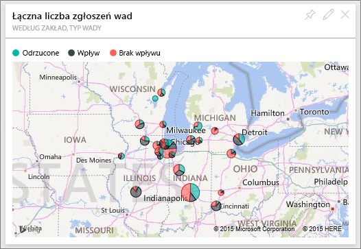

# Próbka danych do analizy jakości dostawców dla usługi Power BI: krótki przewodnik

## Krótkie omówienie przykładu Supplier Quality Analysis
Ten przykładowy pulpit nawigacyjny dla branży i raport będący jego podstawą koncentrują się na jednym z typowych wyzwań związanych z łańcuchem zaopatrzenia — analizie jakości usług dostawców.
W tej analizie główną rolę odgrywają dwie podstawowe metryki: łączna liczba defektów oraz łączny czas przestojów spowodowanych przez te defekty. Ten przykład ma dwa główne cele:

* Zidentyfikowanie najlepszych i najgorszych dostawców pod względem jakości
* Zidentyfikowanie zakładów lepiej wyszukujących i odrzucających defekty w celu zminimalizowania przestojów

Te przykładowe dane stanowią części serii ilustrującej, w jaki sposób możesz wykorzystać usługę Power BI w pracy z danymi biznesowymi, raportami i pulpitami nawigacyjnymi.
Są to prawdziwe dane pochodzące z firmy obviEnce ([www.obvience.com](http://www.obvience.com/)) przedstawione w sposób anonimowy.

## Wymagania wstępne

 Zanim będzie można korzystać z przykładu, trzeba go najpierw pobrać jako [pakiet zawartości](https://docs.microsoft.com/power-bi/sample-supplier-quality#get-the-content-pack-for-this-sample), [plik pbix](http://download.microsoft.com/download/8/C/6/8C661638-C102-4C04-992E-9EA56A5D319B/Supplier%20Quality%20Analysis%20Sample%20PBIX.pbix) lub [skoroszyt programu Excel](http://go.microsoft.com/fwlink/?LinkId=529779).

### Pobieranie pakietu zawartości dla tego przykładu

1. Otwórz usługę Power BI (app.powerbi.com) i zaloguj się.
2. W lewym dolnym rogu wybierz opcję **Pobierz dane**.
   
    
3. Na wyświetlonej stronie Pobieranie danych wybierz ikonę **Przykłady**.
   
   
4. Wybierz pozycję **Przykład Supplier Quality Analysis**, a następnie wybierz polecenie **Połącz**.  
  
   
   
5. Usługa Power BI zaimportuje pakiet zawartości i doda nowy pulpit nawigacyjny, raport oraz zestaw danych do bieżącego obszaru roboczego. Nowa zawartość jest oznaczona żółtą gwiazdką. 
   
   
  
### Pobieranie pliku pbix dla tego przykładu

Alternatywnie przykład możesz pobrać jako plik pbix, który został zaprojektowany do użycia w programie Power BI Desktop. 

 * [Przykład Supplier Quality Analysis — PBIX](http://download.microsoft.com/download/8/C/6/8C661638-C102-4C04-992E-9EA56A5D319B/Supplier%20Quality%20Analysis%20Sample%20PBIX.pbix)

### Pobieranie skoroszytu programu Excel dla tego przykładu
Możesz też [pobrać sam zestaw danych (skoroszyt programu Excel)](http://go.microsoft.com/fwlink/?LinkId=529779) omawiany w tym przykładzie. Skoroszyt zawiera arkusze programu Power View, które można wyświetlać i modyfikować. Aby wyświetlić nieprzetworzone dane, wybierz pozycje **Power Pivot > Zarządzaj**.

## Przestoje spowodowane wadliwymi materiałami
Przeanalizujmy przestoje spowodowane wadliwymi materiałami i sprawdźmy, którzy dostawcy są za to odpowiedzialni.  

1. Na pulpicie nawigacyjnym wybierz kafelek liczby **Całkowita liczba wad** lub kafelek liczby **Łączna liczba minut przestoju**.  

     

   Raport „Przykład analizy jakości dostawcy” zostanie otwarty na stronie „Analiza przestojów”. Należy zauważyć, że mamy łącznie 33 M wadliwych elementów, a całkowity czas przestoju spowodowany przez te wadliwe elementy wynosi 77 K minut. Niektóre materiały mają mniejszą liczbę wadliwych elementów, ale mogą powodować ogromne opóźnienia, powodując dłuższy przestój. Przyjrzyjmy im się na stronie raportu.  
2. Patrząc na linię **Łącznej liczby minut przestoju** na wykresie kombi **Wady i przestoje (min) według typu materiału**, widzimy, że pofalowane materiały powodują najwięcej przestojów.  
3. Wybierz kolumnę **Pofalowane** na tym samym wykresie kombi, aby zobaczyć, które zakłady mają największe straty spowodowane tą wadą i który dostawca za to odpowiada.  

     
4. Wybieraj poszczególne zakłady na mapie, aby zobaczyć, który dostawca lub materiał odpowiada za przestój w tym zakładzie.

### Którzy dostawcy są najgorsi?
 Chcemy znaleźć najgorszych ośmiu dostawców i ustalić, za spowodowanie jakiego procentu przestojów są oni odpowiedzialni. Możemy to zrobić, zmieniając wykres warstwowy **Przestój (min) według dostawcy** na mapę drzewa.  

1. Na stronie 3 raportu, „Analiza przestojów” wybierz pozycję **Edytuj raport** w lewym górnym rogu.  
2. Wybierz wykres warstwowy **Przestój (min) według dostawcy**, a następnie w okienku Wizualizacje wybierz mapę drzewa.  

     

    Mapa drzewa automatycznie umieszcza pole **Dostawca** jako **Grupę**.  

      

   Na tej mapie drzewa można zauważyć, że ośmiu największych dostawców to osiem bloków po lewej stronie mapy drzewa. Można też zobaczyć, że odpowiadają oni za około 50% wszystkich minut przestoju.  
3. Wybierz pozycję **Przykład analizy jakości dostawcy** na górnym pasku nawigacyjnym, aby wrócić do pulpitu nawigacyjnego.

### Porównywanie zakładów
Teraz zbadajmy, które zakłady wykonują lepszą pracę, zarządzając wadliwymi materiałami, i mają mniejsze przestoje.  

1. Wybierz kafelek mapy **Całkowita liczba raportów o wadzie według zakładu, typ wady**.  

    Raport zostanie otwarty na stronie „Jakość dostawcy”.  

     
2. W legendzie mapy wybierz okrąg **Wpływ**.  

      

    Zwróć uwagę, że na wykresie bąbelkowym, **Logistyka** jest najbardziej poszkodowaną kategorią — jest największa pod względem łącznej liczby wad, raportów łącznej liczby wad i łączny czas przestojów w minutach. Przyjrzyjmy się dokładniej tej kategorii.  
3. Wybierz bąbelek Logistyka na wykresie bąbelkowym i obserwujmy zakłady w Springfield, IL i Naperville, IL. Wydaje się, że Naperville znacznie lepiej sobie radzi z zarządzaniem wadliwymi dostawami, ponieważ ma dużą liczbę odrzutów i kilka zdarzeń, w porównaniu do wielu zdarzeń w Springfield.  

     
4. Wybierz pozycję **Przykład analizy jakości dostawcy** na górnym pasku nawigacyjnym, aby wrócić do swojego aktywnego obszaru roboczego.

## Jaki typ materiału jest najlepiej zarządzany?
Najlepiej zarządzanym typem materiału jest typ mający najniższy przestój lub brak wpływu niezależnie od liczby wad.

* Na pulpicie nawigacyjnym przyjrzyj się kafelkowi **Łączna liczba wad według typu materiału, typu usterki**.

  

Zwróć uwagę, że pozycja **Surowce** ma wiele wad łącznie, ale większość wad jest odrzucana albo nie ma wpływu.

Sprawdźmy, czy surowce nie powodują wielu przestojów bez względu na dużą liczbę wad.

* Na pulpicie nawigacyjnym przyjrzyj się kafelkowi **Łączna liczba wad, łączna liczba minut według typu materiału**.

  

Najwyraźniej surowce są dobrze zarządzane: mają więcej wad, ale mniejszą łączną liczbę minut przestojów.

### Porównanie wad do przestojów według roku
1. Wybierz kafelek mapy **Łączna liczba raportów wad według zakładu, typ wady**, aby otworzyć raport na pierwszej stronie raportu jakości dostawcy.
2. Zwróć uwagę, że **Liczba usterek** jest wyższa w 2014 r. niż w 2013 r.  

      
3. Czy więcej wad przekłada się na więcej przestojów? Aby się dowiedzieć, możemy zadawać pytania w funkcji pytań i odpowiedzi.  
4. Wybierz pozycję **Przykład analizy jakości dostawcy** na górnym pasku nawigacyjnym, aby wrócić do pulpitu nawigacyjnego.  
5. Ponieważ wiemy, że surowce mają największa liczbę wad, w polu pytania wpisz „pokaż typy materiałów, rok i łączną liczbę wad”.  

    W 2014 r. znaleziono o wiele więcej wad surowców niż w 2013 r.  

      
6. Teraz zmienimy pytanie na „pokaż typy materiałów, rok i łączną liczbę minut przestojów”.  

   

Przestój spowodowany surowcami był prawie taki sam w 2013 i 2014 r., chociaż w 2014 r. wystąpiło dużo więcej wad surowców.

Okazuje się, że więcej wad surowców w 2014 r. nie prowadzi do znacznie większych przestojów z powodu surowców w 2014 r.

### Porównywanie wad do przestojów miesiąc do miesiąca
Przyjrzyjmy się innemu kafelkowi pulpitu nawigacyjnego związanemu z łączną liczbą wad.  

1. Wybierz strzałkę wstecz  w lewym górnym rogu nad polem pytania, aby wrócić do pulpitu nawigacyjnego.  

    Przyglądając się dokładniej kafelkowi **Łączna liczba wad według miesiąca, rok**, zauważymy, że pierwsza połowa 2014 r. miała podobną liczbę wad jak 2013 r., ale w drugiej połowie 2014 r. liczba wad znacznie skoczyła.  

      

    Zobaczmy, czy to zwiększenie liczby wad prowadzi do takiego samego zwiększenia czasu przestoju.  
2. W polu pytanie wpisz „łączne minuty przestojów według miesiąca i roku jako wykres liniowy”.  

   

   Widzimy skok liczby minut czasu przestoju w czerwcu i październiku, ale w odróżnieniu od tego skok liczby wad nie spowodował znacznie większych przestojów. Oznacza to, że dobrze zarządzamy wadami.  
3. Aby przypiąć ten wykres do pulpitu nawigacyjnego, wybierz ikonę pinezki  z prawej strony pola zapytania.  
4. Aby zapoznać się z odbiegającymi od normy miesiącami, sprawdź liczbę minut przestojów w październiku według typu materiału, lokalizacji zakładu, kategorii itd., zadając takie pytanie, jak „łączna liczba minut przestojów w październiku według zakładu”.    
5. Wybierz strzałkę wstecz  w lewym górnym rogu nad polem pytania, aby wrócić do pulpitu nawigacyjnego.

Pracując na danych w tym środowisku, nie musisz się niczego obawiać. Zawsze możesz zrezygnować z zapisania wprowadzonych zmian. Jeśli jednak je zapiszesz, możesz przejść do obszaru **Pobieranie danych** i pobrać nową kopię zestawu danych użytego w tym przykładzie.

## Następne kroki: łączenie z danymi
Mamy nadzieję, że dzięki temu przewodnikowi wiesz już, że pulpity nawigacyjne usługi Power BI, funkcja pytań i odpowiedzi oraz raporty mogą okazać się niezastąpione w uzyskiwaniu danych o jakości dostawcy. Teraz Twoja kolej. Połącz się ze swoimi danymi. Usługa Power BI umożliwia nawiązanie połączenia z różnymi źródłami danych. Dowiedz się więcej o [rozpoczynaniu pracy z usługą Power BI](service-get-started.md).
