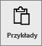
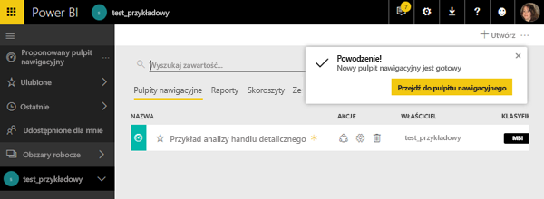
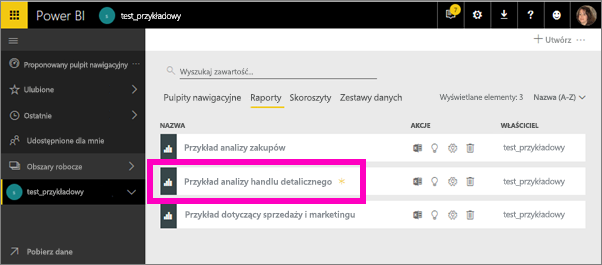
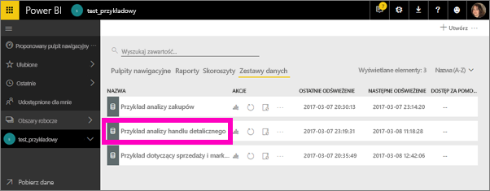
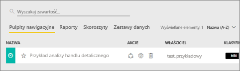
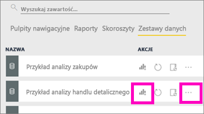
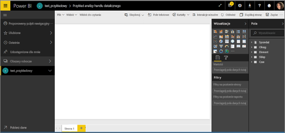
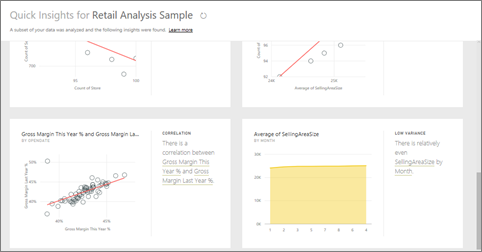
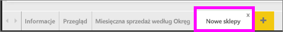
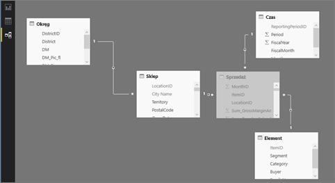

# Przykłady usługi Power BI

Zalecamy rozpoczęcie od artykułu [Przykładowe zestawy danych dla usługi Power BI](sample-datasets.md). W tym artykule dowiesz się wszystkiego o przykładach; jak je pobrać, gdzie je zapisać, jak ich używać, a także poznasz niektóre z historii, które mogą opowiedzieć przykłady. Następnie, kiedy już opanujesz podstawy, wróć do tego samouczka.   

### Wymagania wstępne
Dostępne są różne przykłady dla usługi Power BI i dla programu Power BI Desktop. W tym samouczku będziemy używać Próbki analizy handlu detalicznego.

Przykładowy pakiet zawartości *Retail Analysis* używany w tym samouczku składa się z pulpitu nawigacyjnego, raportu i zestawu danych.
Aby zapoznać się z tym pakietem zawartości i scenariuszem, możesz przed rozpoczęciem [zobaczyć przewodnik po przykładzie Retail Analysis](sample-retail-analysis.md).

## Informacje o tym samouczku
W tym samouczku przedstawiono, w jaki sposób można wykonać następujące czynności: 
- Zaimportować przykładowy pakiet zawartości, dodać go do usługi Power BI i otworzyć jego zawartość. *Pakiet zawartości* jest typem przykładu, w którym zestaw danych jest powiązany z pulpitem nawigacyjnym i raportem. 
-  Otworzyć przykładowy plik PBIX w programie Power BI Desktop.

## Przykłady i usługa Power BI

1. Otwórz usługę Power BI i zaloguj się w niej (app.powerbi.com).
2. Wybierz pozycję **Pobierz dane** w dolnej części okienka nawigacji po lewej stronie. Jeśli nie widzisz opcji **Pobierz dane**, rozwiń w okienko nawigacji, wybierając .
   
   
5. Wybierz opcję **Przykłady**.  
   
   
6. Wybierz pozycję *Retail Analysis Sample* i wybierz polecenie **Połącz**.   
   
   

## Co dokładnie zostało zaimportowane?
W przypadku przykładowych pakietów zawartości po wybraniu opcji **Połącz** usługa Power BI tworzy kopię pakietu zawartości i zapisuje ją w chmurze. Ponieważ osoba, która utworzyła pakiet zawartości, dołączyła zestaw danych, raport i pulpit nawigacyjny, to właśnie te elementy otrzymasz po kliknięciu opcji **Połącz**. 

1. Usługa Power BI tworzy nowy pulpit nawigacyjny i umieszcza go na liście na karcie **Pulpity nawigacyjne**. Żółta gwiazdka informuje użytkownika o tym, że jest to nowy element.
   
   
2. Otwórz kartę **Raporty**.  W tym miejscu zobaczysz nowy raport o nazwie *Retail Analysis Sample*.
   
   
   
   Sprawdź też kartę **Zestawy danych**.  Znajdziesz tu nowy zestaw danych.
   
   

## Eksplorowanie nowej zawartości
Teraz możesz samodzielnie eksplorować pulpit nawigacyjny, zestaw danych i raport. Istnieje wiele różnych sposobów przechodzenia do pulpitów nawigacyjnych, raportów i zestawów danych. Poniżej opisano jeden z tych sposobów.  

> [!TIP]
> Potrzebujesz małego wsparcia na początek?  Sprawdź [Przewodnik po przykładzie Retail Analysis](sample-retail-analysis.md), aby uzyskać instrukcje krok po kroku dotyczące tego przykładu.
> 
> 

1. Przejdź z powrotem do karty **Pulpity nawigacyjne** i wybierz pulpit nawigacyjny *Retail Analysis Sample*, aby go otworzyć.    
   
   
2. Zostanie otwarty pulpit nawigacyjny.  Zawiera on różne kafelki wizualizacji.
   
   
3. Wybierz jeden z kafelków, aby otworzyć raport źródłowy.  W tym przykładzie wybierzemy wykres warstwowy (ujęty w różową ramkę na poprzedniej ilustracji). Raport zostanie otwarty na stronie zawierającej ten wykres warstwowy.
   
    
   
   > [!NOTE]
   > Jeżeli kafelek zostanie utworzony przy użyciu [funkcji pytań i odpowiedzi usługi Power BI](consumer/end-user-q-and-a.md), zamiast tego zostanie otwarta strona funkcji pytań i odpowiedzi. Jeśli kafelek został [przypięty z programu Excel](service-dashboard-pin-tile-from-excel.md), aplikacja Excel Online będzie już otwarta wewnątrz usługi Power BI.
   > 
   > 
1. Z powrotem na karcie **Zestawy danych** masz kilka opcji umożliwiających eksplorowanie zestawu danych.  Nie możesz otworzyć go i zobaczyć wszystkich wierszy oraz kolumn (jak w przypadku programu Power BI Desktop lub Excel).  Jeżeli ktoś udostępnia współpracownikom pakiet zawartości, zazwyczaj chce podzielić się szczegółowymi informacjami, a nie dawać współpracownikom bezpośredni dostęp do danych. Nie oznacza to jednak, że nie możesz eksplorować zestawu danych.  
   
   
   
   * Jednym ze sposobów eksploracji zestawu danych jest utworzenie własnych wizualizacji i raportów od początku.  Wybierz ikonę wykresu,  aby otworzyć zestaw danych w trybie edycji raportu.
     
       
   * Innym sposobem eksploracji zestawu danych jest uruchomienie funkcji [Szybki wgląd](consumer/end-user-insights.md). Wybierz wielokropek (...) i wybierz opcję **Uzyskaj szczegółowe dane**. Gdy szczegółowe informacje będą gotowe, wybierz opcję **Wyświetl szczegółowe dane**.
     
       

## Przykłady i program Power BI Desktop 
Przy pierwszym otwarciu przykładowego pliku PBIX jest on wyświetlany w widoku raportu, w którym można eksplorować, tworzyć i modyfikować dowolną liczbę stron raportu z wizualizacjami. Widok raportu udostępnia niemal takie samo środowisko projektowania, jak widok do edycji raportu w usłudze Power BI. Wizualizacje można między innymi przenosić oraz kopiować i wklejać.

Różnica między nimi jest następująca: podczas używania programu Power BI Desktop można pracować z zapytaniami i modelować dane, aby zapewnić, że używane dane stanowią najbardziej przydatne informacje w ramach raportów. Następnie możesz zapisać plik programu Power BI Desktop w dowolnym miejscu — nie ma znaczenia, czy jest to dysk lokalny, czy chmura.

1. Otwórz [plik PBIX Próbka analizy handlu detalicznego](http://download.microsoft.com/download/9/6/D/96DDC2FF-2568-491D-AAFA-AFDD6F763AE3/Retail%20Analysis%20Sample%20PBIX.pbix) w programie Power BI Desktop. 

    

1. Plik zostanie otwarty w widoku raportu. Czy widzisz 4 karty w dolnej części edytora raportu? Oznacza to, że ten raport zawiera 4 strony, a aktualnie wybrana strona to „New Stores”. 

    .

3. Aby dokładniej poznać edytor raportu, zobacz temat [Zapoznaj się z edytorem raportów](service-the-report-editor-take-a-tour.md)

## Co dokładnie zostało zaimportowane?
W przypadku otwarcia przykładowego pliku PBIX w programie Desktop usługa Power BI dostarcza kopię danych i zapisuje ją w chmurze. Z poziomu programu Desktop masz dostęp do raportu ***i bazowego zestawu danych***. Po załadowaniu danych program Power BI Desktop podejmie próbę znalezienia i utworzenia relacji.  

1. Przełącz się do [Widoku danych](desktop-data-view.md), wybierając ikonę tabeli .
 
    

    Widok danych ułatwia sprawdzanie, przeglądanie i interpretację danych w modelu programu Power BI Desktop. Sposób wyświetlania tabel, kolumn i danych jest inny niż w Edytorze zapytań. W Widoku danych widzisz dane po ich załadowaniu do modelu.

    Gdy modelujesz dane, czasami chcesz zobaczyć, co faktycznie znajduje się w tabeli lub kolumnie bez tworzenia wizualizacji na kanwie raportu, często aż na poziomie wiersza. Jest to szczególnie istotne, gdy tworzysz miary i kolumny obliczeniowe albo musisz określić typ danych lub kategorię danych.

1. Przełącz się do [widoku relacji](desktop-relationship-view.md), wybierając ikonę .
 
    

    W Widoku relacji wyświetlane są wszystkie tabele, kolumny i relacje w modelu. W tym miejscu można wyświetlać, zmieniać i tworzyć relacje.

## Eksplorowanie nowej zawartości
Teraz możesz samodzielnie eksplorować zestaw danych, relacje i raport. Aby uzyskać pomoc przy rozpoczęciu, odwiedź [Przewodnik — wprowadzenie do programu Desktop](desktop-getting-started.md).    

## Następne kroki
[Power BI — podstawowe pojęcia](consumer/end-user-basic-concepts.md)

[Przykłady dla usługi Power BI](sample-datasets.md)

[Źródła danych dla usługi Power BI](service-get-data.md)

Masz więcej pytań? [Odwiedź społeczność usługi Power BI](http://community.powerbi.com/)

