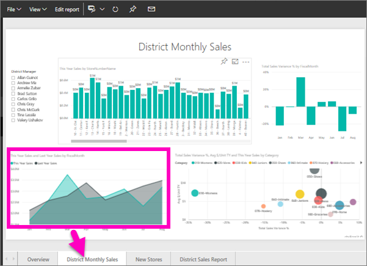

# Przykłady usługi Power BI, samouczek
<!-- Shared newnav Include -->
[!INCLUDE [newnavbydefault](./includes/newnavbydefault.md)]

Zalecamy rozpoczęcie od artykułu [Przykładowe zestawy danych dla usługi Power BI](sample-datasets.md). W tym artykule dowiesz się wszystkiego o przykładach; jak je pobrać, gdzie je zapisać, jak ich używać, a także poznasz niektóre z historii, które mogą opowiedzieć przykłady. Następnie, kiedy już opanujesz podstawy, wróć do tego samouczka.   

## Informacje o tym samouczku
Ten samouczek omawia sposób importowania przykładowych pakietów zawartości, dodawania ich do usługi Power BI oraz otwierania zawartości. *Pakiet zawartości* jest typem przykładu, w którym zestaw danych jest powiązany z pulpitem nawigacyjnym i raportem. Przykładowe pakiety zawartości są dostępne z poziomu usługi Power BI, przy użyciu funkcji **Pobierz dane**.

> [!NOTE]
> Ten samouczek dotyczy usługi Power BI, a nie programu Power BI Desktop.
> 
> 

Przykładowy pakiet zawartości *Retail Analysis* używany w tym samouczku składa się z pulpitu nawigacyjnego, raportu i zestawu danych.
Aby zapoznać się z tym pakietem zawartości i scenariuszem, możesz przed rozpoczęciem [zobaczyć przewodnik po przykładzie Retail Analysis](sample-retail-analysis.md).

## Pobieranie danych (w tym przypadku pobieranie przykładowego pakietu zawartości)
1. Otwórz usługę Power BI i zaloguj się w niej (app.powerbi.com).
2. Wybierz obszar roboczy i utwórz nowy pulpit nawigacyjny.  
   
    
3. Nadaj mu nazwę **Retail Analysis sample**.
   
   
4. Wybierz pozycję **Pobierz dane** w dolnej części okienka nawigacji po lewej stronie. Jeśli nie widzisz opcji **Pobierz dane**, rozwiń w okienko nawigacji, wybierając pozycję .
   
   
5. Wybierz opcję **Przykłady**.  
   
   
6. Wybierz pozycję *Retail Analysis Sample* i wybierz polecenie **Połącz**.   
   
   

## Co dokładnie zostało zaimportowane?
W przypadku przykładowych pakietów zawartości po wybraniu opcji **Połącz** usługa Power BI tworzy kopię pakietu zawartości i zapisuje ją w chmurze. Ponieważ osoba, która utworzyła pakiet zawartości, dołączyła zestaw danych, raport i pulpit nawigacyjny, to właśnie te elementy otrzymasz po kliknięciu opcji **Połącz**.

1. Usługa Power BI tworzy nowy pulpit nawigacyjny i umieszcza go na liście na karcie **Pulpity nawigacyjne**. Żółta gwiazdka informuje użytkownika o tym, że jest to nowy element.
   
   
2. Otwórz kartę **Raporty**.  W tym miejscu zobaczysz nowy raport o nazwie *Retail Analysis Sample*.
   
   
   
   Sprawdź też kartę **Zestawy danych**.  Znajdziesz tu nowy zestaw danych.
   
   

## Eksplorowanie nowej zawartości
Teraz możesz samodzielnie eksplorować pulpit nawigacyjny, zestaw danych i raport. Istnieje wiele różnych sposobów przechodzenia do pulpitów nawigacyjnych, raportów i zestawów danych. Poniżej opisano jeden z tych sposobów.  

> [!TIP]
> Potrzebujesz małego wsparcia na początek?  Sprawdź [Przewodnik po przykładzie Retail Analysis](sample-retail-analysis.md), aby uzyskać instrukcje krok po kroku dotyczące tego przykładu.
> 
> 

1. Przejdź z powrotem do karty **Pulpity nawigacyjne** i wybierz pulpit nawigacyjny *Retail Analysis Sample*, aby go otworzyć.    
   
   
2. Zostanie otwarty pulpit nawigacyjny.  Zawiera on różne kafelki wizualizacji.
   
   
3. Wybierz jeden z kafelków, aby otworzyć raport źródłowy.  W tym przykładzie wybierzemy wykres warstwowy (ujęty w różową ramkę na poprzedniej ilustracji). Raport zostanie otwarty na stronie zawierającej ten wykres warstwowy.
   
    
   
   > [!NOTE]
   > Jeżeli kafelek zostanie utworzony przy użyciu [funkcji pytań i odpowiedzi usługi Power BI](power-bi-q-and-a.md), zamiast tego zostanie otwarta strona funkcji pytań i odpowiedzi.
   > 
   > 
4. Z powrotem na karcie **Zestawy danych** masz kilka opcji umożliwiających eksplorowanie zestawu danych.  Nie możesz otworzyć go i zobaczyć wszystkich wierszy oraz kolumn (jak w przypadku programu Power BI Desktop lub Excel).  Jeżeli ktoś udostępnia współpracownikom pakiet zawartości, zazwyczaj chce podzielić się szczegółowymi informacjami, a nie dawać współpracownikom bezpośredni dostęp do danych. Nie oznacza to jednak, że nie możesz eksplorować zestawu danych.  
   
   
   
   * Jednym ze sposobów eksploracji zestawu danych jest utworzenie własnych wizualizacji i raportów od początku.  Wybierz ikonę wykresu , aby otworzyć zestaw danych w trybie edycji raportu.
     
       
   * Innym sposobem eksploracji zestawu danych jest uruchomienie funkcji [Szybki wgląd](service-insights.md). Wybierz wielokropek (...) i wybierz opcję **Uzyskaj szczegółowe dane**. Gdy szczegółowe informacje będą gotowe, wybierz opcję **Wyświetl szczegółowe dane**.
     
       

## Następne kroki
[Power BI — podstawowe pojęcia](service-basic-concepts.md)

[Przykłady dla usługi Power BI](sample-datasets.md)

[Źródła danych dla usługi Power BI](service-get-data.md)

Masz więcej pytań? [Odwiedź społeczność usługi Power BI](http://community.powerbi.com/)

