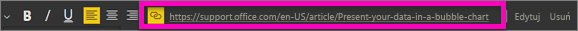
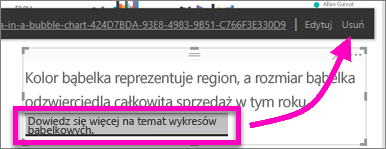

# Dodawanie hiperlinku do pola tekstowego w raporcie
Pola tekstowe mogą być dodawane do raportów, przypinane do pulpitów nawigacyjnych z raportów i dodawane bezpośrednio do pulpitów nawigacyjnych. Hiperlinki można dodać do pola tekstowego, niezależnie od tego, gdzie się ono znajduje.  

> **UWAGA**: Aby uzyskać informacje o hiperlinkach w tabelach i macierzach usługi Power BI, zobacz [Hiperlinki w tabelach](power-bi-hyperlinks-in-tables.md). Informacje na temat dodawania pól tekstowych z **pulpitu nawigacyjnego**, zobacz [Dodawanie kafelka bezpośrednio z pulpitu nawigacyjnego](service-dashboard-add-widget.md). 
> 
> 

<iframe width="560" height="315" src="https://www.youtube.com/embed/_3q6VEBhGew#t=0m55s" frameborder="0" allowfullscreen></iframe>

## Aby dodać hiperlink do pola tekstowego w raporcie
1. [Utwórz pole tekstowe i wpisz jakiś tekst](power-bi-reports-add-text-and-shapes.md). 
2. Wyróżnij istniejący tekst lub dodaj nowy tekst do wykorzystania jako hiperlink.
   
   
3. Wybierz ikonę hiperlinku  .
4. Wpisz lub wklej adres URL w polu hiperlinku, a następnie wybierz pozycję **Gotowe**.
   
   
5. Przetestuj link.  
   
   
   
   * Umieść kursor w dowolnym miejscu wyróżnionego tekstu, aby wyświetlić adres URL.  
     
      
   * Wybierz adres URL, aby otworzyć stronę w nowym oknie przeglądarki.

## Aby usunąć hiperlink, ale pozostawić tekst
1. W polu tekstowym wybierz hiperlink, aby go wyróżnić.
   
     
2. Wybierz pozycję **Usuń**. 

## Następne kroki
[Pola tekstowe w raportach usługi Power BI](power-bi-reports-add-text-and-shapes.md)

Masz więcej pytań? [Odwiedź społeczność usługi Power BI](http://community.powerbi.com/)

