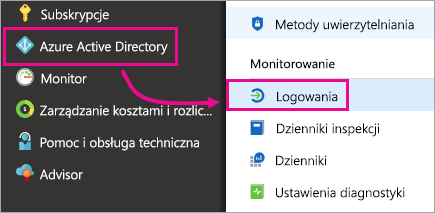
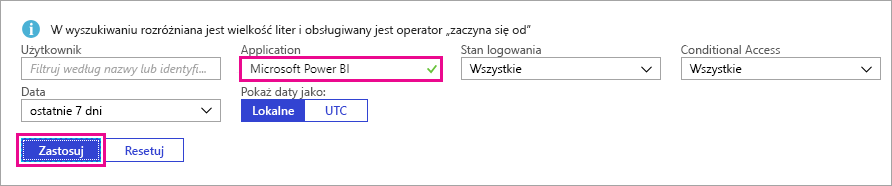
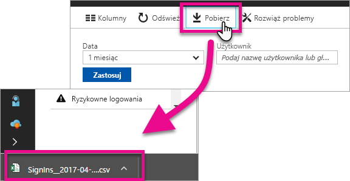

# Znajdowanie zalogowanych użytkowników usługi Power BI
Jeśli administrator dzierżawy chce dowiedzieć się, kto jest zalogowany do usługi Power BI, może uzyskać wgląd za pomocą raportów dostępu i użycia usługi Azure Active Directory.

<iframe width="640" height="360" src="https://www.youtube.com/embed/1AVgh9w9VM8?showinfo=0" frameborder="0" allowfullscreen></iframe>

Raport aktywności jest dostępny zarówno w [nowym](https://docs.microsoft.com/azure/active-directory/active-directory-reporting-activity-sign-ins), jak i [klasycznym](https://docs.microsoft.com/azure/active-directory/active-directory-view-access-usage-reports) portalu usługi Azure Active Directory (Azure AD). Na powyższym filmie wideo użyto portalu klasycznego, natomiast w tym artykule zostanie omówiony nowy portal.

> [!NOTE]
> Raport aktywności obejmuje zarówno użytkowników wersji bezpłatnej, jak i wersji Pro usługi Power BI, ale nie zawiera informacji o używanych licencjach.
> 
> 

## Wymagania
Aby wyświetlić raport aktywności logowania, należy spełnić poniższe wymagania.

* Dostęp do danych mogą uzyskać użytkownicy z rolą administratora globalnego, administratora zabezpieczeń lub czytelnika zabezpieczeń.
* Dowolny użytkownik (niebędący administratorem) ma dostęp do informacji o swoich logowaniach.
* Do wyświetlenia podsumowującego raportu aktywności związanej z logowaniem wymagane jest skojarzenie dzierżawy z licencją usługi Azure AD Premium.

## Wyświetlanie informacji o logowaniu w witrynie Azure Portal
Aktywność związaną z logowaniem można wyświetlić w portalu usługi Azure AD.

1. Przejdź do witryny **Azure Portal** i wybierz pozycję **Azure Active Directory**.
2. W obszarze **Działanie** wybierz pozycję **Logowania**.
   
    
3. Przefiltruj aplikacje, wybierając pozycję **Microsoft Power BI** lub **Power BI Gateway**, i wybierz pozycję **Zastosuj**.
   
    Pozycja **Microsoft Power BI** dotyczy aktywności logowania związanej z usługą, a **Power BI Gateway** obejmuje logowania do lokalnej bramy danych.
   
    

## Eksportowanie danych
Dostępne są dwie opcje eksportowania danych logowania. Można pobrać plik csv lub użyć programu PowerShell.

### Pobieranie pliku csv
Wybierz pozycję **Pobierz** na pasku narzędzi ekranu Działanie. Zostanie pobrany plik csv zawierający bieżące, odfiltrowane dane.

### Program PowerShell
Dane logowania można wyeksportować za pomocą programu PowerShell. [Przykład](https://docs.microsoft.com/azure/active-directory/active-directory-reporting-api-sign-in-activity-samples#powershell-script) jest dostępny w dokumentacji usługi Azure AD.

> [!NOTE]
> Aby przykład z programem PowerShell zadziałał, muszą być spełnione [wymagania wstępne dotyczące uzyskiwania dostępu do interfejsu API raportowania usługi Azure AD](https://docs.microsoft.com/en-us/azure/active-directory/active-directory-reporting-api-prerequisites).
> 
> 

## Przechowywanie danych
Dane logowania są dostępne przez maksymalnie 30 dni. Aby uzyskać więcej informacji, zobacz [Zasady przechowywania raportów usługi Azure Active Directory](https://docs.microsoft.com/azure/active-directory/active-directory-reporting-retention).

## Następne kroki
[Raporty aktywności związanej z logowaniem w portalu usługi Azure Active Directory (nowym portalu)](https://docs.microsoft.com/azure/active-directory/active-directory-reporting-activity-sign-ins)  
[Wyświetlanie raportów dostępu i użycia (portal klasyczny)](https://docs.microsoft.com/azure/active-directory/active-directory-view-access-usage-reports#view-or-download-a-report)  
[Przykładowy skrypt logowania programu PowerShell](https://docs.microsoft.com/azure/active-directory/active-directory-reporting-api-sign-in-activity-samples#powershell-script)  
[Zasady przechowywania raportów usługi Azure Active Directory](https://docs.microsoft.com/azure/active-directory/active-directory-reporting-retention)  
[Korzystanie z inspekcji w ramach organizacji](service-admin-auditing.md)  
[Aktywacja rozszerzonej wersji próbnej Pro](service-extended-pro-trial.md)

Masz więcej pytań? [Zadaj pytanie społeczności usługi Power BI](https://community.powerbi.com/)

