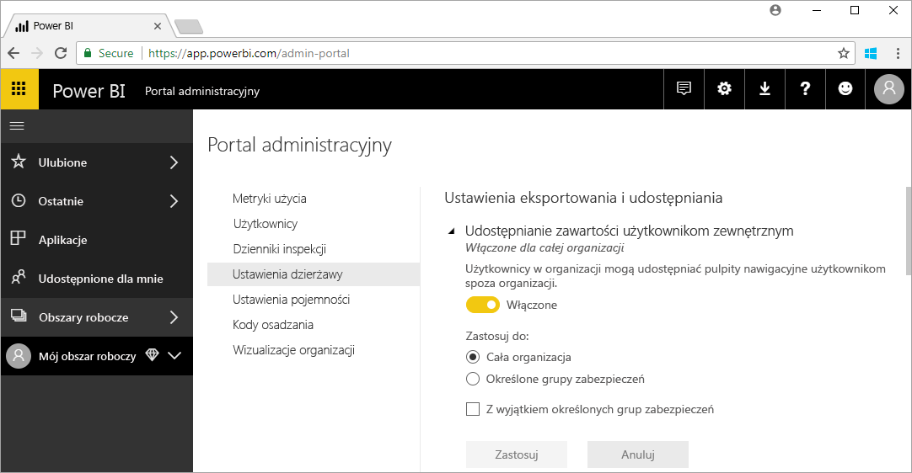

# Co to jest administracja usługi Power BI?

Administracja usługi Power BI to zarządzanie dzierżawami usługi Power BI, w tym konfiguracją zasad zarządzania, monitorowania użycia i aprowizowania licencji, możliwości i zasobów organizacyjnych. Ten artykuł zawiera omówienie ról, zadań i narzędzi administracyjnych oraz linki do artykułów z bardziej szczegółowymi informacjami.

Usługa Power BI jest przeznaczona do samodzielnego przeprowadzania analizy biznesowej, a administrator jest strażnikiem danych, procesów i zasad w dzierżawie usługi Power BI. Administrator usługi Power BI to kluczowy członek zespołu obejmującego deweloperów i analityków biznesowych oraz użytkowników pełniących inne role. Administrator może pomóc organizacji w zapewnieniu, że cele o krytycznym znaczeniu zostały spełnione:

- Zrozumienie kluczowych wskaźników wydajności i metryk _faktycznie_ potrzebnych użytkownikom
- Skrócenie czasu dostarczania produktu na rynek na potrzeby raportowania przeprowadzanego przez dział IT
- Zwiększanie szybkości wdrażania i zwrotów z inwestycji powiązanych z wdrożeniem usługi Power BI

Głównym zadaniem jest zwiększenie produktywności pracy użytkowników biznesowych oraz zapewnienie bezpieczeństwa i zgodności z prawem i przepisami. Obowiązki mogą obejmować wsparcie i pomoc techniczną, a w wielu przypadkach ułatwianie użytkownikom biznesowym właściwego wykonywania zadań.

## Role administratora powiązane z usługą Power BI

Istnieje kilka ról związanych z administrowaniem usługą Power BI, które opisano w poniższej tabeli.

| **Typ administratora** | **Zakres administracyjny** | **Zakres usługi Power BI** |
| --- | --- | --- |
| Administrator globalny usługi Office 365 | Office 365 | Może zarządzać wszystkimi aspektami dzierżawy usługi Power BI i innych usług. |
| Administrator rozliczeń usługi Office 365 | Office 365 | Może uzyskiwać licencje usługi Power BI w ramach subskrypcji usługi Office 365. |
| Administrator usługi Power BI | Dzierżawa usługi Power BI | Ma pełną kontrolę nad dzierżawą usługi Power BI i jej funkcjami administracyjnymi (z wyjątkiem licencjonowania). |
| Administrator pojemności usługi Power BI Premium | Pojemność pojedynczej usługi Premium | Ma pełną kontrolę nad pojemnością Premium i jej funkcjami administracyjnymi. |
| Administrator pojemności usługi Power BI Embedded | Pojemność pojedynczej usługi Embedded | Ma pełną kontrolę nad pojemnością usługi Embedded i jej funkcjami administracyjnymi. |

Administratorzy globalni w usłudze Office 365 lub Azure Active Directory mają prawa administratora w usłudze Power BI. Administrator globalny usługi Office 365 może przypisywać innych użytkowników do roli administratora usługi Power BI, która ma prawa administracyjne tylko do funkcji usługi Power BI.

Administratorzy usługi Power BI mają dostęp do portalu administracyjnego usługi Power BI, który zawiera różne ustawienia na poziomie dzierżawy dotyczące funkcjonalności, zabezpieczeń i monitorowania. Administratorzy usługi mają pełny dostęp do wszystkich zasobów dzierżawy usługi Power BI. W większości przypadków administratorzy usługi mogą identyfikować problemy, a następnie współpracować z właścicielami zasobów w celu podjęcia akcji naprawczych.

Rola administratora usługi Power BI nie pozwala na przypisywanie licencji do użytkowników ani na przeglądanie dzienników inspekcji w usłudze Office 365. W związku z tym zadania administrowania usługą Power BI nie mogą być aktualnie wykonywane przez użytkowników, którzy są wyłącznie członkami roli administratora usługi Power BI.

## Zadania administracyjne

Administratorzy wykonują wiele zadań obsługi dzierżawy usługi Power BI w swojej organizacji. Zadania te przedstawiono w poniższej tabeli.

| **Obszar zadania** | **Typowe zadania** |
| --- | --- |
| Zarządzanie dzierżawą usługi Power BI |<ul><li>Włączanie i wyłączanie kluczowych funkcji usługi Power BI <li>Tworzenie raportów dotyczących użycia i wydajności <li>Przeglądanie inspekcji zdarzeń i zarządzanie nimi</ul>|
| Uzyskiwanie i przypisywanie licencji usługi Power BI |<ul><li>Zarządzanie tworzeniem nowych kont użytkowników <li>Kupowanie i przypisywanie licencji usługi Pro <li>Blokowanie dostępu użytkowników do usługi Power BI</ul>|
| Zarządzanie pojemnością Premium |<ul><li>Uzyskiwanie pojemności Premium i praca z nią <li>Zapewnianie jakości usługi|
| Zarządzanie pojemnością usługi Embedded |<ul><li>Uzyskiwanie pojemności usługi Embedded w celu uproszczenia sposobu korzystania z możliwości z usługi Power BI przez niezależnych dostawców oprogramowania i deweloperów</ul>|
| Zapewnianie zgodności z zasadami wewnętrznymi, przepisami i regulacjami | <ul><li>Zarządzanie klasyfikacją danych biznesowych <li>Pomoc w wymuszaniu zasad publikowania i udostępniania zawartości</ul>|
| Zarządzanie zasobami usługi Power BI |<ul><li>Zarządzanie obszarami roboczymi <li>Publikowanie wizualizacji niestandardowych <li>Weryfikowanie kodów używanych do osadzania usługi Power BI w innych aplikacjach|
| Zapewnianie wsparcia i pomocy technicznej użytkownikom dzierżawy |<ul><li>Rozwiązywanie problemów z dostępem do danych i innych problemów</ul>|
| Inne zadania |<ul><li>Wdrażanie programu Power BI Desktop, np. przy użyciu programu System Center Configuration Manager <li>Zarządzanie wdrażaniem aplikacji mobilnych usługi Power BI przy użyciu usługi Intune <li>Zarządzanie prywatnością i zabezpieczeniami danych, takimi jak zabezpieczenia źródeł danych</ul>|

## Narzędzia administracyjne

Istnieje szereg narzędzi związanych z administrowaniem usługą Power BI, które opisano w poniższej tabeli. Administratorzy zwykle spędzają większość czasu w portalu administracyjnym usługi Power BI i w razie potrzeby korzystają z innych narzędzi.

| **Narzędzie** | **Typowe zadania** |
| --- | --- |
| Portal administracyjny usługi Power BI |<ul><li>Blokowanie dostępu użytkowników do usługi Power BI <li>Uzyskiwanie pojemności Premium i praca z nią <li>Zapewnianie jakości usługi <li>Zarządzanie klasyfikacją danych biznesowych <li>Pomoc w wymuszaniu zasad publikowania i udostępniania zawartości <li>Zarządzanie obszarami roboczymi <li>Publikowanie wizualizacji niestandardowych <li>Weryfikowanie kodów używanych do osadzania usługi Power BI w innych aplikacjach <li>Rozwiązywanie problemów z dostępem do danych i innych problemów</ul>|
| Centrum administracyjne usługi Office 365 |<ul><li>Zarządzanie tworzeniem nowych kont użytkowników <li>Kupowanie i przypisywanie licencji usługi Pro</ul>|
| Centrum zabezpieczeń i zgodności usługi Office 365 |<ul><li>Przeglądanie inspekcji zdarzeń i zarządzanie nimi</ul>|
| Usługa Azure Active Directory (AAD) w portalu platformy Azure |<ul><li>Konfigurowanie warunkowego dostępu do zasobów usługi Power BI za pomocą usługi AAD <li>Aprowizowanie pojemności usługi Power BI Embedded</ul>|
| Polecenia cmdlet programu PowerShell |<ul><li>Zarządzanie obszarami roboczymi i innymi aspektami usługi Power BI za pośrednictwem skryptów</ul>|
| Administracyjne interfejsy API |<ul><li>Kompilowanie niestandardowych narzędzi administracyjnych w celu ułatwienia pracy administratora usługi Power BI. Na przykład program Power BI Desktop może używać tych interfejsów API do kompilowania raportów na podstawie danych związanych z administracją</ul>|

## Następne kroki

Mamy nadzieję, że ten artykuł przybliżył Ci szczegółowe informacje na temat administratora usługi Power BI oraz powiązanych z nim określonych ról, zadań i narzędzi. W celu pogłębienia wiedzy na ten temat zalecamy zapoznanie z dwoma poniższymi tematami.

[Korzystanie z portalu administracyjnego usługi Power BI](service-admin-portal.md)

[Power BI administration FAQ](service-admin-faq.md) (Administracja usługi Power BI — często zadawane pytania)

Masz więcej pytań? [Zadaj pytanie społeczności usługi Power BI](http://community.powerbi.com/)

