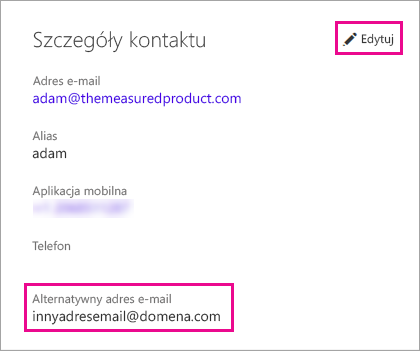

# <a name="using-an-alternate-email-address"></a>Korzystanie z alternatywnego adresu e-mail
Domyślnie adres e-mail użyty podczas tworzenia konta w usłudze Power BI służy do wysyłania aktualizacji dotyczących działań w usłudze Power BI.  Na przykład gdy użytkownik wyśle do Ciebie zaproszenie do udostępniania, zostanie ono wysłane na ten adres.

Czasami możesz chcieć, aby te wiadomości e-mail były dostarczane na alternatywny adres e-mail zamiast adresu użytego pierwotnie podczas rejestrowania się w usłudze Power BI.

## <a name="updating-through-office-365-personal-info-page"></a>Aktualizowanie przy użyciu strony informacji osobistych w usłudze Office 365
1. Przejdź do strony [informacji osobistych w usłudze Office 365](https://portal.office.com/account/#personalinfo).  Jeśli zostanie wyświetlony monit, zaloguj się przy użyciu adresu e-mail i hasła używanego w usłudze Power BI.
2. Kliknij link edycji w sekcji Szczegóły kontaktu.  
   
   > [!NOTE]
   > Jeśli link edycji nie jest wyświetlany, oznacza to, że adresem e-mail zarządza administrator usługi Office 365 i musisz skontaktować się z nim, aby zaktualizować swój adres e-mail.
   > 
   > 
   
   
3. W polu Alternatywny adres e-mail wprowadź adres, na który mają być wysyłane aktualizacje dotyczące usługi Power BI.

> [!NOTE]
> Zmiana tego ustawienia nie wpłynie na adres e-mail używany do wysyłania aktualizacji dotyczących usług, biuletynów i innych informacji promocyjnych.  Te wiadomości będą zawsze wysyłane na adres e-mail użyty pierwotnie podczas rejestracji w usłudze Power BI.
> 
> 

## <a name="updating-through-azure-active-directory"></a>Aktualizowanie przy użyciu usługi Azure Active Directory
Podczas przechwytywania tokenu osadzania usługi Active Azure Directory (AAD) na potrzeby usługi Power BI można korzystać z trzech różnych rodzajów adresów e-mail. Są to następujące trzy typy:

* Główny adres e-mail skojarzony z kontem usługi AAD użytkownika
* Adres e-mail UserPrincipalName (UPN)
* Adres e-mail z atrybutem tablicy „other”

Usługa Power BI wybiera adres e-mail do użycia na podstawie następujących kryteriów:
1.  Jeśli w obiekcie użytkownika dzierżawy usługi AAD znajduje się atrybut poczty, usługa Power BI skorzysta z tego atrybutu poczty na potrzeby adresu e-mail.
2.  Jeśli adres e-mail UPN *nie* jest adresem e-mail należącym do domeny **\*.onmicrosoft.com** (informacja po symbolu „@”), usługa Power BI użyje tego atrybutu poczty na potrzeby adresu e-mail.
3.  Jeśli w obiekcie użytkownika usługi AAD znajduje się atrybut „other” tablicy adresu e-mail, zostanie użyty pierwszy adres e-mail z tej listy (ponieważ w tym atrybucie może być lista adresów e-mail).
4. Jeśli żaden z powyższych warunków nie jest spełniony, zostanie użyty adres UPN.

## <a name="updating-with-powershell"></a>Aktualizowanie za pomocą programu PowerShell
Alternatywnie można zaktualizować adres e-mail przy użyciu programu PowerShell dla usługi Azure Active Directory. Można to zrobić przy użyciu polecenia [Set-AzureADUser](https://docs.microsoft.com/powershell/module/azuread/set-azureaduser).

```
Set-AzureADUser -ObjectId john@contoso.com -OtherMails "otheremail@somedomain.com"
```

Aby uzyskać więcej informacji, zobacz [Program PowerShell usługi Azure Active Directory w wersji 2](https://docs.microsoft.com/powershell/azure/active-directory/install-adv2).

Masz więcej pytań? [Odwiedź społeczność usługi Power BI](http://community.powerbi.com/)

