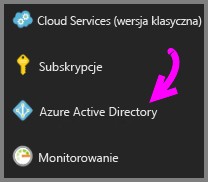
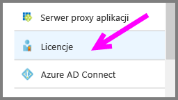
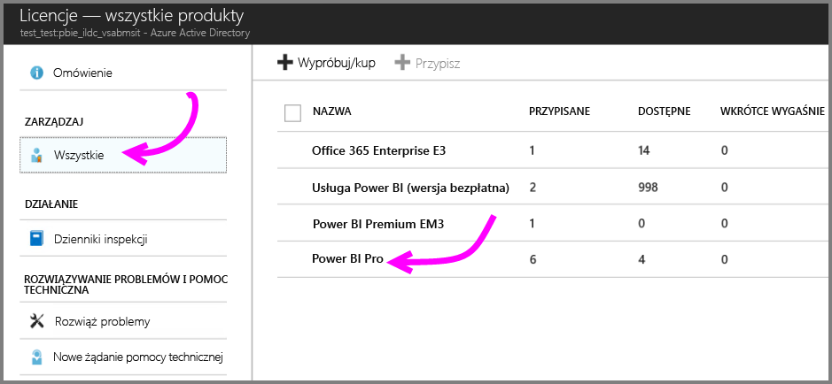
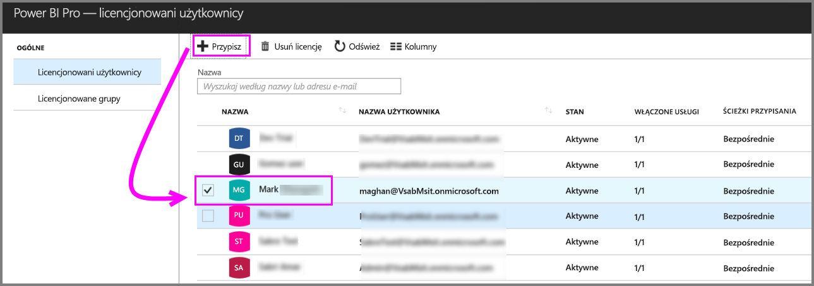

# Szybki start: przypisywanie licencji usługi Power BI Pro na platformie Azure

Usługa Power BI Pro stanowi indywidualną licencję, która zapewnia dostęp do całej zawartości i wszystkich funkcji w usłudze Power BI, w tym do możliwości udostępniania zawartości i współpracy z innymi użytkownikami wersji Pro. Tylko użytkownicy wersji Pro mogą publikować zawartość i używać jej w obszarach roboczych aplikacji, udostępniać pulpity nawigacyjne oraz subskrybować pulpity nawigacyjne i raporty. W tym artykule wyjaśniono, jak przypisać licencje usługi Power BI Pro na platformie Azure. Można również [przypisać licencje w usłudze Office 365](service-admin-assigning-power-bi-pro-licenses.md).

## Wymagania wstępne

Musisz być właścicielem subskrypcji platformy Azure, której usługa Power BI używa podczas operacji wyszukiwania w usłudze Active Directory.

Przed rozpoczęciem pracy musisz [zakupić co najmniej jedną licencję](service-admin-purchasing-power-bi-pro.md).

## Przypisywanie licencji do pojedynczych kont użytkowników

Wykonaj następujące kroki, aby przypisać licencje usługi Power BI Pro do pojedynczych kont użytkowników:

1. Otwórz witrynę [Azure Portal](https://ms.portal.azure.com/#@microsoft.onmicrosoft.com/dashboard/private/39bc3cf7-31a4-43f6-954c-f2d69ca2f0). 

2. Na pasku nawigacyjnym po lewej stronie wybierz pozycję **Azure Active Directory**.

    

3. W obszarze usługi **Azure Active Directory** wybierz pozycję **Licencje**.

    

4. W obszarze **Licencje** wybierz pozycję **Wszystkie produkty**, a następnie wybierz pozycję **Power BI Pro**, aby wyświetlić listę licencjonowanych użytkowników.

    

5. Wybierz pozycję **Przypisz**, aby dodać licencję usługi Power BI Pro do kolejnego konta użytkownika.

    

## Następne kroki

Teraz, gdy licencje zostały już przypisane, dowiedz się więcej na temat usługi Power BI Pro.

[Usługa Power BI Pro w organizacji](service-admin-power-bi-pro-in-your-organization.md)

[Znajdowanie zalogowanych użytkowników usługi Power BI](service-admin-access-usage.md)

Masz więcej pytań? [Zadaj pytanie społeczności usługi Power BI](https://community.powerbi.com/)