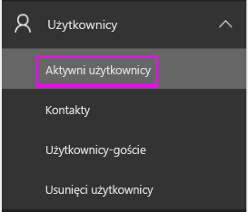
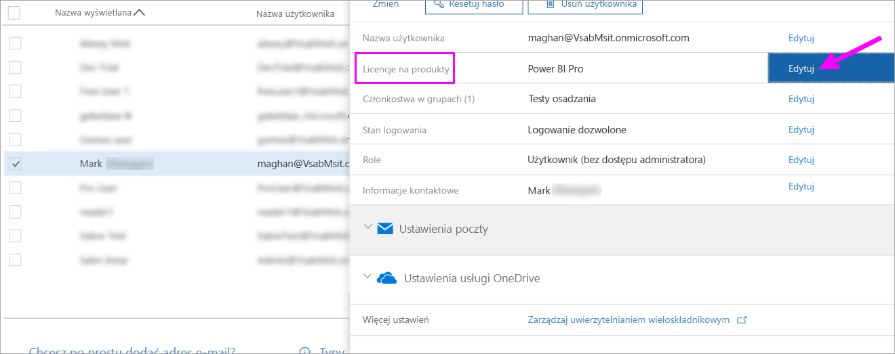
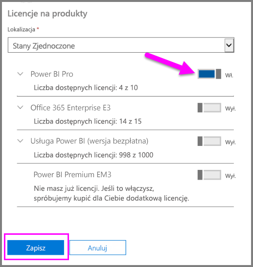
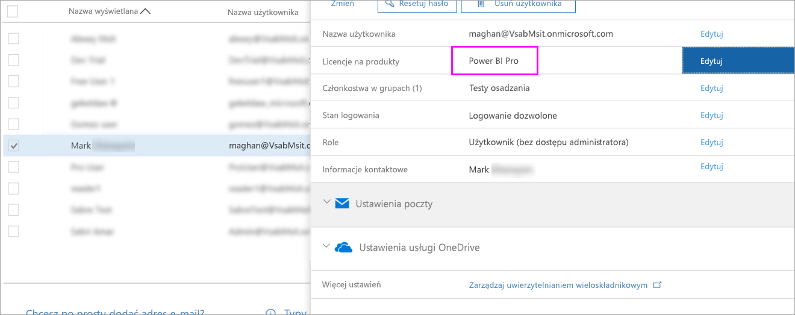

# Szybki start: przypisywanie licencji usługi Power BI Pro w usłudze Office 365

Usługa Power BI Pro stanowi indywidualną licencję, która zapewnia dostęp do całej zawartości i wszystkich funkcji w usłudze Power BI, w tym do możliwości udostępniania zawartości i współpracy z innymi użytkownikami wersji Pro. Tylko użytkownicy wersji Pro mogą publikować zawartość i używać jej w obszarach roboczych aplikacji, udostępniać pulpity nawigacyjne oraz subskrybować pulpity nawigacyjne i raporty. W tym artykule wyjaśniono, jak przypisywać licencje usługi Power BI Pro w usłudze Office 365. Można również [przypisać licencje na platformie Azure](service-admin-assigning-power-bi-pro-licenses-azure.md).

## Wymagania wstępne

Musisz być członkiem roli [**Administrator globalny** lub **Administrator kont użytkowników**](https://support.office.com/article/about-office-365-admin-roles-da585eea-f576-4f55-a1e0-87090b6aaa9d?ui=en-US&rs=en-US&ad=US) w usłudze Office 365.

Przed rozpoczęciem pracy musisz [zakupić co najmniej jedną licencję](service-admin-purchasing-power-bi-pro.md).

## Przypisywanie licencji do pojedynczych kont użytkowników

Wykonaj następujące kroki, aby przypisać licencje usługi Power BI Pro do pojedynczych kont użytkowników:

1. Otwórz [centrum administracyjne usługi Office 365](https://portal.office.com/adminportal/home#/homepage).

2. W okienku nawigacyjnym po lewej stronie rozwiń pozycję **Użytkownicy**, a następnie wybierz pozycję **Aktywni użytkownicy**.

    

3. Wybierz użytkownika, a następnie w obszarze **Licencje produktu** wybierz pozycję **Edytuj**.

    

4. W obszarze **Power BI Pro** przełącz ustawienie na **Włączone**, a następnie kliknij pozycję **Zapisz**.

    

5. W obszarze **Stan** wybranego konta sprawdź, czy licencja usługi Power BI Pro została pomyślnie przypisana.

    

## Następne kroki

Teraz, gdy licencje zostały już przypisane, dowiedz się więcej na temat usługi Power BI Pro.

[Usługa Power BI Pro w organizacji](service-admin-power-bi-pro-in-your-organization.md)

[Znajdowanie zalogowanych użytkowników usługi Power BI](service-admin-access-usage.md)

Masz więcej pytań? [Zadaj pytanie społeczności usługi Power BI](https://community.powerbi.com/)