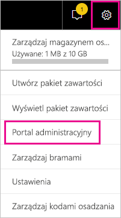

# <a name="using-auditing-within-your-organization"></a>Korzystanie z inspekcji w ramach organizacji

Wiedza na temat tego, kto wykonuje jakie akcje i na jakim elemencie w dzierżawie usługi Power BI może być niezbędna, aby pomóc organizacji w spełnianiu jej wymagań, np. zapewnianiu zgodności z przepisami i zarządzaniu rekordami. Funkcja inspekcji usługi Power BI umożliwia przeprowadzanie inspekcji czynności wykonywanych przez użytkowników, takich jak „Wyświetl raport” czy „Wyświetl pulpit nawigacyjny”. Nie można użyć funkcji inspekcji do przeprowadzania inspekcji uprawnień.

Praca z funkcją inspekcji odbywa się w Centrum zgodności i zabezpieczeń usługi Office 365 lub w programie PowerShell. W tym artykule zostały omówione obydwie sytuacje. Dane inspekcji możesz filtrować według zakresu dat, użytkownika, pulpitu nawigacyjnego, raportu, zestawu danych i typu działania. Dodatkowo działania możesz pobrać w pliku csv (wartości rozdzielone przecinkami), aby je przeanalizować w trybie offline.

## <a name="requirements"></a>Wymagania

Aby uzyskać dostęp do dzienników inspekcji, musisz spełnić następujące wymagania:

- Aby uzyskać dostęp do sekcji inspekcji w Centrum zabezpieczeń i zgodności usługi Office 365, musisz mieć licencję usługi Exchange Online (uwzględnioną w subskrypcjach E3 i E5 usługi Office 365 Enterprise).

- Musisz być administratorem globalnym lub mieć rolę administratora programu Exchange, która zapewnia dostęp do dziennika inspekcji. Role administratora programu Exchange są kontrolowane za pośrednictwem Centrum administracyjnego programu Exchange. Aby uzyskać więcej informacji, zobacz [Uprawnienia w usłudze Exchange Online](/exchange/permissions-exo/permissions-exo/).

- Jeśli masz dostęp do dziennika inspekcji, ale nie jesteś administratorem globalnym ani administratorem usługi Power BI, nie będziesz mieć dostępu do portalu administracyjnego usługi Power BI. W takim przypadku musisz uzyskać bezpośredni link do [Centrum zabezpieczeń i zgodności usługi Office 365](https://sip.protection.office.com/#/unifiedauditlog).

- Aby wyświetlić dzienniki inspekcji dla usługi Power BI w dzierżawie, wymagana jest w niej co najmniej jedna licencja skrzynki pocztowej programu Exchange.

## <a name="accessing-your-audit-logs"></a>Uzyskiwanie dostępu do dzienników inspekcji

Aby uzyskać dostępu do dzienników, najpierw sprawdź, czy w usłudze Power BI włączono rejestrowanie. Aby uzyskać więcej informacji, zobacz temat [Dzienniki inspekcji](service-admin-portal.md#audit-logs) w dokumentacji portalu administracyjnego. Od momentu włączenia inspekcji do czasu, kiedy możliwe będzie wyświetlenie danych inspekcji, może wystąpić opóźnienie do 48 godzin. Jeśli dane nie są natychmiast widoczne, sprawdź dzienniki inspekcji później. Podobne opóźnienie może występować między uzyskaniem uprawnień do wyświetlania dzienników inspekcji a możliwością uzyskania do nich dostępu.

Dzienniki inspekcji usługi Power BI są dostępne bezpośrednio za pośrednictwem [Centrum zgodności i zabezpieczeń usługi Office 365](https://sip.protection.office.com/#/unifiedauditlog). W portalu administracyjnym usługi Power BI można również znaleźć link:

1. W usłudze Power BI wybierz **ikonę koła zębatego** w prawym górnym rogu, a następnie wybierz pozycję **Portal administracyjny**.

   

1. Wybierz pozycję **Dzienniki inspekcji**.

1. Wybierz opcję **Przejdź do Centrum administracyjnego usługi O365**.

   

Aby zapewnić dostęp do dziennika inspekcji kontom bez uprawnień administratora, musisz przypisać uprawnienia w centrum administracyjnym usługi Exchange Online. Na przykład można przypisać użytkownika do istniejącej grupy ról, takiej jak Zarządzanie organizacją, lub utworzyć nową grupę ról z rolą Dzienniki inspekcji. Aby uzyskać więcej informacji, zobacz [Uprawnienia w usłudze Exchange Online](/exchange/permissions-exo/permissions-exo/).

## <a name="search-only-power-bi-activities"></a>Wyszukiwanie tylko działań usługi Power BI

Ogranicz wyniki tylko do działań usługi Power BI, wykonując poniższe czynności. Listę działań można znaleźć w sekcji dotyczącej [listy działań poddawanych inspekcji przez usługę Power BI](#list-of-activities-audited-by-power-bi) w dalszej części tego artykułu.

1. Otwórz stronę **Wyszukiwanie w dzienniku inspekcji** i w obszarze **Wyszukiwanie** wybierz listę rozwijaną dla opcji **Działania**.

2. Wybierz pozycję **Działania usługi Power BI**.

   

3. Wybierz dowolne miejsce poza obszarem wyboru, aby go zamknąć.

Wyszukiwania będą teraz filtrowane tak, aby zawierały tylko działania usługi Power BI.

## <a name="search-the-audit-logs-by-date"></a>Przeszukiwanie dzienników inspekcji według daty

Dzienniki można przeszukiwać na podstawie zakresu dat przy użyciu pól **Data rozpoczęcia** i **Data zakończenia**. Domyślnie wybrane jest siedem ostatnich dni. Data i godzina są prezentowane w formacie Uniwersalnego czasu koordynowanego (UTC). Maksymalny zakres dat wynosi 90 dni. 

Jeśli wybrany zakres dat jest większy niż 90 dni, zostanie wyświetlony błąd. W przypadku użycia maksymalnego zakresu dat (90 dni) dla **daty rozpoczęcia** wybierz bieżącą godzinę. W przeciwnym razie zostanie wyświetlony błąd informujący o tym, że data rozpoczęcia jest wcześniejsza niż data zakończenia. Jeśli inspekcja została włączona w ciągu ostatnich 90 dni, zakres dat nie może rozpoczynać się przed datą włączenia inspekcji.


## <a name="search-the-audit-logs-by-users"></a>Przeszukiwanie dzienników inspekcji według użytkowników

Wyszukać możesz wpisy dziennika inspekcji dotyczące działań wykonanych przez konkretnych użytkowników. W tym celu wprowadź co najmniej jedną nazwę użytkownika w polu **Użytkownicy**. Nazwa użytkownika wygląda jak adres e-mail. Jest to konto, za pomocą którego użytkownicy logują się do usługi Power BI. Pozostaw to pole puste, aby zwrócić wpisy dla wszystkich użytkowników (i kont usług) w Twojej organizacji.


## <a name="view-search-results"></a>Wyświetlanie wyników wyszukiwania

Po naciśnięciu pozycji **Wyszukaj** wyniki wyszukiwania zostaną załadowane, a po kilku chwilach zostaną wyświetlone w obszarze **Wyniki**. Po zakończeniu wyszukiwania zostanie wyświetlona liczba wyników. Maksymalna liczba wyświetlanych zdarzeń to 1000. Jeśli więcej niż 1000 zdarzeń spełnia kryteria wyszukiwania, zostanie wyświetlonych 1000 najnowszych zdarzeń.

### <a name="view-the-main-results"></a>Wyświetlanie wyników głównych

Obszar **Wyniki** zawiera następujące informacje dotyczące każdego zdarzenia zwróconego przez wyszukiwanie. Wybierz nagłówek kolumny w obszarze **Wyniki**, aby posortować wyniki.

| **Kolumna** | **Definicja** |
| --- | --- |
| Data |Data i godzina wystąpienia zdarzenia w formacie UTC. |
| Adres IP |Adres IP urządzenia, które było używane podczas zarejestrowania działania. Adres IP jest wyświetlany w formacie IPv4 lub IPv6. |
| Użytkownik |Użytkownik (lub konto usługi), który wykonał akcję wyzwalającą zdarzenie. |
| Działanie |Działanie wykonane przez użytkownika. Ta wartość odpowiada działaniom wybranym z listy rozwijanej **Działania**. W przypadku zdarzenia z dziennika inspekcji administratora programu Exchange wartość w tej kolumnie to polecenie cmdlet programu Exchange. |
| Element |Obiekt, który został utworzony lub zmodyfikowany w wyniku odpowiedniego działania. Na przykład wyświetlony lub zmodyfikowany plik albo zaktualizowane konto użytkownika. Ta kolumna nie zawiera wartości w przypadku niektórych działań. |
| Szczegół |Dodatkowe szczegóły dotyczące działania. Podobnie jak poprzednio, w przypadku niektórych działań ta kolumna nie będzie zawierać wartości. |

### <a name="view-the-details-for-an-event"></a>Wyświetlanie szczegółów zdarzenia

Więcej informacji o zdarzeniu można wyświetlić, klikając rekord zdarzenia na liście wyników wyszukiwania. Zostanie wyświetlona strona **Szczegóły** zawierająca szczegółowe właściwości rekordu zdarzenia. Wyświetlane właściwości zależą od usługi Office 365, w której wystąpiło zdarzenie. 

Aby wyświetlić te szczegóły, wybierz pozycję **Więcej informacji**. Wszystkie wpisy usługi Power BI mają wartość 20 dla właściwości RecordType. Aby uzyskać informacje o innych właściwościach, zobacz temat [Detailed properties in the audit log](/office365/securitycompliance/detailed-properties-in-the-office-365-audit-log/) (Szczegółowe właściwości w dzienniku inspekcji).

   

## <a name="export-search-results"></a>Eksportowanie wyników wyszukiwania

Aby wyeksportować dziennik inspekcji usługi Power BI do pliku csv, wykonaj poniższe kroki.

1. Wybierz pozycję **Eksportuj wyniki**.

1. Wybierz opcję **Zapisz załadowane wyniki** lub **Pobierz wszystkie wyniki**.

    

## <a name="use-powershell-to-search-audit-logs"></a>Używanie programu PowerShell do wyszukiwania dzienników inspekcji

Za pomocą programu PowerShell można uzyskiwać również dostęp do dzienników inspekcji na podstawie identyfikatora logowania. Poniższy przykład pokazuje, jak ściągać wpisy dziennika inspekcji usługi Power BI za pomocą polecenia [Search-UnifiedAuditLog](/powershell/module/exchange/policy-and-compliance-audit/search-unifiedauditlog?view=exchange-ps/).

Aby używać polecenia [New-PSSession](/powershell/module/microsoft.powershell.core/new-pssession/), Twoje konto musi mieć przypisaną licencję usługi Exchange Online i musisz mieć dostęp do dziennika inspekcji swojej dzierżawy. Aby uzyskać więcej informacji dotyczących nawiązywania połączenia z usługą Exchange Online, zobacz [CŁączenie z programem PowerShell usługi Exchange Online](/powershell/exchange/exchange-online/connect-to-exchange-online-powershell/connect-to-exchange-online-powershell/).

```powershell
Set-ExecutionPolicy RemoteSigned

$UserCredential = Get-Credential

$Session = New-PSSession -ConfigurationName Microsoft.Exchange -ConnectionUri https://outlook.office365.com/powershell-liveid/ -Credential $UserCredential -Authentication Basic -AllowRedirection

Import-PSSession $Session
Search-UnifiedAuditLog -StartDate 9/11/2018 -EndDate 9/15/2018 -RecordType PowerBI -ResultSize 1000 | Format-Table | More
```

Inny przykład użycia programu PowerShell z dziennikami inspekcji można znaleźć w artykule [Using Power BI audit log and PowerShell to assign Power BI Pro licenses](https://powerbi.microsoft.com/blog/using-power-bi-audit-log-and-powershell-to-assign-power-bi-pro-licenses/) (Używanie dziennika inspekcji usługi Power BI i programu PowerShell do przypisywania licencji usługi Power BI Pro).

## <a name="activities-audited-by-power-bi"></a>Działania poddawane inspekcji przez usługę Power BI

Poniższe działania są poddawane inspekcji przez usługę Power BI.

| Przyjazna nazwa                                     | Nazwa operacji                              | Uwagi                                  |
|---------------------------------------------------|---------------------------------------------|------------------------------------------|
| Dodanie źródła danych do bramy usługi Power BI             | AddDatasourceToGateway                      |                                          |
| Dodanie dostępu do folderu usługi Power BI                      | AddFolderAccess                             | Obecnie nieużywane                       |
| Dodanie członków grupy usługi Power BI                      | AddGroupMembers                             |                                          |
| Dołączenie konta magazynu przepływu danych do dzierżawy przez administratora | AdminAttachedDataflowStorageAccountToTenant | Obecnie nieużywane                       |
| Przeanalizowanie zestawu danych usługi Power BI                         | AnalyzedByExternalApplication               |                                          |
| Przeanalizowanie raportu usługi Power BI                          | AnalyzeInExcel                              |                                          |
| Powiązano zestaw danych usługi Power BI z bramą                | BindToGateway                               |                                          |
| Zmiana stanu pojemności                            | ChangeCapacityState                         |                                          |
| Zmiana przypisania użytkownika pojemności                  | UpdateCapacityUsersAssignment               |                                          |
| Zmiana połączeń zestawów danych usługi Power BI              | SetAllConnections                           |                                          |
| Zmiana administratorów bramy usługi Power BI                   | ChangeGatewayAdministrators                 |                                          |
| Zmiana użytkowników źródła danych bramy usługi Power BI        | ChangeGatewayDatasourceUsers                |                                          |
| Utworzenie organizacyjnego pakietu zawartości usługi Power BI      | CreateOrgApp                                |                                          |
| Utworzenie aplikacji usługi Power BI                              | CreateApp                                   |                                          |
| Utworzenie pulpitu nawigacyjnego usługi Power BI                        | CreateDashboard                             |                                          |
| Utworzenie przepływu danych usługi Power BI                         | CreateDataflow                              |                                          |
| Utworzenie zestawu danych usługi Power BI                          | CreateDataset                               |                                          |
| Utworzenie subskrypcji wiadomości e-mail usługi Power BI               | CreateEmailSubscription                     |                                          |
| Utworzenie folderu usługi Power BI                           | CreateFolder                                |                                          |
| Utworzenie bramy usługi Power BI                          | CreateGateway                               |                                          |
| Utworzenie grupy usługi Power BI                            | CreateGroup                                 |                                          |
| Utworzenie raportu usługi Power BI                           | CreateReport                                |                                          |
| Migrowanie przepływu danych do zewnętrznego konta magazynu     | DataflowMigratedToExternalStorageAccount    | Obecnie nieużywane                       |
| Dodanie uprawnień przepływu danych                        | DataflowPermissionsAdded                    | Obecnie nieużywane                       |
| Usunięcie uprawnień przepływu danych                      | DataflowPermissionsRemoved                  | Obecnie nieużywane                       |
| Usunięcie organizacyjnego pakietu zawartości usługi Power BI      | DeleteOrgApp                                |                                          |
| Usunięcie komentarza usługi Power BI                          | DeleteComment                               |                                          |
| Usunięcie pulpitu nawigacyjnego usługi Power BI                        | DeleteDashboard                             | Obecnie nieużywane                       |
| Usunięcie przepływu danych usługi Power BI                         | DeleteDataflow                              | Obecnie nieużywane                       |
| Usunięcie zestawu danych usługi Power BI                          | DeleteDataset                               |                                          |
| Usunięcie subskrypcji wiadomości e-mail usługi Power BI               | DeleteEmailSubscription                     |                                          |
| Usunięcie folderu usługi Power BI                           | DeleteFolder                                |                                          |
| Usunięcie dostępu do folderu usługi Power BI                    | DeleteFolderAccess                          | Obecnie nieużywane                       |
| Usunięcie bramy usługi Power BI                          | DeleteGateway                               |                                          |
| Usunięcie grupy usługi Power BI                            | DeleteGroup                                 |                                          |
| Usunięcie raportu usługi Power BI                           | DeleteReport                                |                                          |
| Odnalezienie źródeł danych zestawu danych usługi Power BI          | GetDatasources                              |                                          |
| Pobranie raportu usługi Power BI                        | DownloadReport                              |                                          |
| Edytowanie uprawnień certyfikacji usługi Power BI          | EditCertificationPermission                 | Obecnie nieużywane                       |
| Edytowanie pulpitu nawigacyjnego usługi Power BI                         | EditDashboard                               | Obecnie nieużywane                       |
| Edytowanie zestawu danych usługi Power BI                           | EditDataset                                 |                                          |
| Edytowanie właściwości zestawu danych usługi Power BI                | EditDatasetProperties                       | Obecnie nieużywane                       |
| Edytowanie raportu usługi Power BI                            | EditReport                                  |                                          |
| Wyeksportowanie przepływu danych usługi Power BI                        | ExportDataflow                              |                                          |
| Wyeksportowanie danych wizualizacji raportu usługi Power BI              | ExportReport                                |                                          |
| Wyeksportowanie danych kafelka usługi Power BI                       | ExportTile                                  |                                          |
| Nie można dodać uprawnień przepływu danych                | FailedToAddDataflowPermissions              | Obecnie nieużywane                       |
| Nie można usunąć uprawnień przepływu danych             | FailedToRemoveDataflowPermissions           | Obecnie nieużywane                       |
| Wygenerowanie tokenu SAS przepływu danych usługi Power BI             | GenerateDataflowSasToken                    |                                          |
| Wygenerowanie tokenu osadzania usługi Power BI                    | GenerateEmbedToken                          |                                          |
| Zaimportowanie pliku do usługi Power BI                         | Importuj                                      |                                          |
| Zainstalowanie aplikacji usługi Power BI                            | InstallApp                                  |                                          |
| Migrowanie obszaru roboczego do pojemności                  | MigrateWorkspaceIntoCapacity                |                                          |
| Opublikowanie komentarza usługi Power BI                           | PostComment                                 |                                          |
| Wydrukowanie pulpitu nawigacyjnego usługi Power BI                        | PrintDashboard                              |                                          |
| Wydrukowanie strony raportu usługi Power BI                      | PrintReport                                 |                                          |
| Opublikowanie raportu usługi Power BI w Internecie                  | PublishToWebReport                          |                                          |
| Odebranie wpisu tajnego przepływu danych usługi Power BI z usługi Key Vault  | ReceiveDataflowSecretFromKeyVault           | Obecnie nieużywane                       |
| Usunięcie źródła danych z bramy usługi Power BI         | RemoveDatasourceFromGateway                 |                                          |
| Usunięcie członków grupy usługi Power BI                    | DeleteGroupMembers                          |                                          |
| Usunięcie obszaru roboczego z pojemności                 | RemoveWorkspacesFromCapacity                |                                          |
| Zmiana nazwy pulpitu nawigacyjnego usługi Power BI                        | RenameDashboard                             |                                          |
| Żądanie odświeżenia przepływu danych usługi Power BI               | RequestDataflowRefresh                      | Obecnie nieużywane                       |
| Żądanie odświeżenia zestawu danych usługi Power BI                | RefreshDataset                              |                                          |
| Pobranie obszarów roboczych usługi Power BI                     | GetWorkspaces                               |                                          |
| Ustawienie zaplanowanego odświeżania przepływu danych usługi Power BI        | SetScheduledRefreshOnDataflow               |                                          |
| Ustawienie zaplanowanego odświeżania zestawu danych usługi Power BI         | SetScheduledRefresh                         |                                          |
| Udostępnienie pulpitu nawigacyjnego usługi Power BI                         | ShareDashboard                              |                                          |
| Udostępnienie raportu usługi Power BI                            | ShareReport                                 |                                          |
| Rozpoczęcie korzystania z rozszerzonej wersji próbnej usługi Power BI                   | OptInForExtendedProTrial                    | Obecnie nieużywane                       |
| Rozpoczęcie korzystania z wersji próbnej usługi Power BI                            | OptInForProTrial                            |                                          |
| Przejęcie źródła danych usługi Power BI                   | TakeOverDatasource                          |                                          |
| Przejęcie zestawu danych usługi Power BI                        | TakeOverDataset                             |                                          |
| Cofnięcie opublikowania aplikacji usługi Power BI                          | UnpublishApp                                |                                          |
| Zaktualizowanie ustawień zarządzania zasobami pojemności      | UpdateCapacityResourceGovernanceSettings    | Obecnie niedostępne w portalu administracyjnym usługi Office 365 |
| Zaktualizowanie administratora pojemności                            | UpdateCapacityAdmins                        |                                          |
| Zaktualizowanie nazwy wyświetlanej pojemności                     | UpdateCapacityDisplayName                   |                                          |
| Zaktualizowanie ustawień usługi Power BI organizacji          | UpdatedAdminFeatureSwitch                   |                                          |
| Zaktualizowanie aplikacji usługi Power BI                              | UpdateApp                                   |                                          |
| Zaktualizowanie przepływu danych usługi Power BI                         | UpdateDataflow                              |                                          |
| Zaktualizowanie źródeł danych zestawu danych usługi Power BI             | UpdateDatasources                           |                                          |
| Zaktualizowanie parametrów zestawu danych usługi Power BI               | UpdateDatasetParameters                     |                                          |
| Zaktualizowanie subskrypcji wiadomości e-mail usługi Power BI               | UpdateEmailSubscription                     |                                          |
| Zaktualizowanie folderu usługi Power BI                           | UpdateFolder                                |                                          |
| Zaktualizowanie dostępu do folderu usługi Power BI                    | UpdateFolderAccess                          |                                          |
| Zaktualizowanie poświadczeń źródła danych bramy usługi Power BI  | UpdateDatasourceCredentials                 |                                          |
| Wyświetlenie pulpitu nawigacyjnego usługi Power BI                         | ViewDashboard                               |                                          |
| Wyświetlenie przepływu danych usługi Power BI                          | ViewDataflow                                |                                          |
| Wyświetlenie raportu usługi Power BI                            | ViewReport                                  |                                          |
| Wyświetlenie kafelka usługi Power BI                              | ViewTile                                    |                                          |
| Wyświetlenie metryk użycia usługi Power BI                     | ViewUsageMetrics                            |                                          |
|                                                   |                                             |                                          |

## <a name="next-steps"></a>Następne kroki

[Co to jest administracja usługi Power BI?](service-admin-administering-power-bi-in-your-organization.md)  

[Portal administracyjny usługi Power BI](service-admin-portal.md)  

Masz więcej pytań? [Zadaj pytanie społeczności usługi Power BI](http://community.powerbi.com/)
