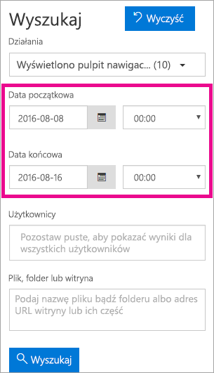

# <a name="using-auditing-within-your-organization"></a>Korzystanie z inspekcji w ramach organizacji

<iframe width="560" height="315" src="https://www.youtube.com/embed/zj4kA39jV_4?showinfo=0" frameborder="0" allowfullscreen></iframe>

Dowiedz się, jak za pomocą inspekcji w usłudze Power BI możesz monitorować i badać wykonywane akcje. Skorzystaj z Centrum zabezpieczeń i zgodności lub programu PowerShell.

Wiedza na temat tego, kto wykonuje jakie akcje i na jakim elemencie w dzierżawie usługi Power BI może być niezbędna, aby pomóc organizacji w spełnianiu jej wymagań, np. zapewnianiu zgodności z przepisami i zarządzaniu rekordami.

Dane inspekcji możesz filtrować według zakresu dat, użytkownika, pulpitu nawigacyjnego, raportu, zestawu danych i typu działania. Dodatkowo działania możesz pobrać w pliku csv (wartości rozdzielone przecinkami), aby je przeanalizować w trybie offline.

> [!NOTE]
> Funkcja inspekcji w usłudze Power BI jest dostępna w wersji zapoznawczej we wszystkich obszarach danych.

## <a name="enabling-auditing-functionality-in-the-power-bi-admin-portal"></a>Włączanie funkcji inspekcji w portalu administracyjnym usługi Power BI

Aby pracować z raportami, należy włączyć funkcję inspekcji dla swojej organizacji. Można to zrobić za pomocą ustawień dzierżawy w portalu administracyjnym.

1. Wybierz **ikonę koła zębatego** w prawym górnym rogu.

2. Wybierz polecenie **Portal administracyjny**.
   
   

3. Wybierz pozycję **Ustawienia dzierżawy**.
   
   

4. Włącz opcję **Twórz dzienniki inspekcji na potrzeby wewnętrznych inspekcji działań i sprawdzania zgodności**.

5. Wybierz pozycję **Zastosuj**.

Usługa Power BI rozpocznie rejestrowanie działań wykonywanych przez użytkowników w tej usłudze. Dzienniki będą widoczne w Centrum zabezpieczeń i zgodności usługi O365 w ciągu maksymalnie 48 godzin. Aby uzyskać więcej informacji na temat rejestrowanych działań, zobacz [Lista działań objętych inspekcją w usłudze Power BI](#list-of-activities-audited-by-power-bi).

> [!NOTE]
> Aby włączyć inspekcję dla usługi Power BI w dzierżawie, wymagana jest w niej co najmniej jedna licencja skrzynki pocztowej programu Exchange.

## <a name="accessing-your-audit-logs"></a>Uzyskiwanie dostępu do dzienników inspekcji

Aby przeprowadzić inspekcję dzienników usługi Power BI, odwiedź Centrum zabezpieczeń i zgodności usługi O365.

1. Wybierz **ikonę koła zębatego** w prawym górnym rogu.

2. Wybierz polecenie **Portal administracyjny**.
   
   

3. Wybierz pozycję **Dzienniki inspekcji**.
4. 
5. Wybierz opcję **Przejdź do Centrum administracyjnego usługi O365**.
   
   

Ewentualnie możesz przejść do obszaru [Office 365 | Zabezpieczenia i zgodność](https://protection.office.com/#/unifiedauditlog).

> [!NOTE]
> Aby zapewnić dostęp do dziennika inspekcji kontom bez uprawnień administratora, musisz przypisać uprawnienia w centrum administracyjnym usługi Exchange Online. Na przykład można przypisać użytkownika do istniejącej grupy ról, takiej jak Zarządzanie organizacją, lub utworzyć nową grupę ról z rolą Dzienniki inspekcji. Aby uzyskać więcej informacji, zobacz [Uprawnienia w usłudze Exchange Online](https://technet.microsoft.com/library/jj200692\(v=exchg.150\).aspx).

## <a name="search-only-power-bi-activities"></a>Wyszukiwanie tylko działań usługi Power BI

Aby ograniczyć wyniki tylko do działań usługi Power BI, wykonaj następujące czynności.

1. Na stronie **Wyszukiwanie w dzienniku inspekcji** wybierz listę rozwijaną dla opcji **Działania** w obszarze **Wyszukiwanie**.

2. Wybierz pozycję **Działania usługi Power BI**.
   
   

3. Wybierz dowolne miejsce poza obszarem wyboru, aby go zamknąć.

Wyszukiwania będą teraz filtrowane tak, aby zawierały tylko działania usługi Power BI.

## <a name="search-the-audit-logs-by-date"></a>Przeszukiwanie dzienników inspekcji według daty

Dzienniki można przeszukiwać na podstawie zakresu dat przy użyciu pól „Data rozpoczęcia” i „Data zakończenia”. Domyślnie wybrane jest siedem ostatnich dni. Data i godzina są prezentowane w formacie Uniwersalnego czasu koordynowanego (UTC). Maksymalny zakres dat wynosi 90 dni. Jeśli wybrany zakres dat jest większy niż 90 dni, zostanie wyświetlony błąd.

> [!NOTE]
> W przypadku użycia maksymalnego zakresu dat (90 dni) dla daty rozpoczęcia wybierz bieżącą godzinę. W przeciwnym razie zostanie wyświetlony błąd informujący o tym, że data rozpoczęcia jest wcześniejsza niż data zakończenia. Jeśli inspekcja została włączona w ciągu ostatnich 90 dni, maksymalny zakres dat nie może się rozpoczynać przed datą włączenia inspekcji.



## <a name="search-the-audit-logs-by-users"></a>Przeszukiwanie dzienników inspekcji według użytkowników

Wyszukać możesz wpisy dziennika inspekcji dotyczące działań wykonanych przez konkretnych użytkowników. W tym celu wprowadź co najmniej jedną nazwę użytkownika w polu „Użytkownicy”.  Jest to nazwa użytkownika używana do logowania się w usłudze Power BI. Wygląda jak adres e-mail.
Pozostaw to pole puste, aby zwrócić wpisy dla wszystkich użytkowników (i kont usług) w Twojej organizacji.


## <a name="viewing-search-results"></a>Wyświetlanie wyników wyszukiwania

Po naciśnięciu przycisku Szukaj wyniki wyszukiwania zostaną załadowane, a po kilku chwilach zostaną wyświetlone w obszarze Wyniki. Po zakończeniu wyszukiwania zostanie wyświetlona liczba wyników. 

> [!NOTE]
> Maksymalna liczba wyświetlanych zdarzeń to 1000. Jeśli więcej niż 1000 zdarzeń spełnia kryteria wyszukiwania, zostanie wyświetlonych 1000 najnowszych zdarzeń.

Wyniki zawierają następujące informacje dotyczące każdego zdarzenia zwróconego przez wyszukiwanie.

| **Kolumna** | **Definicja** |
| --- | --- |
| Data |Data i godzina wystąpienia zdarzenia w formacie UTC. |
| Adres IP |Adres IP urządzenia, które było używane podczas zarejestrowania działania. Adres IP jest wyświetlany w formacie IPv4 lub IPv6. |
| Użytkownik |Użytkownik (lub konto usługi), który wykonał akcję wyzwalającą zdarzenie. |
| Działanie |Działanie wykonane przez użytkownika. Ta wartość odpowiada działaniom wybranym z listy rozwijanej Działania. W przypadku zdarzenia z dziennika inspekcji administratora programu Exchange wartość w tej kolumnie to polecenie cmdlet programu Exchange. |
| Element |Obiekt, który został utworzony lub zmodyfikowany w wyniku odpowiedniego działania. Na przykład wyświetlony lub zmodyfikowany plik albo zaktualizowane konto użytkownika. Ta kolumna nie zawiera wartości w przypadku niektórych działań. |
| Szczegół |Dodatkowe szczegóły dotyczące działania. Podobnie jak poprzednio, w przypadku niektórych działań ta kolumna nie będzie zawierać wartości. |

> [!NOTE]
> Wybierz nagłówek kolumny w obszarze Wyniki, aby posortować wyniki. Wyniki można sortować w kolejności od A do Z lub od Z do A. Kliknięcie nagłówka Data umożliwia posortowanie wyników od najstarszego do najnowszego lub od najnowszego do najstarszego.

## <a name="view-the-details-for-an-event"></a>Wyświetlanie szczegółów zdarzenia

Więcej informacji o zdarzeniu można wyświetlić, wybierając rekord zdarzenia na liście wyników wyszukiwania. Zostanie wyświetlona strona szczegółów zawierająca szczegółowe właściwości rekordu zdarzenia. Wyświetlane właściwości zależą od usługi Office 365, w której wystąpiło zdarzenie. Aby wyświetlić dodatkowe szczegóły, wybierz opcję **Więcej informacji**.

Poniższa tabela zawiera szczegółowe informacje na temat danych, które mogą zostać wyświetlone.

| **Parametr lub zdarzenie** | **Opis** | **Dodatkowe szczegóły** |
| --- | --- | --- |
| Pobranie raportu usługi Power BI |To działanie jest rejestrowane za każdym razem, gdy pobierany jest raport. |Nazwa raportu, Nazwa zestawu danych |
| Utworzenie raportu |To działanie jest rejestrowane za każdym razem, gdy tworzony jest nowy raport. |Nazwa raportu, Nazwa zestawu danych |
| Edytowanie raportu |To działanie jest rejestrowane za każdym razem, gdy edytowany jest raport. |Nazwa raportu, Nazwa zestawu danych |
| Utworzenie zestawu danych |To działanie jest rejestrowane za każdym razem, gdy tworzony jest zestaw danych. |Nazwa zestawu danych, DataConnectivityMode |
| Usunięcie zestawu danych |To działanie jest rejestrowane za każdym razem, gdy usuwany jest zestaw danych. |Nazwa zestawu danych, DataConnectivityMode |
| Utworzenie aplikacji Power BI |To działanie jest rejestrowane za każdym razem, gdy jest tworzona aplikacja Power BI. |Nazwa aplikacji, Uprawnienia, Nazwa obszaru roboczego |
| Zainstalowanie aplikacji Power BI |To działanie jest rejestrowane za każdym razem, gdy instalowana jest aplikacja Power BI. |Nazwa aplikacji |
| Zaktualizowanie aplikacji Power BI |To działanie jest rejestrowane za każdym razem, gdy aktualizowana jest aplikacja Power BI. |Nazwa aplikacji, Uprawnienia, Nazwa obszaru roboczego |
| Rozpoczęcie korzystania z rozszerzonej wersji próbnej usługi Power BI |To działanie jest rejestrowane za każdym razem, gdy użytkownik akceptuje rozszerzoną wersję próbną usługi Pro, która obowiązuje do 31 maja 2018 r. | |
| Przeanalizowanie zestawu danych usługi Power BI |To działanie jest rejestrowane za każdym razem, gdy zestaw danych usługi Power BI jest analizowany w programie Excel. | |
| Utworzenie bramy usługi Power BI |To działanie jest rejestrowane za każdym razem, gdy jest tworzona nowa brama. |Nazwa bramy, Typ bramy |
| Usunięcie bramy usługi Power BI |To działanie jest rejestrowane za każdym razem, gdy usuwana jest brama. |Nazwa bramy, Typ bramy |
| Dodanie źródła danych do bramy usługi Power BI |To działanie jest rejestrowane za każdym razem, gdy źródło danych jest dodawane do bramy. |Nazwa bramy, Typ bramy, Nazwa źródła danych, Typ źródła danych |
| Usunięcie źródła danych z bramy usługi Power BI |To działanie jest rejestrowane za każdym razem, gdy źródło danych jest usuwane z bramy. |Nazwa bramy, Typ bramy, Nazwa źródła danych, Typ źródła danych |
| Zmiana administratorów bramy usługi Power BI |To działanie jest rejestrowane za każdym razem, gdy administratorzy bramy ulegają zmianie (są dodawani lub usuwani). |Nazwa bramy, Dodani użytkownicy, Usunięci użytkownicy |
| Zmiana użytkowników źródła danych bramy usługi Power BI |To działanie jest rejestrowane za każdym razem, gdy użytkownicy bramy ulegają zmianie (są dodawani lub usuwani). |Nazwa bramy, Dodani użytkownicy, Usunięci użytkownicy |
| SetScheduledRefresh |To działanie jest rejestrowane za każdym razem, gdy jest planowane nowe odświeżenie zestawu danych. |Nazwa zestawu danych, Częstotliwość odświeżania (w minutach) |

## <a name="using-powershell-to-search"></a>Wyszukiwanie za pomocą programu PowerShell

Za pomocą programu PowerShell można uzyskiwać dostęp do dzienników inspekcji na podstawie identyfikatora logowania. Odbywa się to przez uzyskanie dostępu do usługi Exchange Online. Oto przykład polecenia umożliwiającego ściągnięcie wpisów dziennika inspekcji usługi Power BI.

> [!NOTE]
> Aby móc używać polecenia New-PSSession, Twoje konto musi mieć przypisaną licencję usługi Exchange Online i musisz mieć dostęp do dziennika inspekcji swojej dzierżawy.

```
Set-ExecutionPolicy RemoteSigned

$UserCredential = Get-Credential

$Session = New-PSSession -ConfigurationName Microsoft.Exchange -ConnectionUri https://outlook.office365.com/powershell-liveid/ -Credential $UserCredential -Authentication Basic -AllowRedirection

Import-PSSession $Session
Search-UnifiedAuditLog -StartDate 9/11/2016 -EndDate 9/15/2016 -RecordType PowerBI -ResultSize 1000 | Format-Table | More
```

Aby uzyskać więcej informacji dotyczących nawiązywania połączenia z usługą Exchange Online, zobacz [CŁączenie z programem PowerShell usługi Exchange Online](https://technet.microsoft.com/library/jj984289\(v=exchg.160\).aspx).

Aby uzyskać więcej informacji na temat parametrów i użycia polecenia Search-UnifiedAuditLog, zobacz [Search-UnifiedAuditLog](https://technet.microsoft.com/library/mt238501\(v=exchg.160\).aspx).

Aby zapoznać się z przykładem użycia programu PowerShell do przeszukania dziennika inspekcji, a następnie przypisania licencji usługi Power BI Pro na podstawie wpisów, zobacz [Używanie dziennika inspekcji usługi Power BI i programu PowerShell w celu przypisywania licencji usługi Power BI Pro](https://powerbi.microsoft.com/blog/using-power-bi-audit-log-and-powershell-to-assign-power-bi-pro-licenses/).

## <a name="export-the-power-bi-audit-log"></a>Eksportowanie dziennika inspekcji usługi Power BI

Dziennik inspekcji usługi Power BI można wyeksportować do pliku csv.

1. Wybierz pozycję **Eksportuj wyniki**.

2. Wybierz opcję **Zapisz załadowane wyniki** lub **Pobierz wszystkie wyniki**.
   
   

## <a name="record-and-user-types"></a>Typy rekordów i użytkowników

Częścią wpisu dziennika inspekcji są parametry RecordType i UserType. Wszystkie wpisy usługi Power BI będą mieć parametr RecordType o wartości 20.

Aby uzyskać pełną listę, zobacz [Szczegółowe właściwości w dzienniku inspekcji usługi Office 365](https://support.office.com/article/Detailed-properties-in-the-Office-365-audit-log-ce004100-9e7f-443e-942b-9b04098fcfc3)

## <a name="list-of-activities-audited-by-power-bi"></a>Lista działań poddawanych inspekcji przez usługę Power BI

| Działanie | Opis | Dodatkowe szczegóły |
| --- | --- | --- |
| CreateDashboard |To działanie jest rejestrowane za każdym razem, gdy zostanie utworzony nowy pulpit nawigacyjny. |— Nazwa pulpitu nawigacyjnego. |
| EditDashboard |To działanie jest rejestrowane za każdym razem, gdy nazwa pulpitu nawigacyjnego zostanie zmieniona. |— Nazwa pulpitu nawigacyjnego. |
| DeleteDashboard |To działanie jest rejestrowane za każdym razem, gdy pulpit nawigacyjny zostanie usunięty. |— Nazwa pulpitu nawigacyjnego. |
| PrintDashboard |To zdarzenie jest rejestrowane za każdym razem, gdy pulpit nawigacyjny zostanie wydrukowany. |— Nazwa pulpitu nawigacyjnego.<br/>— Nazwa zestawu danych |
| ShareDashboard |To działanie jest rejestrowane za każdym razem, gdy pulpit nawigacyjny zostanie udostępniony. |— Nazwa pulpitu nawigacyjnego.<br/>— Adres e-mail adresata.<br/>— Nazwa zestawu danych.<br>— Uprawnienia do udostępniania dalej. |
| ViewDashboard |To działanie jest rejestrowane za każdym razem, gdy pulpit nawigacyjny zostanie wyświetlony. |— Nazwa pulpitu nawigacyjnego. |
| ExportTile |To zdarzenie jest rejestrowane za każdym razem, gdy dane z kafelka pulpitu nawigacyjnego zostaną wyeksportowane. |— Nazwa kafelka.<br/>— Nazwa zestawu danych. |
| DeleteReport |To działanie jest rejestrowane za każdym razem, gdy raport zostanie usunięty. |— Nazwa raportu. |
| ExportReport |To zdarzenie jest rejestrowane za każdym razem, gdy dane z kafelka raportu zostaną wyeksportowane. |— Nazwa raportu.<br/>— Nazwa zestawu danych. |
| PrintReport |To zdarzenie jest rejestrowane za każdym razem, gdy raport zostanie wydrukowany. |— Nazwa raportu.<br/>— Nazwa zestawu danych. |
| PublishToWebReport |To zdarzenie jest rejestrowane za każdym razem, gdy raport zostanie opublikowany w Internecie. |— Nazwa raportu.<br/>— Nazwa zestawu danych. |
| ViewReport |To działanie jest rejestrowane za każdym razem, gdy raport zostanie wyświetlony. |— Nazwa raportu. |
| ExploreDataset |To zdarzenie jest rejestrowane za każdym razem, gdy zestaw danych zostanie eksplorowany przez jego wybranie. |— Nazwa zestawu danych |
| DeleteDataset |To zdarzenie jest rejestrowane za każdym razem, gdy zestaw danych zostanie usunięty. |— Nazwa zestawu danych. |
| CreateOrgApp |To działanie jest rejestrowane za każdym razem, gdy zostanie utworzony organizacyjny pakiet zawartości. |— Nazwa organizacyjnego pakietu zawartości.<br/>— Nazwy pulpitów nawigacyjnych.<br/>— Nazwy raportów.<br/>— Nazwy zestawów danych. |
| CreateGroup |To działanie jest wyzwalane za każdym razem, gdy grupa zostanie utworzona. |— Nazwa grupy. |
| AddGroupMembers |To działanie jest rejestrowane za każdym razem, gdy członek zostanie dodany do obszaru roboczego grupy usługi Power BI. |— Nazwa grupy.<br/>— Adresy e-mail. |
| UpdatedAdminFeatureSwitch |To zdarzenie jest rejestrowane przy każdej zmianie przełącznika funkcji administracyjnej. |— Nazwa przełącznika.<br/>— Nowy stan przełącznika. |
| OptInForProTrial |To zdarzenie jest rejestrowane, gdy użytkownik wybierze opcję wypróbowania usługi Power BI Pro w ramach usługi. |— Adres e-mail |

## <a name="next-steps"></a>Następne kroki

[Portal administracyjny usługi Power BI](service-admin-portal.md)  
[Power BI Premium — co to jest?](service-premium.md)  
[Zakup usługi Power BI Pro](service-admin-purchasing-power-bi-pro.md)  
[Uprawnienia w usłudze Exchange Online](https://technet.microsoft.com/library/jj200692\(v=exchg.150\).aspx)  
[Łączenie z programem PowerShell usługi Exchange Online](https://technet.microsoft.com/library/jj984289\(v=exchg.160\).aspx)  
[Search-UnifiedAuditLog](https://technet.microsoft.com/library/mt238501\(v=exchg.160\).aspx)  
[Szczegółowe właściwości w dzienniku inspekcji usługi Office 365](https://support.office.com/article/Detailed-properties-in-the-Office-365-audit-log-ce004100-9e7f-443e-942b-9b04098fcfc3)  

Masz więcej pytań? [Zadaj pytanie społeczności usługi Power BI](http://community.powerbi.com/)