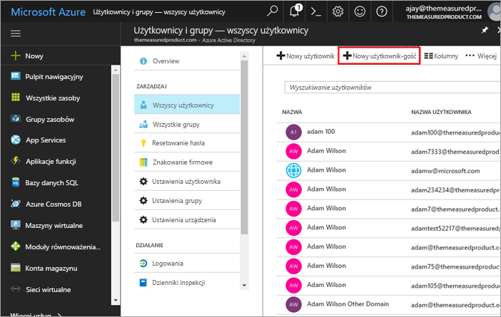
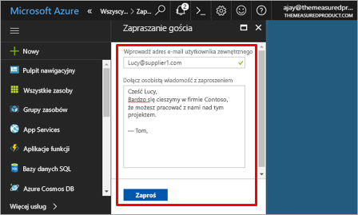
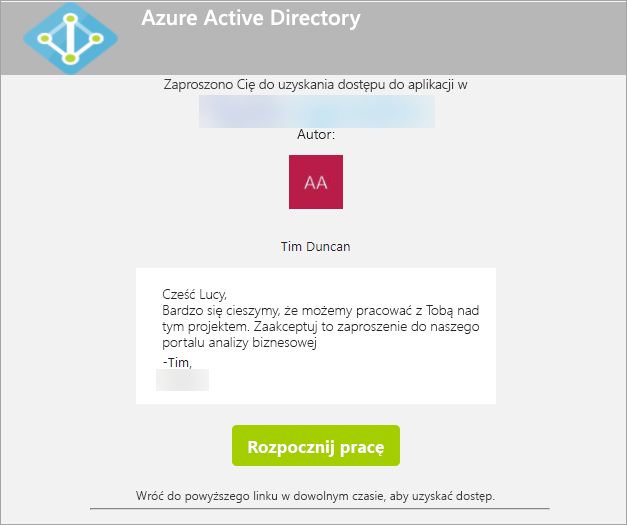
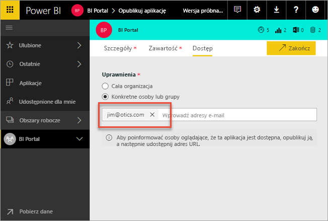
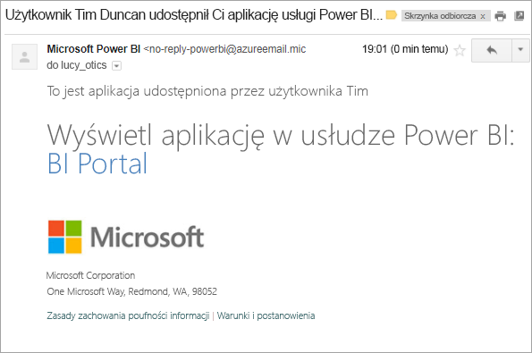
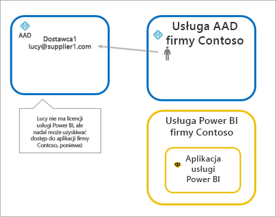
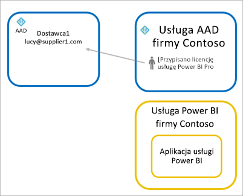
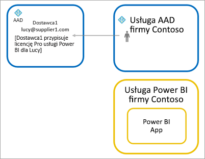

# Dystrybucja zawartości usługi Power BI do zewnętrznych użytkowników (gości) przy użyciu usługi Azure AD B2B

Usługa Power BI integruje się z usługą Azure Active Directory Business-to-business (Azure AD B2B), aby zapewnić bezpieczny sposób dystrybucji zawartości usługi Power BI do użytkowników (gości) spoza organizacji, przy jednoczesnym zachowaniu kontroli nad danymi wewnętrznymi.

> [!VIDEO https://www.youtube.com/embed/xxQWEQ1NnlY]

> [!NOTE]
> Zanim zaprosisz użytkowników-gości, musisz **włączyć** funkcję [Ustawienia eksportowania i udostępniania](service-admin-portal.md#export-and-sharing-settings) w ustawieniach dzierżawy portalu administracyjnego usługi Power BI.

> [!NOTE]
> Ta funkcja nie jest obecnie dostępna w aplikacjach mobilnych Power BI. Na urządzeniu przenośnym zawartość usługi Power BI udostępnianą za pośrednictwem usługi Azure AD B2B można wyświetlać w przeglądarce. 

## Kogo można zaprosić?

Możesz zaprosić użytkowników-gości korzystających z dowolnego adresu e-mail, w tym kont osobistych, takich jak gmail.com, outlook.com lub hotmail.com. W usłudze Azure B2B są one nazywane „identyfikatorami społecznościowymi”. Aby uzyskać więcej informacji, zobacz [Azure B2B](https://docs.microsoft.com/en-us/azure/active-directory/active-directory-b2b-what-is-azure-ad-b2b).

## Zapraszanie gości

Istnieją dwa sposoby na zaproszenie gości do dzierżawy usługi Power BI: zaproszenia planowane i zaproszenia ad hoc. Zaproszenia są wymagane tylko podczas pierwszego zapraszania użytkownika zewnętrznego do organizacji.

### Zaproszenia planowane

Zaproszenie planowane jest wykonywane w witrynie Microsoft Azure Portal w usłudze Azure AD lub przy użyciu programu PowerShell. Tej opcji należy użyć, jeśli wiesz, których użytkowników należy zaprosić. 

**Tworzenie użytkowników gości w portalu usługi Azure AD wymaga pozycji administratora dzierżawy.**

1. Przejdź do witryny [Azure Portal](https://portal.azure.com) i wybierz opcję **Azure Active Directory**.

2. Przejdź do pozycji **Użytkownicy i grupy** > **Wszyscy użytkownicy** > **Nowy użytkownik gość**.

    

3. Wprowadź **adres e-mail** oraz **osobistą wiadomość**.

    

4. Wybierz opcję **Zaproś**.

Aby zaprosić więcej niż jednego użytkownika gościa, użyj programu PowerShell. Aby uzyskać więcej informacji, zobacz [Funkcja współpracy między firmami przy użyciu usługi Azure Active Directory oraz przykłady programu PowerShell](https://docs.microsoft.com/azure/active-directory/active-directory-b2b-code-samples).

Użytkownik gość musi wybrać opcję **Rozpoczynanie pracy** w odebranej wiadomości e-mail z zaproszeniem. Następnie gość zostanie dodany do dzierżawy.

### Zaproszenia ad hoc

Aby wykonać to zaproszenie w dowolnym momencie, dodaj zewnętrznego użytkownika do pulpitu nawigacyjnego lub raportu za pomocą udziału interfejsu użytkownika lub aplikacji poprzez stronę dostępu.

Oto przykład tego, co można zrobić podczas zapraszania użytkownika zewnętrznego do korzystania z aplikacji.

Gość otrzyma wiadomość e-mail z informacją o udostępnieniu aplikacji.

Gość musi zalogować się przy użyciu firmowego adresu e-mail. Po zalogowaniu zostanie wyświetlony monit o zaakceptowanie zaproszenia. Po zalogowaniu gość zostanie przekierowany do zawartości aplikacji. Aby powrócić do aplikacji, należy dodać link do zakładek lub zapisać wiadomość e-mail.

## Licencjonowanie

Gość musi mieć odpowiednie licencje, aby wyświetlić udostępnioną aplikację. Istnieją trzy opcje realizacji tego kroku.

### Użycie usługi Power BI Premium

Przypisanie obszaru roboczego aplikacji do usługi Power BI Premium umożliwi gościom używanie aplikacji bez potrzeby posiadania licencji Power BI Pro. Ponadto licencja Power BI Premium zapewnia aplikacjom inne możliwości, takie jak zwiększona częstotliwość odświeżania, dedykowana pojemność i modele o dużych rozmiarach.

### Przypisanie licencji Power BI Pro do użytkownika gościa

Przypisanie licencji Power BI Pro do użytkownika gościa w ramach dzierżawy umożliwi mu wyświetlenie zawartości.

> [!NOTE]
> Licencja Power BI Pro z dzierżawy ma zastosowanie do użytkowników gości tylko wtedy, gdy uzyskują oni dostęp do zawartości w dzierżawie.

### Użytkownik gość używa własnej licencji Power BI Pro

Gość ma już licencję Power BI Pro przypisaną w ramach swojej dzierżawy.

## Istotne zagadnienia i ograniczenia

* W przypadku zaproszenia użytkowników-gości korzystających z osobistych kont e-mail, takich jak gmail.com, outlook.com lub hotmail.com, można wykonać to [osadzone wideo](https://docs.microsoft.com/en-us/azure/active-directory/active-directory-b2b-redemption-experience), aby zobaczyć przykład sposobu, w jaki użytkownik może się zarejestrować.
* Zewnętrzni goście B2B są ograniczeni tylko do korzystania z zawartości. Zewnętrzni goście B2B mogą wyświetlać aplikacje, pulpity nawigacyjne i raporty, eksportować dane oraz tworzyć subskrypcje e-mail dla pulpitów nawigacyjnych i raportów. Nie mogą uzyskiwać dostępu do obszarów roboczych ani publikować własnej zawartości.
* Ta funkcja nie jest obecnie dostępna w aplikacjach mobilnych Power BI. Na urządzeniu przenośnym zawartość usługi Power BI udostępnianą za pośrednictwem usługi Azure AD B2B można wyświetlać w przeglądarce.
* Stosowanie użytkowników-gości z usługą Power BI nie jest obsługiwane w suwerennych chmurach (dla instytucji rządowych).

## Następne kroki

Aby uzyskać bardziej szczegółowe informacje, w tym dotyczące działania zabezpieczeń na poziomie wiersza, zapoznaj się z [oficjalnym dokumentem](https://aka.ms/powerbi-b2b-whitepaper).

Aby uzyskać informacje dotyczące usługi Azure Active Directory B2B, zobacz [Co to jest współpraca w usłudze Azure AD B2B?](https://docs.microsoft.com/azure/active-directory/active-directory-b2b-what-is-azure-ad-b2b)
