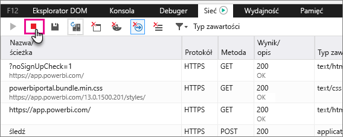

# Przechwytywanie dodatkowych informacji diagnostycznych
## Przechwytywanie dodatkowych informacji diagnostycznych dotyczących usługi Power BI
Instrukcje te zapewniają dwie potencjalne opcje ręcznego gromadzenia dodatkowych informacji diagnostycznych od internetowego klienta usługi Power BI.  Należy postępować zgodnie z tylko jedną z tych opcji.

## Przechwytywanie sieci — przeglądarki Edge i Internet Explorer
1. Przejdź do usługi [Power BI](https://app.powerbi.com) za pomocą przeglądarki Edge lub Internet Explorer.
2. Otwórz narzędzia deweloperskie przeglądarki Edge, naciskając klawisz F12.
3. Spowoduje to wyświetlenie okna Narzędzia dla deweloperów: 
   
   
4. Przejdź do karty Sieć. Wyświetlony zostanie ruch, który został już przechwycony. 
   
   
5. Możesz wybrać w oknie i odtworzyć dowolny problem, który mógł wystąpić. Okno narzędzi dla deweloperów możesz w każdej chwili ukryć i pokazać podczas sesji, naciskając klawisz F12.
6. Aby zatrzymać przechwytywanie, możesz wybrać czerwony kwadrat na karcie sieciowej w obszarze narzędzi dla deweloperów.
   
   
7. Wybierz ikonę dyskietki, aby **wyeksportować jako HAR**
   
   
8. Podaj nazwę pliku i zapisz plik HAR.
   
    Plik HAR będzie zawierał wszystkie informacje dotyczące żądań sieci między oknem przeglądarki i usługą Power BI.  Obejmuje to identyfikatory działań dla każdego żądania, dokładny znacznik czasu dla każdego żądania oraz wszelkie informacje o błędzie zwracane do klienta.  Ten ślad zawiera również dane używane do wypełniania elementów wizualnych wyświetlonych na ekranie.
9. Możesz udostępnić pliku HAR do obsługi podczas przeglądu.

Masz więcej pytań? [Zadaj pytanie społeczności usługi Power BI](http://community.powerbi.com/)

