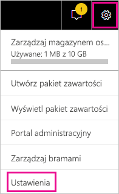
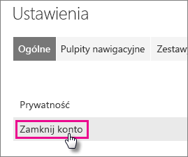
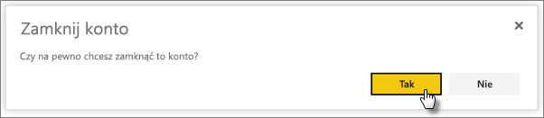
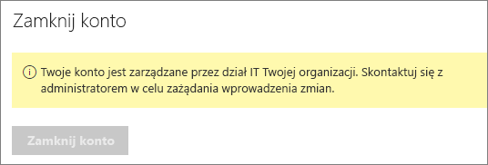

# Zamykanie konta usługi Power BI
Jeśli nie chcesz już używać usługi Power BI, możesz skontaktować się z nami, aby zamknąć konto usługi Power BI.  Po zamknięciu konta nie można już logować się do usługi Power BI.  Ponadto dane klienta przekazane lub utworzone w usłudze Power BI są usuwane zgodnie z zasadami przechowywania danych w Warunkach korzystania z usługi Power BI.

## Indywidualni użytkownicy usługi Power BI
Możesz zamknąć konto na ekranie ustawień.

1. Wybierz ikonę koła zębatego  w prawym górnym rogu.
2. Wybierz pozycję **Ustawienia**.
   
    
3. **Ogólne** > **Zamknij konto**
   
    
4. Wybierz przyczynę z listy rozwijanej **Dlaczego zamykasz konto?** (1).  Opcjonalnie możesz podać dodatkowe informacje (2). Następnie wybierz pozycję **Zamknij konto**.
   
    
5. Potwierdź, że chcesz zamknąć konto.
   
    
6. Zostanie wyświetlone potwierdzenie, że konto zostało zamknięte. Zostanie również wyświetlony link umożliwiający ponowne otwarcie konta.
   
    

## Użytkownicy zarządzanej dzierżawy
Skontaktuj się z administratorem dzierżawy i poproś o usunięcie przypisania licencji z tego konta.

Masz więcej pytań? [Zadaj pytanie społeczności usługi Power BI](http://community.powerbi.com/)

