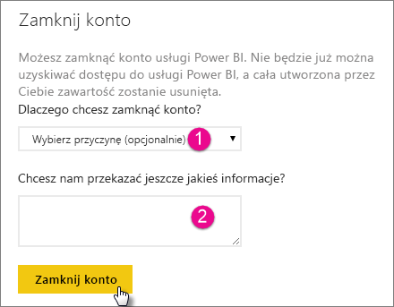

# Zamykanie konta usługi Power BI

Jeśli nie chcesz już używać usługi Power BI, możesz zamknąć konto usługi Power BI.  Po zamknięciu konta nie można już logować się do usługi Power BI. Wszystkie dane klienta przekazane lub utworzone w usłudze Power BI są usuwane zgodnie z zasadami przechowywania danych w Warunkach korzystania z usługi Power BI.

## Indywidualni użytkownicy usługi Power BI

Jeśli konto usługi Power BI zostało utworzone dla użytkownika indywidualnego, można je zamknąć na ekranie **Ustawienia**.

1. W usłudze Power BI wybierz ikonę koła zębatego w prawym górnym rogu, a następnie wybierz pozycję **Ustawienia**.

    

1. Na karcie **Ogólne** wybierz pozycję **Zamknij konto**.

    

1. Wybierz przyczynę zamknięcia konta (1). Możesz również podać dodatkowe informacje (2). Następnie wybierz pozycję **Zamknij konto**.

    

1. Potwierdź, że chcesz zamknąć konto.

    

    Powinno zostać wyświetlone potwierdzenie zamknięcia konta. W razie potrzeby można ponownie otworzyć konto z tego miejsca.

    

## Użytkownicy zarządzanej dzierżawy

Jeśli organizacja utworzyła dla Ciebie konto usługi Power BI, skontaktuj się z administratorem dzierżawy. Poproś go o anulowanie przypisania licencji z Twojego konta.

Masz więcej pytań? [Zadaj pytanie społeczności usługi Power BI](http://community.powerbi.com/)