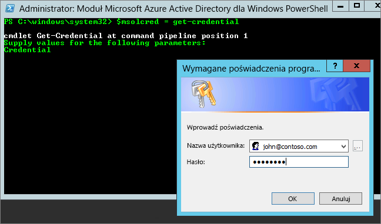

# <a name="administering-power-bi---frequently-asked-questions-faq"></a>Administrowanie usługą Power BI — często zadawane pytania

W tym artykule przedstawiono często zadawane pytania dotyczące administrowania usługi Power BI. Omówienie administracji usługi Power BI można znaleźć w temacie [Co to jest administracja usługi Power BI?](service-admin-administering-power-bi-in-your-organization.md).

## <a name="whats-in-this-article"></a>Zawartość artykułu

### <a name="sign-up-for-power-bi-section"></a>Sekcja Tworzenie konta w usłudze Power BI

* [Korzystanie z programu PowerShell](#using-powershell)
* [Jak użytkownicy tworzą konta w usłudze Power BI?](#how-do-users-sign-up-for-power-bi)
* [Jak poszczególni użytkownicy w organizacji tworzą konta?](#how-do-individual-users-in-my-organization-sign-up)
* [Jak mogę uniemożliwić użytkownikom dołączanie do istniejącej dzierżawy usługi Office 365?](#how-can-i-prevent-users-from-joining-my-existing-office-365-tenant)
* [Jak można zezwolić użytkownikom na dołączanie do istniejącej dzierżawy usługi Office 365?](#how-can-i-allow-users-to-join-my-existing-office-365-tenant)
* [Jak sprawdzić, czy dzierżawa ma blokadę?](#how-do-i-verify-if-i-have-the-block-on-in-the-tenant)
* [Jak uniemożliwić istniejącym użytkownikom rozpoczynanie korzystania z usługi Power BI?](#how-can-i-prevent-my-existing-users-from-starting-to-use-power-bi)
* [Jak można zezwolić istniejącym użytkownikom na tworzenie kont w usłudze Power BI?](#how-can-i-allow-my-existing-users-to-sign-up-for-power-bi)

### <a name="administration-of-power-bi-section"></a>Sekcja Administrowanie usługi Power BI

* [Jak zmieni się obecny sposób zarządzania tożsamością użytkowników w mojej organizacji?](#how-will-this-change-the-way-i-manage-identities-for-users-in-my-organization-today)
* [Jak zarządzać usługą Power BI?](#how-do-we-manage-power-bi)
* [Jaka jest procedura przejęcia zarządzania dzierżawą utworzoną przez firmę Microsoft dla moich użytkowników?](#what-is-the-process-to-manage-a-tenant-created-by-microsoft-for-my-users)
* [Jeśli mam wiele domen, czy mogę kontrolować to, do której dzierżawy usługi Office 365 dodawani są użytkownicy?](#if-i-have-multiple-domains-can-i-control-the-office-365-tenant-that-users-are-added-to)
* [Jak usunąć usługę Power BI dla użytkowników, którzy są już zarejestrowani?](#how-do-i-remove-power-bi-for-users-that-already-signed-up)
* [Jak sprawdzić, kiedy nowi użytkownicy dołączają do mojej dzierżawy?](#how-do-i-know-when-new-users-have-joined-my-tenant)
* [Czy istnieją dodatkowe rzeczy, na które należy się przygotować?](#are-there-any-additional-things-i-should-be-prepared-for)
* [Gdzie znajduje się moja dzierżawa usługi Power BI?](#where-is-my-power-bi-tenant-located)
* [Co to jest umowa SLA (umowa dotycząca poziomu usług) usługi Power BI?](#what-is-the-power-bi-sla)

### <a name="security-in-power-bi-section"></a>Sekcja Zabezpieczenia w usłudze Power BI

* [Czy usługa Power BI spełnia krajowe, regionalne i branżowe wymagania dotyczące zgodności?](#does-power-bi-meet-national-regional-and-industry-specific-compliance-requirements)
* [Jak działają zabezpieczenia w usłudze Power BI?](#how-does-security-work-in-power-bi)

## <a name="sign-up-for-power-bi"></a>Tworzenie konta w usłudze Power BI

### <a name="using-powershell"></a>Korzystanie z programu PowerShell

Niektóre procedury w tej sekcji wymagają skryptów programu Windows PowerShell. Jeśli nie znasz programu PowerShell, zalecamy zapoznanie się z [przewodnikiem zawierającym wprowadzenie do programu PowerShell](http://go.microsoft.com/fwlink/p/?LinkID=286814). Aby uruchomić skrypty, najpierw zainstaluj najnowszą 64-bitową wersję modułu [Azure Active Directory PowerShell for Graph](/powershell/azure/active-directory/).

### <a name="how-do-users-sign-up-for-power-bi"></a>Jak użytkownicy tworzą konta w usłudze Power BI?

Jako administrator możesz utworzyć konto usługi Power BI za pośrednictwem [witryny internetowej usługi Power BI](https://powerbi.microsoft.com) lub strony [Zakup usług](https://admin.microsoft.com/AdminPortal/Home#/catalog) w centrum administracyjnym usługi Office 365. Jeśli administrator zarejestruje się w usłudze Power BI, będzie mógł przydzielać licencje użytkownikom, którzy powinni otrzymać dostęp.

Ponadto poszczególni użytkownicy w organizacji mogą być w stanie zarejestrować się w usłudze Power BI za pośrednictwem [witryny internetowej usługi Power BI](https://powerbi.microsoft.com). Po zarejestrowaniu się użytkownika organizacji w usłudze Power BI zostanie do niego automatycznie przypisana bezpłatna licencja usługi Power BI. Aby uzyskać więcej informacji, zobacz tematy [Rejestrowanie się w usłudze Power BI jako użytkownik indywidualny](service-self-service-signup-for-power-bi.md) i [Licencjonowanie usługi Power BI w organizacji](service-admin-licensing-organization.md).

### <a name="how-do-individual-users-in-my-organization-sign-up"></a>Jak poszczególni użytkownicy w organizacji tworzą konta?

Istnieją trzy scenariusze, które mogą mieć zastosowanie do użytkowników w Twojej organizacji:

* **Scenariusz 1**. Organizacja ma już istniejące środowisko usługi Office 365, a użytkownik rejestrujący się w usłudze Power BI ma już konto usługi Office 365.
    Jeśli w tym scenariuszu użytkownik ma konto służbowe w dzierżawie (np. contoso.com), ale nie ma jeszcze konta usługi Power BI, firma Microsoft po prostu aktywuje plan dla tego konta, a użytkownik otrzymuje automatyczne powiadomienie o sposobie korzystania z usługi Power BI.

* **Scenariusz 2**. Organizacja ma istniejące środowisko usługi Office 365, ale użytkownik rejestrujący się w usłudze Power BI nie ma jeszcze konta usługi Office 365.
    W tym scenariuszu użytkownik ma adres e-mail w domenie organizacji (np. contoso.com), ale nie ma jeszcze konta usługi Office 365. W takim przypadku użytkownik może zarejestrować się w usłudze Power BI i automatycznie otrzymuje konto. Dzięki temu użytkownik może uzyskać dostęp do usługi Power BI. Jeśli na przykład pracownica o imieniu Nancy używa służbowy adresu e-mail (takiego jak nancy@contoso.com) do zarejestrowania się w usłudze, firma Microsoft automatycznie dodaje użytkownika Nancy w środowisku usługi Office 365 firmy Contoso i aktywuje usługę Power BI dla tego konta.

* **Scenariusz 3**. Organizacja nie ma środowiska usługi Office 365 połączonego z domeną poczty e-mail.
    Nie ma żadnych administracyjnych działań, które organizacja musi podjąć, aby skorzystać z usługi Power BI. Użytkownicy są dodawani do nowego katalogu użytkowników działającego tylko w chmurze, a Ty masz możliwość dobrowolnego wyboru i przejęcia tych użytkowników jako administrator dzierżawy i zarządzania nimi.

> [!IMPORTANT]
> Jeśli organizacja ma wiele domen poczty e-mail i chcesz, aby wszystkie rozszerzenia adresu e-mail znalazły się w tej samej dzierżawie, dodaj wszystkie domeny adresów e-mail do dzierżawy usługi Azure Active Directory przed zarejestrowaniem jakichkolwiek użytkowników. Nie istnieje automatyczny mechanizm przenoszenia użytkowników między dzierżawami po ich utworzeniu. Aby uzyskać więcej informacji o tym procesie, zobacz sekcję [Jeśli mam wiele domen, czy mogę kontrolować to, do której dzierżawy usługi Office 365 dodawani są użytkownicy?](#if-i-have-multiple-domains-can-i-control-the-office-365-tenant-that-users-are-added-to) później w tym artykule oraz [Add a domain to Office 365](/office365/admin/setup/add-domain/) (Dodawanie domeny do usługi Office 365).

### <a name="how-can-i-prevent-users-from-joining-my-existing-office-365-tenant"></a>Jak mogę uniemożliwić użytkownikom dołączanie do istniejącej dzierżawy usługi Office 365?

Istnieją kroki, które możesz podjąć jako administrator, aby uniemożliwić użytkownikom dołączanie do istniejącej dzierżawy usługi Office 365. Jeśli dostęp zostanie zablokowany, próby rejestracji podejmowane przez użytkowników zakończą się niepowodzeniem, a użytkownicy zostaną przekierowani do kontaktu z administratorem w organizacji. Nie musisz powtarzać tego procesu, jeśli już wyłączono automatyczną dystrybucję licencji (np. za pośrednictwem usługi Office 365 dla instytucji edukacyjnych dla uczniów i studentów, nauczycieli i wykładowców oraz personelu).

Aby uniemożliwić nowym użytkownikom dołączanie do dzierżawy zarządzanej, użyj poniższego skryptu programu PowerShell. [Dowiedz się więcej o programie PowerShell](#basic-powershell-information)

```powershell
$msolcred = get-credential
connect-msolservice -credential $msolcred

Set-MsolCompanySettings -AllowEmailVerifiedUsers $false
```

> [!NOTE]
> Zablokowanie dostępu uniemożliwia nowym użytkownikom w organizacji rejestrowanie się w usłudze Power BI. Użytkownicy, którzy zarejestrują się w usłudze Power BI przed wyłączeniem nowych rejestracji dla organizacji, zachowują swoje licencje. Aby usunąć użytkownika, zobacz sekcję [Jak usunąć usługę Power BI dla użytkowników, którzy są już zarejestrowani?](#how-do-i-remove-power-bi-for-users-that-already-signed-up) w dalszej części tego artykułu.

### <a name="how-can-i-allow-users-to-join-my-existing-office-365-tenant"></a>Jak można zezwolić użytkownikom na dołączanie do istniejącej dzierżawy usługi Office 365?

Aby umożliwić nowym użytkownikom dołączanie do dzierżawy zarządzanej, użyj poniższego skryptu programu PowerShell. [Dowiedz się więcej o programie PowerShell](#basic-powershell-information)

```powershell
$msolcred = get-credential
connect-msolservice -credential $msolcred

Set-MsolCompanySettings -AllowEmailVerifiedUsers $true
```

### <a name="how-do-i-verify-if-i-have-the-block-on-in-the-tenant"></a>Jak sprawdzić, czy dzierżawa ma blokadę?

Aby zweryfikować ustawienia, użyj poniższego skryptu programu PowerShell. Parametr *AllowEmailVerifiedUsers* powinien mieć wartość false. [Dowiedz się więcej o programie PowerShell](#basic-powershell-information)

```powershell
$msolcred = get-credential
connect-msolservice -credential $msolcred

Get-MsolCompanyInformation | fl allow*
```

### <a name="how-can-i-prevent-my-existing-users-from-starting-to-use-power-bi"></a>Jak uniemożliwić istniejącym użytkownikom rozpoczynanie korzystania z usługi Power BI?

Ustawienie usługi Azure AD, które kontroluje tę opcję, to **AllowAdHocSubscriptions**. W przypadku większości dzierżaw dla tego ustawienia określona jest wartość true, co oznacza, że jest ono włączone. Jeśli klient nabył usługę Power BI za pośrednictwem partnera, dla tego ustawienia może być ustawiona wartość false, co oznacza, że zostało ono wyłączone.

Aby wyłączyć subskrypcje ad hoc, użyj poniższego skryptu programu PowerShell. [Dowiedz się więcej o programie PowerShell](#basic-powershell-information)

1. Zaloguj się do usługi Azure Active Directory przy użyciu poświadczeń usługi Office 365. Pierwszy wiersz poniższego skrypt programu PowerShell będzie monitować o podanie poświadczeń. Drugi wiersz spowoduje nawiązanie połączenia z usługą Azure Active Directory.

    ```powershell
     $msolcred = get-credential
     connect-msolservice -credential $msolcred
    ```

   

1. Po zalogowaniu się uruchom następujące polecenie, aby wyświetlić bieżącą konfigurację dzierżawy.

    ```powershell
     Get-MsolCompanyInformation | fl AllowAdHocSubscriptions
    ```
1. Uruchom poniższe polecenie, aby włączyć ($true) lub wyłączyć ($false) ustawienie **AllowAdHocSubscriptions**.

    ```powershell
     Set-MsolCompanySettings -AllowAdHocSubscriptions $false
    ```

> [!NOTE]
> Flaga AllowAdHocSubscriptions jest używana do kontrolowania kilku możliwości użytkownika w organizacji, w tym możliwości rejestrowania się w usłudze Azure Rights Management. Zmiana tej flagi wpływa na wszystkie te możliwości.

### <a name="how-can-i-allow-my-existing-users-to-sign-up-for-power-bi"></a>Jak można zezwolić istniejącym użytkownikom na tworzenie kont w usłudze Power BI?

Aby umożliwić istniejącym użytkownikom rejestrowanie się w usłudze Power BI, uruchom polecenie opisane w powyższym pytaniu, ale w ostatnim kroku przekaż wartość true zamiast wartości false.

## <a name="administration-of-power-bi"></a>Administrowanie usługi Power BI

### <a name="how-will-this-change-the-way-i-manage-identities-for-users-in-my-organization-today"></a>Jak zmieni się obecny sposób zarządzania tożsamością użytkowników w mojej organizacji?

Istnieją trzy scenariusze, które mogą mieć zastosowanie do użytkowników w Twojej organizacji:

* **Scenariusz 1**. Jeśli organizacja ma już istniejące środowisko usługi Office 365 i wszyscy użytkownicy w organizacji mają konta usługi Office 365, sposób zarządzania tożsamościami nie zmienia się.

* **Scenariusz 2**. Jeśli organizacja ma już istniejące środowisko usługi Office 365, ale nie wszyscy użytkownicy w organizacji mają konta usługi Office 365, tworzymy użytkownika w ramach dzierżawy i przypisujemy licencje na podstawie służbowego adresu e-mail danego użytkownika.

    Oznacza to, że liczba użytkowników, którymi zarządzasz w danym momencie, zwiększa się w miarę tworzenia kont usługi przez użytkowników w organizacji.

* **Scenariusz 3**. Jeśli organizacja nie ma środowiska usługi Office 365 połączonego z domeną poczty e-mail, sposób zarządzania tożsamościami nie zmienia się.

    Użytkownicy są dodawani do nowego katalogu użytkowników działającego tylko w chmurze, a Ty masz możliwość dobrowolnego wyboru i przejęcia tych użytkowników jako administrator dzierżawy i zarządzania nimi.

### <a name="how-do-we-manage-power-bi"></a>Jak zarządzać usługą Power BI?

Usługa Power BI zapewnia portal administracyjny, który umożliwia wyświetlanie statystyk użycia, oferuje link do centrum administracyjnego usługi Office 365 umożliwiającego zarządzanie użytkownikami i grupami oraz udostępnia możliwość kontrolowania ustawień obejmujących całą dzierżawę.

Aby uzyskać dostęp do portalu administracyjnego usługi Power BI, Twoje konto musi być oznaczone jako **Administrator globalny** w usłudze Office 365 lub Azure Active Directory albo musi mieć przypisaną rolę administratora usługi Power BI. Aby uzyskać więcej informacji, zobacz tematy [Opis roli administratora usługi Power BI](service-admin-role.md) i [Portal administracyjny usługi Power BI](service-admin-portal.md).

### <a name="what-is-the-process-to-manage-a-tenant-created-by-microsoft-for-my-users"></a>Jaka jest procedura przejęcia zarządzania dzierżawą utworzoną przez firmę Microsoft dla moich użytkowników?

Jeśli dzierżawa została utworzona przez firmę Microsoft, możesz przejąć dzierżawę i zarządzać nią w następujący sposób:

1. Dołącz do dzierżawy, tworząc konto w usłudze Power BI za pomocą adresu e-mail w domenie odpowiadającej domenie dzierżawy, którą chcesz zarządzać. Na przykład jeśli firma Microsoft utworzyła dzierżawę contoso.com, dołączasz do dzierżawy za pomocą adresu e-mail kończącego się na @contoso.com.

1. Przejmij kontrolę administracyjną, weryfikując własność domeny: po dołączeniu do dzierżawy możesz nadać sobie rolę *administratora globalnego*, weryfikując własność domeny. Wykonaj następujące kroki opisane w [dokumentacji usługi Office 365](/office365/admin/misc/become-the-admin).

### <a name="if-i-have-multiple-domains-can-i-control-the-office-365-tenant-that-users-are-added-to"></a>Jeśli mam wiele domen, czy mogę kontrolować to, do której dzierżawy usługi Office 365 dodawani są użytkownicy?

Jeśli nic nie zrobisz, dzierżawy będą tworzone dla każdej domeny i poddomeny poczty e-mail dla użytkowników. Jeśli chcesz, aby wszyscy użytkownicy — bez względu na rozszerzenie adresu e-mail — znajdowali się w tej samej dzierżawie: utwórz docelową dzierżawę wcześniej lub użyj istniejącej dzierżawy, a następnie dodaj wszystkie istniejące domeny i poddomeny, które chcesz skonsolidować z dzierżawą. Wtedy wszyscy użytkownicy mający adresy e-mail w tych domenach i poddomenach automatycznie dołączą do dzierżawy docelowej po utworzeniu konta.

> [!IMPORTANT]
> Nie jest obsługiwany żaden automatyczny mechanizm przenoszenia już utworzonych użytkowników do innej dzierżawy. Aby uzyskać więcej informacji na temat dodawania domen do dzierżawy usługi Office 365, zobacz [Dodawanie domeny i użytkowników do usługi Office 365](/office365/admin/setup/add-domain/).

### <a name="how-do-i-remove-power-bi-for-users-that-already-signed-up"></a>Jak usunąć usługę Power BI dla użytkowników, którzy są już zarejestrowani?

Jeśli użytkownik zarejestrował się już w usłudze Power BI, ale nie chcesz, aby miał dostęp do usługi Power BI, możesz usunąć licencję usługi Power BI dla tego użytkownika.

1. Przejdź do [centrum administracyjnego usługi Office 365](https://admin.microsoft.com/AdminPortal/Home#/homepage).

1. Na lewym pasku nawigacyjnym wybierz pozycję **Użytkownicy** > **Aktywni użytkownicy**.

1. Znajdź użytkownika, którego licencję chcesz usunąć, a następnie wybierz jego nazwę.

    Możesz też przeprowadzać zbiorcze zarządzanie licencjami użytkowników. W tym celu wybierz wielu użytkowników i wybierz pozycję **Edytuj licencje produktów**.

1. Na stronie szczegółów użytkownika obok pozycji **Licencje na produkty** wybierz pozycję **Edytuj**.

1. Ustaw pozycję **Power BI (wersja bezpłatna)** lub **Power BI Pro** na wartość **Wył.** w zależności od licencji zastosowanej do konta użytkownika.

1. Wybierz pozycję **Zapisz**.

### <a name="how-do-i-know-when-new-users-have-joined-my-tenant"></a>Jak sprawdzić, kiedy nowi użytkownicy dołączają do mojej dzierżawy?

Użytkownicy, którzy dołączyli do dzierżawy w ramach tego programu, otrzymują unikatową licencję, którą można odfiltrować w okienku aktywnego użytkownika na pulpicie nawigacyjnym administratora. Aby utworzyć ten nowy widok, wykonaj poniższe kroki.

1. Przejdź do [centrum administracyjnego usługi Office 365](https://admin.microsoft.com/AdminPortal/Home#/homepage).

1. Na lewym pasku nawigacyjnym wybierz pozycję **Użytkownicy** > **Aktywni użytkownicy**.

1. W menu **Widoki** wybierz pozycję **Dodaj widok niestandardowy**.

1. Nazwij nowy widok i w pozycji **Przypisana licencja na produkt** wybierz pozycję **Power BI (wersja bezpłatna)** lub **Power BI Pro**.

    Możesz mieć wybraną tylko jedną licencję na widok. Jeśli masz w organizacji obie licencje, **Power BI (wersja bezpłatna)** i **Power BI Pro**, musisz utworzyć dwa widoki.

1. Wprowadź inne wybrane warunki, a następnie wybierz pozycję **Dodaj**.

1. Nowo utworzony widok jest dostępny w menu **Widoki**.

### <a name="are-there-any-additional-things-i-should-be-prepared-for"></a>Czy istnieją dodatkowe rzeczy, na które należy się przygotować?

Może wzrosnąć liczba żądań o resetowanie haseł. Aby uzyskać informacje o tym procesie, zobacz [Resetowanie hasła użytkownika](/office365/admin/add-users/reset-passwords).

Możesz usunąć użytkownika z dzierżawy za pośrednictwem standardowego procesu w centrum administracyjnym usługi Office 365. Jeśli jednak użytkownik nadal ma aktywny adres e-mail od organizacji, może ponownie dołączyć, chyba że zablokujesz wszystkim użytkownikom możliwość dołączania.

### <a name="where-is-my-power-bi-tenant-located"></a>Gdzie znajduje się moja dzierżawa usługi Power BI?

Aby dowiedzieć się, w którym regionie znajduje się dzierżawa usługi Power BI, zapoznaj się z tematem [Gdzie znajduje się moja dzierżawa usługi Power BI?](service-admin-where-is-my-tenant-located.md)

### <a name="what-is-the-power-bi-sla"></a>Co to jest umowa SLA usługi Power BI?

Aby uzyskać informacje na temat umowy SLA (umowy dotyczącej poziomu usług) usługi Power BI, zapoznaj się z artykułem dotyczącym [postanowień licencyjnych i dokumentacji](http://www.microsoftvolumelicensing.com/DocumentSearch.aspx?Mode=3&DocumentTypeId=37) w sekcji **Licencjonowanie** witryny internetowej licencjonowania firmy Microsoft.

## <a name="security-in-power-bi"></a>Zabezpieczenia w usłudze Power BI

### <a name="does-power-bi-meet-national-regional-and-industry-specific-compliance-requirements"></a>Czy usługa Power BI spełnia krajowe, regionalne i branżowe wymagania dotyczące zgodności?

Dowiedz się więcej na temat zgodności usługi Power BI na stronie [Centrum zaufania firmy Microsoft](https://www.microsoft.com/en-us/TrustCenter/CloudServices/business-application-platform/default.aspx).

### <a name="how-does-security-work-in-power-bi"></a>Jak działają zabezpieczenia w usłudze Power BI?

Usługa Power BI jest oparta na usłudze Office 365, która z kolei jest oparta na usługach platformy Azure, takich jak usługa Azure Active Directory. Aby uzyskać omówienie architektury usługi Power BI, zobacz [Zabezpieczenia usługi Power BI](service-admin-power-bi-security.md).

## <a name="next-steps"></a>Następne kroki

[Portal administracyjny usługi Power BI](service-admin-portal.md)  
[Opis roli administratora usługi Power BI](service-admin-role.md)  
[Rejestracja samoobsługowa w usłudze Power BI](service-self-service-signup-for-power-bi.md)  
[Zakup usługi Power BI Pro](service-admin-purchasing-power-bi-pro.md)  
[Power BI Premium — co to jest?](service-premium.md)  
[Jak kupić usługę Power BI Premium](service-admin-premium-purchase.md)  
[Oficjalny dokument na temat usługi Power BI Premium](https://aka.ms/pbipremiumwhitepaper)  
[Zarządzanie grupą w usługach Power BI i Office 365](service-manage-app-workspace-in-power-bi-and-office-365.md)  
[Zarządzanie kontami użytkowników usługi Office 365](/office365/servicedescriptions/office-365-platform-service-description/user-account-management/)  
[Zarządzanie grupami usługi Office 365](/office365/admin/email/create-edit-or-delete-a-security-group/)  

Masz więcej pytań? [Zadaj pytanie społeczności usługi Power BI](http://community.powerbi.com/)
