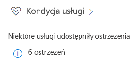
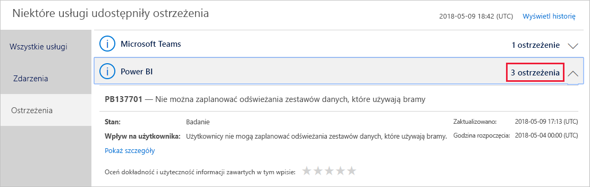
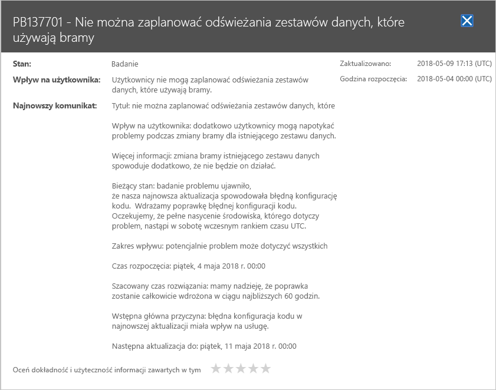

# Śledzenie kondycji usługi Power BI w usłudze Office 365

Centrum administracyjne usługi Office 365 oferuje ważne narzędzia dla administratorów usługi Power BI, w tym bieżące i historyczne informacje na temat kondycji usługi. Aby uzyskać dostęp do tych informacji, musisz pełnić jedną z następujących ról: administrator usługi Power BI lub administratora globalnego usługi Office 365. Aby uzyskać więcej informacji o rolach, zobacz [Role administratora powiązane z usługą Power BI](service-admin-administering-power-bi-in-your-organization.md#administrator-roles-related-to-power-bi).

1. Zaloguj się do [centrum administracyjnego usługi Office 365](https://portal.office.com/adminportal).

1. Wybierz kafelek **Kondycja usługi**.

    

1. Z bieżącej listy wybierz pozycję **Porady: N** lub **Zdarzenia: N** i zapoznaj się z wynikami. Na poniższym rysunku przedstawiono jedną z trzech aktywnych porad.

    

1. Aby uzyskać więcej informacji, wybierz pozycję **Pokaż szczegóły** dla elementu. Na poniższym rysunku widać dodatkowe szczegóły, w tym najnowsze aktualizacje stanu.

    

    Przewiń w dół, aby zobaczyć więcej informacji, a następnie zamknij okienko, gdy skończysz.

1. Aby wyświetlić informacje historyczne dotyczące wszystkich usług, w prawym górnym rogu głównej listy wybierz pozycję **Wyświetl historię**. Następnie wybierz pozycję **Ostatnie 7 dni** lub **Ostatnie 30 dni**. Aby wrócić do kondycji bieżącej usługi, wybierz pozycję **Wyświetl bieżący stan**.