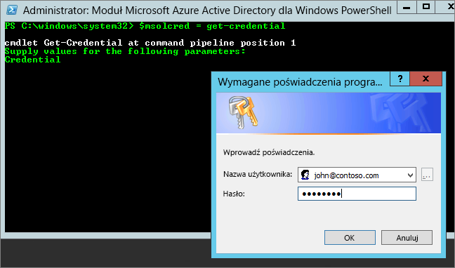

# <a name="power-bi-licensing-in-your-organization"></a>Licencjonowanie usługi Power BI w organizacji

[!INCLUDE [license-capabilities](includes/license-capabilities.md)]

Ten artykuł koncentruje się na licencjonowaniu na użytkownika z perspektywy administratora.

## <a name="manage-power-bi-pro-licenses"></a>Zarządzanie licencjami usługi Power BI Pro

Jako administrator możesz kupować i przypisywać licencje usługi Power BI Pro. Możesz również utworzyć konto wersji próbnej usługi Power BI Pro dla swojej organizacji. Poszczególne osoby mogą również tworzyć konta wersji próbnej usługi Power BI Pro.

### <a name="purchasing-power-bi-pro"></a>Zakup usługi Power BI Pro

Licencje usługi Power BI Pro są kupowane za pośrednictwem usługi Microsoft Office 365 lub u certyfikowanego partnera firmy Microsoft. Po zakupieniu licencji możesz przypisać je do poszczególnych użytkowników. Aby uzyskać więcej informacji, zobacz [Kupowanie i przypisywanie licencji usługi Power BI Pro](service-admin-purchasing-power-bi-pro.md).

### <a name="power-bi-pro-trial-for-individuals"></a>Wersja próbna usługi Power BI Pro dla użytkowników indywidualnych

Użytkownicy indywidualni w organizacji mogą utworzyć konto wersji próbnej usługi Power BI Pro. Aby uzyskać więcej informacji, zobacz [Rejestrowanie się w usłudze Power BI jako użytkownik indywidualny](service-self-service-signup-for-power-bi.md).

Użytkownicy korzystający z tej wersji próbnej usługi Power BI Pro w ramach produktu nie są widoczni w portalu administracyjnym usługi Office 365 jako użytkownicy wersji próbnej usługi Power BI Pro (są wyświetlani jako użytkownicy wersji bezpłatnej usługi Power BI). Są jednak wyświetlani jako użytkownicy usługi Power BI Pro w wersji próbnej na stronie zarządzania magazynem w usłudze Power BI.

### <a name="power-bi-pro-trial-for-organizations"></a>Wersja próbna usługi Power BI Pro dla organizacji

Jeśli chcesz uzyskać i wdrożyć licencje na wersję próbną usługi Power BI dla wielu użytkowników w organizacji bez indywidualnego akceptowania warunków wersji próbnej, możesz utworzyć konto wersji próbnej usługi Power BI Pro dla organizacji.

Przed wykonaniem kroków tworzenia konta należy pamiętać o następujących kwestiach:

* Aby utworzyć konto, musisz być członkiem roli [**Administrator globalny** lub **Administrator rozliczeń**](https://support.office.com/article/about-office-365-admin-roles-da585eea-f576-4f55-a1e0-87090b6aaa9d?ui=en-US&rs=en-US&ad=US) w usłudze Office 365.

* Obowiązuje limit jednej wersji próbnej dla organizacji w dzierżawie. Oznacza to, że jeśli w danej dzierżawie już zastosowano wersję próbną usługi Power BI Pro, nie można tego zrobić ponownie. Jeśli potrzebujesz pomocy w tym zakresie, skontaktuj się z [pomocą techniczną ds. rozliczeń w usłudze Office 365](https://support.office.microsoft.com/article/contact-support-for-business-products-admin-help-32a17ca7-6fa0-4870-8a8d-e25ba4ccfd4b?CorrelationId=552bbf37-214f-4202-80cb-b94240dcd671&ui=en-US&rs=en-US&ad=US).

1. Przejdź do [centrum administracyjnego usługi Office 365](https://portal.office.com/adminportal/home#/homepage).

1. W lewym okienku nawigacji wybierz kolejno pozycje **Rozliczenia** i **Subskrypcje**.

   

1. Po prawej stronie wybierz pozycję **Dodaj subskrypcje**.

   

1. W obszarze **Inne plany** najedź kursorem na wielokropek (**. . .**) przy usłudze Power BI Pro i wybierz pozycję **Rozpocznij bezpłatny kres próbny**.

    

1. Na ekranie potwierdzenia zamówienia wybierz pozycję **Wypróbuj teraz**.

1. Po otrzymaniu potwierdzenia zamówienia wybierz pozycję **Kontynuuj**.

Teraz możesz [przypisać licencje w usłudze Office 365](https://support.office.com/article/assign-licenses-to-users-in-office-365-for-business-997596b5-4173-4627-b915-36abac6786dc).

## <a name="manage-power-bi-free-licenses"></a>Zarządzanie bezpłatnymi licencjami usługi Power BI

Użytkownicy w organizacji mogą uzyskiwać dostęp do bezpłatnych licencji usługi Power BI na dwa różne sposoby:

* Z poziomu portalu administracyjnego usługi Office 365 możesz przypisać im licencję usługi Power BI.

* Jeśli użytkownik [zarejestruje się w wersji próbnej usługi Power BI Pro](service-self-service-signup-for-power-bi.md) i wersja próbna wygaśnie, zostanie do niego przypisana bezpłatna licencja.

### <a name="requesting-and-assigning-free-licenses"></a>Tworzenie żądań dotyczących licencji bezpłatnych i przypisywanie tych licencji

Jeśli planujesz centralnie zarządzać żądaniami i przypisaniami licencji, sprawdź najpierw, czy masz nieograniczony blok licencji usługi Power BI (wersja bezpłatna).

Ten blok licencji jest dostępny od momentu indywidualnego zarejestrowania się użytkownika w usłudze Power BI po raz pierwszy. Podczas tego procesu blok licencji jest dołączany do organizacji, a licencja zostaje przypisana do rejestrującego się użytkownika.

1. W centrum administracyjnym usługi Office 365 w obszarze **Rozliczenia** > **Licencje** wyszukaj pozycję **nieograniczone**.

    

1. Jeśli blok jest dostępny, możesz teraz [przypisywać licencje w usłudze Office 365](https://support.office.com/article/assign-licenses-to-users-in-office-365-for-business-997596b5-4173-4627-b915-36abac6786dc). Jeśli blok nie jest dostępny, masz dwie możliwości:

    * Członek organizacji tworzy konto indywidualnie, co wyzwala tworzenie bloku bez ograniczeń.

    * Przechodzisz do następnej procedury, w ramach której możesz utworzyć konto dla ustalonej liczby licencji.

Jeśli nieograniczony blok licencji usługi Power BI (wersja bezpłatna) nie jest dostępny, wykonaj poniższą procedurę.

1. Przejdź do [centrum administracyjnego usługi Office 365](https://portal.office.com/admin/default.aspx).

1. W okienku nawigacji po lewej stronie wybierz pozycję **Rozliczenia** > **Subskrypcje**.

1. Po prawej stronie wybierz pozycję **Dodaj subskrypcje +**.

1. W obszarze **Inne plany** najedź kursorem na wielokropek (**. . .**) przy usłudze Power BI (wersja bezpłatna) i wybierz pozycję **Kup teraz**.

    

1. Wprowadź liczbę licencji, które chcesz dodać, i wybierz pozycję **Sfinalizuj zakup** lub **Dodaj do koszyka**.

1. Wprowadź wymagane informacje w przepływie finalizacji zakupu.

    To podejście nie powoduje zakupu, ale konieczne jest wprowadzenie informacji o karcie kredytowej do rozliczeń lub wybranie opcji fakturowania.

1. Teraz możesz [przypisać licencje w usłudze Office 365](https://support.office.com/article/assign-licenses-to-users-in-office-365-for-business-997596b5-4173-4627-b915-36abac6786dc).

1. Jeśli zechcesz później dodać więcej licencji, wróć do obszaru **Dodawanie subskrypcji**, a następnie wybierz pozycję **Zmień liczbę licencji** dla usługi Power BI (wersja bezpłatna).

    

### <a name="enable-or-disable-individual-user-sign-up-in-azure-active-directory"></a>Włączanie lub wyłączanie indywidualnego rejestrowania się użytkowników w usłudze Azure Active Directory

Jako administrator możesz wybrać, czy chcesz włączyć, czy wyłączyć indywidualne rejestrowanie się użytkowników za pośrednictwem usługi Azure Active Directory (AAD). Z tej sekcji artykułu dowiesz się, jak zarządzać operacjami rejestracji za pomocą poleceń programu PowerShell. Aby uzyskać więcej informacji na temat programu Azure PowerShell, zobacz [Omówienie programu Azure PowerShell](/powershell/azure/overview).

Ustawienie usługi AAD, które kontroluje rejestrację, to **AllowAdHocSubscriptions**. W większości dzierżaw jest ono ustawione na wartość *true*, co oznacza jego włączenie. Jeśli klient nabył usługę Power BI za pośrednictwem partnera, dla tego ustawienia może być ustawiona wartość *false*, co oznacza jego wyłączenie. Jeśli zmienisz wartość ustawienia z *true* na *false*, indywidualne rejestrowanie użytkowników w organizacji zostanie zablokowane. Użytkownicy, którzy zarejestrowali się do usługi Power BI przed zmianą ustawień, zachowają licencje.

1. Zaloguj się do usługi Azure Active Directory przy użyciu poświadczeń usługi Office 365. Pierwszy wiersz poniższego skrypt programu PowerShell będzie monitować o podanie poświadczeń. Drugi wiersz spowoduje nawiązanie połączenia z usługą Azure Active Directory.

    ```powershell
     $msolcred = get-credential
     connect-msolservice -credential $msolcred
    ```

   

1. Po zalogowaniu się uruchom następujące polecenie, aby wyświetlić bieżącą konfigurację dzierżawy.

    ```powershell
     Get-MsolCompanyInformation | fl AllowAdHocSubscriptions
    ```
1. Uruchom poniższe polecenie, aby włączyć ($true) lub wyłączyć ($false) ustawienie **AllowAdHocSubscriptions**.

    ```powershell
     Set-MsolCompanySettings -AllowAdHocSubscriptions $true
    ```

> [!NOTE]
> Flaga AllowAdHocSubscriptions jest używana do kontrolowania kilku możliwości użytkownika w organizacji, w tym możliwości rejestrowania się w usłudze Azure Rights Management. Zmiana tej flagi wpływa na wszystkie te możliwości.

## <a name="next-steps"></a>Następne kroki

[Rejestracja samoobsługowa w usłudze Power BI](service-self-service-signup-for-power-bi.md)  

[Kupowanie i przypisywanie licencji usługi Power BI Pro](service-admin-purchasing-power-bi-pro.md)

Masz więcej pytań? [Zadaj pytanie społeczności usługi Power BI](http://community.powerbi.com/)