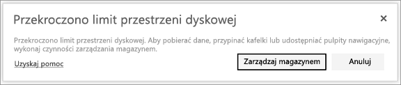

# Zarządzanie magazynem danych
Dowiedz się, jak można zarządzać magazynem własnego obszaru roboczego lub magazynem danych obszaru roboczego aplikacji, aby móc publikować raporty i zestawy danych.

Obszary robocze użytkowników i aplikacji mają własne pojemności danych.

* Użytkownicy wersji bezpłatnej i Pro mają magazyn danych o maksymalnej pojemności 10 GB.
* Użytkownicy wersji Pro mogą tworzyć obszary robocze aplikacji z magazynami danych o maksymalnym rozmiarze 10 GB każdy.

Na poziomie dzierżawy łączne użycie nie może przekroczyć 10 GB na użytkownika wersji Pro dla wszystkich użytkowników wersji Pro oraz obszarów roboczych aplikacji w dzierżawie.

Więcej informacji o innych funkcjach [modelu cen usługi Power BI](https://powerbi.microsoft.com/pricing).

Magazyn danych zawiera Twoje zestawy danych i raporty programu Excel oraz elementy, które udostępniły Ci inne osoby. Zestawy danych są dowolnymi źródłami danych, które zostały przekazane lub z którymi nawiązano połączenie, w tym plikami programu Power BI Desktop oraz używanymi skoroszytami programu Excel. Pojemność danych uwzględnia również następujące elementy.

* Zakresy programu Excel przypięte do pulpitu nawigacyjnego.
* Lokalne wizualizacje usług Reporting Services przypięte do pulpitu nawigacyjnego usługi Power BI.
* Przekazane obrazy.

Rozmiar udostępnianego pulpitu nawigacyjnego będzie różnić się zależnie od elementów, które są do niego przypięte. Na przykład w przypadku przypięcia elementów z dwóch raportów należących do dwóch różnych zestawów danych rozmiar będzie obejmować oba zestawy danych.

<a name="manage"/>

## Zarządzanie elementami będącymi własnością użytkownika
Zobacz, ile miejsca w magazynie danych jest używane w ramach Twojego konta usługi Power BI, i zarządzaj kontem.

1. Aby zarządzać własnym magazynem, przejdź do obszaru **Mój obszar roboczy** w lewym okienku nawigacji.
   
    
2. Wybierz ikonę koła zębatego  w prawym górnym rogu, a następnie wybierz pozycję \> **Zarządzaj magazynem osobistym**.
   
    Na górnym pasku jest wyświetlane wykorzystanie limitu miejsca.
   
    
   
    Zestawy danych i raporty są podzielone na dwie karty:
   
    **Należące do mnie:** Są to raporty i zestawy danych przekazane przez Ciebie do konta usługi Power BI, w tym zestawy danych usługi, takie jak Salesforce i Dynamics CRM.  
    **Należące do innych:** Te raporty i zestawy danych zostały udostępnione Tobie przez inne osoby.
3. Aby usunąć zestaw danych lub raport, wybierz ikonę kosza na śmieci .

Należy pamiętać, że Ty lub inna osoba może mieć raporty i pulpity nawigacyjne oparte na zestawie danych. Jeśli usuniesz zestaw danych, te raporty i pulpity nawigacyjne nie będą już działać.

## Zarządzanie obszarem roboczym aplikacji
1. Wybierz strzałkę obok pozycji **Obszary robocze** \> wybierz nazwę obszaru roboczego aplikacji.
   
    
2. Wybierz ikonę koła zębatego  w prawym górnym rogu, a następnie wybierz pozycję \> **Zarządzaj miejscem grupy**.
   
    Na górnym pasku jest wyświetlane wykorzystanie limitu miejsca w magazynie grupy.
   
    
   
    Zestawy danych i raporty są podzielone na dwie karty:
   
    **Należące do nas:** Są to raporty i zestawy danych przekazane przez Ciebie lub inną osobę do konta usługi Power BI grupy, w tym zestawy danych usługi, takie jak Salesforce i Dynamics CRM.
    **Należące do innych:** Te raporty i zestawy danych zostały udostępnione Twojej grupie przez inne osoby.
3. Aby usunąć zestaw danych lub raport, wybierz ikonę kosza na śmieci .
   
   > [!NOTE]
   > Każdy członek mający uprawnienia do edycji obszaru roboczego aplikacji ma uprawnienia do usuwania zestawów danych i raportów z obszaru roboczego aplikacji.
   > 
   > 

Należy pamiętać, że Ty lub inna osoba w grupie może mieć raporty i pulpity nawigacyjne oparte na zestawie danych. Jeśli usuniesz zestaw danych, te raporty i pulpity nawigacyjne nie będą już działać.

## Limity zestawu danych
Istnieje limit rozmiaru wynoszący 1 GB na zestaw danych importowany do usługi Power BI. Jeśli wybrano, aby zachować środowisko programu Excel zamiast importować dane, będzie występować ograniczenie do 250 MB na zestaw danych.

## Co się stanie po osiągnięciu limitu
Po osiągnięciu limitu pojemności danych w usłudze zostaną wyświetlone monity. 

Wybranie ikony koła zębatego  spowoduje wyświetlenie czerwonego paska wskazującego, że przekroczono limit pojemności danych.

Ta informacja będzie wyświetlana również w obszarze **Zarządzaj magazynem osobistym**.

 

 W przypadku próby wykonania działania, które spowoduje osiągnięcie jednego z limitów, zostanie wyświetlony monit informujący, że przekroczono limit. Możliwe będzie [zarządzanie](#manage) magazynem w celu zmniejszenia ilości danych w magazynie i pozostania w ramach limitu.

 

 Masz więcej pytań? [Zadaj pytanie społeczności usługi Power BI](http://community.powerbi.com/)

