# Konfigurowanie aplikacji mobilnych za pomocą usługi Microsoft Intune
Usługa Microsoft Intune umożliwia organizacjom zarządzanie urządzeniami i aplikacjami. Aplikacje mobilne usługi Power BI dla systemów iOS i Android obsługują integrację z usługą Intune, aby umożliwić zarządzanie aplikacjami na urządzeniach oraz sterowanie zabezpieczeniami. Za pomocą zasad konfiguracji można zarządzać elementami na przykład przez wymaganie dostępowego kodu PIN, określanie sposobu obsługi danych przez aplikację, a nawet szyfrowanie danych aplikacji, kiedy aplikacja nie jest używana.

<iframe width="560" height="315" src="https://www.youtube.com/embed/9HF-qsdQvHw?list=PLv2BtOtLblH1nPVPU2etFzTNmpz49dwXm" frameborder="0" allowfullscreen></iframe>

## Ogólna konfiguracja zarządzania urządzeniami przenośnymi
Tego artykułu nie należy traktować jako pełnego przewodnika po konfiguracji usługi Microsoft Intune. Jeśli właśnie przeprowadzasz integrację z usługą Intune, istnieje kilka elementów, w przypadku których musisz upewnić się, że zostały skonfigurowane. [Dowiedz się więcej](https://technet.microsoft.com/library/jj676587.aspx)

Usługa Microsoft Intune może współistnieć z funkcją zarządzania urządzeniami przenośnymi (MDM) w usłudze Office 365. [Dowiedz się więcej](https://blogs.technet.microsoft.com/configmgrdogs/2016/01/04/microsoft-intune-co-existence-with-mdm-for-office-365/)

W tym artykule przyjęto założenie, że usługa Intune jest skonfigurowana prawidłowo i że masz urządzenia zarejestrowane w usłudze Intune. Jeśli masz istniejące wspólnie z zarządzaniem urządzeniami Przenośnymi, urządzenie będzie wyświetlane jako zarejestrowane w ramach zarządzania urządzeniami przenośnymi, ale jest dostępne do zarządzania w usłudze Intune.

> [!NOTE]
> Jeśli korzystasz z aplikacji mobilnej usługi Power BI na urządzeniu z systemem iOS lub Android, a Twoja organizacja skonfigurowała funkcję zarządzania aplikacjami mobilnymi w usłudze Microsoft Intune, odświeżanie danych w tle jest wyłączone. Przy następnym otwarciu aplikacji usługa Power BI odświeży dane na podstawie usługi Power BI w Internecie.
> 
> 

## Krok 1: Uzyskiwanie adresu URL aplikacji
Przed utworzeniem aplikacji w usłudze Intune trzeba uzyskać adresy URL aplikacji. W przypadku systemu iOS można je uzyskać z programu iTunes. W przypadku systemu Android można je uzyskać ze strony aplikacji mobilnej usługi Power BI.

Zapisz adres URL, ponieważ będzie on potrzebny podczas tworzenia aplikacji.

### iOS
Aby uzyskać adres URL aplikacji dla systemu iOS, trzeba go pobrać z programu iTunes.

1. Otwórz program iTunes.
2. Wyszukaj usługę *Power BI*.
3. Aplikacja **Microsoft Power BI** powinna być wyświetlana na listach **aplikacji dla urządzenia iPhone** i **aplikacji dla urządzenia iPad**. Można skorzystać z dowolnej z nich, ponieważ adres URL będzie ten sam.
4. Wybierz listę rozwijaną **Pobierz** i wybierz pozycję **Kopiuj link**.
   
    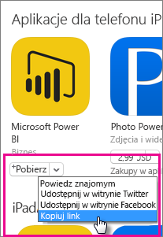

Powinno to wyglądać mniej więcej tak.

    https://itunes.apple.com/us/app/microsoft-power-bi/id929738808?mt=8

### Android
Adres URL do witryny Google Play można pobrać ze [strony aplikacji mobilnej usługi Power BI](https://powerbi.microsoft.com/mobile/). Kliknięcie ikony **Pobierz ze sklepu Google Play** spowoduje przejście na stronę aplikacji. Możesz skopiować adres URL z paska adresu przeglądarki. Powinno to wyglądać mniej więcej tak.

    https://play.google.com/store/apps/details?id=com.microsoft.powerbim

## Krok 2. Tworzenie zasad zarządzania aplikacjami mobilnymi
Zasady zarządzania aplikacjami mobilnymi umożliwiają wymuszanie elementów takich jak dostępowy kod PIN. Możesz je utworzyć w portalu usługi Intune. 

Możesz najpierw utworzyć aplikację lub zasady. Kolejność, w której zostaną dodane, nie ma znaczenia. Oba te elementy muszą jedynie istnieć przed wykonaniem kroku wdrażania.

1. Wybierz pozycje **Zasady** > **Zasady konfiguracji**.
   
    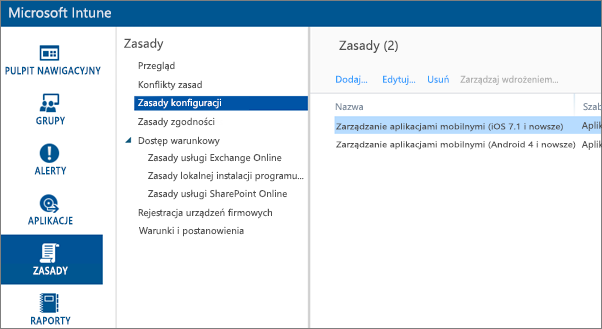
2. Wybierz pozycję **Dodaj...**.
3. W obszarze **Oprogramowanie** możesz wybrać pozycję Zarządzanie aplikacjami mobilnymi dla systemu Android lub systemu iOS. Aby szybko rozpocząć pracę, możesz wybrać opcję **Utwórz zasady z zalecanymi ustawieniami**. Możesz także utworzyć zasady niestandardowe.
4. Edytuj zasady, aby skonfigurować ograniczenia, które chcesz zastosować do aplikacji.

## Krok 3. Tworzenie aplikacji
Aplikacja jest odwołaniem (lub pakietem) zapisanym w usłudze Intune na potrzeby wdrożenia. Konieczne będzie utworzenie aplikacji i odwołania do adresu URL aplikacji, który został uzyskany z usługi Google Play lub programu iTunes.

Możesz najpierw utworzyć aplikację lub zasady. Kolejność, w której zostaną dodane, nie ma znaczenia. Oba te elementy muszą jedynie istnieć przed wykonaniem kroku wdrażania.

1. Przejdź do portalu usługi Intune i z menu po lewej stronie wybierz pozycję **Aplikacje**.
2. Wybierz pozycję **Dodaj aplikację**. Spowoduje to uruchomienie aplikacji **Dodaj oprogramowanie**.

### iOS
1. Wybierz z listy rozwijanej pozycję **Zarządzana aplikacja systemu iOS ze sklepu App Store**.
2. Wprowadź adres URL aplikacji uzyskany w [kroku 1](#step-1-get-the-url-for-the-application) i wybierz przycisk **Dalej**.
   
    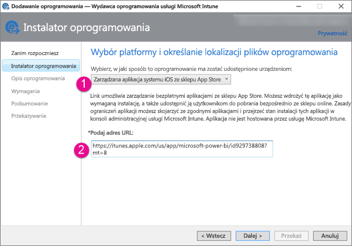
3. Podaj **wydawcę**, **nazwę** i **opis**. Opcjonalnie możesz udostępnić **ikonę**. **Kategoria** jest określona dla aplikacji Portal firmy. Gdy wszystko będzie gotowe, wybierz przycisk **Dalej**.
4. Możesz zdecydować, czy chcesz opublikować aplikację jako **Dowolną** (ustawienie domyślne), **iPad** lub **iPhone**. Domyślnie zostanie wyświetlona jako **Dowolna** i będzie działać dla obu typów urządzeń. Aplikacja usługi Power BI ma ten sam adres URL dla urządzeń iPhone i iPad. Wybierz pozycję **Dalej**.
5. Wybierz przycisk **Przekaż**.

> [!NOTE]
> Aplikacja może nie być widoczna na liście aplikacji, dopóki strona nie zostanie odświeżona. Aby załadować ponownie stronę, możesz kliknąć pozycję **Przegląd** i wrócić do pozycji **Aplikacje**.
> 
> 

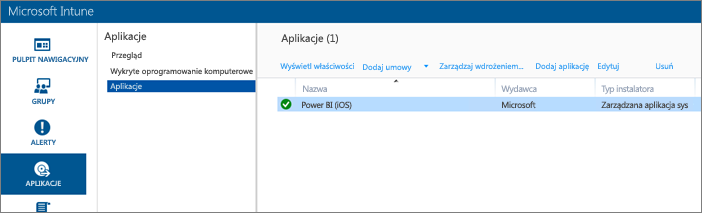

### Android
1. Z listy rozwijanej wybierz pozycję **Odnośnik zewnętrzny**.
2. Wprowadź adres URL aplikacji uzyskany w [kroku 1](#step-1-get-the-url-for-the-application) i wybierz przycisk **Dalej**.
   
    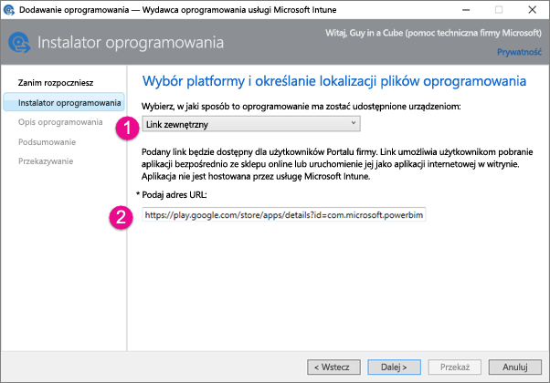
3. Podaj **wydawcę**, **nazwę** i **opis**. Opcjonalnie możesz udostępnić **ikonę**. **Kategoria** jest określona dla aplikacji Portal firmy. Gdy wszystko będzie gotowe, wybierz przycisk **Dalej**.
4. Wybierz przycisk **Przekaż**.

> [!NOTE]
> Aplikacja może nie być widoczna na liście aplikacji, dopóki strona nie zostanie odświeżona. Aby załadować ponownie stronę, możesz kliknąć pozycję **Przegląd** i wrócić do pozycji **Aplikacje**.
> 
> 

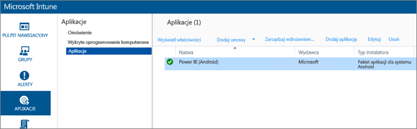

## Krok 4. Wdrażanie aplikacji
Po dodaniu aplikacji należy ją wdrożyć, aby była dostępna dla użytkowników końcowych. Jest to krok, w którym utworzone zasady zostaną powiązane z aplikacją.

### iOS
1. Na ekranie aplikacje wybierz utworzoną aplikację. Następnie wybierz link **Zarządzanie wdrażaniem...**.
   
    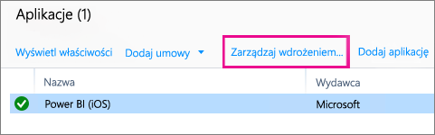
2. Na ekranie **Wybieranie grup** możesz wybrać grupy, w których chcesz wdrożyć tę aplikację. Wybierz pozycję **Dalej**.
3. Na ekranie **Akcja wdrażania** możesz wybrać sposób, w jaki chcesz wdrożyć tę aplikację. W przypadku wybrania opcji **Dostępna instalacja** lub **Wymagana instalacja** aplikacja zostanie udostępniona użytkownikom w Portalu firmy, do instalacji na żądanie. Po dokonaniu wyboru wybierz pozycję **Dalej**.
   
    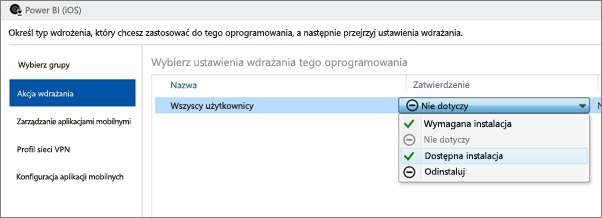
4. Na ekranie **Zarządzanie aplikacjami mobilnymi** możesz wybrać zasady zarządzania aplikacjami mobilnymi, które zostały utworzone w [kroku 2](#step-2-create-a-mobile-application-management-policy). Te zasady zostaną domyślnie wybrane, jeśli są jedynymi dostępnymi zasadami dla systemu iOS. Wybierz pozycję **Dalej**.
   
    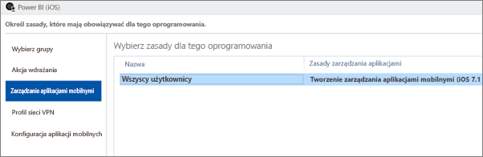
5. Na ekranie **Profil sieci VPN** możesz wybrać zasady, jeśli są dostępne dla Twojej organizacji. Ustawieniem domyślnym jest **Brak**. Wybierz pozycję **Dalej**.
6. Na ekranie **Konfiguracja aplikacji mobilnych** możesz wybrać **Zasady konfiguracji aplikacji**, jeśli zostały utworzone. Ustawieniem domyślnym jest **Brak**. Nie jest to wymagane. Wybierz pozycję **Zakończ**.

Po wdrożeniu aplikacji powinna ona zostać wyświetlona z wartością **Tak** jako wdrożona na stronie aplikacji.

### Android
1. Na ekranie aplikacje wybierz utworzoną aplikację. Następnie wybierz link **Zarządzanie wdrażaniem...**.
   
    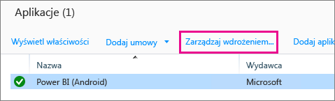
2. Na ekranie **Wybieranie grup** możesz wybrać grupy, w których chcesz wdrożyć tę aplikację. Wybierz pozycję **Dalej**.
3. Na ekranie **Akcja wdrażania** możesz wybrać sposób, w jaki chcesz wdrożyć tę aplikację. W przypadku wybrania opcji **Dostępna instalacja** lub **Wymagana instalacja** aplikacja zostanie udostępniona użytkownikom w Portalu firmy, do instalacji na żądanie. Po dokonaniu wyboru wybierz pozycję **Dalej**.
   
    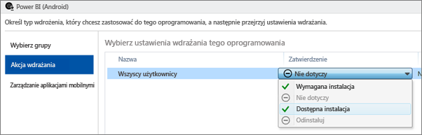
4. Na ekranie **Zarządzanie aplikacjami mobilnymi** możesz wybrać zasady zarządzania aplikacjami mobilnymi, które zostały utworzone w [kroku 2](#step-2-create-a-mobile-application-management-policy). Te zasady zostaną domyślnie wybrane, jeśli są jedynymi dostępnymi zasadami dla systemu Android. Wybierz pozycję **Zakończ**.
   
    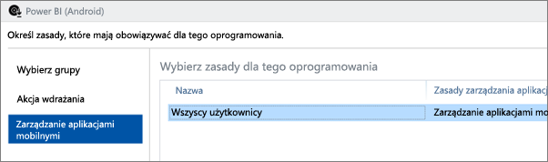

Po wdrożeniu aplikacji powinna ona zostać wyświetlona z wartością **Tak** jako wdrożona na stronie aplikacji.

## Krok 5. Instalowanie aplikacji na urządzeniu
Aplikację zainstalujesz za pomocą aplikacji Portal firmy. Jeśli aplikacja Portal firmy nie została jeszcze zainstalowana, możesz ją pobrać za pośrednictwem sklepu z aplikacjami dla platformy iOS lub Android. Do zalogowania się w Portalu firmy użyjesz swoich organizacyjnych danych logowania.

1. Otwórz aplikację Portal firmy.
2. Jeśli nie widzisz aplikacji Power BI jako polecanej aplikacji, wybierz pozycję **Aplikacje firmowe**.
   
    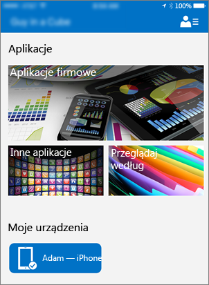
3. Wybierz wdrożoną aplikację usługi Power BI.
   
    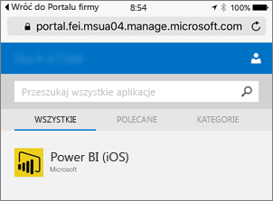
4. Wybierz pozycję **Zainstaluj**.
   
    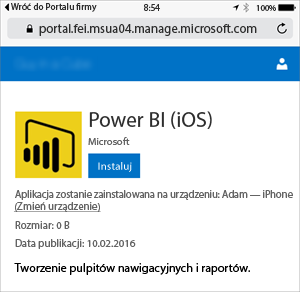
5. Jeśli pracujesz w systemie iOS, spowoduje to wypchnięcie aplikacji do Twojego urządzenia. W oknie dialogowym wypychania wybierz pozycję **Zainstaluj**.
   
    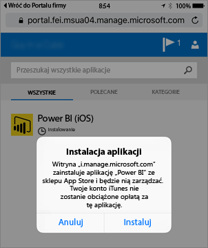

Po zainstalowaniu aplikacji zobaczysz, że jest ona **Zarządzana przez Twoją firmę**. Jeśli w zasadach włączono dostęp przy użyciu numeru PIN, zostanie wyświetlony poniższy ekran.

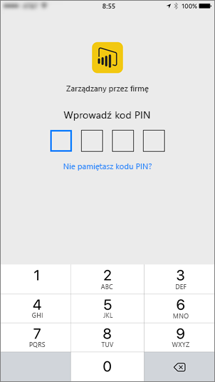

## Następne kroki
[Konfigurowanie i wdrażanie zasad zarządzania aplikacjami mobilnymi w konsoli usługi Microsoft Intune](https://technet.microsoft.com/library/dn878026.aspx)  
[Aplikacje Power BI dla urządzeń przenośnych](mobile-apps-for-mobile-devices.md)  

Masz więcej pytań? [Zadaj pytanie społeczności usługi Power BI](http://community.powerbi.com/)

