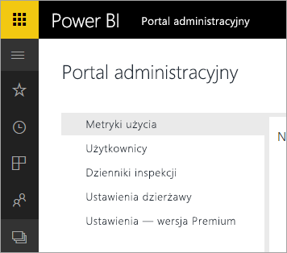

# Usługa Power BI dla Office 365 została wycofana
Usługa Power BI dla Office 365, poprzednia wersja usługi Power BI, została zastąpiona bieżącą wersją usługi [Power BI](https://powerbi.microsoft.com). Użytkownicy, którzy korzystali wcześniej z usługi **Power BI dla Office 365**, mogą używać bieżącej wersji usługi Power BI. [Dowiedz się więcej o usłudze Power BI](service-get-started.md).

## Portal administracyjny
Dostęp do portalu administracyjnego usługi **Power BI dla Office 365** nie jest już możliwy. Administratorzy mogą korzystać z nowego [portalu administracyjnego](https://app.powerbi.com/admin-portal) do zarządzania subskrypcją usługi Power BI w organizacji.

Aby uzyskać więcej informacji, zobacz [Portal administracyjny usługi Power BI](service-admin-portal.md).

## Następne kroki
[Wprowadzenie do usługi Power BI](service-get-started.md)

[Wprowadzenie do programu Power BI Desktop](desktop-getting-started.md)

[Administrowanie usługą Power BI w organizacji](service-admin-administering-power-bi-in-your-organization.md)