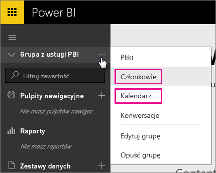
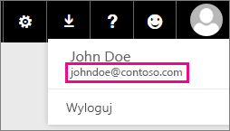

# Klienci usługi Office 365 Dedicated — znane problemy
Usługa Power BI jest teraz obsługiwana w przypadku klientów usługi Office 365 Dedicated.  Jeśli jesteś klientem usługi Office 365 Dedicated, możesz zalogować się przy użyciu konta z tej dzierżawy i korzystać z usługi Power BI. Obecnie istnieją dwa znane problemy.

## Grupy
W przypadku wybrania pozycji **Członkowie** lub **Kalendarz** z menu kontekstowego grupy zamiast przejścia do odpowiedniego obszaru nastąpi przekierowanie do aplikacji poczty.  Pozycje **Pliki** i **Konwersacje** działają zgodnie z oczekiwaniami.

## Aplikacja dla telefonu iPhone — logowanie się przy użyciu domeny znaczącej prowadzi do błędu
Podczas logowania się w aplikacji dla telefonu iPhone przy użyciu identyfikatora logowania z domeną znaczącą może wystąpić błąd.

*Błąd logowania*  
*Wystąpił nieoczekiwany błąd wewnętrzny. Spróbuj ponownie.*

Aby obejść ten problem, zaloguj się przy użyciu adresu e-mail podanego po kliknięciu ikony użytkownika w usłudze Power BI zamiast adresu z domeną znaczącą.

Masz więcej pytań? [Odwiedź społeczność usługi Power BI](http://community.powerbi.com/)

