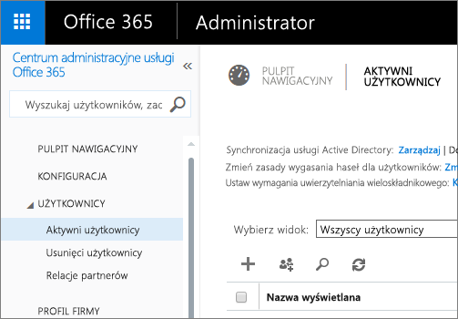

# Portal administracyjny usługi Power BI
Portal administracyjny umożliwia zarządzanie dzierżawą usługi Power BI w organizacji. Zawiera on kluczowe elementy, takie jak metryki użycia, dostęp do centrum administracyjnego usługi Office 365 oraz ustawienia.

Zarządzanie dzierżawą usługi Power BI w firmie odbywa się za pośrednictwem portalu administracyjnego usługi Power BI. Portal administracyjny jest dostępny dla wszystkich użytkowników, którzy są administratorami globalnymi w usłudze Office 365 lub którym przydzielono rolę administratora usługi Power BI. Aby uzyskać więcej informacji o roli administratora usługi Power BI, zobacz [Opis roli administratora usługi Power BI](service-admin-role.md).

Wszyscy użytkownicy będą widzieli **Portal administracyjny** pod ikoną koła zębatego. Jeśli użytkownik nie jest administratorem, zobaczy tylko sekcję **Ustawienia — wersja Premium** oraz wyłącznie te ustawienia, którymi może zarządzać.

## Jak uzyskać dostęp do portalu administracyjnego
Twoje konto musi być oznaczone jako **Administrator globalny**, w usłudze Office 365 lub Azure Active Directory, albo musisz uzyskać przydział do roli administratora usługi Power BI, aby uzyskać dostęp do portalu administracyjnego usługi Power BI. Aby uzyskać więcej informacji o roli administratora usługi Power BI, zobacz [Opis roli administratora usługi Power BI](service-admin-role.md). Aby uzyskać dostęp do portalu administracyjnego usługi Power BI, wykonaj następujące czynności.

1. Wybierz koło zębate ustawień w prawym górnym rogu usługi Power BI.
2. Wybierz polecenie **Portal administracyjny**.

W portalu znajduje się pięć kart. Zostały one opisane poniżej.

* [Metryki użycia](#usage-metrics)
* [Użytkownicy](#users)
* [Dzienniki inspekcji](#audit-logs)
* [Ustawienia dzierżawy](#tenant-settings)
* [Ustawienia — wersja Premium](#premium-settings)

## Metryki użycia
Pierwsza karta w portalu administracyjnym to **Metryki użycia**. Raport metryk użycia daje możliwość monitorowania użycia w usłudze Power BI w ramach organizacji. Ponadto zapewnia możliwość wyświetlania najbardziej aktywnych użytkowników i grup w usłudze Power BI w ramach organizacji.

> [!NOTE]
> Przy pierwszym uzyskaniu dostępu do pulpitu nawigacyjnego lub po powrocie do pulpitu nawigacyjnego po długim czasie najprawdopodobniej zobaczysz ekran ładowania, gdy będziemy ładować pulpit nawigacyjny.
> 
> 

Po załadowaniu pulpitu nawigacyjnego zobaczysz dwie sekcje kafelków. Pierwsza sekcja obejmuje dane użycia dla poszczególnych użytkowników, a druga sekcja zawiera podobne informacje dotyczące grup w organizacji.

Oto podział elementów, które zobaczysz w każdym kafelków:

* Unikatowy licznik dla wszystkich pulpitów nawigacyjnych, raportów i zestawów danych w obszarze roboczym użytkownika
  
    
* Najczęściej używany pulpit nawigacyjny według liczby użytkowników, którzy mogą do niego uzyskać dostęp. Jeśli na przykład masz pulpit nawigacyjny, który został udostępniony trzem użytkownikom oraz został dodany do pakietu zawartości, z którym łączy się dwóch różnych użytkowników, licznik będzie wskazywać 6 (1 + 3 +2)
  
    
* Najpopularniejsza zawartość, z którą łączą się użytkownicy. Będzie to wszystko to, z czym użytkownicy mogą się połączyć za pośrednictwem procesu Pobierz dane, a więc pakiety zawartości SaaS, pakiety zawartości organizacji, pliki lub bazy danych.
  
    
* Widok użytkowników oparty na liczbie posiadanych przez nich pulpitów nawigacyjnych, zarówno utworzonych przez użytkowników, jak i tych udostępnionych.
  
    
* Widok użytkowników oparty na liczbie posiadanych raportów
  
    

Druga sekcja wyświetla informacje tego samego typu, ale w oparciu o grupy. Dzięki temu możesz zobaczyć, które grupy w organizacji są najbardziej aktywne oraz których informacji używają.

Przy użyciu tych informacji możesz zyskać prawdziwy wgląd w sposób użytkowania usługi Power BI w organizacji oraz rozpoznać bardzo aktywnych użytkowników i grupy w organizacji.

## Użytkownicy
Druga karta w portalu administracyjnym to **Zarządzanie użytkownikami**. Zarządzanie użytkownikami, w przypadku usługi Power BI, odbywa się w centrum administracyjnym usługi Office 365, więc ta sekcja umożliwia szybkie przejście do obszaru, w którym można zarządzać użytkownikami, administratorami i grupami w usłudze Office 365.

Po kliknięciu pozycji **Przejdź do centrum administracyjnego usługi Office 365** użytkownik zostanie przeniesiony bezpośrednio do strony początkowej centrum administracyjnego usługi Office 365, aby zarządzać użytkownikami dzierżawy.

## Dzienniki inspekcji
Trzeci karta w portalu administracyjnym to **Dzienniki inspekcji**. Dzienniki znajdują się w centrum zabezpieczeń i zgodności usługi Office 365. Ta sekcja umożliwia szybki dostęp do tego obszaru w usłudze Office 365. 

Aby uzyskać więcej informacji o dziennikach inspekcji, zobacz [Inspekcja usługi Power BI w organizacji](service-admin-auditing.md)

## Ustawienia dzierżawy
Trzeci karta w portalu administracyjnym to **Ustawienia dzierżawy**. Ustawienia dzierżawy zapewniają więcej kontroli nad funkcjami, które są dostępne w organizacji. Jeśli masz obawy związane z poufnymi danymi, niektóre z funkcji mogą nie być odpowiednie dla Twojej organizacji. Możesz też zdecydować, że dana funkcja będzie dostępna tylko dla wybranej grupy. Jeśli tak jest, możesz ją wyłączyć w dzierżawie.

> [!NOTE]
> Zastosowanie ustawienia dla wszystkich użytkowników w dzierżawie może zająć do 10 minut.
> 
> 

Ustawienia mogą mieć trzy stany w oparciu o podane ustawienia.

### Wyłączone dla całej organizacji
Możesz wyłączyć funkcję i uniemożliwić użytkownikom korzystanie z niej.

### Włączone dla całej organizacji
Możesz włączyć funkcję dla całej organizacji — wszyscy użytkownicy będą mieć dostęp do tej funkcji.

### Włączone dla podzbioru organizacji
Możesz też włączyć funkcję dla części organizacji. Można to zrobić na kilka różnych sposobów. Funkcję możesz włączyć dla całej organizacji poza wybraną grupą użytkowników.

Ponadto możesz włączyć funkcję tylko dla wybranej grupy użytkowników, jednocześnie wyłączając ją dla innej grupy użytkowników. Dzięki temu upewnisz się, że wybrani użytkownicy nie będą mieć dostępu do funkcji, nawet kiedy znajdą się w grupie dozwolonych użytkowników.

## Ustawienia eksportowania i udostępniania
### Udostępnianie zawartości użytkownikom zewnętrznym
Użytkownicy w organizacji mogą udostępniać pulpity nawigacyjne użytkownikom spoza organizacji.

### Publikowanie w Internecie
Użytkownicy w organizacji mogą publikować raporty w Internecie. [Dowiedz się więcej](service-publish-to-web.md)

> [!NOTE]
> To ustawienie ma zastosowanie do całej organizacji i nie może być ograniczone do konkretnych grup.
> 
> 

### Eksportowanie danych
Użytkownicy w organizacji mogą eksportować dane z kafelka lub wizualizacji. [Dowiedz się więcej](power-bi-visualization-export-data.md)

> [!NOTE]
> Wyłączenie opcji **Eksportowanie danych** ponadto uniemożliwi użytkownikom korzystanie z funkcji **Analizuj w programie Excel** oraz połączenia na żywo usługi Power BI.
> 
> 

### Eksportowanie raportów jako prezentacji programu PowerPoint
Użytkownicy w organizacji mogą eksportować raporty usługi Power BI jako pliki programu PowerPoint. [Dowiedz się więcej](service-publish-to-powerpoint.md)

### Drukowanie pulpitów nawigacyjnych i raportów
Użytkownicy w organizacji mogą drukować pulpity nawigacyjne i raporty. [Dowiedz się więcej](service-print.md)

## Ustawienia pakietu zawartości
### Publikowanie pakietów zawartości w całej organizacji
Użytkownicy w organizacji mogą publikować pakiety zawartości w całej organizacji.

### Tworzenie szablonów pakietów zawartości w organizacji
Użytkownicy w organizacji mogą tworzyć szablony pakietów zawartości, które używają zestawów danych wbudowanych w jednym źródle danych w aplikacji Power BI Desktop.

## Ustawienia integracji
### Zadawanie pytań o dane przy użyciu Cortany
Użytkownicy w organizacji mogą zadawać pytania dotyczące danych przy użyciu Cortany.

> [!NOTE]
> To ustawienie ma zastosowanie do całej organizacji i nie może być ograniczone do konkretnych grup.
> 
> 

### Używanie funkcji Analizuj w programie Excel z lokalnymi zestawami danych
Użytkownicy w organizacji mogą używać programu Excel, aby wyświetlać lokalne zestawy danych usługi Power BI i wchodzić z nimi w interakcje. [Dowiedz się więcej](service-analyze-in-excel.md)

> [!NOTE]
> Wyłączenie funkcji **Eksportowanie danych** również uniemożliwi użytkownikom korzystanie z funkcji **Analizuj w programie Excel**.
> 
> 

### Używanie dodatku ArcGIS Maps for Power BI (wersja zapoznawcza)
Użytkownicy w organizacji mogą używać wizualizacji ArcGIS Maps for Power BI (wersja zapoznawcza) dostarczanej przez firmę Esri. [Dowiedz się więcej](power-bi-visualization-arcgis.md)

## Ustawienia elementów wizualnych języka R
### Wchodzenie w interakcje z elementami wizualnymi języka R oraz ich udostępnianie
Użytkownicy w organizacji mogą wchodzić w interakcje z elementami wizualnymi utworzonymi przy użyciu skryptów języka R oraz je udostępniać. [Dowiedz się więcej](service-r-visuals.md)

> [!NOTE]
> To ustawienie ma zastosowanie do całej organizacji i nie może być ograniczone do konkretnych grup.
> 
> 

## Ustawienia inspekcji
### Twórz dzienniki inspekcji na potrzeby wewnętrznych inspekcji działań i sprawdzania zgodności
Użytkownicy w organizacji mogą używać inspekcji, aby monitorować działania podejmowane w usłudze Power BI przez innych użytkowników w organizacji. [Dowiedz się więcej](service-admin-auditing.md)

To ustawienie musi być włączone, aby można było rejestrować wpisy dziennika inspekcji.

> [!NOTE]
> To ustawienie ma zastosowanie do całej organizacji i nie może być ograniczone do konkretnych grup.
> 
> 

## Ustawienia pulpitu nawigacyjnego
### Klasyfikacja danych dla pulpitów nawigacyjnych
Użytkownicy w organizacji mogą tagować pulpity nawigacyjne przy użyciu klasyfikacji, aby wskazywać poziomy zabezpieczeń pulpitów nawigacyjnych. [Dowiedz się więcej](service-data-classification.md)

> [!NOTE]
> To ustawienie ma zastosowanie do całej organizacji i nie może być ograniczone do konkretnych grup.
> 
> 

## Ustawienia dewelopera
### Osadzanie zawartości w aplikacjach
Użytkownicy w organizacji mogą osadzać pulpity nawigacyjne i raporty usługi Power BI w aplikacjach oprogramowania jako usługi (SaaS). Wyłączenie tego ustawienia sprawi, że użytkownicy nie będą w stanie używać interfejsów API REST do osadzania zawartości usługi Power BI w swoich aplikacjach.

## Ustawienia — wersja Premium
Karta Ustawienia — wersja Premium umożliwia zarządzanie pojemnością Power BI Premium zakupioną dla organizacji. Wszyscy użytkownicy w organizacji będą widzieć kartę ustawień wersji Premium, ale zobaczą zawartość na karcie tylko wtedy, jeśli przydzielono im rolę **administratora pojemności** lub użytkownika z uprawnieniami do przypisywania. Jeśli użytkownik nie ma żadnych uprawnień, zobaczy następujący komunikat.

Aby uzyskać więcej informacji o zarządzaniu ustawieniami wersji Premium, zobacz [Zarządzanie usługą Power BI Premium](service-admin-premium-manage.md).

## Następne kroki
[Opis roli administratora usługi Power BI](service-admin-role.md)  
[Inspekcja usługi Power BI w organizacji](service-admin-auditing.md)  
[Zarządzanie usługą Power BI Premium](service-admin-premium-manage.md)  
[Administrowanie usługą Power BI w organizacji](service-admin-administering-power-bi-in-your-organization.md)  

Masz więcej pytań? [Zadaj pytanie społeczności usługi Power BI](http://community.powerbi.com/)

