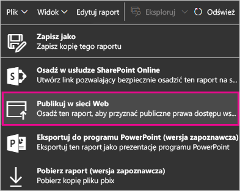
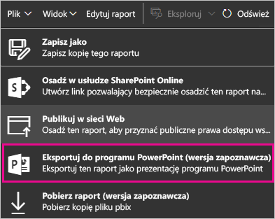

# Portal administracyjny usługi Power BI

Portal administracyjny pozwala na zarządzanie *dzierżawą* usługi Power BI w organizacji. Portal zawiera elementy, takie jak metryki użycia, dostęp do centrum administracyjnego usługi Office 365 oraz ustawienia.

Pełny portal administracyjny jest dostępny dla wszystkich użytkowników, którzy są administratorami globalnymi w usłudze Office 365 lub którym przydzielono rolę administratora usługi Power BI. Jeśli nie pełnisz żadnej z tych ról, w portalu są widoczne tylko **ustawienia pojemności**. Aby uzyskać więcej informacji o roli administratora usługi Power BI, zobacz [Opis roli administratora usługi Power BI](service-admin-role.md).

## Jak uzyskać dostęp do portalu administracyjnego

Twoje konto musi być oznaczone jako **Administrator globalny**, w usłudze Office 365 lub Azure Active Directory, albo musisz uzyskać przydział do roli administratora usługi Power BI, aby uzyskać dostęp do portalu administracyjnego usługi Power BI. Aby uzyskać więcej informacji o roli administratora usługi Power BI, zobacz [Opis roli administratora usługi Power BI](service-admin-role.md). Aby uzyskać dostęp do portalu administracyjnego usługi Power BI, wykonaj następujące czynności.

1. Wybierz koło zębate ustawień w prawym górnym rogu usługi Power BI.

1. Wybierz pozycję **Portal administracyjny**.

    

Portal zawiera siedem kart. W pozostałej części tego artykułu przedstawiono informacje na temat każdej z tych kart.

* [Metryki użycia](#usage-metrics)
* [Użytkownicy](#users)
* [Dzienniki inspekcji](#audit-logs)
* [Ustawienia dzierżawy](#tenant-settings)
* [Ustawienia — wersja Premium](#premium-settings)
* [Kody osadzania](#embed-codes)
* [Organization visuals](#organization-visuals) (Wizualizacje organizacji)

## Metryki użycia

Karta **Metryki użycia** umożliwia monitorowanie użycia usługi Power BI w organizacji. Ponadto zapewnia możliwość wyświetlania najbardziej aktywnych użytkowników i grup w usłudze Power BI w ramach organizacji.

> [!NOTE]
> Przy pierwszym uzyskaniu dostępu do pulpitu nawigacyjnego lub po powrocie do pulpitu nawigacyjnego po długim czasie najprawdopodobniej zobaczysz ekran ładowania, gdy będziemy ładować pulpit nawigacyjny.

Po załadowaniu pulpitu nawigacyjnego zobaczysz dwie sekcje kafelków. Pierwsza sekcja obejmuje dane użycia dla poszczególnych użytkowników, a druga sekcja zawiera podobne informacje dotyczące grup w organizacji.

Oto podział elementów, które możesz zobaczyć w każdym kafelków:

* Unikatowy licznik dla wszystkich pulpitów nawigacyjnych, raportów i zestawów danych w obszarze roboczym użytkownika
  
    

* Najczęściej używany pulpit nawigacyjny według liczby użytkowników, którzy mogą do niego uzyskać dostęp. Jeśli na przykład masz pulpit nawigacyjny, który został udostępniony 3 użytkownikom oraz został dodany do pakietu zawartości, z którym łączy się dwóch różnych użytkowników, licznik będzie wskazywać 6 (1 + 3 +2)
  
    

* Najpopularniejsza zawartość, z którą łączą się użytkownicy. Będzie to wszystko to, z czym użytkownicy mogą się połączyć za pośrednictwem procesu Pobierz dane, a więc pakiety zawartości SaaS, pakiety zawartości organizacji, pliki lub bazy danych.
  
    

* Widok użytkowników oparty na liczbie posiadanych przez nich pulpitów nawigacyjnych, zarówno utworzonych przez użytkowników, jak i tych udostępnionych.
  
    

* Widok użytkowników oparty na liczbie posiadanych raportów
  
    

Druga sekcja wyświetla informacje tego samego typu, ale w oparciu o grupy. Dzięki temu możesz zobaczyć, które grupy w organizacji są najaktywniejsze i z jakiej zawartości korzystają.

Przy użyciu tych informacji można uzyskiwać faktyczny wgląd w to, jak użytkownicy korzystają z usługi Power BI w organizacji, a także rozpoznawać w organizacji użytkowników i grupy charakteryzujące się dużą aktywnością.

## Użytkownicy

Do zarządzania użytkownikami, grupami i administratorami usługi Power BI służy centrum administracyjne usługi Office 365. Karta **Użytkownicy** zawiera link do centrum administracyjnego dla dzierżawy.

## Dzienniki inspekcji

Do zarządzania dziennikami inspekcji usługi Power BI służy centrum zabezpieczeń i zgodności usługi Office 365. Karta **Dzienniki inspekcji**  zawiera link do centrum zabezpieczeń i zgodności dla dzierżawy. [Dowiedz się więcej](service-admin-auditing.md)

## Ustawienia dzierżawy

Karta **Ustawienia dzierżawy** umożliwia szczegółowe kontrolowanie funkcji udostępnionych w organizacji. Jeśli masz obawy związane z poufnymi danymi, niektóre z funkcji mogą nie być odpowiednie dla Twojej organizacji. Możesz też zdecydować, że określona funkcja będzie dostępna tylko dla wybranej grupy.

Na poniższej ilustracji przedstawiono dwie pierwsze sekcje karty **Ustawienia dzierżawy**.

> [!NOTE]
> Zastosowanie zmiany ustawienia dla wszystkich użytkowników w dzierżawie może zająć do 10 minut.

Ustawienia mogą mieć trzy stany:

* **Wyłączone w całej organizacji**: nikt w organizacji nie może używać tej funkcji.

    

* **Włączone w całej organizacji**: wszyscy w organizacji mogą używać tej funkcji.

    

* **Włączone w podzestawie organizacji**: określony podzestaw użytkowników lub grup w organizacji może używać tej funkcji.

    Funkcję możesz włączyć dla całej organizacji poza wybraną grupą użytkowników.

    

    Ponadto możesz włączyć funkcję tylko dla wybranej grupy użytkowników, jednocześnie wyłączając ją dla innej grupy użytkowników. Dzięki zastosowaniu takiego podejścia upewnisz się, że wybrani użytkownicy nie będą mieć dostępu do funkcji, nawet kiedy znajdą się w grupie dozwolonych użytkowników.

    

W kilku kolejnych sekcjach omówiono różne typy ustawień dzierżawy.

## Ustawienia obszaru roboczego

### Tworzenie obszarów roboczych (wersja zapoznawcza)

Użytkownicy w organizacji mogą tworzyć obszary robocze aplikacji, aby współpracować nad pulpitami nawigacyjnymi, raportami i inną zawartością. [Dowiedz się więcej](service-create-the-new-workspaces.md)

## Ustawienia eksportowania i udostępniania

### Udostępnianie zawartości użytkownikom zewnętrznym

Użytkownicy w organizacji mogą udostępniać pulpity nawigacyjne użytkownikom spoza organizacji.

Na poniższej ilustracji przedstawiono komunikat, który jest wyświetlany w przypadku udostępniania użytkownikowi zewnętrznemu.

### Publikuj w Internecie

Użytkownicy w organizacji mogą publikować raporty w Internecie. [Dowiedz się więcej](service-publish-to-web.md)

Na poniższej ilustracji przedstawiono menu **Plik** raportu po włączeniu ustawienia **Publikuj w Internecie**.

Użytkownicy widzą różne opcje w interfejsie użytkownika w zależności od tego, jakie jest ustawienie **Publikuj w Internecie**.

|Promowanie |Włączone dla całej organizacji |Wyłączone dla całej organizacji |Określone grupy zabezpieczeń   |
|---------|---------|---------|---------|
|Opcja **Publikuj w sieci Web** w menu **Plik** raportu.|Włączone dla wszystkich|Nie jest widoczne dla wszystkich|Widoczne tylko dla autoryzowanych użytkowników lub grup.|
|Opcja **Zarządzaj kodami osadzania** w obszarze **Ustawienia**|Włączone dla wszystkich|Włączone dla wszystkich|Włączone dla wszystkich  Opcja * **Usuń** tylko dla autoryzowanych użytkowników lub grup. Opcja * **Uzyskaj kody** włączona dla wszystkich.|
|**Kody osadzania** w portalu administracyjnym|Stan odzwierciedla jedną z następujących sytuacji: * Aktywne * Nieobsługiwane * Zablokowane|Wyświetlany stan to **Wyłączone**|Stan odzwierciedla jedną z następujących sytuacji: * Aktywne * Nieobsługiwane * Zablokowane  Jeśli zgodnie z ustawieniami dzierżawy użytkownik nie ma autoryzacji, jest wyświetlany stan **Naruszenie**.|
|Istniejące opublikowane raporty|Wszystko włączone|Wszystko wyłączone|Raporty w dalszym ciągu są renderowane dla wszystkich.|

### Eksportuj dane

Użytkownicy w organizacji mogą eksportować dane z kafelka lub wizualizacji. [Dowiedz się więcej](visuals/power-bi-visualization-export-data.md)

Na poniższej ilustracji przedstawiono opcję eksportowania danych z kafelka.

> [!NOTE]
> Wyłączenie funkcji **Eksportowanie danych** ponadto uniemożliwia użytkownikom korzystanie z funkcji **Analizuj w programie Excel** oraz połączenia na żywo usługi Power BI.

### Eksportuj raporty jako prezentacje programu PowerPoint

Użytkownicy w organizacji mogą eksportować raporty usługi Power BI jako pliki programu PowerPoint. [Dowiedz się więcej](consumer/end-user-powerpoint.md)

Na poniższej ilustracji przedstawiono menu **Plik** raportu po włączeniu ustawienia **Eksportuj raporty jako prezentacje programu PowerPoint**.

### Drukuj pulpity nawigacyjne i raporty

Użytkownicy w organizacji mogą drukować pulpity nawigacyjne i raporty. [Dowiedz się więcej](consumer/end-user-print.md)

## Ustawienia pakietu zawartości

### Publikowanie pakietów zawartości w całej organizacji

Użytkownicy w organizacji mogą publikować pakiety zawartości w całej organizacji.

### Tworzenie szablonów pakietów zawartości w organizacji

Użytkownicy w organizacji mogą tworzyć szablony pakietów zawartości, które używają zestawów danych wbudowanych w jednym źródle danych w aplikacji Power BI Desktop.

### Wypychanie aplikacji do użytkowników końcowych

Administrator dzierżawy umożliwia wypychanie aplikacji w **ustawieniach dzierżawy**.

   

Możesz zmienić ustawienie na **Włączone**, a następnie określić, kto dysponuje tą możliwością (cała organizacja lub konkretne grupy zabezpieczeń).

> [!NOTE]
> Należy pamiętać o tym, że uwzględnienie zmian ustawień dzierżawy może zabrać trochę czasu.

Przejdź tutaj, aby dowiedzieć się więcej o [wypychaniu aplikacji](service-create-distribute-apps.md).

## Ustawienia integracji

### Zadawanie pytań o dane przy użyciu Cortany

Użytkownicy w organizacji mogą zadawać pytania dotyczące danych przy użyciu Cortany.

> [!NOTE]
> To ustawienie ma zastosowanie do całej organizacji i nie może być ograniczone do określonych grup.

### Używanie funkcji Analizuj w programie Excel z lokalnymi zestawami danych

Użytkownicy w organizacji mogą używać programu Excel, aby wyświetlać lokalne zestawy danych usługi Power BI i wchodzić z nimi w interakcje. [Dowiedz się więcej](service-analyze-in-excel.md)

> [!NOTE]
> Wyłączenie funkcji **Eksportowanie danych** również uniemożliwia użytkownikom korzystanie z funkcji **Analizuj w programie Excel**.

### Używanie wizualizacji ArcGIS Maps for Power BI

Użytkownicy w organizacji mogą używać wizualizacji ArcGIS Maps for Power BI oferowanej przez firmę Esri. [Dowiedz się więcej](power-bi-visualization-arcgis.md)

### Używanie wyszukiwania globalnego dla usługi Power BI (wersja zapoznawcza)

Użytkownicy w organizacji mogą używać zewnętrznych funkcji wyszukiwania, które korzystają z usługi Azure Search. Na przykład użytkownicy mogą korzystać z Cortany, aby pobierać kluczowe informacje bezpośrednio z pulpitów nawigacyjnych i raportów usługi Power BI. [Dowiedz się więcej](service-cortana-intro.md)

## Ustawienia wizualizacji niestandardowych

### Umożliwiają włączenie niestandardowych elementów wizualnych w całej organizacji

Użytkownicy w organizacji mogą interaktywnie współpracować przy użyciu niestandardowych elementów wizualnych oraz je udostępniać. [Dowiedz się więcej](power-bi-custom-visuals.md)

> [!NOTE]
> To ustawienie ma zastosowanie do całej organizacji i nie może być ograniczone do określonych grup.

## Ustawienia elementów wizualnych języka R

### Korzystaj z wizualizacji języka R i udostępniaj je

Użytkownicy w organizacji mogą wchodzić w interakcje z elementami wizualnymi utworzonymi przy użyciu skryptów języka R oraz je udostępniać. [Dowiedz się więcej](visuals/service-r-visuals.md)

> [!NOTE]
> To ustawienie ma zastosowanie do całej organizacji i nie może być ograniczone do określonych grup.

## Ustawienia inspekcji i użycia

### Twórz dzienniki inspekcji na potrzeby wewnętrznych inspekcji działań i sprawdzania zgodności

Użytkownicy w organizacji mogą używać inspekcji, aby monitorować działania podejmowane w usłudze Power BI przez innych użytkowników w organizacji. [Dowiedz się więcej](service-admin-auditing.md)

To ustawienie musi być włączone, aby można było rejestrować wpisy dziennika inspekcji. Od momentu włączenia inspekcji do czasu, kiedy możliwe będzie wyświetlenie danych inspekcji, może wystąpić opóźnienie do 48 godzin. Jeśli dane nie są natychmiast widoczne, sprawdź dzienniki inspekcji później. Podobne opóźnienie może występować między uzyskaniem uprawnień do wyświetlania dzienników inspekcji a możliwością uzyskania do nich dostępu.

> [!NOTE]
> To ustawienie ma zastosowanie do całej organizacji i nie może być ograniczone do określonych grup.

### Metryki użycia dla twórców zawartości
Użytkownicy w organizacji widzą metryki użycia dla utworzonych przez siebie pulpitów nawigacyjnych i raportów. [Dowiedz się więcej](service-usage-metrics.md).

Ustawienie możesz zmienić na **Włączone**, a następnie określić, kto może wyświetlać metryki użycia (cała organizacja lub konkretne grupy zabezpieczeń).

> [!NOTE]
> Należy pamiętać o tym, że uwzględnienie zmian ustawień dzierżawy może zabrać trochę czasu.

### Dane dotyczące poszczególnych użytkowników w metrykach użycia dla twórców zawartości
Metryki użycia dla twórców zawartości będą ujawniać nazwy wyświetlane i adresy e-mail użytkowników, którzy uzyskują dostęp do zawartości. [Dowiedz się więcej](service-usage-metrics.md).

Ustawienie możesz zmienić na **Włączone**, a następnie określić, kto może wyświetlać nazwy wyświetlane i adresy e-mail w metrykach użycia (cała organizacja lub konkretne grupy zabezpieczeń).

Domyślnie dane poszczególnych użytkowników są włączone dla metryk użycia, a informacje o koncie twórcy zawartości są uwzględniane w raporcie metryk. Jeśli nie chcesz uwzględnić tych informacji dla niektórych lub wszystkich użytkowników, wyłączyć funkcję dla określonych grup zabezpieczeń lub całej organizacji. Informacje o koncie będą wyświetlane w raporcie jako *Bez nazwy*.

> [!NOTE]
> Należy pamiętać o tym, że uwzględnienie zmian ustawień dzierżawy może zabrać trochę czasu.

## Ustawienia pulpitu nawigacyjnego

### Klasyfikacja danych dla pulpitów nawigacyjnych

Użytkownicy w organizacji mogą tagować pulpity nawigacyjne przy użyciu klasyfikacji, aby wskazywać poziomy zabezpieczeń pulpitów nawigacyjnych. [Dowiedz się więcej](service-data-classification.md)

> [!NOTE]
> To ustawienie ma zastosowanie do całej organizacji i nie może być ograniczone do określonych grup.

## Ustawienia dewelopera

### Osadzanie zawartości w aplikacjach

Użytkownicy w organizacji mogą osadzać pulpity nawigacyjne i raporty usługi Power BI w aplikacjach oprogramowania jako usługi (SaaS). Wyłączenie tego ustawienia sprawia, że użytkownicy nie mogą używać interfejsów API REST do osadzania zawartości usługi Power BI w swoich aplikacjach.

## Ustawienia pojemności

### Ustawienia — wersja Premium

Karta Ustawienia — wersja Premium umożliwia zarządzanie dowolną pojemnością usługi Power BI Premium (Em lub SKU P) zakupioną przez organizację. Wszyscy użytkownicy w organizacji widzą kartę ustawień wersji Premium, ale zobaczą zawartość na karcie tylko wtedy, jeśli przydzielono im rolę **administratora pojemności** lub użytkownika z uprawnieniami do przypisywania. Jeśli użytkownik nie ma żadnych uprawnień, jest wyświetlany poniższy komunikat.

Aby uzyskać więcej informacji o sposobach zarządzania ustawieniami wersji Premium, zobacz [Zarządzanie usługą Power BI Premium](service-admin-premium-manage.md).

### Ustawienia usługi Power BI Embedded

Karta ustawień usługi Power BI Embedded służy do wyświetlania pojemności usługi Power BI Embedded (SKU A) zakupionych dla klienta. Ponieważ jednostki SKU A można kupić tylko na platformie Azure, możesz [zarządzać osadzonymi pojemnościami na platformie Azure](developer/azure-pbie-create-capacity.md) z poziomu witryny **Azure Portal**.

Aby uzyskać więcej informacji na temat zarządzania ustawieniami usługi Power BI Embedded (SKU A), zobacz [Co to jest usługa Power BI Embedded](developer/azure-pbie-what-is-power-bi-embedded.md).

## Kody osadzania

Jako administrator możesz wyświetlać kody osadzania, które są generowane dla dzierżawy. Do dyspozycji masz akcje wyświetlenia raportu i usunięcia kodu osadzania w celu odwołania go.

## Wizualizacje organizacji

Karta wizualizacji organizacji umożliwia wdrażanie niestandardowych wizualizacji oraz zarządzanie nimi w ramach organizacji. Pozwala łatwo implementować własne wizualizacje niestandardowe w organizacji, tak aby autorzy raportów mogli je w prosty sposób odnajdować i importować bezpośrednio z programu Power BI Desktop do swoich raportów.

Na stronie znajdują się wszystkie wizualizacje niestandardowe, które są aktualnie zaimplementowane w repozytorium organizacji.

### Dodawanie nowej wizualizacji niestandardowej

Aby dodać nową wizualizację niestandardową do listy, wybierz pozycję **Importuj niestandardową wizualizację**.

> [!WARNING]
> Wizualizacja niestandardowa może zawierać kod zagrażający bezpieczeństwu lub prywatności. Przed jej wdrożeniem w repozytorium pochodzenia upewnij się, że autor i źródło wizualizacji niestandardowej należą do zaufanych.

Wypełnij pola:

* Wybierz plik pbiviz (wymagane): wybierz plik wizualizacji niestandardowej do przekazania. Obsługiwane są tylko wersjonowane niestandardowe wizualizacje interfejsu API (przeczytaj tutaj, co to oznacza).

Przed przekazaniem wizualizacji niestandardowej należy ją sprawdzić pod kątem zabezpieczeń i prywatności, aby zapewnić jej zgodność ze standardami organizacji. Przeczytaj więcej o zabezpieczeniach wizualizacji niestandardowych.

* Nazwij swoją wizualizację niestandardową (wymagane): nadaj wizualizacji krótki tytuł, by użytkownicy programu Power BI Desktop mogli łatwo poznać jej zastosowanie

* Ikona (wymagane): plik ikony wyświetlany w interfejsie użytkownika programu Power BI Desktop.

* Opis: krótki opis wizualizacji zapewniający użytkownikowi więcej informacji i kontekst

Wybierz opcję „Zastosuj”, aby zainicjować żądanie przekazania. Jeśli operacja zostanie wykonana pomyślnie, na liście pojawia się nowy element. Jeśli operacja zakończy się niepowodzeniem, jest wyświetlany odpowiedni komunikat o błędzie.

### Usuwanie wizualizacji niestandardowej z listy

Wybierz ikonę kosza, aby trwale usunąć wizualizację z repozytorium.
Ważne: usunięcie elementu jest nieodwracalne. Usunięcie wizualizacji powoduje natychmiastowe zakończenie renderowania w istniejących raportach. Nawet w przypadku ponownego przekazania tej samej wizualizacji nie zastąpi ona poprzedniej, która została usunięta. Użytkownicy mogą ponownie zaimportować nową wizualizację i zastąpić wystąpienie w raportach.

### Wyłączanie wizualizacji niestandardowej na liście

Aby wyłączyć wizualizację z magazynu organizacyjnego, wybierz ikonę koła zębatego. W sekcji **Dostęp** wyłącz wizualizację niestandardową.

Wyłączona wizualizacja nie będzie renderowana w istniejących raportach i spowoduje wyświetlenie poniższego komunikatu o błędzie.

*Ta wizualizacja niestandardowa jest już niedostępna. Aby uzyskać więcej informacji, skontaktuj się z administratorem.*

Wizualizacje oznaczone zakładkami będą jednak nadal działać.

Po każdej aktualizacji lub zmianie wprowadzonej przez administratora użytkownicy usługi Power BI Desktop powinni ponownie uruchomić aplikację lub odświeżyć przeglądarkę w usłudze Power BI, aby zobaczyć aktualizacje.

### Jak zaktualizować wizualizację

Jeśli chcesz zaktualizować wizualizację w repozytorium, ponieważ dostępna jest jej nowa wersja (np. zawierająca poprawki błędów, nowe funkcje itp.), wybierz ikonę **Aktualizuj** i przekaż nowy plik. Upewnij się, że identyfikator wizualizacji pozostał niezmieniony. Nowy plik zastępuje jego poprzednią wersję dla wszystkich raportów w całej organizacji. Jednak jeśli nowa wersja wizualizacji może uniemożliwić użycie wcześniejszej wersji wizualizacji lub zaburzyć jej strukturę danych, nie zastępuj poprzedniej wersji. Zamiast tego utwórz nową listę z nową wersją wizualizacji. Na przykład dodaj numer nowej wersji (wersja X.X) do tytułu umieszczonej na liście nowej wizualizacji. Dzięki temu wyraźnie widać, że jest to ta sama wizualizacja ze zaktualizowanym numerem wersji, dlatego funkcjonalność istniejących raportów nie zostaje zakłócona. I tym razem upewnij się, że identyfikator wizualizacji pozostał niezmieniony. Następnym razem, gdy użytkownicy przejdą do repozytorium organizacji z programu Power BI Desktop, mogą zaimportować nową wersję, co powoduje wyświetlenie monitu o zastąpienie bieżącej wersji zawartej w raporcie.

## Następne kroki

[Opis roli administratora usługi Power BI](service-admin-role.md)  
[Inspekcja usługi Power BI w organizacji](service-admin-auditing.md)  
[Zarządzanie usługą Power BI Premium](service-admin-premium-manage.md)  
[Administrowanie usługą Power BI w organizacji](service-admin-administering-power-bi-in-your-organization.md)  

Masz więcej pytań? [Zadaj pytanie społeczności usługi Power BI](http://community.powerbi.com/)
