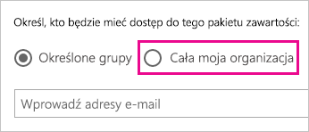

# Administrowanie usługą Power BI w portalu administracyjnym

Portal administracyjny pozwala na zarządzanie *dzierżawą* usługi Power BI w organizacji. Portal zawiera elementy, takie jak metryki użycia, dostęp do centrum administracyjnego usługi Office 365 oraz ustawienia.

Pełny portal administracyjny jest dostępny dla wszystkich użytkowników, którzy są administratorami globalnymi w usłudze Office 365 lub którym przydzielono rolę administratora usługi Power BI. Jeśli nie pełnisz żadnej z tych ról, w portalu są widoczne tylko **ustawienia pojemności**. Aby uzyskać więcej informacji o roli administratora usługi Power BI, zobacz [Opis roli administratora usługi Power BI](service-admin-role.md).

## Jak uzyskać dostęp do portalu administracyjnego

Twoje konto musi być oznaczone jako **Administrator globalny**, w usłudze Office 365 lub Azure Active Directory, albo musisz uzyskać przydział do roli administratora usługi Power BI, aby uzyskać dostęp do portalu administracyjnego usługi Power BI. Aby uzyskać więcej informacji o roli administratora usługi Power BI, zobacz [Opis roli administratora usługi Power BI](service-admin-role.md). Aby uzyskać dostęp do portalu administracyjnego usługi Power BI, wykonaj następujące czynności.

1. Wybierz koło zębate ustawień w prawym górnym rogu usługi Power BI.

1. Wybierz pozycję **Portal administracyjny**.

    

Portal zawiera siedem kart. W pozostałej części tego artykułu przedstawiono informacje na temat każdej z tych kart.

* [Metryki użycia](#usage-metrics)
* [Użytkownicy](#users)
* [Dzienniki inspekcji](#audit-logs)
* [Ustawienia dzierżawy](#tenant-settings)
* [Ustawienia — wersja Premium](#premium-settings)
* [Kody osadzania](#embed-codes)
* [Organization visuals](#organization-visuals) (Wizualizacje organizacji)

## Metryki użycia

Karta **Metryki użycia** umożliwia monitorowanie użycia usługi Power BI w organizacji. Ponadto zapewnia możliwość wyświetlania najbardziej aktywnych użytkowników i grup w usłudze Power BI w ramach organizacji.

> [!NOTE]
> Przy pierwszym uzyskaniu dostępu do pulpitu nawigacyjnego lub po powrocie do pulpitu nawigacyjnego po długim czasie najprawdopodobniej zobaczysz ekran ładowania, gdy będziemy ładować pulpit nawigacyjny.

Po załadowaniu pulpitu nawigacyjnego zobaczysz dwie sekcje kafelków. Pierwsza sekcja obejmuje dane użycia dla poszczególnych użytkowników, a druga sekcja zawiera podobne informacje dotyczące grup w organizacji.

Oto podział elementów, które możesz zobaczyć w każdym kafelków:

* Unikatowy licznik dla wszystkich pulpitów nawigacyjnych, raportów i zestawów danych w obszarze roboczym użytkownika
  
    

* Najczęściej używany pulpit nawigacyjny według liczby użytkowników, którzy mogą do niego uzyskać dostęp. Jeśli na przykład masz pulpit nawigacyjny, który został udostępniony 3 użytkownikom oraz został dodany do pakietu zawartości, z którym łączy się dwóch różnych użytkowników, licznik będzie wskazywać 6 (1 + 3 +2)
  
    

* Najpopularniejsza zawartość, z którą łączą się użytkownicy. Będzie to wszystko to, z czym użytkownicy mogą się połączyć za pośrednictwem procesu Pobierz dane, a więc pakiety zawartości SaaS, pakiety zawartości organizacji, pliki lub bazy danych.
  
    

* Widok użytkowników oparty na liczbie posiadanych przez nich pulpitów nawigacyjnych, zarówno utworzonych przez użytkowników, jak i tych udostępnionych.
  
    

* Widok użytkowników oparty na liczbie posiadanych raportów
  
    

Druga sekcja wyświetla informacje tego samego typu, ale w oparciu o grupy. Dzięki temu możesz zobaczyć, które grupy w organizacji są najaktywniejsze i z jakiej zawartości korzystają.

Przy użyciu tych informacji można uzyskiwać faktyczny wgląd w to, jak użytkownicy korzystają z usługi Power BI w organizacji, a także rozpoznawać w organizacji użytkowników i grupy charakteryzujące się dużą aktywnością.

## Użytkownicy

Do zarządzania użytkownikami, grupami i administratorami usługi Power BI służy centrum administracyjne usługi Office 365. Karta **Użytkownicy** zawiera link do centrum administracyjnego dla dzierżawy.

## Dzienniki inspekcji

Do zarządzania dziennikami inspekcji usługi Power BI służy centrum zabezpieczeń i zgodności usługi Office 365. Karta **Dzienniki inspekcji**  zawiera link do centrum zabezpieczeń i zgodności dla dzierżawy. [Dowiedz się więcej](service-admin-auditing.md)

Aby korzystać z dzienników inspekcji, upewnij się, że ustawienie [**Twórz dzienniki inspekcji na potrzeby wewnętrznych inspekcji działań i sprawdzania zgodności**](#create-audit-logs-for-internal-activity-auditing-and-compliance) zostało włączone.

## Ustawienia dzierżawy

Karta **Ustawienia dzierżawy** umożliwia szczegółowe kontrolowanie funkcji udostępnionych w organizacji. Jeśli masz obawy związane z poufnymi danymi, niektóre z funkcji mogą nie być odpowiednie dla Twojej organizacji. Możesz też zdecydować, że określona funkcja będzie dostępna tylko dla wybranej grupy.

Na poniższej ilustracji przedstawiono dwie pierwsze sekcje karty **Ustawienia dzierżawy**.

> [!NOTE]
> Zastosowanie zmiany ustawienia dla wszystkich użytkowników w dzierżawie może zająć do 10 minut.

Ustawienia mogą mieć trzy stany:

* **Wyłączone dla całej organizacji**: Nikt w Twojej organizacji nie może używać tej funkcji.

    

* **Włączone dla całej organizacji**: Każdy w Twojej organizacji może używać tej funkcji.

    

* **Włączone dla podzbioru organizacji**: Określony podzestaw użytkowników lub grup w organizacji może używać tej funkcji.

    Funkcję możesz włączyć dla całej organizacji poza wybraną grupą użytkowników.

    

    Ponadto możesz włączyć funkcję tylko dla wybranej grupy użytkowników, jednocześnie wyłączając ją dla innej grupy użytkowników. Dzięki zastosowaniu takiego podejścia upewnisz się, że wybrani użytkownicy nie będą mieć dostępu do funkcji, nawet kiedy znajdą się w grupie dozwolonych użytkowników.

    

W kilku kolejnych sekcjach omówiono różne typy ustawień dzierżawy.

## Ustawienia obszaru roboczego

### Tworzenie obszarów roboczych (wersja zapoznawcza)

Użytkownicy w organizacji mogą tworzyć obszary robocze aplikacji, aby współpracować nad pulpitami nawigacyjnymi, raportami i inną zawartością. [Dowiedz się więcej](service-create-the-new-workspaces.md)

## Ustawienia eksportowania i udostępniania

### Udostępnianie zawartości użytkownikom zewnętrznym

Użytkownicy w organizacji mogą udostępniać pulpity nawigacyjne użytkownikom spoza organizacji. [Dowiedz się więcej](service-share-dashboards.md#share-a-dashboard-or-report-with-people-outside-your-organization)

Na poniższej ilustracji przedstawiono komunikat, który jest wyświetlany w przypadku udostępniania użytkownikowi zewnętrznemu.

### Publikuj w sieci Web

Użytkownicy w organizacji mogą publikować raporty w Internecie. [Dowiedz się więcej](service-publish-to-web.md)

Na poniższej ilustracji przedstawiono menu **Plik** raportu po włączeniu ustawienia **Publikuj w Internecie**.

Użytkownicy widzą różne opcje w interfejsie użytkownika w zależności od tego, jakie jest ustawienie **Publikuj w Internecie**.

|Promowanie |Włączone dla całej organizacji |Wyłączone dla całej organizacji |Określone grupy zabezpieczeń   |
|---------|---------|---------|---------|
|Opcja **Publikuj w sieci Web** w menu **Plik** raportu.|Włączone dla wszystkich|Nie jest widoczne dla wszystkich|Widoczne tylko dla autoryzowanych użytkowników lub grup.|
|Opcja **Zarządzaj kodami osadzania** w obszarze **Ustawienia**|Włączone dla wszystkich|Włączone dla wszystkich|Włączone dla wszystkich  Opcja * **Usuń** tylko dla autoryzowanych użytkowników lub grup. Opcja * **Uzyskaj kody** włączona dla wszystkich.|
|**Kody osadzania** w portalu administracyjnym|Stan odzwierciedla jedną z następujących sytuacji: * Aktywne * Nieobsługiwane * Zablokowane|Wyświetlany stan to **Wyłączone**|Stan odzwierciedla jedną z następujących sytuacji: * Aktywne * Nieobsługiwane * Zablokowane  Jeśli zgodnie z ustawieniami dzierżawy użytkownik nie ma autoryzacji, jest wyświetlany stan **Naruszenie**.|
|Istniejące opublikowane raporty|Wszystko włączone|Wszystko wyłączone|Raporty w dalszym ciągu są renderowane dla wszystkich.|

### Eksportuj dane

Użytkownicy w organizacji mogą eksportować dane z kafelka lub wizualizacji. [Dowiedz się więcej](visuals/power-bi-visualization-export-data.md)

Na poniższej ilustracji przedstawiono opcję eksportowania danych z kafelka.

> [!NOTE]
> Wyłączenie funkcji **Eksportowanie danych** ponadto uniemożliwia użytkownikom korzystanie z funkcji **Analizuj w programie Excel** oraz połączenia na żywo usługi Power BI.

### Eksportuj raporty jako prezentacje programu PowerPoint

Użytkownicy w organizacji mogą eksportować raporty usługi Power BI jako pliki programu PowerPoint. [Dowiedz się więcej](consumer/end-user-powerpoint.md)

Na poniższej ilustracji przedstawiono menu **Plik** raportu po włączeniu ustawienia **Eksportuj raporty jako prezentacje programu PowerPoint**.

### Drukuj pulpity nawigacyjne i raporty

Użytkownicy w organizacji mogą drukować pulpity nawigacyjne i raporty. [Dowiedz się więcej](consumer/end-user-print.md)

Na poniższej ilustracji przedstawiono opcję drukowania pulpitu nawigacyjnego.

Na poniższej ilustracji przedstawiono menu **Plik** raportu po włączeniu ustawienia **Drukuj pulpity nawigacyjne i raporty**.

## Ustawienia pakietu zawartości i aplikacji

### Publikowanie pakietów zawartości i aplikacji dla całej organizacji

Użytkownicy w organizacji mogą publikować pakiety zawartości i aplikacje dla całej organizacji, zamiast tylko dla określonych grup. [Dowiedz się więcej](service-organizational-content-pack-manage-update-delete.md)

Na poniższej ilustracji przedstawiono opcję **Cała moja organizacja** dostępną podczas tworzenia pakietu zawartości.

### Tworzenie aplikacji i pakietów zawartości organizacji w formie szablonów

Użytkownicy w organizacji mogą tworzyć szablony pakietów zawartości, które używają zestawów danych wbudowanych w programie Power BI Desktop. [Dowiedz się więcej](template-content-pack-authoring.md)

### Wypychanie aplikacji do użytkowników końcowych

Użytkownicy mogą bezpośrednio udostępniać aplikacje użytkownikom końcowym bez konieczności instalacji z usługi AppSource. [Dowiedz się więcej](service-create-distribute-apps.md)

## Ustawienia integracji

### Zadawanie pytań o dane przy użyciu Cortany

Użytkownicy w organizacji mogą zadawać pytania dotyczące danych przy użyciu Cortany. [Dowiedz się więcej](service-cortana-enable.md)

> [!NOTE]
> To ustawienie ma zastosowanie do całej organizacji i nie może być ograniczone do określonych grup.

### Używanie funkcji Analizuj w programie Excel z lokalnymi zestawami danych

Użytkownicy w organizacji mogą używać programu Excel, aby wyświetlać lokalne zestawy danych usługi Power BI i wchodzić z nimi w interakcje. [Dowiedz się więcej](service-analyze-in-excel.md)

> [!NOTE]
> Wyłączenie funkcji **Eksportowanie danych** również uniemożliwia użytkownikom korzystanie z funkcji **Analizuj w programie Excel**.

### Używanie wizualizacji ArcGIS Maps for Power BI

Użytkownicy w organizacji mogą używać wizualizacji ArcGIS Maps for Power BI oferowanej przez firmę Esri. [Dowiedz się więcej](power-bi-visualization-arcgis.md)

### Używanie wyszukiwania globalnego dla usługi Power BI (wersja zapoznawcza)

Użytkownicy w organizacji mogą używać zewnętrznych funkcji wyszukiwania, które korzystają z usługi Azure Search. Na przykład użytkownicy mogą korzystać z Cortany, aby pobierać kluczowe informacje bezpośrednio z pulpitów nawigacyjnych i raportów usługi Power BI. [Dowiedz się więcej](service-cortana-intro.md)

## Ustawienia wizualizacji niestandardowych

### Umożliwiają włączenie niestandardowych elementów wizualnych w całej organizacji

Użytkownicy w organizacji mogą interaktywnie współpracować przy użyciu niestandardowych elementów wizualnych oraz je udostępniać. [Dowiedz się więcej](power-bi-custom-visuals.md)

> [!NOTE]
> To ustawienie ma zastosowanie do całej organizacji i nie może być ograniczone do określonych grup.

## Ustawienia elementów wizualnych języka R

### Korzystaj z wizualizacji języka R i udostępniaj je

Użytkownicy w organizacji mogą wchodzić w interakcje z elementami wizualnymi utworzonymi przy użyciu skryptów języka R oraz je udostępniać. [Dowiedz się więcej](visuals/service-r-visuals.md)

> [!NOTE]
> To ustawienie ma zastosowanie do całej organizacji i nie może być ograniczone do określonych grup.

## Ustawienia inspekcji i użycia

### Twórz dzienniki inspekcji na potrzeby wewnętrznych inspekcji działań i sprawdzania zgodności

Użytkownicy w organizacji mogą używać inspekcji, aby monitorować działania podejmowane w usłudze Power BI przez innych użytkowników w organizacji. [Dowiedz się więcej](service-admin-auditing.md)

To ustawienie musi zostać włączone, aby można było rejestrować wpisy dziennika inspekcji. Od momentu włączenia inspekcji do czasu, kiedy możliwe będzie wyświetlenie danych inspekcji, może wystąpić opóźnienie do 48 godzin. Jeśli dane nie są natychmiast widoczne, sprawdź dzienniki inspekcji później. Podobne opóźnienie może występować między uzyskaniem uprawnień do wyświetlania dzienników inspekcji a możliwością uzyskania do nich dostępu.

> [!NOTE]
> To ustawienie ma zastosowanie do całej organizacji i nie może być ograniczone do określonych grup.

### Metryki użycia dla twórców zawartości

Użytkownicy w organizacji widzą metryki użycia dla tworzonych przez siebie pulpitów nawigacyjnych i raportów. [Dowiedz się więcej](service-usage-metrics.md)

### Dane dotyczące poszczególnych użytkowników w metrykach użycia dla twórców zawartości

Metryki użycia dla twórców zawartości będą ujawniać nazwy wyświetlane i adresy e-mail użytkowników, którzy uzyskują dostęp do zawartości. [Dowiedz się więcej](service-usage-metrics.md)

Domyślnie dane poszczególnych użytkowników są włączone dla metryk użycia, a informacje o koncie twórcy zawartości są uwzględniane w raporcie metryk. Jeśli nie chcesz uwzględnić tych informacji dla niektórych lub wszystkich użytkowników, wyłączyć funkcję dla określonych grup zabezpieczeń lub całej organizacji. Informacje o koncie będą wyświetlane w raporcie jako *Bez nazwy*.

## Ustawienia pulpitu nawigacyjnego

### Klasyfikacja danych dla pulpitów nawigacyjnych

Użytkownicy w organizacji mogą tagować pulpity nawigacyjne przy użyciu klasyfikacji, które wskazują poziomy zabezpieczeń pulpitów nawigacyjnych. [Dowiedz się więcej](service-data-classification.md)

> [!NOTE]
> To ustawienie ma zastosowanie do całej organizacji i nie może być ograniczone do określonych grup.

## Ustawienia dewelopera

### Osadzanie zawartości w aplikacjach

Użytkownicy w organizacji mogą osadzać pulpity nawigacyjne i raporty usługi Power BI w aplikacjach oprogramowania jako usługi (SaaS). Wyłączenie tego ustawienia sprawia, że użytkownicy nie mogą używać interfejsów API REST do osadzania zawartości usługi Power BI w swoich aplikacjach. [Dowiedz się więcej](developer/embedding.md)

## Ustawienia obszarów roboczych i importowania

### Tworzenie treści w obszarach roboczych

Użytkownicy w organizacji mogą uzyskiwać dostęp do obszarów roboczych, aby łączyć się z danymi i tworzyć zawartość. [Dowiedz się więcej](service-create-the-new-workspaces.md)

### Importowanie danych do usługi Power BI

Użytkownicy w organizacji mogą importować dane do usługi, na przykład publikując raporty z programu Power BI Desktop, przekazując pliki raportów usługi Power BI i łącząc się z danymi bezpośrednio z usługi. [Dowiedz się więcej](desktop-upload-desktop-files.md)

## Ustawienia przepływu danych (wersja zapoznawcza)

### Tworzenie i używanie przepływów danych (wersja zapoznawcza)

Użytkownicy w organizacji mogą tworzyć przepływy danych i ich używać. Aby zapoznać się z omówieniem przepływów danych, zobacz [Przygotowywanie danych samoobsługi w usłudze Power BI (wersja zapoznawcza)](service-dataflows-overview.md). Aby włączyć przepływy danych w pojemności Premium, zobacz [Konfigurowanie obciążeń](service-admin-premium-manage.md#configure-workloads).

> [!NOTE]
> To ustawienie ma zastosowanie do całej organizacji i nie może być ograniczone do określonych grup.

## Ustawienia pojemności

### Power BI Premium

Karta **Power BI Premium** umożliwia zarządzanie dowolnymi pojemnościami usługi Power BI Premium (jednostki SKU EM lub P) zakupionymi przez organizację. Wszyscy użytkownicy w organizacji widzą kartę **Power BI Premium**, ale zobaczą zawartość na karcie tylko wtedy, jeśli przypisano im rolę *administratora pojemności* lub użytkownika z uprawnieniami do przypisywania. Jeśli użytkownik nie ma żadnych uprawnień, jest wyświetlany poniższy komunikat.

Aby uzyskać więcej informacji o sposobach zarządzania ustawieniami wersji Premium, zobacz [Zarządzanie usługą Power BI Premium](service-admin-premium-manage.md).

### Power BI Embedded

Karta **Power BI Embedded** służy do wyświetlania pojemności usługi Power BI Embedded (jednostka SKU A) zakupionych dla klienta. Ponieważ jednostki SKU A można kupić tylko na platformie Azure, [zarządzasz osadzonymi pojemnościami na platformie Azure](developer/azure-pbie-create-capacity.md) z poziomu witryny **Azure Portal**.

Aby uzyskać więcej informacji na temat zarządzania ustawieniami usługi Power BI Embedded (SKU A), zobacz [Co to jest usługa Power BI Embedded](developer/azure-pbie-what-is-power-bi-embedded.md).

## Kody osadzania

Jako administrator możesz wyświetlać kody osadzania, które są generowane dla dzierżawy. Możesz również wycofywać lub usuwać kody. [Dowiedz się więcej](service-publish-to-web.md)

## Wizualizacje organizacji

Karta **Wizualizacje organizacji** umożliwia wdrażanie wizualizacji niestandardowych i zarządzanie nimi wewnątrz organizacji. Dzięki wizualizacjom organizacji można łatwo wdrażać własne wizualizacje w organizacji. Autorzy raportów mogą je następnie odnajdywać i importować do swoich raportów z poziomu programu Power BI Desktop. [Dowiedz się więcej](power-bi-custom-visuals-organization.md)

> [!WARNING]
> Wizualizacja niestandardowa może zawierać kod zagrażający bezpieczeństwu lub prywatności. Przed jej wdrożeniem w repozytorium organizacji upewnij się, że autor i źródło wizualizacji niestandardowej należą do zaufanych.

Na poniższej ilustracji znajdują się wszystkie wizualizacje niestandardowe, które zostały aktualnie wdrożone w repozytorium organizacji.

### Dodawanie nowej wizualizacji niestandardowej

Aby dodać nową wizualizację niestandardową do listy, wykonaj poniższe kroki. 

1. W okienku po prawej stronie wybierz pozycję **Dodaj wizualizację niestandardową**.

    

1. Wypełnij formularz **Dodawanie wizualizacji niestandardowej**:

    * **Wybierz plik pbiviz** (wymagane): wybierz plik wizualizacji niestandardowej do przekazania. Obsługiwane są tylko wersjonowane niestandardowe wizualizacje interfejsu API (przeczytaj tutaj, co to oznacza).

    Przed przekazaniem wizualizacji niestandardowej należy ją sprawdzić pod kątem zabezpieczeń i prywatności, aby zapewnić jej zgodność ze standardami organizacji.

    * **Nazwij swoją wizualizację niestandardową** (wymagane): nadaj wizualizacji krótki tytuł, by użytkownicy programu Power BI Desktop mogli łatwo poznać jej zastosowanie.

    * **Ikona**: plik ikony wyświetlany w interfejsie użytkownika programu Power BI Desktop.

    * **Opis**: krótki opis wizualizacji zapewniający użytkownikowi więcej informacji i kontekst.

1. Wybierz pozycję **Dodaj**, aby zainicjować żądanie przekazania. Jeśli operacja zostanie wykonana pomyślnie, na liście pojawia się nowy element. Jeśli operacja zakończy się niepowodzeniem, jest wyświetlany odpowiedni komunikat o błędzie.

### Usuwanie wizualizacji niestandardowej z listy

Aby trwale usunąć wizualizację, wybierz ikonę kosza dla wizualizacji w repozytorium.

> [!IMPORTANT]
> Usunięcie jest nieodwracalne. Usunięcie wizualizacji powoduje natychmiastowe zakończenie renderowania w istniejących raportach. Nawet jeśli wizualizacja zostanie przekazana ponownie, nie zastąpi ona poprzedniej, już usuniętej wizualizacji. Użytkownicy mogą jednak ponownie zaimportować nową wizualizację i zastąpić wystąpienie w swoich raportach.

### Wyłączanie wizualizacji niestandardowej na liście

Aby wyłączyć wizualizację z magazynu organizacyjnego, wybierz ikonę koła zębatego. W sekcji **Dostęp** wyłącz wizualizację niestandardową.

Wyłączona wizualizacja nie będzie renderowana w istniejących raportach i spowoduje wyświetlenie poniższego komunikatu o błędzie.

*Ta wizualizacja niestandardowa jest już niedostępna. Aby uzyskać więcej informacji, skontaktuj się z administratorem.*

Wizualizacje oznaczone zakładkami będą jednak nadal działać.

Po każdej aktualizacji lub zmianie wprowadzonej przez administratora użytkownicy usługi Power BI Desktop powinni ponownie uruchomić aplikację lub odświeżyć przeglądarkę w usłudze Power BI, aby zobaczyć aktualizacje.

### Aktualizowanie wizualizacji

Aby zaktualizować wizualizację z poziomu magazynu organizacyjnego, wybierz ikonę koła zębatego. Przejdź do nowej wersji wizualizacji i przekaż ją.

Upewnij się, że identyfikator wizualizacji pozostał niezmieniony. Nowy plik zastępuje jego poprzednią wersję dla wszystkich raportów w całej organizacji. Jednak jeśli nowa wersja wizualizacji może uniemożliwić użycie wcześniejszej wersji wizualizacji lub zaburzyć jej strukturę danych, nie zastępuj poprzedniej wersji. Zamiast tego utwórz nową listę z nową wersją wizualizacji. Na przykład dodaj numer nowej wersji (wersja X.X) do tytułu umieszczonej na liście nowej wizualizacji. Dzięki temu wyraźnie widać, że jest to ta sama wizualizacja ze zaktualizowanym numerem wersji, dlatego funkcjonalność istniejących raportów nie zostaje zakłócona. I tym razem upewnij się, że identyfikator wizualizacji pozostał niezmieniony. Następnym razem, gdy użytkownicy przejdą do repozytorium organizacji z programu Power BI Desktop, mogą zaimportować nową wersję, co powoduje wyświetlenie monitu o zastąpienie bieżącej wersji zawartej w raporcie.

Aby uzyskać więcej informacji, odwiedź stronę [często zadawanych pytań dotyczących wizualizacji niestandardowych organizacji](https://docs.microsoft.com/en-us/power-bi/power-bi-custom-visuals-faq#organizational-custom-visuals)

## Magazyn przepływów danych (wersja zapoznawcza)

Domyślnie dane używane z usługą Power BI są przechowywane w magazynie wewnętrznym oferowanym przez usługę Power BI. Dzięki integracji przepływów danych i usługi Azure Data Lake Storage Gen2 (ADLS Gen2) można przechowywać swoje przepływy danych na koncie usługi Azure Data Lake Storage Gen2 organizacji. Aby uzyskać więcej informacji, zobacz [Integracja przepływów danych z usługą Azure Data Lake (wersja zapoznawcza)](service-dataflows-azure-data-lake-integration.md).

## Obszary robocze (wersja zapoznawcza)

Jako administrator możesz wyświetlać obszary robocze, które istnieją w Twojej dzierżawie. Listę obszarów roboczych można sortować i filtrować. Można również wyświetlać szczegóły poszczególnych obszarów roboczych. Należy zwrócić uwagę, że kolumny tabeli odpowiadają właściwościom zwracanym przez [interfejs API REST administratora usługi Power BI](/rest/api/power-bi/admin) dla obszarów roboczych. Osobiste obszary robocze są typu **PersonalGroup**, starsze obszary robocze są typu **Group**, a nowoczesne obszary robocze są typu **Workspace**. Aby uzyskać więcej informacji, zobacz [Tworzenie nowych obszarów roboczych (wersja zapoznawcza) w usłudze Power BI](service-create-the-new-workspaces.md).

## Następne kroki

[Administrowanie usługą Power BI w organizacji](service-admin-administering-power-bi-in-your-organization.md) [Opis roli administratora usługi Power BI](service-admin-role.md)  
[Inspekcja usługi Power BI w organizacji](service-admin-auditing.md)  
[Zarządzanie usługą Power BI Premium](service-admin-premium-manage.md)  

Masz więcej pytań? [Zadaj pytanie społeczności usługi Power BI](http://community.powerbi.com/)
