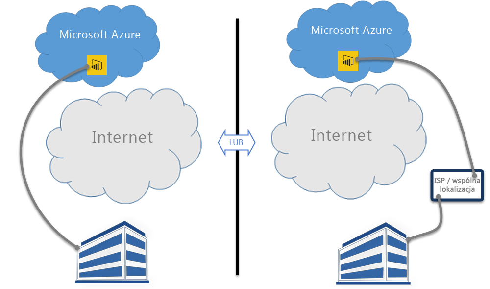

# Usługi Power BI i ExpressRoute
Korzystając z usług **Power BI** i **ExpressRoute**, możesz utworzyć prywatne połączenie sieciowe z Twojej organizacji do usługi Power BI (lub za pomocą funkcji wspólnej lokalizacji od usługodawcy internetowego), omijając Internet w celu lepszego zabezpieczenia poufnych danych i połączeń usługi Power BI.

**ExpressRoute** to usługa platformy Azure, która pozwala tworzyć połączenia prywatne między centrami danych platformy Azure (na której znajduje się usługa Power BI) i infrastrukturą lokalną lub tworzyć połączenia prywatne między centrami danych platformy Azure i środowiskiem wspólnej lokalizacji.

Możesz uzyskać [więcej informacji na temat usługi ExpressRoute](https://azure.microsoft.com/services/expressroute/) lub poznać [sposób rejestrowania](https://azure.microsoft.com/pricing/details/expressroute/).

> [!NOTE]
> Usługa Power BI jest obsługiwana w trybie publicznej komunikacji równorzędnej, zgodnie z opisem w [tych często zadawanych pytaniach](https://docs.microsoft.com/azure/expressroute/expressroute-faqs).
> 
> 

## Wyjątki dotyczące usługi ExpressRoute w usłudze Power BI
Usługa Power BI jest zgodna z usługą ExpressRoute, jednak istnieje kilka wyjątków, gdy usługa Power BI pobiera lub wysyła dane za pośrednictwem publicznej sieci Internet. Te określone wyjątki często obejmują dane statyczne, na przykład pliki konfiguracji przeglądarki, które są pobierane z najbliższego węzła usługi **Content Delivery Network (CDN)**. Istnieje kilka wyjątków ogólnych, które mają zastosowanie do całej usługi Power BI, oraz kilka wyjątków dotyczących usług lub funkcji, które opisano w poniższych sekcjach.

### Wyjątki ogólne dotyczące usług Power BI i ExpressRoute
Wyjątek dotyczący usług **Power BI** i **ExpressRoute** oznacza, że dane do i z usługi Power BI są przesyłane za pośrednictwem publicznej sieci Internet, a nie za pośrednictwem prywatnego linku ExpressRoute.

Dwa wyjątki ogólne dotyczące usług Power BI i ExpressRoute to:

* Pliki statyczne pobierane z usługi **Content Delivery Network (CDN)** i witryn internetowych
* Dane **telemetryczne** przesyłane za pośrednictwem publicznej sieci Internet

Usługa Power BI korzysta z wielu usług **Content Delivery Network (CDN)** lub witryn internetowych, aby skutecznie dostarczać niezbędną zawartość statyczną i pliki do użytkowników na podstawie geograficznych ustawień regionalnych za pośrednictwem publicznej sieci Internet. Wśród tych plików statycznych znajdują się pliki produktów do pobrania (na przykład **Power BI Desktop**, **lokalna brama danych** lub **pakiety zawartości usługi Power BI** od różnych niezależnych dostawców usług), pliki konfiguracji przeglądarki, które są używane do inicjowania i nawiązywania wszystkich kolejnych połączeń z usługą Power BI, a także początkowa, bezpieczna strona logowania usługi Power BI — rzeczywiste poświadczenia są wysyłane tylko za pośrednictwem usługi ExpressRoute.   

Również niektóre **dane telemetryczne** są przesyłane za pośrednictwem publicznej sieci Internet i za pośrednictwem usługi ExpressRoute. Dane telemetryczne to między innymi statystyki użycia i podobne dane, które są przesyłane do usług służących do monitorowania użycia i działania.

### Aplikacja Power BI SaaS i usługa ExpressRoute
Gdy użytkownik inicjuje połączenie z usługą Power BI (za pośrednictwem witryny powerbi.com lub Cortany), strona docelowa usługi Power BI, strona logowania i pliki statyczne, które przygotowują przeglądarkę do nawiązania połączenia i interakcji z usługą Power BI, są pobierane z usługi CDN lub witryn internetowych za pośrednictwem publicznej sieci Internet.

Po zalogowaniu się kolejne interakcje z danymi usługi Power BI odbywają się za pośrednictwem usługi ExpressRoute, z wyjątkiem niektórych funkcji i usług, które są zależne od danych dostępnych w publicznej sieci Internet:

* **Wizualizacje w postaci map** wymagają połączenia i transmisji danych do usługi Bing Virtual Earth lub do usługi geokodowania Bing, które odbywają się za pośrednictwem publicznej sieci Internet.
* Integracja usługi Power BI z **Cortaną** wymaga dostępu do usługi Bing za pośrednictwem publicznej sieci Internet.
* Gdy użytkownik dodaje **linki niestandardowe**, na przykład widżet obrazu lub klip wideo, usługa Power BI żąda danych na podstawie linku udostępnionego przez użytkownika, który może (ale nie musi) korzystać z usługi ExpressRoute.
* Użytkownicy mogą wysyłać **opinie do usługi Power BI** w formie tekstu (i opcjonalnie obrazów) za pośrednictwem mechanizmu opinii User Voice, który do transmisji danych używa publicznej sieci Internet.
* **Dostawca zawartości usługi Wiadomości Bing** pobiera zawartość z usługi Bing za pośrednictwem publicznej sieci Internet.
* Podczas nawiązywania połączeń z **aplikacjami** (na przykład pakietami zawartości) użytkownicy często muszą wprowadzać poświadczenia i ustawienia, korzystając ze stron udostępnionych przez dostawcę SaaS. Tego rodzaju strony mogą (ale nie muszą) używać usługi ExpressRoute.

| Aktywność użytkownika | Lokalizacja docelowa |
| --- | --- |
| Strona docelowa (przed logowaniem) |`maxcdn.bootstrapcdn.com ; ajax.aspnetcdn.com ; netdna.bootstrapcdn.com ; cdn.optimizely.com; google-analytics.com ` |
| Logowanie |`*.mktoresp.com ; *.aadcdn.microsoftonline-p.com ; *.msecnd.com ; *.localytics.com ; ajax.aspnetcdn.com` |
| Zarządzanie pulpitami nawigacyjnymi, raportami i zestawami danych (w tym mapami i geokodowaniem) |`*.localytics.com ; *.virtualearth.net ; platform.bing.com; powerbi.microsoft.com; c.microsoft.com; app.powerbi.com; *.powerbi.com; dc.services.visualstudio.com ` |
| Pomoc techniczna |`support.powerbi.com ; powerbi.uservoice.com ; go.microsoft.com ` |

### Program Power BI Desktop i usługa ExpressRoute
Program Power BI Desktop również jest zgodny z usługą ExpressRoute, jednak istnieje kilka wyjątków, które zostały opisane na poniższej liście:

* **Powiadomienia o aktualizacjach** używane do wykrywania, czy użytkownicy mają najnowszą wersję programu Power BI Desktop, są przesyłane za pośrednictwem publicznej sieci Internet.
* Niektóre **dane telemetryczne** są przesyłane za pośrednictwem publicznej sieci Internet.
* **Wizualizacje w postaci map** wymagają połączenia i transmisji danych do usługi **Bing Virtual Earth** lub do usługi **geokodowania Bing**, które odbywają się za pośrednictwem publicznej sieci Internet.
* Funkcja **Pobierz dane** z kilku źródeł danych, na przykład z **sieci Web** lub od innych dostawców SaaS, odbywa się za pośrednictwem publicznej sieci Internet.

### Rozwiązanie Power BI PaaS i usługa ExpressRoute
Usługa Power BI zawiera interfejsy API i inne funkcje oparte na platformie, które umożliwiają deweloperom tworzenie dostosowanych rozwiązań i aplikacji usługi Power BI. Oprócz telemetrii i danych CDN omówionych wcześniej w tym temacie, podczas przesyłania danych Power BI PaaS za pośrednictwem publicznej sieci Internet są używane następujące usługi:

| Działanie PaaS | Dodatkowe używane miejsca docelowe |
| --- | --- |
| Osadzenie publiczne (telemetria) |`c1.microsoft.com` |
| Wizualizacje niestandardowe (CDN) |`*.azureedge.net` |

Niektóre **wizualizacje niestandardowe** są tworzone przez inne podmioty, a niektóre przez firmę Microsoft. Mogą one (ale nie muszą) używać usługi ExpressRoute.

### Aplikacje Power BI Mobile i usługa ExpressRoute
Ten dokument nie zawiera informacji na temat korzystania z aplikacji Power BI Mobile.  

### Lokalna brama danych i usługa ExpressRoute
Gdy z usługą Power BI jest używana **lokalna brama danych**, transmisje są zgodne z usługą ExpressRoute, z wyjątkiem działań użytkownika opisanych w sekcji **Aplikacja Power BI SaaS i usługa ExpressRoute** znajdującej się wcześniej w tym temacie.  

