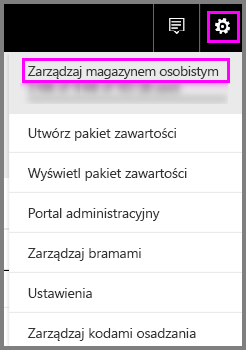
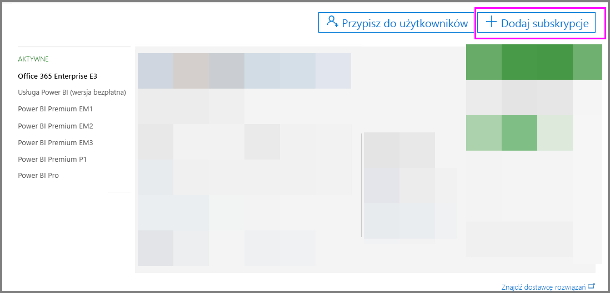

# Usługa Power BI Pro w organizacji

Usługa Power BI Pro to płatne licencje, które zapewniają więcej funkcji. Licencje usługi Power BI Pro są przeznaczone dla zespołów, które chcą udostępniać zawartość i współpracować z innymi osobami, aby podejmować decyzje oparte na danych.  Każdy członek zespołu tworzący lub wyświetlający udostępnioną zawartość usługi Power BI potrzebuje licencji Pro, chyba że zawartość jest skojarzona z dedykowaną pojemnością przy użyciu usługi Power BI Premium.

Następujące funkcje wymagają licencji usługi Power BI Pro:

* **Analizowanie danych w programie Excel lub Power BI Desktop** — użyj programu Excel lub Power BI Desktop, aby wyświetlić zestaw danych opublikowany w usłudze Power BI i wejść z nim w interakcje. Aby uzyskać więcej informacji, zobacz [Analizowanie w programie Excel](service-analyze-in-excel.md).

* **Udostępnianie pulpitów nawigacyjnych i współpraca z obszarami roboczymi** — obszary robocze usługi Power BI ułatwiają współpracę z innymi osobami podczas pracy na pulpitach nawigacyjnych, raportach i zestawach danych. Więcej informacji można znaleźć w artykule [Współpraca w obszarze roboczym aplikacji usługi Power BI](service-collaborate-power-bi-workspace.md).

* **Wyświetlanie zawartości udostępnionej** — użytkownicy wersji Pro mogą wyświetlać pulpity nawigacyjne i raporty, które zostały im udostępnione, wchodzić w interakcje z udostępnionymi pulpitami nawigacyjnymi i raportami, a także ponownie udostępniać udostępnione pulpity nawigacyjne i raporty (jeśli jest to dozwolone). Jednak użytkownik wersji Pro nie może edytować tych pulpitów nawigacyjnych ani raportów. Aby uzyskać więcej informacji, zobacz [Udostępnianie pulpitów nawigacyjnych usługi Power BI współpracownikom i innym osobom](service-share-dashboards.md).

* **Integrowanie zawartości z usługą Microsoft Teams** — możesz dodać kartę usługi Power BI na kanale usługi Microsoft (MS) Teams. Usługa MS Teams automatycznie wykrywa wszystkie raporty w obszarze roboczym. Aby uzyskać więcej informacji, zobacz [Usługa Power BI łączy się z usługą Microsoft Teams](https://powerbi.microsoft.com/en-us/blog/power-bi-teams-up-with-microsoft-teams/). 

## 60-dniowa wersja próbna usługi Power BI Pro dla użytkowników indywidualnych

Po zarejestrowaniu się i utworzeniu bezpłatnego konta możesz opcjonalnie wypróbować wersję Pro usługi bezpłatnie przez 60 dni. Podczas okresu próbnego będziesz mieć dostęp do wszystkich funkcji usługi Power BI Pro. Usługa Power BI Pro oferuje wszystkie funkcje bezpłatnej wersji usługi Power BI oraz dodatkowe funkcje udostępniania i współpracy. Aby uzyskać więcej informacji, zobacz [Cennik usługi Power BI](https://powerbi.microsoft.com/en-us/pricing/). Aby wypróbować 60-dniową bezpłatną wersję próbną usługi Power BI Pro, zaloguj się do usługi Power BI i wypróbuj jedną z następujących funkcji usługi Power BI Pro.

* [Tworzenie obszaru roboczego](service-create-distribute-apps.md)
* [Udostępnianie pulpitu nawigacyjnego](service-share-dashboards.md)

Kiedy zaczniesz korzystać z dowolnej z tych funkcji, zostanie wyświetlony monit o rozpoczęcie bezpłatnego okresu próbnego. Możesz również rozpocząć okres próbny, przechodząc do ikony koła zębatego i wybierając pozycję Zarządzaj magazynem osobistym. Następnie wybierz pozycję Wypróbuj bezpłatnie wersję Pro po prawej stronie.

   
    
   

Następnie możesz wybrać pozycję Rozpocznij okres próbny.

   

> [!NOTE]
> Użytkownicy korzystający z tej wersji próbnej usługi Power BI Pro w ramach produktu nie są widoczni w portalu administracyjnym usługi Office 365 jako użytkownicy wersji próbnej usługi Power BI Pro (są wyświetlani jako użytkownicy wersji bezpłatnej usługi Power BI). Będą jednak wyświetlani jako użytkownicy usługi Power BI Pro w wersji próbnej na stronie zarządzania magazynem w usłudze Power BI.
>

> [!NOTE]
> Jeśli jesteś administratorem IT i chcesz uzyskać oraz wdrożyć licencje na wersję próbną usługi Power BI dla wielu użytkowników w organizacji bez konieczności akceptowania warunków wersji próbnej przez poszczególnych użytkowników, możesz zarejestrować się, korzystając z wersji próbnej subskrypcji usługi Power BI Pro. Musisz być przy tym administratorem globalnym lub administratorem rozliczeń w usłudze Office 365 albo utworzyć nową dzierżawę, aby umożliwić rejestrację w wersji próbnej dla administratora. Aby uzyskać więcej informacji, zobacz [Zakup usługi Power BI Pro](service-admin-purchasing-power-bi-pro.md).
>

Podczas pracy w usłudze możesz sprawdzić, czy masz konto próbne wersji Pro, przechodząc do ikony koła zębatego i wybierając pozycję Zarządzaj magazynem osobistym.

   

## Wersja próbna subskrypcji w usłudze Office 365

Dla swojej organizacji możesz uzyskać wersję próbną usługi Power BI Pro. Gdy subskrypcja będzie dostępna, możesz przypisać użytkownikom licencje usługi Power BI Pro. Aby uzyskać więcej informacji na temat przydzielania licencji, zobacz [Przydzielanie licencji użytkownikom w usłudze Office 365](https://support.office.com/en-us/article/assign-licenses-to-users-in-office-365-for-business-997596b5-4173-4627-b915-36abac6786dc?ui=en-US&rs=en-US&ad=US).

> [!NOTE]
> Obowiązuje limit jednej wersji próbnej dla organizacji w dzierżawie. Oznacza to, że jeśli w danej dzierżawie już zastosowano wersję próbną usługi Power BI Pro, nie można tego zrobić ponownie. Jeśli potrzebujesz pomocy w tym zakresie, możesz skontaktować się z [pomocą techniczną ds. rozliczeń w usłudze Office 365](https://support.office.microsoft.com/en-us/article/contact-support-for-business-products-admin-help-32a17ca7-6fa0-4870-8a8d-e25ba4ccfd4b?CorrelationId=552bbf37-214f-4202-80cb-b94240dcd671&ui=en-US&rs=en-US&ad=US).
>

Wykonaj poniższe kroki, aby uzyskać subskrypcję w wersji próbnej w usłudze Office 365:

1. Przejdź do [centrum administracyjnego usługi Office 365](https://portal.office.com/adminportal/home#/homepage).
2. W lewym okienku nawigacji wybierz pozycję Rozliczenia, a następnie kliknij pozycję Subskrypcje.

   

3. Wybierz pozycję Dodaj subskrypcje znajdującą się po prawej stronie.

   

4. W obszarze Inne plany najedź kursorem na wielokropek (…) przy usłudze Power BI Pro i wybierz pozycję Rozpocznij bezpłatny kres próbny.

    

5. Wybierz pozycję Wypróbuj teraz na ekranie potwierdzania zamówienia.
6. Po otrzymaniu potwierdzenia zamówienia wybierz pozycję Kontynuuj.

## Zakup usługi Power BI Pro

Możesz kupić usługę Power BI Pro za pośrednictwem usługi Microsoft Office 365 lub u certyfikowanego partnera firmy Microsoft. Aby uzyskać więcej informacji o sposobie zakupu usługi Power BI Pro, zobacz [Zakup usługi Power BI Pro](service-admin-purchasing-power-bi-pro.md).

## Następne kroki
[Rejestracja samoobsługowa w usłudze Power BI](service-admin-signing-up-for-power-bi-with-a-new-office-365-trial.md)
 
[Usługa Power BI (wersja bezpłatna) w organizacji](service-admin-service-free-in-your-organization.md)
 
[Zakup usługi Power BI Pro](service-admin-purchasing-power-bi-pro.md)
 
[Aktywacja rozszerzonej wersji próbnej Pro](service-extended-pro-trial.md)
 
[Przypisywanie licencji usługi Power BI Pro](service-admin-assigning-power-bi-pro-licenses.md)
 
[Power BI Premium — co to jest?](service-admin-premium-manage.md)
 
[Jak kupić usługę Power BI Premium](service-admin-premium-purchase.md)
 
[Oficjalny dokument firmy Microsoft na temat usługi Power BI Premium](https://aka.ms/pbipremiumwhitepaper)

Masz więcej pytań? [Zadaj pytanie społeczności usługi Power BI](https://community.powerbi.com/)