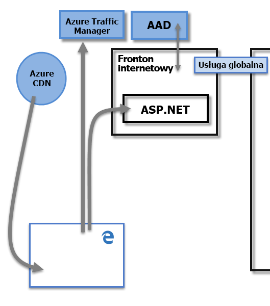
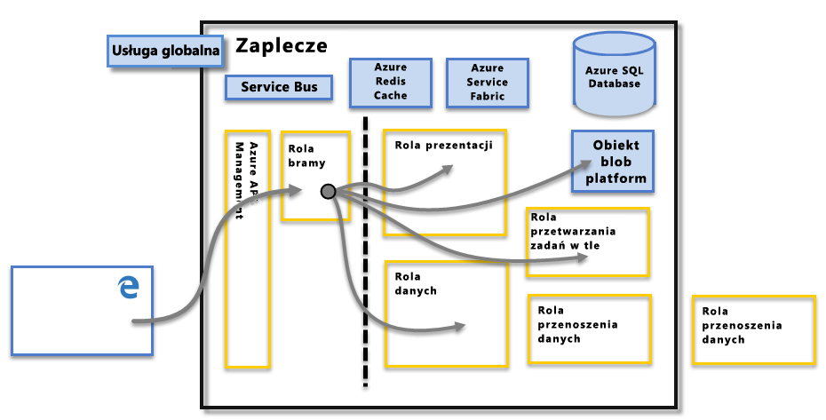

# Zabezpieczenia usługi Power BI
Aby uzyskać szczegółowy opis zabezpieczeń usługi Power BI, [pobierz oficjalny dokument na temat zabezpieczeń usługi Power BI](http://go.microsoft.com/fwlink/?LinkId=829185):

Usługa Power BI jest oparta na platformie **Azure** — infrastrukturze i platformie obliczeniowej w chmurze firmy Microsoft. Architektura usługi Power BI opiera się na dwóch klastrach — klastrze **frontonu internetowego** i klastrze **zaplecza**. Klaster frontonu internetowego zarządza początkowym połączeniem i uwierzytelnianiem w usłudze Power BI, a po uwierzytelnieniu wszystkie kolejne interakcje użytkownika są obsługiwane przez zaplecze. Usługa Power BI używa usługi Azure Active Directory (AAD) do przechowywania tożsamości użytkowników i zarządzania nimi oraz zarządza magazynem danych i metadanych przy użyciu, odpowiednio, usługi Azure BLOB i usługi Azure SQL Database.

## Architektura usługi Power BI
Każde wdrożenie usługi Power BI składa się z dwóch klastrów — klastra **frontonu internetowego** i klastra **zaplecza**.

Klaster **frontonu internetowego** zarządza procesem początkowego połączenia i uwierzytelniania dla usługi Power BI, używając usługi AAD do uwierzytelniania klientów i zapewnienia tokenów dla kolejnych połączeń klienta z usługą Power BI. Usługa Power BI korzysta również z **usługi Azure Traffic Manager** (ATM) w celu kierowania ruchu użytkowników do najbliższego centrum danych, określonego przez rekord DNS klienta próbującego nawiązać połączenie, na potrzeby procesu uwierzytelniania oraz w celu pobrania zawartości statycznej i plików. Usługa Power BI korzysta z usługi **Content Delivery Network (CDN)**, aby skutecznie dostarczać niezbędną zawartość statyczną i pliki do użytkowników na podstawie geograficznych ustawień regionalnych.

Klaster **zaplecza** określa sposób interakcji uwierzytelnionych klientów z usługą Power BI. Klaster **zaplecza** zarządza wizualizacjami, pulpitami nawigacyjnymi użytkownika, zestawami danych, raportami, magazynem danych, połączeniami danych, odświeżaniem danych i innymi aspektami interakcji z usługą Power BI. **Rola bramy** działa jako brama między żądaniami użytkownika a usługą Power BI. Użytkownicy nie wchodzą w bezpośrednie interakcje z żadnymi rolami innymi niż **rola bramy**. Usługa **Azure API Management** będzie ostatecznie obsługiwać **rolę bramy**.

> [!IMPORTANT]
> Należy koniecznie pamiętać, że tylko role **usługi Azure API Management** (APIM) i **bramy** (GW) są dostępne za pośrednictwem publicznego Internetu. Zapewniają one funkcje uwierzytelniania, autoryzacji, ochrony DDoS, ograniczania, równoważenia obciążenia, routingu i inne możliwości.
> 
> 

## Zabezpieczenia magazynu danych
Usługa Power BI korzysta z dwóch głównych repozytoriów na potrzeby przechowywania danych i zarządzania nimi: dane przekazywane przez użytkowników są zwykle wysyłane do magazynu **usługi Azure BLOB**, a wszystkie metadane, jak również artefakty dla samego systemu, są przechowywane w usłudze **Azure SQL Database**.

Linia kropkowana na obrazie klastra **zaplecza** powyżej pokazuje granicę między jedynymi dwoma składnikami dostępnymi dla użytkowników (po lewej stronie linii kropkowanej) i rolami dostępnymi tylko dla systemu. Gdy uwierzytelniony użytkownik nawiązuje połączenie z usługą Power BI, połączenie i wszelkie żądania klienta są akceptowane i zarządzane przez **rolę bramy** (ostatecznie mają być obsługiwane przez usługę **Azure API Management**), która następnie w imieniu użytkownika wchodzi w interakcję z pozostałą częścią usługi Power BI. Na przykład kiedy klient próbuje wyświetlić pulpit nawigacyjny, **rola bramy** akceptuje to żądanie, a następnie oddzielnie wysyła żądanie do **roli prezentacji**, aby pobrać dane potrzebne przeglądarce do renderowania pulpitu nawigacyjnego.

## Uwierzytelnianie użytkownika
Usługa Power BI używa usługi Azure Active Directory ([AAD](http://azure.microsoft.com/services/active-directory/)) do uwierzytelnienia użytkowników, którzy logują się do usługi Power BI, a następnie korzysta z poświadczeń logowania usługi Power BI zawsze, gdy użytkownicy próbują uzyskać dostęp do zasobów, które wymagają uwierzytelniania. Użytkownik loguje się do usługi Power BI przy użyciu adresu e-mail użytego do założenia jego konta e-mail. Usługa Power BI używa tego adresu e-mail logowania jako *obowiązującej nazwy użytkownika*, która jest przekazywana do zasobów przy każdej próbie połączenia się z danymi. *Obowiązująca nazwa użytkownika* jest następnie mapowana na *główną nazwę użytkownika* ([UPN](https://msdn.microsoft.com/library/windows/desktop/aa380525\(v=vs.85\).aspx) i rozpoznawana jako skojarzone konto domeny systemu Windows, względem którego zastosowano uwierzytelnianie.

W przypadku organizacji, które używały służbowych adresów e-mail jako danych logowania w usłudze Power BI (na przykład <em>david@contoso.com</em>), mapowanie *obowiązującej nazwy użytkownika* na nazwę UPN jest proste. W przypadku organizacji, które nie używały służbowych adresów e-mail do logowania w usłudze Power BI (na przykład <em>david@contoso.onmicrosoft.com</em>), mapowanie poświadczeń między usługą AAD i kontami lokalnymi będzie wymagało [synchronizacji katalogów](https://technet.microsoft.com/library/jj573653.aspx), aby wszystko działało poprawnie.

Zabezpieczenia platformy dla usługi Power BI obejmują również zabezpieczenia środowiska wielodostępnego, zabezpieczenia sieci oraz możliwość stosowania dodatkowych środków bezpieczeństwa opartych na usłudze AAD.

## Zabezpieczenia danych i usługi
Aby uzyskać więcej informacji, odwiedź stronę [Centrum zaufania firmy Microsoft](https://www.microsoft.com/trustcenter).

Zgodnie z opisem we wcześniejszej części tego artykułu, dane logowania użytkownika usługi Power BI są używane przez serwery lokalne usługi Active Directory do mapowania nazwy UPN dla poświadczeń. **Należy jednak pamiętać**, że użytkownicy są odpowiedzialni za dane, które udostępniają: jeśli użytkownik łączy się ze źródłami danych przy użyciu swoich poświadczeń, a następnie udostępnia raport (lub pulpit nawigacyjny, zestaw danych) na podstawie tych danych, użytkownicy, którym pulpit nawigacyjny jest udostępniany, nie są uwierzytelniani względem oryginalnego źródła danych i zostanie im przyznany dostęp do raportu.

Wyjątkiem są połączenia z usługami **SQL Server Analysis Services** przy użyciu **lokalnej bramy danych**. W tym przypadku pulpity nawigacyjne są buforowane w usłudze Power BI, ale próba dostępu do podstawowych raportów lub zestawów danych zainicjuje uwierzytelnianie użytkownika próbującego uzyskać dostęp do raportu (lub zestawu danych) i dostęp zostanie udzielony tylko w przypadku, gdy ten użytkownik ma wystarczające poświadczenia, aby uzyskać dostęp do danych. Aby uzyskać więcej informacji, zobacz [szczegółowe omówienie lokalnej brany danych](service-gateway-onprem-indepth.md).

## Wymuszanie użycia wersji protokołu TLS

Administratorzy sieci i IT mogą wymusić wymaganie dotyczące używania bieżącego protokołu TLS (Transport Layer Security) do dowolnej bezpiecznej komunikacji w sieci. System Windows zapewnia obsługę wersji protokołu TLS przez dostawcę pakietu Microsoft Schannel, jak [opisano w artykule dotyczącym dostawcy usług udostępnionych TLS Schannel](https://docs.microsoft.com/windows/desktop/SecAuthN/protocols-in-tls-ssl--schannel-ssp-).

To wymuszenie można przeprowadzić przez administracyjne ustawienie kluczy rejestru. Wymuszenie opisano w artykule [Managing SSL Protocols in AD FS](https://docs.microsoft.com/windows-server/identity/ad-fs/operations/manage-ssl-protocols-in-ad-fs) (Zarządzanie protokołami SSL w usługach AD FS). 

Program **Power BI Desktop** obsługuje ustawienia klucza rejestru opisane w tych artykułach oraz tylko utworzone połączenia korzystające z wersji protokołu TLS dozwolonego w oparciu o te ustawienia rejestru, jeśli występują.

Aby uzyskać więcej informacji dotyczących ustawienia tych kluczy rejestru, zobacz artykuł [TLS Registry Settings](https://docs.microsoft.com/windows-server/security/tls/tls-registry-settings) (Ustawienia rejestru protokołu TLS).

