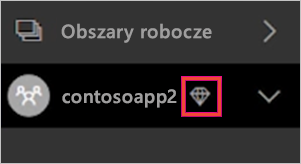
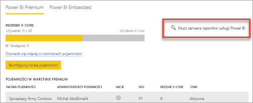

# Zarządzanie pojemnościami w usługach Power BI Premium i Power BI Embedded

Dowiedz się, jak zarządzać pojemnościami usług Power BI Premium i Power BI Embedded, zapewniając zasoby dedykowane dla swojej zawartości.

## Co to jest pojemność?

*Pojemność* to kluczowy element ofert Power BI Premium i Power BI Embedded. Jest to zestaw zasobów zarezerwowanych do użytku wyłącznie przez Twoją organizację. Dzięki dedykowanej pojemności można publikować pulpity nawigacyjne, raporty i zestawy danych dla użytkowników w całej organizacji bez konieczności kupowania indywidualnych licencji dla tych użytkowników. Oferuje ona również niezawodną, spójną i wydajną obsługę zawartości hostowanej w danej pojemności. Aby uzyskać więcej informacji, zobacz [Co to jest usługa Power BI Premium?](service-premium.md).

### Administratorzy pojemności

Gdy jest się przypisanym do pojemności jako *administrator pojemności*, ma się pełną kontrolę nad daną pojemnością i jej funkcjami administracyjnymi. Korzystając z portalu administratora usługi Power BI, można dodać kolejnych administratorów pojemności lub nadać użytkownikom uprawnienia do przypisywania pojemności. Do pojemności można zbiorczo przypisywać obszary robocze. Można też wyświetlać metryki dotyczące użycia danej pojemności.

> [!NOTE]
> W przypadku usługi Power BI Embedded administratorzy pojemności są definiowani w witrynie Microsoft Azure Portal.

Każda pojemność ma własnych administratorów. Administrator przypisany dla jednej pojemności nie uzyskuje dostępu do wszystkich pojemności w danej organizacji. Administratorzy pojemności domyślnie nie mają dostępu do wszystkich obszarów administratora usługi Power BI, takich jak metryki użycia, dzienniki inspekcji i ustawienia dzierżawy. Administratorzy pojemności nie mają też uprawnień do konfigurowania nowych pojemności ani zmieniania jednostki SKU istniejących pojemności. Tylko administratorzy globalni usługi Office 365 oraz administratorzy usługi Power BI mają dostęp do tych elementów.

Wszyscy administratorzy globalni usługi Office 365 i administratorzy usługi Power BI są też automatycznie administratorami pojemności usługi Power BI Premium i pojemności usługi Power BI Embedded.

## Kupowana pojemność

Aby optymalnie wykorzystać dedykowaną pojemność, należy wykupić dostęp do usługi Power BI Premium w centrum administracyjnym usługi Office 365 albo utworzyć zasób usługi Power BI Embedded w witrynie Microsoft Azure Portal. Aby uzyskać więcej informacji, zobacz następujące artykuły:

* **Power BI Premium:** [jak kupić usługę Power BI Premium](service-admin-premium-purchase.md)

* **Power BI Embedded:** [Tworzenie pojemności usługi Power BI Embedded w witrynie Azure Portal](https://docs.microsoft.com/azure/power-bi-embedded/create-capacity)

Po kupieniu jednostek SKU usługi Power BI Premium lub Embedded Twoja dzierżawa otrzyma odpowiednią liczbę rdzeni wirtualnych do użytku w uruchomionych pojemnościach. Na przykład zakup jednostki Power BI Premium P3 zapewnia dzierżawie 32 rdzenie wirtualne. Aby uzyskać więcej informacji na temat jednostek SKU, zobacz [węzły pojemności Premium](service-premium.md#premium-capacity-nodes).

## Widok pojemności Premium z perspektywy użytkowników

W większości przypadków użytkownicy nie muszą wiedzieć, że są w pojemności Premium. Wystarczy, że ich pulpity nawigacyjne i raporty działają. Wizualną wskazówką jest ikona rombu obok obszarów roboczych w pojemności Premium.

## Monitorowanie użycia pojemności

Usługa Power BI oferuje aplikację do monitorowania użycia pojemności. Aby uzyskać więcej informacji, zobacz [Monitorowanie pojemności usługi Power BI Premium w organizacji](service-admin-premium-monitor-capacity.md).

## Zarządzanie pojemnością

Po zakupie węzłów pojemności w usłudze Office 365 należy skonfigurować pojemność w portalu administracyjnym usługi Power BI. Pojemnościami usługi Power BI Premium zarządza się w sekcji **Ustawienia pojemności** portalu.

Aby zarządzać pojemnością, należy wybrać jej nazwę. Spowoduje to przejście do ekranu zarządzania pojemnością.

Jeśli do pojemności nie przypisano żadnych obszarów roboczych, zostanie wyświetlony komunikat dotyczący [przypisania obszarów roboczych do pojemności](#assign-a-workspace-to-a-capacity).

### Konfigurowanie nowej pojemności (Power BI Premium)

W portalu administracyjnym widoczna jest liczba już użytych i nadal dostępnych *rdzeni wirtualnych*. Całkowita liczba rdzeni wirtualnych zależy od liczby kupionych jednostek SKU Premium. Na przykład zakup jednostek P3 i P2 daje 48 dostępnych rdzeni — 32 dzięki jednostce P3 i 16 dzięki jednostce P2.

Jeśli masz dostępne rdzenie wirtualne, możesz skonfigurować nową pojemność, wykonując następujące kroki.

1. Wybierz pozycję **Skonfiguruj nową pojemność**.

1. Nadaj nazwę pojemności.

1. Zdefiniuj administratora tej pojemności.

1. Wybierz rozmiar pojemności. Dostępne opcje zależą od liczby posiadanych rdzeni wirtualnych. Nie można wybrać opcji przekraczającej liczbę dostępnych rdzeni.

    

1. Wybierz pozycję **Skonfiguruj**.

    

Administratorzy pojemności, a także administratorzy usługi Power BI i administratorzy globalni usługi Office 365 zobaczą nową pojemność na liście w portalu administracyjnym.

### Ustawienia pojemności

1. Na ekranie zarządzania pojemnością Premium w sekcji **Akcje** wybierz **ikonę koła zębatego**, aby przejrzeć i zaktualizować ustawienia. 

    

1. W ten sposób zobaczysz, kim są administratorzy usługi, jaki jest rozmiar/jednostka SKU pojemności i w jakim regionie znajduje się pojemność.

    

1. Możesz również zmienić nazwę pojemności lub ją usunąć.

    

> [!NOTE]
> Zarządzanie ustawieniami pojemności usługi Power BI Embedded odbywa się z poziomu witryny Microsoft Azure Portal.

### Zmiana rozmiaru pojemności

Administratorzy usługi Power BI i administratorzy globalni usługi Office 365 mogą zmienić pojemność usługi Power BI Premium. Administrator pojemności, który nie jest administratorem usługi Power BI ani administratorem globalnym usługi Office 365, nie ma takiej możliwości.

1. Wybierz pozycję **Zmień rozmiar pojemności**.

    

1. Na ekranie **Zmień rozmiar pojemności** zmień pojemność na większą lub mniejszą zgodnie z potrzebami.

    

    Administratorzy mogą tworzyć i usuwać węzły, a także zmieniać ich rozmiar, o ile dysponują odpowiednią liczbą rdzeni wirtualnych.

    Rozmiaru jednostek SKU P nie można obniżyć do poziomu jednostek SKU EM. Możesz zatrzymać wskaźnik myszy nad dowolną wyłączoną opcją, aby wyświetlić wyjaśnienie.

### Zarządzanie uprawnieniami użytkowników

Możesz przypisać dodatkowych administratorów pojemności i przypisać użytkowników mających uprawnienie do *przypisywania pojemności*. Użytkownicy z uprawnieniem do przypisywania mogą przypisać obszar roboczy aplikacji do pojemności, o ile są administratorem danego obszaru roboczego. Mogą także przypisać osobisty *Mój obszar roboczy* do pojemności. Użytkownicy z uprawnieniami do przypisywania nie mają dostępu do portalu administracyjnego.

> [!NOTE]
> W przypadku usługi Power BI Embedded administratorzy pojemności są definiowani w witrynie Microsoft Azure Portal.

W obszarze **Uprawnienia użytkownika** rozwiń pozycję **Użytkownicy z uprawnieniami do przypisywania**, a następnie dodaj odpowiednich użytkowników lub grupy.

## Przypisywanie obszaru roboczego do pojemności

Obszar roboczy można przypisać do pojemności na dwa sposoby: w portalu administracyjnym i w obszarze roboczym aplikacji.

### Przypisywanie w portalu administracyjnym

Administratorzy pojemności, a także administratorzy usługi Power BI i administratorzy globalni usługi Office 365 mogą przypisywać zbiorczo obszary robocze w sekcji zarządzania pojemnością Premium w portalu administracyjnym. Podczas zarządzania pojemnością obszary robocze można przypisywać za pomocą sekcji **Obszary robocze**.

1. Wybierz pozycję **Przypisz obszary robocze**. Ta opcja jest dostępna w kilku miejscach.

1. Wybierz opcję dla pozycji **Zastosuj do**.

    

   | Wybieranie | Opis |
   | --- | --- |
   | **Obszary robocze według użytkowników** | Przypisanie obszarów roboczych według użytkownika lub grupy powoduje, że wszystkie obszary robocze należące do tych użytkowników zostają przypisane do pojemności Premium (z uwzględnieniem osobistego obszaru roboczego użytkowników). Użytkownicy ci automatycznie uzyskują uprawnienia do przypisywania obszarów roboczych. Obejmuje to obszary robocze, które są już przypisane do innej pojemności. |
   | **Określone obszary robocze** | Wprowadź nazwę określonego obszaru roboczego, aby go przypisać do wybranej pojemności. |
   | **Obszary robocze całej organizacji** | Przypisanie obszarów roboczych całej organizacji do pojemności Premium powoduje przypisanie wszystkich obszarów roboczych aplikacji i obszarów typu Mój obszar roboczy w organizacji do danej pojemności Premium. Ponadto wszyscy użytkownicy (obecni i przyszli) będą posiadać uprawnienia do zmieniania przypisania poszczególnych obszarów, aby były przypisane do tej pojemności. |
   | | |

1. Wybierz pozycję **Zastosuj**.

### Przypisywanie w ustawieniach obszaru roboczego aplikacji

Obszar roboczy aplikacji można także przypisać do pojemności Premium, korzystając z ustawień tego obszaru roboczego. Aby przenieść obszar roboczy do pojemności, musisz mieć uprawnienia administratora do tego obszaru roboczego, a także uprawnienia do przypisywania pojemności względem danej pojemności. Pamiętaj, że administrator obszaru roboczego może w dowolnym momencie usunąć obszar roboczy z pojemności Premium.

1. Edytuj obszar roboczy aplikacji, wybierając wielokropek **(. . .)**, a następnie wybierając pozycję **Edytuj obszar roboczy**.

    

1. W obszarze **Edytowanie adresu roboczego** rozwiń pozycję **Zaawansowane**.

1. Wybierz pojemność, do której chcesz przypisać ten obszar roboczy aplikacji.

    

1. Wybierz pozycję **Zapisz**.

Po zapisaniu obszar roboczy i cała jego zawartość zostaną przeniesione do pojemności Premium w sposób niezauważalny dla użytkowników końcowych.

## Klucz produktu serwera raportów usługi Power BI

Na karcie **Ustawienia pojemności** portalu administracyjnego usługi Power BI będziesz mieć dostęp do klucza produktu serwera raportów usługi Power BI. Jest on dostępny tylko w przypadku administratorów globalnych lub użytkowników z przypisaną rolą administratora usługi Power BI oraz zakupu jednostki SKU usługi Power BI Premium.

Wybranie pozycji **Klucz serwera raportów usługi Power BI** spowoduje wyświetlenie okna dialogowego z Twoim kluczem produktu. Możesz skopiować go i użyć podczas instalacji.

Aby uzyskać więcej informacji, zobacz [Instalowanie serwera raportów usługi Power BI](report-server/install-report-server.md).

## Następne kroki

Udostępniaj opublikowane aplikacje użytkownikom. Aby uzyskać więcej informacji, zobacz [Tworzenie i rozpowszechnianie aplikacji w usłudze Power BI](service-create-distribute-apps.md).

Masz więcej pytań? [Zadaj pytanie społeczności usługi Power BI](http://community.powerbi.com/)
