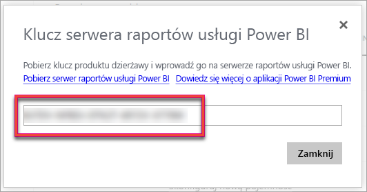

# Zarządzanie pojemnościami w usługach Power BI Premium i Power BI Embedded
Dowiedz się, jak zarządzać pojemnościami usług Power BI Premium i Power BI Embedded, zapewniając zasoby dedykowane dla swojej zawartości.

Pojemność to kluczowy element oferty dostępnej w postaci usług Power BI Premium i Power BI Embedded.

## Co to jest pojemność?
Pojemność to zestaw zasobów zarezerwowanych wyłącznie do Twojego użytku. Dzięki pojemności można publikować pulpity nawigacyjne, raporty i zestawy danych dla użytkowników w całej organizacji bez konieczności kupowania licencji dla tych osób. Gwarantuje ona również niezawodną, spójną i wydajną obsługę zawartości hostowanej w danej pojemności.

Pojemność jest niewidoczna dla Twoich użytkowników końcowych. Korzystają oni z usługi Power BI lub aplikacji w zwykły sposób. Nie muszą wiedzieć, że część zawartości (lub całość) znajduje się w Twojej wydajności dedykowanej. Z perspektywy użytkowników wszystko działa dokładnie tak jak wcześniej.

[!INCLUDE [powerbi-premium-illustration](./includes/powerbi-premium-illustration.md)]

Aby uzyskać więcej informacji, zobacz [Co to jest usługa Power BI Premium?](service-premium.md).

### Administratorzy pojemności
> [!NOTE]
> W przypadku pojemności usługi Power BI Embedded administratorzy pojemności są definiowani z poziomu portalu Microsoft Azure.

Gdy użytkownik jest przypisany do pojemności jako administrator, ma pełną kontrolę nad daną pojemnością i jej funkcjami administracyjnymi. Korzystając z portalu administratora usługi Power BI, można dodać kolejnych administratorów pojemności (tylko w przypadku usługi Power BI Premium) lub nadać użytkownikom uprawnienia do przypisywania pojemności. Do pojemności można zbiorczo przypisywać obszary robocze. Można też wyświetlać metryki dotyczące użycia danej pojemności.

Każda pojemność ma własnych administratorów. Administrator zdefiniowany dla jednej pojemności nie uzyskuje dostępu do wszystkich pojemności w danej organizacji. Administratorzy pojemności domyślnie nie mają dostępu do wszystkich obszarów administratora usługi Power BI, takich jak metryki użycia, dzienniki inspekcji i ustawienia dzierżawy. Administratorzy pojemności nie mają też uprawnień do konfigurowania nowych pojemności ani zmieniania jednostki SKU istniejących pojemności. Tylko administratorzy globalni lub administratorzy usługi Power BI mają dostęp do tych elementów.

Wszyscy administratorzy globalni usługi Office 365 i administratorzy usługi Power BI są też automatycznie administratorami pojemności usługi Power BI Premium i pojemności usługi Power BI Embedded.

## Kupowana pojemność
Aby optymalnie wykorzystać dedykowaną pojemność, należy kupić subskrypcję usługi Power BI Premium z poziomu centrum administracyjnego usługi Office 365 lub utworzyć zasób usługi Power BI Embedded z poziomu portalu Microsoft Azure. Aby uzyskać więcej informacji, zobacz następujące artykuły:

* **Power BI Premium:** [jak kupić usługę Power BI Premium](service-admin-premium-purchase.md)
* **Power BI Embedded:** [Tworzenie pojemności usługi Power BI Embedded w witrynie Azure Portal](https://docs.microsoft.com/en-us/azure/power-bi-embedded/create-capacity)

Po kupieniu jednostek SKU usługi Power BI Premium Twoja dzierżawa otrzyma odpowiednią liczbę rdzeni wirtualnych do użytku w uruchomionych pojemnościach. Na przykład zakup jednostki Power BI Premium P3 zapewnia dzierżawie 32 rdzenie wirtualne.

> [!NOTE]
> Po zakończeniu subskrypcji będziesz mieć pełny dostęp przez 30 dni, ale następnie zawartość zostanie przywrócona do udostępnionej pojemności. Modele większe niż 1 GB nie będą obsługiwane w przypadku zwykłej licencji udostępnionej.

## Zarządzanie pojemnością
Po zakupie węzłów pojemności w usłudze Office 365 należy skonfigurować nową pojemność. Należy to zrobić za pomocą [portalu administracyjnego usługi Power BI](service-admin-portal.md). W portalu administracyjnym znajduje się sekcja o nazwie **Ustawienia pojemności**. W tym miejscu można zarządzać pojemnościami usługi Power BI Premium dla swojej organizacji.

Po wybraniu pozycji **Ustawienia pojemności** następuje przejście do ekranu zarządzania pojemnością (domyślnie dla usługi Power BI Premium).

### Konfigurowanie nowej pojemności (Power BI Premium)
Liczba rdzeni wirtualnych odzwierciedla liczbę używaną i liczbę dostępną na użytej tworzenia pojemności. Liczba rdzeni wirtualnych dostępnych dla danej organizacji zależy od kupionych jednostek SKU Premium. Na przykład zakup jednostek P3 i P2 zapewniły 48 dostępne rdzenie — 32 dzięki jednostce P3 i 16 dzięki jednostce P2.

Jeśli masz dostępne rdzenie wirtualne, możesz skonfigurować nową pojemność, wykonując poniższe czynności.

1. Wybierz pozycję **Skonfiguruj nową pojemność**.
2. Nadaj nowej pojemności **nazwę**.
3. Zdefiniuj administratora pojemności dla tej pojemności.

    Administrator pojemności nie musi być administratorem usługi Power BI ani administratorem globalnym usługi Office 365. Aby uzyskać więcej informacji, zobacz [Administratorzy pojemności usługi Power BI Premium](#capacity-admins).
4. Wybierz rozmiar pojemności. Dostępne opcje zależą od liczby posiadanych rdzeni wirtualnych. Nie można wybrać opcji przekraczającej liczbę dostępnych rdzeni.

    
5. Wybierz pozycję **Skonfiguruj**.

    

Administratorzy pojemności, a także administratorzy usługi Power BI i administratorzy globalni usługi Office 365 zobaczą nową pojemność na liście w portalu administracyjnym.

### Ustawienia pojemności
Na ekranie zarządzania pojemnością Premium możesz wybrać **ikonę koła zębatego (ustawienia)** znajdującą się w obszarze akcji. Następnie możesz zmienić nazwę pojemności lub usunąć pojemność. Można tam także sprawdzić, kim są administratorzy usługi, jaki jest rozmiar/jednostka SKU pojemności i w jakim jakie regionie pojemność się znajduje.

> [!NOTE]
> Zarządzanie ustawieniami pojemności usługi Power BI Embedded odbywa się z poziomu portalu Microsoft Azure.

### Zmienianie rozmiaru pojemności (Power BI Premium)
Administratorzy usługi Power BI i administratorzy globalni usługi Office 365 mogą zmienić rozmiar pojemności usługi Power BI Premium, wybierając pozycję **Zmień rozmiar pojemności**. Administrator pojemności, który nie jest administratorem usługi Power BI ani administratorem globalnym usługi Office 365, nie ma takiej możliwości.

Ekran **Zmień rozmiar pojemności** umożliwia zwiększenie lub zmniejszenie rozmiaru pojemności, jeśli są dostępne odpowiednie zasoby. Administratorzy mogą tworzyć i usuwać węzły, a także zmieniać ich rozmiar, o ile dysponują odpowiednią liczbą rdzeni wirtualnych.

Nie jest możliwa zmiana jednostek SKU P na jednostki SKU EM. Po umieszczeniu kursora na wyłączonych opcjach można uzyskać odpowiednie wyjaśnienie.

### Przypisywanie pojemności
Aby zarządzać pojemnością, należy wybrać jej nazwę. Spowoduje to przejście do ekranu zarządzania pojemnością.

Jeśli do pojemności nie przypisano żadnych obszarów roboczych, zostanie wyświetlony komunikat umożliwiający użycie pozycji **Przypisz obszary robocze**.

#### Uprawnienia użytkowników
Pojemnościom usługi Power BI Premium mogą zostać przypisani dodatkowi **Administratorzy pojemności**. Można również wyznaczyć użytkowników, którzy będą mieli **uprawnienia do przypisywania pojemności**. Użytkownicy posiadający uprawnienia do przypisywania mogą przypisać obszar roboczy aplikacji do pojemności, o ile są administratorem danego obszaru roboczego. Mogą także przypisać osobisty *Mój obszar roboczy* do pojemności. Użytkownicy z uprawnieniami do przypisywania nie mają dostępu do portalu administracyjnego.

> [!NOTE]
> W przypadku pojemności usługi Power BI Embedded administratorzy pojemności są przypisywani z poziomu portalu Microsoft Azure.
>
>

## Przypisywanie obszaru roboczego do pojemności
Istnieje kilka sposobów przypisywania obszaru roboczego do pojemności.

### Zarządzanie pojemnością w portalu administracyjnym
Administratorzy pojemności, a także administratorzy usługi Power BI i administratorzy globalni usługi Office 365 mogą przypisywać zbiorczo obszary robocze w sekcji zarządzania pojemnością Premium w portalu administracyjnym. Podczas zarządzania pojemnością obszary robocze można przypisywać za pomocą sekcji **Obszary robocze**.

1. Wybierz pozycję **Przypisz obszary robocze**. Ta pozycja jest dostępna w wielu miejscach i w każdym ma to samo działanie.
2. Wybierz pozycję **Obszary robocze całej organizacji** lub **Określone obszary robocze według użytkownika**.

   | Pozycja | Opis |
   | --- | --- |
   | **Obszary robocze całej organizacji** |Przypisanie obszarów roboczych całej organizacji do pojemności Premium spowoduje przypisanie wszystkie obszarów roboczych aplikacji i obszarów typu Mój obszar roboczy w organizacji do danej pojemności Premium. Ponadto wszyscy użytkownicy (obecni i przyszli) będą posiadać uprawnienia do zmieniania przypisania poszczególnych obszarów, aby były przypisane do tej pojemności. |
   | **Określone obszary robocze według użytkownika** |Przypisanie obszarów roboczych według użytkownika lub grupy powoduje, że wszystkie obszary robocze należące do tych użytkowników zostają przypisane do pojemności Premium (z uwzględnieniem osobistego obszaru roboczego użytkowników). Użytkownicy ci automatycznie uzyskują uprawnienia do przypisywania obszarów roboczych. Obejmuje to obszary robocze, które są już przypisane do innej pojemności. |
3. Wybierz pozycję **Zastosuj**.

Ta opcja nie umożliwia przypisania określonych obszarów roboczych do pojemności.

### Ustawienia obszaru roboczego aplikacji
Obszar roboczy aplikacji można także przypisać do pojemności Premium, korzystając z ustawień tego obszaru roboczego. Aby przypisać obszar roboczy aplikacji do pojemności Premium, wykonaj poniższe czynności.

Aby przenieść obszar roboczy do pojemności, musisz mieć uprawnienia administratora do tego obszaru roboczego, a także uprawnienia do przypisywania pojemności względem danej pojemności. Administrator obszaru roboczego może w dowolnym momencie usunąć obszar roboczy z pojemności Premium.

1. Edytuj obszar roboczy aplikacji, wybierając **wielokropek (...)** i wybierając pozycję **Edytuj obszar roboczy**.

    
2. W obszarze **Edytowanie adresu roboczego** rozwiń węzeł **Zaawansowane**.
3. Jeśli posiadasz uprawnienia do przypisywania dowolnej pojemności, masz dostęp do opcji **Premium** dla tego obszaru roboczego.
4. Wybierz pojemność, do której chcesz przypisać ten obszar roboczy aplikacji.

    
5. Wybierz pozycję **Zapisz**.

Po zapisaniu obszar roboczy i cała jego zawartość zostaną przeniesione do pojemności Premium w sposób niezauważalny dla użytkowników końcowych.

## Monitorowanie użycia pojemności
W przypadku każdej pojemności dostępne są pomiary użycia dla procesora CPU, pamięci, przeładowywania pamięci i zapytania bezpośredniego. Zalecamy monitorowanie tych metryk, aby użytkownicy mieli zapewnioną wysoką wydajność w Twojej pojemności:

> [!NOTE]
> Monitorowanie użycia pojemności usługi Power BI Embedded odbywa się z poziomu portalu Azure.

| Metryka | Opis |
| --- | --- |
| Procesor CPU |Ile razy wykorzystanie procesora CPU przekroczyło 80%. |
| Przeładowywanie pamięci |Reprezentuje wykorzystanie pamięci rdzeni wewnętrznej bazy danych. Ta metryka w szczególności obrazuje, ile razy zestawy danych zostały usunięte z pamięci z powodu braku pamięci wynikającego z używania wielu zestawów danych. |
| Memory Usage (Użycie pamięci) |Średnie użycie pamięci przedstawiane w gigabajtach (GB). |
| Zapytania bezpośrednie | Ile razy liczba zapytań bezpośrednich i połączeń na żywo przekroczyła 80% limitu.     * Łączna liczba zapytań bezpośrednich i zapytań w ramach połączeń na żywo występujących w ciągu sekundy jest ograniczona.  * Ograniczenia są następujące: 30/s dla jednostki P1, 60/s dla jednostki P2 i 120/s dla jednostki P3.   * Liczba zapytań bezpośrednich i zapytań w ramach połączeń na żywo wlicza się do powyższych limitów. Na przykład, jeśli w ciągu sekundy wystąpiło 15 połączeń bezpośrednich i 15 połączeń na żywo, limit został osiągnięty.  * Ma to jednakowe zastosowanie się do połączeń lokalnych i połączeń w chmurze. |

Metryki odzwierciedlają wykorzystanie w ostatnim tygodniu.  Jeśli chcesz wyświetlić bardziej szczegółowy widok metryki, możesz to zrobić, klikając dowolny kafelek podsumowania.  Spowoduje to przejście do szczegółowych wykresów dla każdej metryki Twojej pojemności Premium.  Wykresy te są podsumowywane co godzinę dla ostatniego tygodnia i mogą pomóc określić, kiedy w Twojej pojemności Premium mogły wystąpić określone zdarzenia dotyczące wydajności.  

Dane źródłowe dla dowolnej metryki można wyeksportować do pliku csv.  Dzięki temu uzyskasz szczegółowe informacje w przedziałach trzyminutowych dla poszczególnych dni w ostatnim tygodniu.

## Widok pojemności Premium z perspektywy użytkowników
W większości przypadków użytkownicy nie muszą wiedzieć, że są w pojemności Premium. Wystarczy, że ich pulpity nawigacyjne i raporty sprawnie działają. Wizualną wskazówką jest ikona diamentu umieszczona obok obszarów roboczych w pojemności Premium.

## Klucz produktu serwera raportów usługi Power BI
Na karcie **Ustawienia pojemności** portalu administracyjnego usługi Power BI portalu administracyjnego będziesz mieć dostęp do klucza produktu serwera raportów usługi Power BI. Jest on dostępny tylko w przypadku administratorów globalnych lub użytkowników z przypisaną rolą administratora usługi Power BI oraz zakupu jednostki SKU usługi Power BI Premium.

Wybranie pozycji **Klucz serwera raportów usługi Power BI** spowoduje wyświetlenie okna dialogowego z Twoim kluczem produktu. Możesz skopiować go i użyć podczas instalacji.

Aby uzyskać więcej informacji, zobacz [Instalowanie serwera raportów usługi Power BI](report-server/install-report-server.md).

## Następne kroki
Udostępniaj opublikowane aplikacje użytkownikom. Aby uzyskać więcej informacji, zobacz [Tworzenie i rozpowszechnianie aplikacji w usłudze Power BI](service-create-distribute-apps.md).

Masz więcej pytań? [Zadaj pytanie społeczności usługi Power BI](http://community.powerbi.com/)
