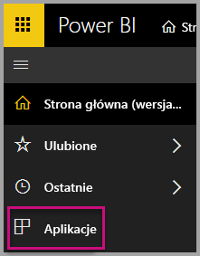
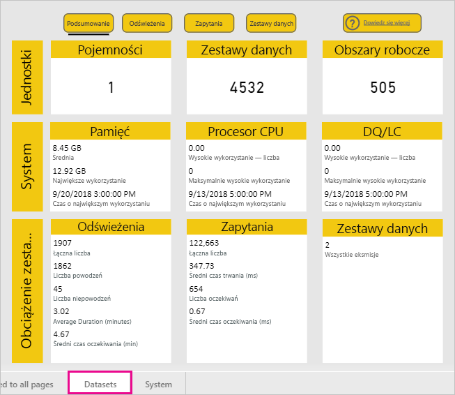
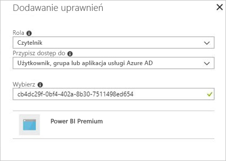
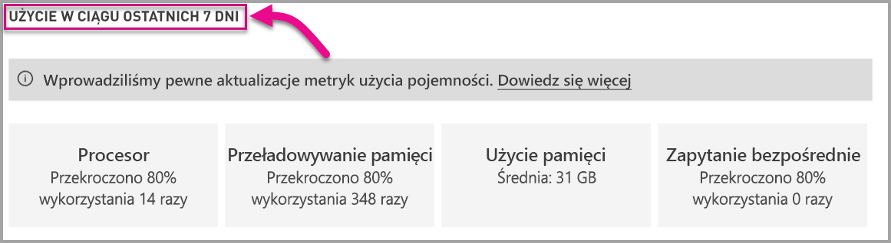

# Monitorowanie pojemności w usługach Power BI Premium i Power BI Embedded

Ten artykuł zawiera omówienie monitorowania metryk pojemności usługi Power BI Premium. Monitorowanie użycia pojemności pozwala na świadomy wybór podejścia do zarządzania pojemnościami.

Pojemność można monitorować za pomocą aplikacji metryk pojemności lub portalu administracyjnego w usłudze Power BI Premium. Zalecamy użycie aplikacji, ponieważ oferuje ona o wiele więcej szczegółów, ale w tym artykule opisano obie opcje.

<iframe width="560" height="315" src="https://www.youtube.com/embed/UgsjMbhi_Bk?rel=0&amp;showinfo=0" frameborder="0" allowfullscreen></iframe>

## Instalowanie aplikacji metryk pojemności usługi Premium

Można przejść bezpośrednio do [aplikacji metryk pojemności usługi Premium](https://app.powerbi.com/groups/me/getapps/services/capacitymetrics) lub zainstalować ją tak jak inne aplikacje w usłudze Power BI.

1. W usłudze Power BI kliknij pozycję **Aplikacje**.

    

2. Po prawej stronie kliknij pozycję **Pobierz aplikacje**.

3. W kategorii **Aplikacje** wyszukaj **aplikację metryk pojemności usługi Power BI Premium**.

4. Subskrybuj, aby zainstalować aplikację.

Teraz, po zainstalowaniu aplikacji, będziesz widzieć metryki dotyczące pojemności w swojej organizacji. Przyjrzyjmy się niektórym dostępnym kluczowym metrykom.

## Używanie aplikacji metryk

Po otwarciu aplikacji najpierw zostanie wyświetlony pulpit nawigacyjny z podsumowaniem wszystkich pojemności, do których masz uprawnienia administratora.

Raport składa się z trzech kart, które bardziej szczegółowo opisujemy w poniższych sekcjach.

* **Filtry stosowane do wszystkich stron**: umożliwia odfiltrowanie pozostałych stron w raporcie pod kątem określonej pojemności.
* **Zestawy danych**: dostarcza szczegółowe metryki dotyczące kondycji zestawów danych w ramach Twoich pojemności.
* **System**: zapewnia ogólne metryki wydajności, takie jak wysokie wykorzystanie pamięci i procesora. 

### Karta Filtry stosowane do wszystkich stron

Na karcie **Filtry stosowane do wszystkich stron** możesz wybrać pojemność, zestaw danych i zakres dat w ciągu ostatnich siedmiu dni. Filtry zostaną następnie zastosowane do wszystkich odpowiednich stron i kafelków w raporcie. Jeśli nie zostaną wybrane żadne filtry, w raporcie będą domyślnie wyświetlane metryki z poprzedniego tygodnia dla każdej pojemności, która należy do Ciebie.

### Karta Zbiory danych

Na karcie **Zestawy danych** znajdują się zbiorcze metryki w aplikacji. Używając przycisków w górnej części karty, możesz przejść do różnych obszarów: **Podsumowanie**, **Odświeżenia**, **Czasy trwania zapytań**, **Oczekiwania zapytań** i **Zestawy danych**.

#### Obszar Podsumowanie

Obszar **Podsumowanie** przedstawia widok Twoich pojemności w oparciu o jednostki, zasoby systemowe i obciążenia zestawu danych.

| | **Metryki** |
| --- | --- |
| **Jednostki** | * Liczba pojemności, których jesteś właścicielem  * Odrębna liczba zestawów danych w pojemności  * Odrębna liczba obszarów roboczych w pojemności |
| **System** | * Średnie użycie pamięci w GB w ciągu ostatnich siedmiu dni  * Najwyższe zużycie pamięci w GB w ciągu ostatnich siedmiu dni oraz czas lokalny wystąpienia tego zużycia  * Liczba, która wskazuje, ile razy procesor przekroczył 80% progów w ciągu ostatnich siedmiu dni z podziałem na trzyminutowe przedziały  * Największa liczba przypadków, gdy procesor przekroczył 80% w ciągu ostatnich siedmiu dni z podziałem na przedziały o długości jednej godziny, oraz czas lokalny tych przypadków  * Liczba, która wskazuje, ile razy zapytania bezpośrednie/połączenia na żywo przekroczyły 80% progów w ciągu ostatnich siedmiu dni z podziałem na trzyminutowe przedziały  * Największa liczba przypadków, gdy zapytania bezpośrednie/połączenia na żywo przekroczyły 80% w ciągu ostatnich siedmiu dni z podziałem na przedziały o długości jednej godziny, oraz czas lokalny tych przypadków |
| **Obciążenia zestawu danych** | * Łączna liczba odświeżeń w ciągu ostatnich siedmiu dni  * Łączna liczba pomyślnych odświeżeń w ciągu ostatnich siedmiu dni  * Łączna liczba nieudanych odświeżeń w ciągu ostatnich siedmiu dni  * Łączna liczba odświeżeń nieudanych z powodu braku pamięci  * Średni czas trwania odświeżania jest mierzony w minutach, czas potrzebny do ukończenia operacji  * Średni czas oczekiwania na odświeżenie jest mierzony w minutach, średnie opóźnienie między zaplanowanym czasem i uruchomieniem operacji  * Łączna liczba zapytań uruchomionych w ciągu ostatnich siedmiu dni  * Łączna liczba pomyślnych zapytań w ciągu ostatnich siedmiu dni  * Łączna liczba nieudanych zapytań w ciągu ostatnich siedmiu dni  * Średni czas trwania zapytania jest mierzony w minutach, czas potrzebny do ukończenia operacji  * Łączna liczba modeli wykluczonych z powodu wykorzystania pamięci |
|  |  |

#### Obszar Odświeżenia

Obszar **Odświeżenia** zawiera listę ukończonych odświeżeń, miar powodzenia, średnich/maksymalnych czasów oczekiwania na odświeżenie i średnich/maksymalnych czasów trwania odświeżania. Lista ta jest podzielona na fragmenty według zestawów danych w ciągu ostatnich siedmiu dni. Dwa dolne wykresy przedstawiają porównanie odświeżeń z zużyciem w GB oraz średnimi czasami oczekiwania z podziałem na przedziały o długości jednej godziny w czasie lokalnym. Górne wykresy słupkowe zawierają listę pięciu najważniejszych zestawów danych według średniego czasu wymaganego do ukończenia odświeżania zestawu danych (czasu trwania odświeżania) oraz średniego czasu oczekiwania na odświeżenie. Wiele dużych wzrostów czasów oczekiwania na odświeżenie wskazuje na wyczerpywanie pojemności.

#### Obszar Czasy trwania zapytań

Obszar **Czasy trwania zapytań** zawiera łączną liczbę uruchomień zapytań oraz średni/maksymalny czas trwania w milisekundach. Te dane są dzielone na fragmenty według zestawów danych, obszaru roboczego i przedziałów godzinowych w ciągu ostatnich siedmiu dni. Dolny wykres przedstawia porównanie liczby zapytań i średniego czasu trwania (w milisekundach) z zużyciem pamięci w GB z podziałem na przedziały o długości jednej godziny w czasie lokalnym.

Prawy górny wykres przedstawia histogram rozkładu czasów trwania zapytań. Histogram jest podzielony według zgłoszonych czasów trwania zapytań w milisekundach na następujące kategorie: interwały o długości <= 30 ms, 30–100 ms, 100–300 ms, 300 ms–1 s, 1 s–3 s, 3 s–10 s, 10 s–30 s i > 30 s.

Prawy dolny wykres zawiera listę pięciu najważniejszych zestawów danych według średniego czasu trwania zapytania wymaganego do wykonania zapytań.

Długie czasy trwania zapytań i długie czasy oczekiwania wskazują na pojemności uruchomione w warstwie Gorąca. Mogą również oznaczać, że pojedynczy zestaw danych powoduje problemy i wymaga dalszych badań.

#### Obszar Oczekiwania zapytań

Obszar **Oczekiwania zapytań** zawiera łączną liczbę uruchomionych zapytań, łączną liczbę zapytań, licznik oczekiwania dla zapytań na żywo/zapytań bezpośrednich i średni/maksymalny czas oczekiwania zgłaszany w milisekundach. Te dane są dzielone na fragmenty według zestawów danych, obszaru roboczego i przedziałów godzinowych w ciągu ostatnich siedmiu dni. Dolny wykres przedstawia porównanie liczby oczekiwań zapytań i średniego czasu oczekiwania (w milisekundach) z zużyciem pamięci w GB z podziałem na przedziały o długości jednej godziny w czasie lokalnym.

Prawy górny wykres przedstawia histogram rozkładu czasów oczekiwania zapytań. Histogram jest podzielony według zgłoszonych czasów trwania zapytań w milisekundach na następujące kategorie: interwały o długości <= 50 ms, 50–100 ms, 100–200 ms, 200–400 ms, 400 ms–1 s, 1 s–5 s i > 5 s.

Prawy dolny wykres zawiera listę pięciu najważniejszych zestawów danych według średniego czasu oczekiwania wymaganego do uruchamiania zapytań.

#### Obszar Zestawy danych

Obszar **Zestawy danych** przedstawia kompletne zestawy danych wykluczone z powodu dużego wykorzystania pamięci według godziny.

### Karta System

Karta **System** przedstawia liczbę przypadków wysokiego wykorzystania procesora (liczba przypadków przekroczenia 80% wykorzystania), wysokie wykorzystanie zapytań bezpośrednich/połączeń na żywo i zużycie pamięci.

## Monitorowanie pojemności usługi Power BI Embedded

Aplikacja metryk pojemności programu Power BI Premium służy również do monitorowania pojemności *jednostek SKU A* w usłudze Power BI Embedded. Te pojemności będą wyświetlane w raporcie, tak długo jak będziesz administratorem pojemności. Jednak odświeżanie raportu nie powiedzie się, chyba że udzielisz określonych uprawnień do usługi Power BI w ramach swoich jednostek SKU A:

1. Otwórz pojemność w witrynie Azure Portal.
1. Kliknij pozycję **Kontrola dostępu (Zarządzanie dostępem i tożsamościami)** i dodaj do roli czytelnika aplikację „Power BI Premium”. Jeśli nie możesz znaleźć aplikacji według nazwy, możesz również dodać ją przy użyciu jej identyfikatora klienta: cb4dc29f-0bf4-402a-8b30-7511498ed654.

    

> [!NOTE]
> Użycie pojemności usługi Power BI Embedded można monitorować w aplikacji lub w witrynie Azure Portal, ale nie w portalu administracyjnym usługi Power BI.

## Podstawowe monitorowanie w portalu administracyjnym

Obszar **Ustawienia pojemności** w portalu administracyjnym udostępnia cztery mierniki, które wskazują obciążenia umieszczone w pojemności i zasoby wykorzystywane przez tę pojemność w ciągu ostatnich siedmiu dni. Te cztery kafelki działają w godzinowym przedziale czasu, który wskazuje liczbę godzin w ciągu ostatnich siedmiu dni, gdy odpowiednia metryka przekroczyła wartość 80%. Ta metryka wskazuje potencjalne obniżenie wydajności środowiska użytkownika końcowego.

| **Metryka** | **Opis** |
| --- | --- |
| Procesor CPU |Ile razy wykorzystanie procesora CPU przekroczyło 80%. |
| Przeładowywanie pamięci |Reprezentuje wykorzystanie pamięci rdzeni wewnętrznej bazy danych. Ta metryka w szczególności obrazuje, ile razy zestawy danych zostały usunięte z pamięci z powodu braku pamięci wynikającego z używania wielu zestawów danych. |
| Memory Usage (Użycie pamięci) |Średnie użycie pamięci przedstawiane w gigabajtach (GB). |
| Zapytania bezpośrednie | Ile razy liczba zapytań bezpośrednich i połączeń na żywo przekroczyła 80% limitu.   * Łączna liczba zapytań w trybie DirectQuery i zapytań w ramach połączeń na żywo występujących w ciągu sekundy jest ograniczona. * Limity wynoszą 30/s (P1), 60/s (P2) i 120/s (P3). * Liczba zapytań bezpośrednich i zapytań w ramach połączeń na żywo wlicza się do powyższych limitów. Na przykład, jeśli w ciągu sekundy wystąpiło 15 zapytań bezpośrednich i 15 połączeń na żywo, limit został osiągnięty. * Ma to jednakowe zastosowanie się do połączeń lokalnych i połączeń w chmurze. |
|  |  |

Metryki odzwierciedlają wykorzystanie w ostatnim tygodniu.  Jeśli chcesz wyświetlić bardziej szczegółowy widok metryki, możesz to zrobić, klikając dowolny kafelek podsumowania.  Spowoduje to przejście do szczegółowych wykresów dla każdej metryki Twojej pojemności Premium. Na poniższym wykresie przedstawiono szczegółowe informacje dotyczące metryki procesora.

Wykresy te są podsumowywane co godzinę dla ostatniego tygodnia i mogą pomóc określić, kiedy w Twojej pojemności Premium mogły wystąpić określone zdarzenia dotyczące wydajności.

Dane źródłowe dla dowolnej metryki można wyeksportować do pliku csv.  Dzięki temu uzyskasz szczegółowe informacje w przedziałach trzyminutowych dla poszczególnych dni w ostatnim tygodniu.

## Następne kroki

Teraz, gdy już znasz sposób monitorowania pojemności usługi Power BI Premium, dowiedz się więcej na temat optymalizowania pojemności.

> [!div class="nextstepaction"]
> [Optymalizacja zasobów o pojemności Power BI Premium i zarządzanie nimi](service-premium-understand-how-it-works.md)
