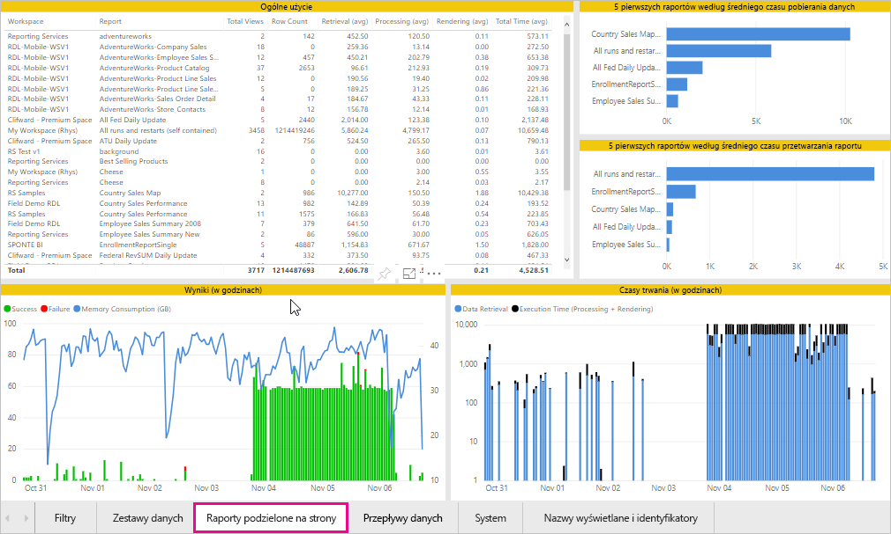
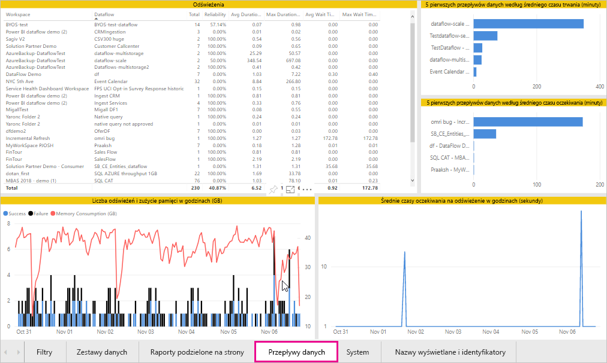

# Monitorowanie pojemności w usługach Power BI Premium i Power BI Embedded

Ten artykuł zawiera omówienie monitorowania metryk pojemności usługi Power BI Premium. Monitorowanie użycia pojemności pozwala na świadomy wybór podejścia do zarządzania pojemnościami.

Pojemność można monitorować za pomocą aplikacji metryk pojemności lub portalu administracyjnego w usłudze Power BI Premium. Zalecamy użycie aplikacji, ponieważ oferuje ona o wiele więcej szczegółów, ale w tym artykule opisano obie opcje. **Bieżąca wersja aplikacji to 1.8 (wydana 7 listopada 2018 r.).**

<iframe width="560" height="315" src="https://www.youtube.com/embed/UgsjMbhi_Bk?rel=0&amp;showinfo=0" frameborder="0" allowfullscreen></iframe>

## Instalowanie aplikacji metryk pojemności usługi Premium

Można przejść bezpośrednio do [aplikacji metryk pojemności usługi Premium](https://app.powerbi.com/groups/me/getapps/services/capacitymetrics) lub zainstalować ją tak jak inne aplikacje w usłudze Power BI.

1. W usłudze Power BI kliknij pozycję **Aplikacje**.

    

1. Po prawej stronie kliknij pozycję **Pobierz aplikacje**.

1. W kategorii **Aplikacje** wyszukaj **aplikację metryk pojemności usługi Power BI Premium**.

1. Subskrybuj, aby zainstalować aplikację.

Teraz, po zainstalowaniu aplikacji, będziesz widzieć metryki dotyczące pojemności w swojej organizacji. Przyjrzyjmy się niektórym dostępnym kluczowym metrykom.

## Używanie aplikacji metryk

Po otwarciu aplikacji najpierw zostanie wyświetlony pulpit nawigacyjny z podsumowaniem wszystkich pojemności, do których masz uprawnienia administratora.

Kliknij pulpit nawigacyjny, aby przejść do raportu źródłowego. Raport składa się z sześciu kart, które bardziej szczegółowo opisujemy w poniższych sekcjach.

* **Filtry**: umożliwia odfiltrowanie pozostałych stron w raporcie pod kątem określonej pojemności.

* **Zestawy danych**: szczegółowe metryki dotyczące kondycji zestawów danych usługi Power BI w ramach Twoich pojemności.

* **Raporty podzielone na strony**: szczegółowe metryki dotyczące kondycji raportów podzielonych na strony w ramach Twoich pojemności.

* **Przepływy danych**: szczegółowe metryki odświeżania dla przepływów danych w ramach Twoich pojemności.

* **System**: ogólne metryki wydajności, takie jak wysokie wykorzystanie pamięci i procesora.

* **Nazwy wyświetlane i identyfikatory**: nazwy, identyfikatory i właściciele pojemności, obszarów roboczych oraz obciążeń.

### Karta Filtry

Karta **Filtry** umożliwia wybranie pojemności, zakresu dat i innych opcji. Filtry zostaną następnie zastosowane do wszystkich odpowiednich stron i kafelków w raporcie. Jeśli nie zostaną wybrane żadne filtry, w raporcie będą domyślnie wyświetlane metryki z poprzedniego tygodnia dla każdej pojemności, która należy do Ciebie.

* **(A)** Wybierz pozycję **Zestawy danych**, **Raporty podzielone na strony** lub **Przepływy danych**, aby ustawić filtry dla poszczególnych obciążeń.

* **(B)** Nazwa i **(C)** informacje są aktualizowane w oparciu o pozycje wybrane w kroku **(A)**, co pozwala na filtrowanie obciążenia według nazwy. Na przykład na powyższej ilustracji wybrano pozycję **Przepływ danych**, co powoduje wyświetlenie obszarów **Nazwa przepływów danych** i **Informacje o przepływach danych**.

* **(D)** Informacje o pojemności, które wskazują, czy w ramach tej pojemności włączono zestawy danych, raporty podzielone na strony lub przepływy danych.

### Karta Zbiory danych

Używając przycisków w górnej części karty **Zestawy danych**, możesz przechodzić do różnych obszarów: **Podsumowanie**, **Odświeżenia**, **Czasy trwania zapytań**, **Oczekiwania zapytań** i **Zestawy danych**.

#### Obszar Podsumowanie

Obszar **Podsumowanie** przedstawia widok Twoich pojemności w oparciu o jednostki, zasoby systemowe i obciążenia zestawu danych. Zawiera on poniższe metryki.

| **Sekcja raportu** | **Metryki** |
| --- | --- |
| **Jednostki** | * Liczba pojemności, których jesteś właścicielem  * Odrębna liczba zestawów danych w pojemności  * Odrębna liczba obszarów roboczych w pojemności |
| **System** | * Średnie użycie pamięci w GB w ciągu ostatnich siedmiu dni  * Najwyższe zużycie pamięci w GB w ciągu ostatnich siedmiu dni oraz czas lokalny wystąpienia tego zużycia  * Liczba, która wskazuje, ile razy procesor przekroczył 80% progów w ciągu ostatnich siedmiu dni z podziałem na trzyminutowe przedziały  * Największa liczba przypadków, gdy procesor przekroczył 80% w ciągu ostatnich siedmiu dni z podziałem na przedziały o długości jednej godziny, oraz czas lokalny tych przypadków  * Liczba, która wskazuje, ile razy zapytania bezpośrednie/połączenia na żywo przekroczyły 80% progów w ciągu ostatnich siedmiu dni z podziałem na trzyminutowe przedziały  * Największa liczba przypadków, gdy zapytania bezpośrednie/połączenia na żywo przekroczyły 80% w ciągu ostatnich siedmiu dni z podziałem na przedziały o długości jednej godziny, oraz czas lokalny tych przypadków |
| **Obciążenia zestawu danych** | * Łączna liczba odświeżeń w ciągu ostatnich siedmiu dni  * Łączna liczba pomyślnych odświeżeń w ciągu ostatnich siedmiu dni  * Łączna liczba nieudanych odświeżeń w ciągu ostatnich siedmiu dni  * Łączna liczba odświeżeń nieudanych z powodu braku pamięci  * Średni czas trwania odświeżania to czas potrzebny do ukończenia operacji, w minutach  * Średni czas oczekiwania na odświeżenie to średnie opóźnienie między zaplanowanym czasem i uruchomieniem operacji, w minutach  * Łączna liczba zapytań uruchomionych w ciągu ostatnich siedmiu dni  * Łączna liczba pomyślnych zapytań w ciągu ostatnich siedmiu dni  * Łączna liczba nieudanych zapytań w ciągu ostatnich siedmiu dni  * Średni czas trwania zapytania to czas potrzebny do ukończenia operacji, w minutach  * Łączna liczba modeli wykluczonych z powodu wykorzystania pamięci |
|  |  |

#### Obszar Odświeżenia

Obszar **Odświeżenia** zawiera poniższe metryki.

| **Sekcja raportu** | **Metryki** |
| --- | --- |
| **Niezawodność odświeżania** | * Łączna liczba: łączna liczba odświeżeń dla każdego zestawu danych  * Niezawodność: procent ukończonych odświeżeń dla każdego zestawu danych  * Średni czas oczekiwania: średnie opóźnienie między zaplanowanym czasem i uruchomieniem odświeżania zestawu danych, w minutach  * Maksymalny czas oczekiwania: maksymalny czas oczekiwania dla zestawu danych, w minutach   * Średni czas trwania: średni czas trwania odświeżania dla zestawu danych, w minutach  * Maksymalny czas trwania: czas trwania najdłuższego odświeżania zestawu danych, w minutach |
| **5 pierwszych zestawów danych według średniego czasu trwania odświeżania** | * Pięć zestawów danych z najdłuższym średnim czasem trwania odświeżania, w minutach |
| **5 pierwszych zestawów danych według średniego czasu oczekiwania** | * Pięć zestawów danych z najdłuższym średnim czasem oczekiwania, w minutach |
| **Średnie czasy oczekiwania na odświeżenie (godzinowo)** | * Średni czas oczekiwania na odświeżenie z podziałem na przedziały o długości jednej godziny w czasie lokalnym. Wiele wzrostów i długie czasy oczekiwania na odświeżenie wskazują na wyczerpywanie pojemności. |
| **Liczba odświeżeń i zużycie pamięci (godzinowo)** | * Powodzenia, niepowodzenia i zużycie pamięci z podziałem na przedziały o długości jednej godziny w czasie lokalnym |
|  |  |

#### Obszar Czasy trwania zapytań

Obszar **Czasy trwania zapytań** zawiera poniższe metryki.

| **Sekcja raportu** | **Metryki** |
| --- | --- |
| **Czasy trwania zapytań** | * Dane w tej sekcji są dzielone na fragmenty według zestawów danych, obszaru roboczego i przedziałów godzinowych w ciągu ostatnich siedmiu dni  * Łącznie: łączna liczba zapytań uruchomiona dla zestawu danych  * Średni: średni czas trwania zapytania dla zestawu danych, w milisekundach  * Maksymalny: czas trwania najdłużej działającego zapytania w zestawie danych, w milisekundach|
| **Rozkład czasów trwania zapytania** | * Histogram czasów trwania zapytań jest podzielony według zgłoszonych czasów trwania zapytań (w milisekundach) na następujące kategorie: interwały o długości <= 30 ms, 30–100 ms, 100–300 ms, 300 ms–1 s, 1 s–3 s, 3 s–10 s, 10 s–30 s i > 30 s. Długie czasy trwania zapytań i długie czasy oczekiwania wskazują na pojemności uruchomione w warstwie Gorąca. Mogą również oznaczać, że pojedynczy zestaw danych powoduje problemy i wymaga dalszych badań. |
| **5 pierwszych zestawów danych według średniego czasu trwania** | * Pięć zestawów danych z najdłuższym średnim czasem trwania zapytania, w milisekundach |
| **Zapytanie bezpośrednie/połączenia na żywo (wykorzystanie > 80%)** | * Okresy, w których zapytanie bezpośrednie lub połączenie na żywo przekroczyło 80% wykorzystania procesora, z podziałem na przedziały o długości jednej godziny w czasie lokalnym |
| **Rozkłady czasów trwania zapytania (godzinowo)** | * Porównanie liczby zapytań i średniego czasu trwania (w milisekundach) z zużyciem pamięci w GB z podziałem na przedziały o długości jednej godziny w czasie lokalnym |
|  |  |

#### Obszar Oczekiwania zapytań

Obszar **Oczekiwania zapytań** zawiera poniższe metryki.

| **Sekcja raportu** | **Metryki** |
| --- | --- |
| **Czasy oczekiwania zapytań** | * Dane w tej sekcji są dzielone na fragmenty według zestawów danych, obszaru roboczego i przedziałów godzinowych w ciągu ostatnich siedmiu dni  * Łącznie: łączna liczba zapytań uruchomiona dla zestawu danych  * Liczba oczekiwań: liczba zapytań w zestawie danych, które oczekiwały na zasoby systemu przed rozpoczęciem wykonywania   * Średni: średni czas oczekiwania zapytania dla zestawu danych, w milisekundach  * Maksymalny: czas trwania najdłużej oczekującego zapytania w zestawie danych, w milisekundach|
| **Rozkład czasów oczekiwania** | * Histogram czasów trwania jest podzielony według czasów trwania zapytań (w milisekundach) na następujące kategorie: interwały o długości <= 50 ms, 50–100 ms, 100–200 ms, 200–400 ms, 400 ms–1 s, 1 s–5 s i > 5 s |
| **5 pierwszych zestawów danych według średniego czasu oczekiwania** | * Pięć zestawów danych z najdłuższym średnim czasem oczekiwania na rozpoczęcie wykonywania zapytania, w milisekundach |
| **Liczby i czasy oczekiwań na zapytanie (godzinowo)** | * Porównanie liczby oczekiwań zapytań i średniego czasu oczekiwania (w milisekundach) z zużyciem pamięci w GB z podziałem na przedziały o długości jednej godziny w czasie lokalnym |
|  |  |

#### Obszar Zestawy danych

Obszar **Zestawy danych** zawiera poniższe metryki.

| **Sekcja raportu** | **Metryki** |
| --- | --- |
| **Liczba eksmisji zestawów danych** | * Łącznie: łączna liczba *eksmisji* zestawów danych w przypadku każdej pojemności. Gdy pojemność powoduje wykorzystanie pamięci, węzeł eksmituje z pamięci jeden lub większą liczbę zestawów danych. Nieaktywne zestawy danych (dla których aktualnie nie są wykonywane żadne operacje zapytania/odświeżania) są eksmitowane jako pierwsze. Następnie kolejność eksmitowania bazuje na mierze „najdawniej używane” (LRU).|
| **Eksmisje zestawów danych i zużycie pamięci (godzinowo)** | * Porównanie eksmisji zestawów z zużyciem pamięci z podziałem na przedziały o długości jednej godziny w czasie lokalnym |
|  |  |

### Karta Raporty podzielone na strony

Karta **Raporty podzielone na strony** zawiera szczegółowe metryki dotyczące kondycji raportów podzielonych na strony w ramach Twoich pojemności.

Karta **Raporty podzielone na strony** zawiera poniższe metryki.

| **Sekcja raportu** | **Metryki** |
| --- | --- |
| **Ogólne użycie** | * Łączna liczba wyświetleń: liczba wskazująca, ile razy raport był wyświetlany przez użytkownika  * Liczba wierszy: liczba wierszy danych w raporcie  * Pobieranie (średnia): średni czas pobierania danych dla raportu, w milisekundach. Długie czasy trwania mogą wskazywać na wolne działanie zapytań lub inne problemy ze źródłem danych.   * Przetwarzanie (średnia): średni czas przetwarzania danych dla raportu, w milisekundach * Renderowanie (średnia): średni czas renderowania raportu w przeglądarce, w milisekundach  * Łączny czas: czas wykonania wszystkich faz raportu, w milisekundach|
| **5 pierwszych raportów według średniego czasu pobierania danych** | * Pięć raportów z najdłuższym średnim czasem pobierania danych, w milisekundach |
| **5 pierwszych raportów według średniego czasu przetwarzania raportu** | * Pięć raportów z najdłuższym średnim czasem przetwarzania raportu, w milisekundach |
| **Czasy trwania (w godzinach)** | * Porównanie czasów pobierania danych z czasami przetwarzania i renderowania z podziałem na przedziały o długości jednej godzinę w czasie lokalnym |
| **Wyniki (w godzinach)** | * Powodzenia, niepowodzenia i zużycie pamięci z podziałem na przedziały o długości jednej godziny w czasie lokalnym |
|  |  |

### Karta Przepływy danych

Karta **Przepływy danych** zawiera szczegółowe metryki odświeżania dla przepływów danych w ramach Twoich pojemności.

Karta **Przepływy danych** zawiera poniższe metryki.

| **Sekcja raportu** | **Metryki** |
| --- | --- |
| **Odświeżanie** | * Łącznie: łączna liczba odświeżeń dla każdego zestawu danych  * Niezawodność: procent ukończonych odświeżeń dla każdego przepływu danych  * Średni czas oczekiwania: średnie opóźnienie między zaplanowanym czasem i uruchomieniem odświeżania przepływu danych, w minutach  * Maksymalny czas oczekiwania: maksymalny czas oczekiwania dla przepływu danych, w minutach   * Średni czas trwania: średni czas trwania odświeżania dla przepływu danych, w minutach  * Maksymalny czas trwania: czas trwania najdłuższego odświeżania przepływu danych, w minutach |
| **5 pierwszych przepływów danych według średniego czasu trwania odświeżania** | * Pięć przepływów danych z najdłuższym średnim czasem trwania odświeżania, w minutach |
| **5 pierwszych przepływów danych według średniego czasu oczekiwania** | * Pięć przepływów danych z najdłuższym średnim czasem oczekiwania, w minutach |
| **Średnie czasy oczekiwania na odświeżenie (godzinowo)** | * Średni czas oczekiwania na odświeżenie z podziałem na przedziały o długości jednej godziny w czasie lokalnym. Wiele wzrostów i długie czasy oczekiwania na odświeżenie wskazują na wyczerpywanie pojemności. |
| **Liczba odświeżeń i zużycie pamięci (godzinowo)** | * Powodzenia, niepowodzenia i zużycie pamięci z podziałem na przedziały o długości jednej godziny w czasie lokalnym |
|  |  |

### Karta System

Karta **System** przedstawia użycie procesora i pamięci we wszystkich pojemnościach i obciążeniach.

Karta **System** zawiera poniższe metryki.

| **Sekcja raportu** | **Metryki** |
| --- | --- |
| **Metryki procesora (wykorzystanie > 80%)** | * Liczba, która wskazuje, ile razy procesor przekroczył 80% progów w ciągu ostatnich siedmiu dni z podziałem na trzyminutowe przedziały |
| **Zużycie pamięci** | * Zużycie pamięci w ciągu ostatnich siedmiu dni z podziałem na przedziały trzyminutowe |
|  |  |

### Karta Nazwy wyświetlane i identyfikatory

Karta **Nazwy wyświetlane i identyfikatory** zawiera nazwy, identyfikatory i właścicieli pojemności, obszarów roboczych oraz obciążeń.

## Monitorowanie pojemności usługi Power BI Embedded

Aplikacja metryk pojemności programu Power BI Premium służy również do monitorowania pojemności *jednostek SKU A* w usłudze Power BI Embedded. Te pojemności będą wyświetlane w raporcie, tak długo jak będziesz administratorem pojemności. Jednak odświeżanie raportu nie powiedzie się, chyba że udzielisz określonych uprawnień do usługi Power BI w ramach swoich jednostek SKU A:

1. Otwórz pojemność w witrynie Azure Portal.

1. Kliknij pozycję **Kontrola dostępu (Zarządzanie dostępem i tożsamościami)** i dodaj do roli czytelnika aplikację „Power BI Premium”. Jeśli nie możesz znaleźć aplikacji według nazwy, możesz również dodać ją przy użyciu jej identyfikatora klienta: cb4dc29f-0bf4-402a-8b30-7511498ed654.

    

> [!NOTE]
> Użycie pojemności usługi Power BI Embedded można monitorować w aplikacji lub w witrynie Azure Portal, ale nie w portalu administracyjnym usługi Power BI.

## Podstawowe monitorowanie w portalu administracyjnym

Obszar **Ustawienia pojemności** w portalu administracyjnym udostępnia cztery mierniki, które wskazują obciążenia umieszczone w pojemności i zasoby wykorzystywane przez tę pojemność w ciągu ostatnich siedmiu dni. Te cztery kafelki działają w godzinowym przedziale czasu, który wskazuje liczbę godzin w ciągu ostatnich siedmiu dni, gdy odpowiednia metryka przekroczyła wartość 80%. Ta metryka wskazuje potencjalne obniżenie wydajności środowiska użytkownika końcowego.

| **Metryka** | **Opis** |
| --- | --- |
| Procesor CPU |Ile razy wykorzystanie procesora CPU przekroczyło 80%. |
| Przeładowywanie pamięci |Reprezentuje wykorzystanie pamięci rdzeni wewnętrznej bazy danych. Ta metryka w szczególności obrazuje, ile razy zestawy danych zostały usunięte z pamięci z powodu braku pamięci wynikającego z używania wielu zestawów danych. |
| Memory Usage (Użycie pamięci) |Średnie użycie pamięci przedstawiane w gigabajtach (GB). |
| Zapytania bezpośrednie | Ile razy liczba zapytań bezpośrednich i połączeń na żywo przekroczyła 80% limitu.   * Łączna liczba zapytań w trybie DirectQuery i zapytań w ramach połączeń na żywo występujących w ciągu sekundy jest ograniczona. * Limity wynoszą 30/s (P1), 60/s (P2) i 120/s (P3). * Liczba zapytań bezpośrednich i zapytań w ramach połączeń na żywo wlicza się do powyższych limitów. Na przykład, jeśli w ciągu sekundy wystąpiło 15 zapytań bezpośrednich i 15 połączeń na żywo, limit został osiągnięty. * Ma to jednakowe zastosowanie się do połączeń lokalnych i połączeń w chmurze. |
|  |  |

Metryki odzwierciedlają wykorzystanie w ostatnim tygodniu.  Jeśli chcesz wyświetlić bardziej szczegółowy widok metryki, możesz to zrobić, klikając dowolny kafelek podsumowania.  Spowoduje to przejście do szczegółowych wykresów dla każdej metryki Twojej pojemności Premium. Na poniższym wykresie przedstawiono szczegółowe informacje dotyczące metryki procesora.

Wykresy te są podsumowywane co godzinę dla ostatniego tygodnia i mogą pomóc określić, kiedy w Twojej pojemności Premium mogły wystąpić określone zdarzenia dotyczące wydajności.

Dane źródłowe dla dowolnej metryki można wyeksportować do pliku csv.  Dzięki temu uzyskasz szczegółowe informacje w przedziałach trzyminutowych dla poszczególnych dni w ostatnim tygodniu.

## Następne kroki

Teraz, gdy już znasz sposób monitorowania pojemności usługi Power BI Premium, dowiedz się więcej na temat optymalizowania pojemności.

> [!div class="nextstepaction"]
> [Optymalizacja zasobów o pojemności Power BI Premium i zarządzanie nimi](service-premium-understand-how-it-works.md)
