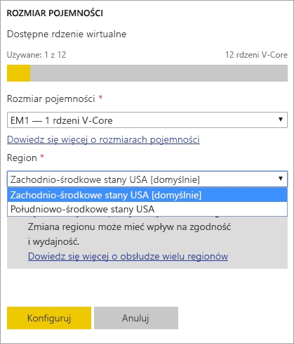
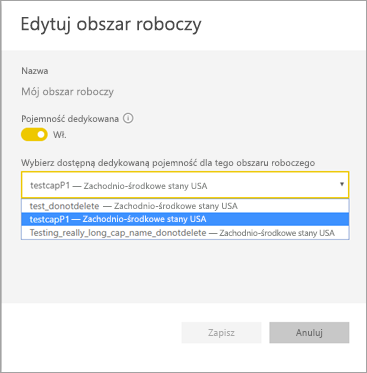
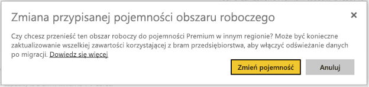
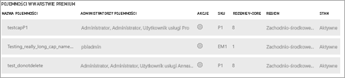

# Obsługa funkcji Multi-Geo w usłudze Power BI Premium (wersja zapoznawcza)
Multi-Geo to funkcja usługi Power BI Premium, która pomaga klientom z wielu krajów spełniać wymagania dotyczące miejsc przechowywania danych regionalnych, specyficznych dla branży lub organizacyjnych. Jako klient usługi Power BI Premium możesz wdrażać zawartość do centrów danych w regionach innych niż region lokalny dzierżawy usługi Power BI. Zawartość można wdrażać w dowolnych spośród następujących obszarów geograficznych:

- Stany Zjednoczone 
- Kanada 
- Zjednoczone Królestwo 
- Brazylia 
- Europa 
- Japonia 
- Indie 
- Azja i Pacyfik 
- Australia 

Obszar geograficzny (geografia) może zawierać więcej niż jeden regionie. Na przykład Stany Zjednoczone to obszar geograficzny, a Zachodnio-środkowe stany USA i Południowo-środkowe stany USA to regiony w Stanach Zjednoczonych. 

Funkcja Multi-Geo jest niedostępna w usłudze Power BI w wersji dla Niemiec, usłudze Power BI obsługiwanej przez firmę 21Vianet w Chinach ani w usłudze Power BI dla instytucji rządowych USA.

## Korzystanie z funkcji Multi-Geo

W przypadku nowych pojemności należy włączyć funkcję Multi-Geo, wybierając region inny niż domyślny z listy rozwijanej.  Każda dostępna pojemność pokazuje region, w którym obecnie się znajduje, na przykład **Zachodnio-środkowe stany USA**.

  
Utworzona pojemność pozostaje w danym regionie, a zawartość wszystkich utworzonych obszarów roboczych będzie przechowywana w danym regionie. Obszary robocze można migrować z jednego regionu do innego za pomocą listy rozwijanej na ekranie ustawień obszaru roboczego.

Jeśli widzisz ten ekran, musisz potwierdzić zmianę. 

W tym momencie nie trzeba resetować poświadczeń bramy podczas migracji.  Po ich umieszczeniu w regionie pojemności Premium trzeba będzie je zresetować podczas migracji.
   
W trakcie migracji niektóre operacje, takie jak publikowanie nowych zestawów danych lub zaplanowane odświeżanie danych, mogą zakończyć się niepowodzeniem.  

Po włączeniu funkcji Multi-Geo następujące elementy są przechowywane w regionie Premium:
 
- Modele (pliki ABF) na potrzeby importowania i zestawów danych DirectQuery
- Pamięć podręczna zapytań
- Obrazy w języku R

Poniższe elementy pozostają w lokalnym regionie dzierżawy:

- Zestawy danych wypychania
- Skoroszyty programu Excel
- Metadane pulpitu nawigacyjnego/raportu: np. nazwy kafelków, zapytania dotyczące kafelka
- Magistrale usług na potrzeby zapytań dotyczących bramy lub zaplanowanych zadań odświeżania
- Uprawnienia
- Poświadczenia zestawu danych
 
## Wyświetlanie regionów pojemności

W portalu administracyjnym można wyświetlić wszystkie pojemności dzierżawy usługi Power BI oraz regiony, w których się obecnie znajdują.

 

## Zmienianie regionu w przypadku istniejącej zawartości

Jeśli musisz zmienić region w przypadku istniejącej zawartości, masz dwie opcje.

- Utwórz drugą pojemność i przenieś obszary robocze. Użytkownicy wersji bezpłatnej nie doświadczą żadnych zakłóceń tak długo, jak dzierżawa będzie mieć wolne rdzenie wirtualne.
- Jeśli nie chcesz tworzyć drugiej pojemności, możesz tymczasowo przenieść zawartość z powrotem do udostępnionej pojemności w warstwie Premium. Nie potrzebujesz dodatkowych rdzeni wirtualnych, ale użytkownicy wersji bezpłatnej mogą doświadczać przestojów w pracy.

## Przenoszenie zawartości z funkcji Multi-Geo  

Obszary robocze można przenosić poza pojemność funkcji Multi-Geo na jeden z dwóch sposobów:

- Usuwanie bieżącej pojemności, w której znajduje się obszar roboczy.  Spowoduje to przeniesienie obszaru roboczego z powrotem do regionu lokalnego.
- Migrowanie poszczególnych obszarów z powrotem do pojemności Premium znajdującej się w dzierżawie lokalnej.

## Ograniczenia i istotne zagadnienia

Upewnij się, że wszystkie operacje przenoszenia inicjowane między regionami są zgodne ze wszystkimi firmowymi i rządowymi wymaganiami dotyczącymi zgodności przed zainicjowaniem transferu danych.

Zapytanie buforowane przechowywane w regionie zdalnym pozostaje w tym regionie podczas magazynowania danych. Inne transferowane dane mogą być jednak przenoszone między różnymi obszarami geograficznymi. 

Podczas przenoszenia danych z jednego regionu do innego w środowisku funkcji Multi-Geo dane źródłowe mogą pozostawać w regionie, z którego dane zostały przeniesione, przez maksymalnie 30 dni. W tym czasie użytkownicy końcowi nie będą mieć dostępu do tych danych. Zostaną one usunięte z tego regionu i zlikwidowane w trakcie 30-dniowego okresu.

Ogólnie rzecz biorąc, funkcja Multi-Geo nie powoduje zwiększenia wydajności. Ładowanie raportów i pulpitów nawigacyjnych będzie nadal uwzględniać żądania do regionu lokalnego dla metadanych.

## Następne kroki

[Power BI Premium — co to jest?](service-premium.md)

Masz więcej pytań? [Zadaj pytanie społeczności usługi Power BI](http://community.powerbi.com/)
