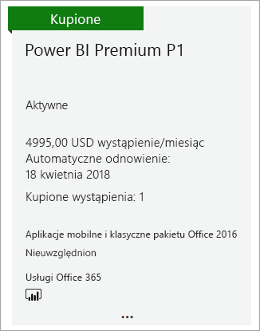

# Jak kupić usługę Power BI Premium
Dowiedz się, jak kupić pojemność usługi Power BI Premium dla organizacji.

<iframe width="640" height="360" src="https://www.youtube.com/embed/NkvYs5Qp4iA?rel=0&amp;showinfo=0" frameborder="0" allowfullscreen></iframe>

Możesz kupić węzły pojemności usługi Power BI Premium za pośrednictwem centrum administracyjnego usługi Office 365. Organizacja może także mieć dowolną kombinację jednostek SKU pojemności Premium (od P1 do P3). Zapewniają one różne funkcje zasobów.

Aby uzyskać więcej informacji na temat usługi Power BI Premium, zobacz [Power BI Premium — co to jest?](service-premium.md). Aby zobaczyć aktualne ceny usługi Power BI, zobacz [stronę cennika usługi Power BI](https://powerbi.microsoft.com/pricing/). Możesz również wyliczyć koszty usługi Power BI Premium, korzystając z [kalkulatora usługi Power BI Premium](https://powerbi.microsoft.com/calculator/).

> [!IMPORTANT]
> Niezależnie od zakupu usługi Power BI Premium, autorzy zawartości będą nadal potrzebować licencji usługi Power BI Pro.
> 
> 

## Tworzenie nowej dzierżawy z usługą Power BI Premium P1
Jeśli nie masz jeszcze dzierżawy i chcesz ją utworzyć, możesz jednocześnie kupić usługę Power BI Premium. Poniższy link zawiera instrukcje tworzenia nowej dzierżawy na potrzeby usługi Office 365 oraz kupowania usługi Power BI Premium. Po utworzeniu dzierżawy należy zakupić licencję usługi Power BI Pro dla użytkownika. Gdy utworzysz dzierżawę, automatycznie zostaniesz jej administratorem globalnym.

Aby dokonać zakupu, zobacz [ofertę usługi Power BI Premium P1](https://signup.microsoft.com/Signup?OfferId=b3ec5615-cc11-48de-967d-8d79f7cb0af1).

## Kupowanie pojemności usługi Power BI Premium dla istniejącej organizacji
W przypadku istniejącej organizacji musisz być administratorem globalnym lub administratorem rozliczeń, aby móc kupować subskrypcje i licencje. Aby uzyskać więcej informacji, zobacz [Role administratora usługi Office 365 — informacje](https://support.office.com/article/About-Office-365-admin-roles-da585eea-f576-4f55-a1e0-87090b6aaa9d).

Aby kupić pojemność Premium, należy wykonać następujące czynności.

1. W usłudze Power BI wybierz kolejno pozycje **Selektor aplikacji usługi Office 365** > **Administrator**. Możesz także przejść do centrum administracyjnego usługi Office 365. W tym celu przejdź do witryny https://portal.office.com i wybierz pozycję **Administrator**.
   
    
2. Wybierz kolejno pozycje **Rozliczenia** > **Zakup usług**.
3. W obszarze **Inne plany** poszukaj ofert usługi Power BI Premium. Dostępne będą plany od P1 do P3, EM3 oraz P1 (z miesiąca na miesiąc).
4. Zatrzymaj wskaźnik myszy na ikonie **wielokropka (...)**, a następnie wybierz polecenie **Kup teraz**.
   
    
5. Postępuj zgodnie z instrukcjami, aby sfinalizować zakup.

Możesz również wybrać jeden z poniższych linków, aby przejść bezpośrednio do strony zakupu poszczególnych jednostek. Aby uzyskać więcej informacji na temat poszczególnych jednostek SKU, zobacz [Power BI Premium — co to jest?](service-premium.md#premiumskus).

Aby móc kupić jednostkę SKU usługi Power BI Premium, ***musisz być administratorem globalnym lub administratorem rozliczeń*** swojej dzierżawy. Jeśli nie jesteś administratorem, po kliknięciu poniższych linków wystąpi błąd.

| Linki bezpośrednie do stron zakupu |
| --- |
| [Jednostka SKU EM3 (z miesiąca na miesiąc)](https://portal.office.com/SubscriptionDetails?OfferId=4004702D-749C-4F74-BF47-3048F1833780&adminportal=1) |
| [Jednostka SKU P1](https://portal.office.com/SubscriptionDetails?OfferId=b3ec5615-cc11-48de-967d-8d79f7cb0af1&adminportal=1) |
| [Jednostka SKU P1 (z miesiąca na miesiąc)](https://portal.office.com/SubscriptionDetails?OfferId=E4C8EDD3-74A1-4D42-A738-C647972FBE81&adminportal=1) |
| [Jednostka SKU P2](https://portal.office.com/SubscriptionDetails?OfferId=062F2AA7-B4BC-4B0E-980F-2072102D8605&adminportal=1) |
| [Jednostka SKU P3](https://portal.office.com/SubscriptionDetails?OfferId=40c7d673-375c-42a1-84ca-f993a524fed0&adminportal=1) |

Po sfinalizowaniu zakupu odpowiednia jednostka będzie wyświetlana na ekranie Zakup usług jako zakupiona i aktywna.

Możesz teraz zarządzać odpowiednią pojemnością w centrum administracyjnym usługi Power BI. Aby uzyskać więcej informacji, zobacz [Zarządzanie usługą Power BI Premium](service-admin-premium-manage.md).

## Kupowanie dodatkowych pojemności
Jeśli jesteś administratorem, w sekcji **Ustawienia Premium** w portalu administracyjnym usługi Power BI będzie wyświetlany przycisk **Kup więcej**. Kliknięcie przycisku spowoduje przejście do portalu usługi Office 365. Po przejściu do centrum administracyjnego usługi Office 365 możesz wykonać następujące czynności.

1. Wybierz kolejno pozycje **Rozliczenia** > **Zakup usług**.
2. Znajdź jednostkę usługi Power BI Premium, której wystąpienia chcesz dokupić, w sekcji **Inne plany**.
3. Zatrzymaj wskaźnik myszy na ikonie **wielokropka (...)**, a następnie wybierz polecenie **Zmień liczbę licencji**.
   
    
4. Wybierz liczbę wystąpień tej jednostki, którą chcesz mieć. Po zakończeniu wybierz polecenie **Prześlij**.
   
   > [!IMPORTANT]
   > Wybranie polecenia **Prześlij** spowoduje obciążenie zapisanej karty kredytowej.
   > 
   > 

Następnie na stronie **Zakup usług** będzie widoczna liczba posiadanych wystąpień. W sekcji **Ustawienia pojemności** w portalu administracyjnym usługi Power BI liczba dostępnych rdzeni wirtualnych odzwierciedla nowo zakupioną pojemność.

Możesz teraz zarządzać odpowiednią pojemnością w centrum administracyjnym usługi Power BI. Aby uzyskać więcej informacji, zobacz [Zarządzanie usługą Power BI Premium](service-admin-premium-manage.md).

## Anulowanie subskrypcji
Możesz anulować subskrypcję z poziomu centrum administracyjnego usługi Office 365. Aby anulować subskrypcję Premium, wykonaj następujące czynności.

1. Przejdź do centrum administracyjnego usługi Office 365.
2. Wybierz kolejno pozycje **Rozliczenia** > **Subskrypcje**.
3. Wybierz subskrypcję usługi Power BI Premium z listy.
4. Na liście rozwijanej **Więcej akcji** wybierz pozycję **Anuluj subskrypcję**.
   
    
5. Na stronie **Anulowanie subskrypcji** zobaczysz, czy będzie konieczne poniesienie [opłaty za wcześniejsze anulowanie](https://support.office.com/article/early-termination-fees-6487d4de-401a-466f-8bc3-c0beb5cc40d3). Na tej stronie znajdziesz również informację o terminie usunięcia danych subskrypcji.
6. Zapoznaj się z tymi informacjami, a następnie, jeśli chcesz kontynuować, wybierz polecenie **Anuluj subskrypcję**.

## Następne kroki
[Strona cennika usługi Power BI](https://powerbi.microsoft.com/pricing/)  
[Kalkulator usługi Power BI Premium](https://powerbi.microsoft.com/calculator/)  
[Power BI Premium — co to jest?](service-premium.md)  
[Zarządzanie usługą Power BI Premium](service-admin-premium-manage.md)  
[Power BI Premium — często zadawane pytania](service-premium-faq.md)  
[Informacje o wersji usługi Power BI Premium](service-premium-release-notes.md)  
[Oficjalny dokument firmy Microsoft na temat usługi Power BI Premium](https://aka.ms/pbipremiumwhitepaper)  
[Oficjalny dokument dotyczący planowania wdrożenia usługi Power BI Enterprise](https://aka.ms/pbienterprisedeploy)  
[Portal administracyjny usługi Power BI](service-admin-portal.md)  
[Administrowanie usługą Power BI w organizacji](service-admin-administering-power-bi-in-your-organization.md)  

Masz więcej pytań? [Zadaj pytanie społeczności usługi Power BI](http://community.powerbi.com/)

