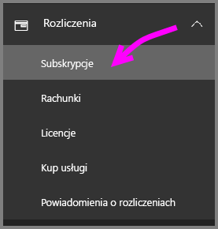
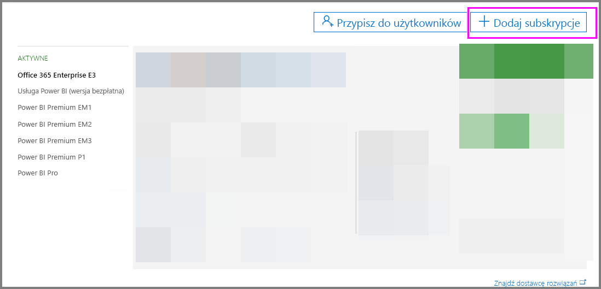
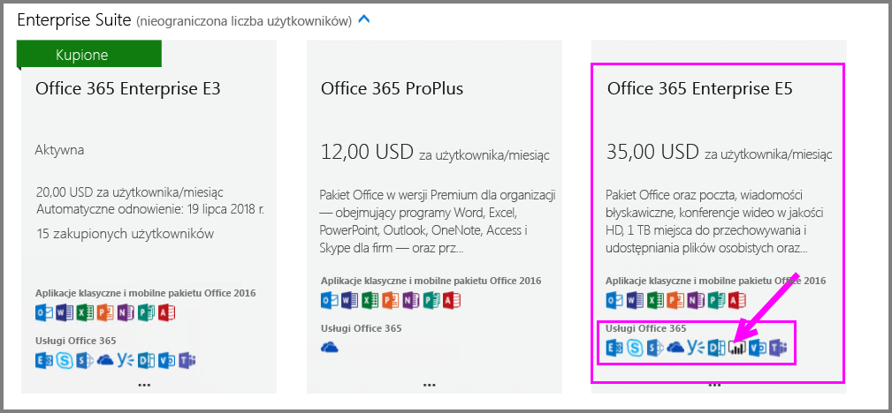
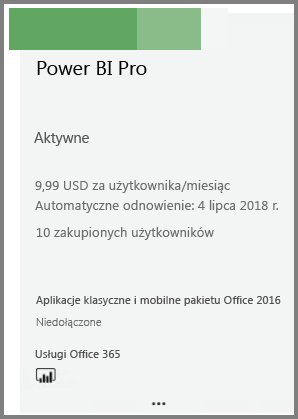
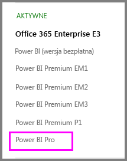

# Szybki start: kupowanie licencji usługi Power BI Pro

Usługa Power BI Pro stanowi indywidualną licencję, która zapewnia dostęp do całej zawartości i wszystkich funkcji w usłudze Power BI, w tym do możliwości udostępniania zawartości i współpracy z innymi użytkownikami wersji Pro. Tylko użytkownicy wersji Pro mogą publikować zawartość i używać jej w obszarach roboczych aplikacji, udostępniać pulpity nawigacyjne oraz subskrybować pulpity nawigacyjne i raporty. W tym artykule wyjaśniono, jak kupować licencje usługi Power BI Pro w usłudze Office 365.

## Wymagania wstępne

Musisz być członkiem roli [**Administrator globalny** lub **Administrator rozliczeń**](https://support.office.com/article/about-office-365-admin-roles-da585eea-f576-4f55-a1e0-87090b6aaa9d?ui=en-US&rs=en-US&ad=US) w usłudze Office 365. 

## Kupowanie licencji usługi Power BI Pro za pośrednictwem usługi Office 365

Wykonaj poniższe kroki, aby kupić licencje usługi Power BI Pro:

1. Otwórz [centrum administracyjne usługi Office 365](https://portal.office.com/adminportal/home#/homepage).

2. W okienku nawigacji po lewej stronie wybierz pozycję **Rozliczenia** > **Subskrypcje**.

    

3. W prawym górnym rogu strony **Subskrypcje** wybierz pozycję **Dodaj subskrypcje**.

    

4. Znajdź żądaną ofertę subskrypcji:

    W obszarze **Enterprise Suite** wybierz pozycję **Office 365 Enterprise E5**.

    

    W obszarze **Inne plany** wybierz pozycję **Power BI Pro**.

    

5. Umieść kursor nad wielokropkiem (...) dla odpowiedniej subskrypcji i wybierz pozycję **Kup teraz**.

    

6. Wybierz pozycję **Płać co miesiąc** lub **Zapłać za cały rok** zgodnie z preferencjami dotyczącymi rozliczeń.

7. W obszarze **Ilu chcesz mieć użytkowników?** wprowadź żądaną liczbę licencji, a następnie wybierz pozycję **Przejdź do kasy** w celu zakończenia transakcji.

8. Sprawdź, czy zakupiona subskrypcja znajduje się teraz na liście na stronie **Subskrypcje**.

   

9. Aby dodać więcej licencji po dokonaniu początkowego zakupu, wybierz pozycję **Power BI Pro** na stronie **Subskrypcje**, a następnie wybierz pozycję **Dodaj/Usuń licencje**.

## Następne kroki

Teraz zakupione licencje należy przypisać do użytkowników w dzierżawie.

[Przypisywanie licencji do użytkowników w usłudze Office 365](service-admin-assigning-power-bi-pro-licenses.md)

[Przypisywanie licencji do użytkowników na platformie Azure](service-admin-assigning-power-bi-pro-licenses-azure.md)

[Cennik usługi Power BI](https://powerbi.microsoft.com/en-us/pricing/)
