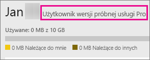

# Zakup usługi Power BI Pro
Usługa Power BI Pro jest przeznaczona dla użytkowników, którzy publikują raporty, udostępniają pulpity nawigacyjne, współpracują w obszarach roboczych oraz wykonują inne powiązane działania, na przykład:

* Analizowanie danych w programie Excel lub Power BI Desktop
* Udostępnianie przy użyciu aplikacji Excel Web App
* Udostępnianie pulpitów nawigacyjnych i współpraca przy użyciu obszarów roboczych aplikacji
* Wyświetlanie udostępnionej zawartości
* Integrowanie zawartości z usługą Microsoft Teams

Administratorzy IT mogą skorzystać z kilku opcji umożliwiających używanie usługi Power BI Pro w organizacji. Usługę Power BI Pro można kupić w centrum administracyjnym usługi Office 365 lub u przedstawiciela albo partnera firmy Microsoft. W tym artykule przedstawiono dwie opcje uzyskania wersji próbnej usługi Power BI Pro i wyjaśniono, jak kupić tę usługę jako organizacja.

Aby uzyskać więcej informacji o usłudze Power BI Premium oraz dowiedzieć się, jakie miejsce zajmuje usługa Power BI Pro w ofercie Premium, zobacz [Power BI Premium — co to jest?](service-premium.md)

## Cennik
Aby uzyskać najnowsze informacje o cenach usługi Power BI Pro oraz zapoznać się z dostępnymi funkcjami, zobacz [Cennik usługi Power BI](https://powerbi.microsoft.com/pricing/).

## 60-dniowa wersja próbna usługi Power BI Pro wewnątrz usługi dla użytkowników indywidualnych
Po zarejestrowaniu się i utworzeniu bezpłatnego konta możesz opcjonalnie wypróbować wersję Pro usługi bezpłatnie przez 60 dni. Podczas okresu próbnego będziesz mieć dostęp do wszystkich funkcji usługi Power BI Pro. Usługa Power BI Pro oferuje wszystkie funkcje bezpłatnej wersji usługi Power BI oraz dodatkowe funkcje udostępniania i współpracy. Aby uzyskać więcej informacji, zobacz [Cennik usługi Power BI](https://powerbi.microsoft.com/pricing). Aby wypróbować 60-dniową bezpłatną wersję próbną usługi Power BI Pro, zaloguj się do usługi Power BI i wypróbuj jedną z następujących funkcji usługi Power BI Pro:

* [Tworzenie obszaru roboczego aplikacji](service-create-distribute-apps.md)
* [Udostępnianie pulpitu nawigacyjnego](service-share-dashboards.md)

Kiedy zaczniesz korzystać z dowolnej z tych funkcji, zostanie wyświetlony monit o rozpoczęcie bezpłatnego okresu próbnego. Możesz również rozpocząć okres próbny, przechodząc do ikony koła zębatego i wybierając pozycję **Zarządzaj magazynem osobistym**. Następnie wybierz pozycję **Wypróbuj bezpłatnie wersję Pro** po prawej stronie.

Następnie wybierz pozycję **Rozpocznij okres próbny**.

> [!NOTE]
> Użytkownicy korzystający z tej wersji próbnej usługi Power BI Pro w ramach produktu nie są widoczni w portalu administracyjnym usługi Office 365 jako użytkownicy wersji próbnej usługi Power BI Pro (są wyświetlani jako użytkownicy wersji bezpłatnej usługi Power BI). Będą jednak wyświetlani jako użytkownicy usługi Power BI Pro w wersji próbnej na stronie **zarządzania magazynem** w usłudze Power BI.

> [!NOTE]
> Jeśli jesteś administratorem IT i chcesz uzyskać oraz wdrożyć licencje na wersję próbną usługi Power BI dla wielu użytkowników w organizacji bez konieczności akceptowania warunków wersji próbnej przez poszczególnych użytkowników, możesz zarejestrować się, korzystając z [wersji próbnej subskrypcji usługi Power BI Pro](https://portal.office.com/Signup/MainSignup15.aspx?OfferId=d59682f3-3e3b-4686-9c00-7c7c1c736085&dl=POWER_BI_PRO). Musisz być przy tym administratorem globalnym lub administratorem rozliczeń w usłudze Office 365 albo utworzyć nową dzierżawę, aby umożliwić rejestrację w wersji próbnej dla administratora. Aby uzyskać więcej informacji, zobacz [Zakup usługi Power BI Pro](service-admin-purchasing-power-bi-pro.md).

> [!NOTE]
> Wraz z dostępnością usługi Power BI Premium i zmianami w ofercie bezpłatnej usługi Power BI od 1 czerwca 2017 możesz zyskać uprawnienia do skorzystania z rozszerzonej wersji próbnej Pro. Aby uzyskać więcej informacji, zobacz [Aktywacja rozszerzonej wersji próbnej Pro](service-extended-pro-trial.md).

### Jak to wygląda w usłudze
Podczas pracy w usłudze możesz sprawdzić, czy masz konto wersji próbnej Pro, przechodząc do ikony **koła zębatego* i wybierając pozycję **Zarządzaj magazynem osobistym**.

## Wersja próbna subskrypcji w usłudze Office 365
Dla swojej organizacji możesz uzyskać wersję próbną usługi Power BI Pro. Gdy subskrypcja będzie dostępna, możesz przypisać użytkownikom licencje usługi Power BI Pro. Aby uzyskać więcej informacji na temat przydzielania licencji, zobacz [Przydzielanie licencji użytkownikom w usłudze Office 365](https://support.office.com/article/Assign-or-unassign-licenses-for-Office-365-for-business-997596b5-4173-4627-b915-36abac6786dc).

> [!NOTE]
> Obowiązuje limit jednej wersji próbnej dla organizacji w dzierżawie. Oznacza to, że jeśli w danej dzierżawie już zastosowano wersję próbną usługi Power BI Pro, nie można tego zrobić ponownie. Jeśli potrzebujesz pomocy w tym zakresie, możesz skontaktować się z [pomocą techniczną ds. rozliczeń w usłudze Office 365](https://support.office.microsoft.com/article/Contact-Office-365-for-business-support-Admin-Help-32a17ca7-6fa0-4870-8a8d-e25ba4ccfd4b?CorrelationId=552bbf37-214f-4202-80cb-b94240dcd671&ui=en-US&rs=en-US&ad=US#BKMK_call_support).
> 

1. Przejdź do [centrum administracyjnego usługi Office 365](https://portal.office.com/admin/default.aspx).
2. W lewym okienku nawigacji wybierz pozycję Rozliczenia -> Subskrypcje.
3. Wybierz pozycję Dodaj subskrypcje + znajdującą się po prawej stronie.
4. W obszarze Inne plany najedź kursorem na wielokropek (…) przy usłudze Power BI Pro i wybierz pozycję Rozpocznij bezpłatny kres próbny.
   
    
5. Na ekranie potwierdzenia zamówienia wybierz pozycję Wypróbuj teraz.
6. Po otrzymaniu potwierdzenia zamówienia wybierz pozycję Kontynuuj.

W obszarze **Rozliczenia** > **Subskrypcje** pojawi się usługa **Power BI Pro w wersji próbnej** z 25 dostępnymi licencjami. Jest to miesięczna wersja próbna.

### Jak to wygląda w usłudze
Podczas pracy w usłudze możesz sprawdzić, czy masz konto Pro, przechodząc do ikony **koła zębatego** i wybierając pozycję **Zarządzaj magazynem osobistym**. Informacja o użytkowniku wersji próbnej nie będzie widoczna.

## Zakup subskrypcji w usłudze Office 365
Usługę Power BI Pro dla swojej organizacji możesz kupić za pośrednictwem centrum administracyjnego usługi Office 365. Gdy subskrypcja będzie dostępna, możesz przypisać użytkownikom licencje usługi Power BI Pro. Aby uzyskać więcej informacji na temat przydzielania licencji, zobacz [Przydzielanie licencji użytkownikom w usłudze Office 365](https://support.office.com/article/Assign-or-unassign-licenses-for-Office-365-for-business-997596b5-4173-4627-b915-36abac6786dc).

1. Przejdź do [centrum administracyjnego usługi Office 365](https://portal.office.com/admin/default.aspx).
2. W lewym okienku nawigacji wybierz pozycję Rozliczenia -> Subskrypcje.
3. Wybierz pozycję Dodaj subskrypcje + znajdującą się po prawej stronie.
4. W obszarze Inne plany najedź kursorem na wielokropek (…) przy usłudze Power BI Pro i wybierz pozycję Kup teraz.
   
    
5. Wprowadź liczbę licencji, które chcesz dodać, i wybierz pozycję Sfinalizuj zakup lub Dodaj do koszyka.
   
   > [!NOTE]
   > Później, w razie potrzeby, możesz dodać więcej licencji.
   > 
   > 
6. Wprowadź informacje wymagane w procesie finalizacji zakupu.

> [!NOTE]
> Jeśli masz już wersję próbną usługi Power BI Pro, nastąpi przekierowanie na ekran finalizacji i pojawi się monit o wprowadzenie liczby licencji.
> 
> 

W obszarze **Rozliczenia** > **Subskrypcje** będzie widoczna pozycja **Power BI Pro**. Jeśli zechcesz później dodać więcej licencji, wróć do obszaru **Dodawanie subskrypcji**, a następnie wybierz pozycję **Zmień liczbę licencji**.

### Jak to wygląda w usłudze
Podczas pracy w usłudze możesz sprawdzić, czy masz konto Pro, przechodząc do ikony **koła zębatego** i wybierając pozycję **Zarządzaj magazynem osobistym**.

## Następne kroki
[Rejestracja samoobsługowa w usłudze Power BI](service-self-service-signup-for-power-bi.md)  
[Usługa Power BI (wersja bezpłatna) w organizacji](service-admin-service-free-in-your-organization.md)  
[Aktywacja rozszerzonej wersji próbnej Pro](service-extended-pro-trial.md)  
[Power BI Premium — co to jest?](service-premium.md)  
[Jak kupić usługę Power BI Premium](service-admin-premium-purchase.md)  
[Oficjalny dokument firmy Microsoft na temat usługi Power BI Premium](https://aka.ms/pbipremiumwhitepaper)  

Masz więcej pytań? [Zadaj pytanie społeczności usługi Power BI](http://community.powerbi.com/)

