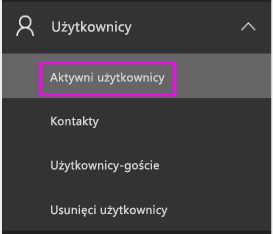
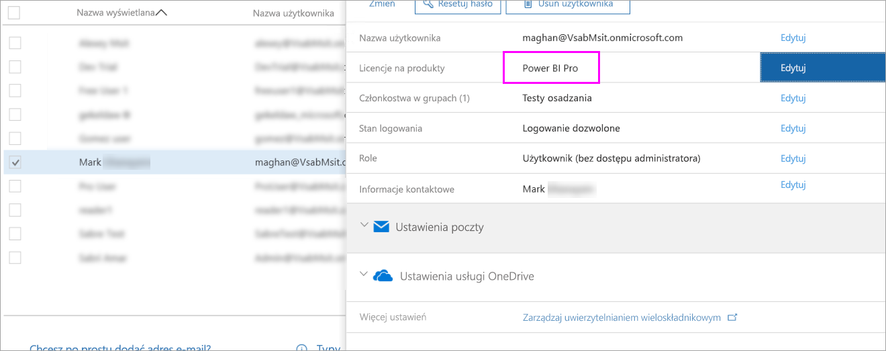
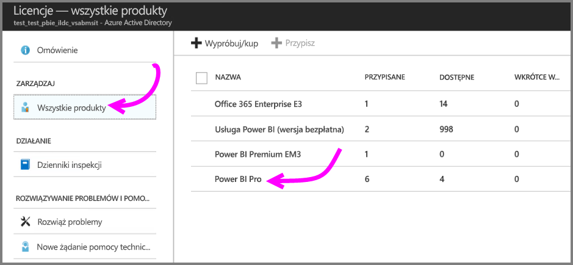

# Kupowanie i przypisywanie licencji usługi Power BI Pro

Usługa Power BI Pro stanowi indywidualną licencję, która zapewnia dostęp do całej zawartości i wszystkich funkcji w usłudze Power BI, w tym do możliwości udostępniania zawartości i współpracy z innymi użytkownikami wersji Pro. Tylko użytkownicy wersji Pro mogą publikować zawartość i używać jej w obszarach roboczych aplikacji, udostępniać pulpity nawigacyjne oraz subskrybować pulpity nawigacyjne i raporty. Aby uzyskać więcej informacji, zobacz [Power BI features by license type](service-features-license-type.md) (Funkcje usługi Power BI według typu licencji).

W tym artykule najpierw wyjaśniono, jak kupować licencje usługi Power BI Pro w usłudze Office 365. Następnie przedstawiono dwie opcje przypisywania tych licencji do poszczególnych użytkowników: usługa Office 365 i platforma Azure (należy wybrać jedną z tych opcji).

## Wymagania wstępne

Musisz być członkiem roli [**Administrator globalny** lub **Administrator rozliczeń**](https://support.office.com/article/about-office-365-admin-roles-da585eea-f576-4f55-a1e0-87090b6aaa9d?ui=en-US&rs=en-US&ad=US) w usłudze Office 365.

Aby przypisywać licencje na platformie Azure, musisz być właścicielem subskrypcji platformy Azure, której usługa Power BI używa podczas operacji wyszukiwania w usłudze Active Directory.

## Kupowanie licencji w usłudze Office 365

Wykonaj poniższe kroki, aby kupić licencje usługi Power BI Pro:

1. Otwórz [centrum administracyjne usługi Office 365](https://portal.office.com/adminportal/home#/homepage).

2. W okienku nawigacji po lewej stronie wybierz pozycję **Rozliczenia** > **Subskrypcje**.

    

3. W prawym górnym rogu strony **Subskrypcje** wybierz pozycję **Dodaj subskrypcje**.

    

4. Znajdź żądaną ofertę subskrypcji:

    W obszarze **Enterprise Suite** wybierz pozycję **Office 365 Enterprise E5**.

    

    W obszarze **Inne plany** wybierz pozycję **Power BI Pro**.

    

5. Umieść kursor nad wielokropkiem (**. . .**) dla odpowiedniej subskrypcji i wybierz pozycję **Kup teraz**.

    

6. Wybierz pozycję **Płać co miesiąc** lub **Zapłać za cały rok** zgodnie z preferencjami dotyczącymi rozliczeń.

7. W obszarze **Ilu chcesz mieć użytkowników?** wprowadź żądaną liczbę licencji, a następnie wybierz pozycję **Przejdź do kasy** w celu zakończenia transakcji.

8. Sprawdź, czy zakupiona subskrypcja znajduje się teraz na liście na stronie **Subskrypcje**.

   

9. Aby dodać więcej licencji po dokonaniu początkowego zakupu, wybierz pozycję **Power BI Pro** na stronie **Subskrypcje**, a następnie wybierz pozycję **Dodaj/Usuń licencje**.

## Przypisywanie licencji w usłudze Office 365

Wykonaj następujące kroki, aby przypisać licencje usługi Power BI Pro do pojedynczych kont użytkowników:

1. Otwórz [centrum administracyjne usługi Office 365](https://portal.office.com/adminportal/home#/homepage).

2. W okienku nawigacyjnym po lewej stronie rozwiń pozycję **Użytkownicy**, a następnie wybierz pozycję **Aktywni użytkownicy**.

    

3. Wybierz użytkownika, a następnie w obszarze **Licencje produktu** wybierz pozycję **Edytuj**.

    

4. W obszarze **Power BI Pro** przełącz ustawienie na **Włączone**, a następnie kliknij pozycję **Zapisz**.

    

5. W obszarze **Stan** wybranego konta sprawdź, czy licencja usługi Power BI Pro została pomyślnie przypisana.

    

## Przypisywanie licencji na platformie Azure

Wykonaj następujące kroki, aby przypisać licencje usługi Power BI Pro do pojedynczych kont użytkowników:

1. Otwórz witrynę [Azure Portal](https://ms.portal.azure.com/#@microsoft.onmicrosoft.com/dashboard/private/39bc3cf7-31a4-43f6-954c-f2d69ca2f0).

2. Na pasku nawigacyjnym po lewej stronie wybierz pozycję **Azure Active Directory**.

    

3. W obszarze usługi **Azure Active Directory** wybierz pozycję **Licencje**.

    

4. W obszarze **Licencje** wybierz pozycję **Wszystkie produkty**, a następnie wybierz pozycję **Power BI Pro**, aby wyświetlić listę licencjonowanych użytkowników.

    

5. Wybierz pozycję **Przypisz**, aby dodać licencję usługi Power BI Pro do kolejnego konta użytkownika.

    

## Następne kroki

Teraz, gdy licencje zostały już przypisane, dowiedz się więcej na temat usługi Power BI Pro.

[Licencjonowanie usługi Power BI w organizacji](service-admin-licensing-organization.md)

[Znajdowanie zalogowanych użytkowników usługi Power BI](service-admin-access-usage.md)

Masz więcej pytań? [Zadaj pytanie społeczności usługi Power BI](https://community.powerbi.com/)
