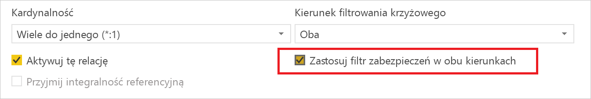
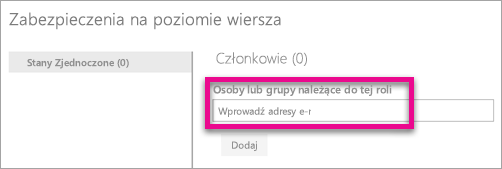

# Zabezpieczenia na poziomie wiersza w usłudze Power BI
<iframe width="560" height="315" src="https://www.youtube.com/embed/67fK0GoVQ80?showinfo=0" frameborder="0" allowfullscreen></iframe>

Zabezpieczenia na poziomie wiersza w usłudze Power BI mogą służyć do ograniczania dostępu do danych do konkretnych użytkowników. Filtry ograniczają dane na poziomie wiersza. Filtry można zdefiniować w ramach ról.

Można skonfigurować zabezpieczenia na poziomie wiersza dla modeli danych importowanych do usługi Power BI za pomocą programu Power BI Desktop. Można również skonfigurować zabezpieczenia na poziomie wiersza w zestawach danych, które korzystają z zapytań bezpośrednich, takich jak program SQL Server. Wcześniej można było implementować zabezpieczenia na poziomie wiersza tylko w ramach modeli usług Analysis Services poza usługą Power BI. Dla połączeń na żywo usług Analysis Services zabezpieczenia na poziomie wiersza są konfigurowane w modelu lokalnym. Opcja zabezpieczeń nie będzie widoczna dla zestawów danych w połączeniach na żywo.

[!INCLUDE [include-short-name](./includes/rls-desktop-define-roles.md)]

Domyślnie filtrowanie zabezpieczeń na poziomie wiersza korzysta z filtrów jednokierunkowych, niezależnie od tego, czy dla relacji skonfigurowano tryb jednokierunkowy, czy dwukierunkowy. Dwukierunkowy filtr krzyżowy można włączyć ręcznie za pomocą zabezpieczeń na poziomie wiersza, wybierając relację i zaznaczając pole wyboru **Zastosuj filtr zabezpieczeń w obu kierunkach**. To pole wyboru należy zaznaczyć podczas implementowania [dynamicznych zabezpieczeń na poziomie wiersza](https://docs.microsoft.com/en-us/sql/analysis-services/supplemental-lesson-implement-dynamic-security-by-using-row-filters), gdzie zabezpieczenia na poziomie wiersza są dostarczane na podstawie nazwy użytkownika lub identyfikatora logowania. 

Aby uzyskać więcej informacji, zobacz temat [Dwukierunkowe filtrowanie krzyżowe przy użyciu zapytania bezpośredniego w programie Power BI Desktop](desktop-bidirectional-filtering.md) oraz artykuł techniczny [Zabezpieczanie tabelarycznego semantycznego modelu analizy biznesowej](http://download.microsoft.com/download/D/2/0/D20E1C5F-72EA-4505-9F26-FEF9550EFD44/Securing the Tabular BI Semantic Model.docx).

[!INCLUDE [include-short-name](./includes/rls-desktop-view-as-roles.md)]

## Zarządzanie zabezpieczeniami modelu
Aby zarządzać zabezpieczeniami modelu danych, należy wykonać następujące czynności.

1. Wybierz **wielokropek (…)** dla zestawu danych.
2. Wybierz pozycję **Zabezpieczenia**.
   
   

Spowoduje to przejście do strony zabezpieczeń na poziomie wiersza, która umożliwia dodawanie członków do roli utworzonej w programie Power BI Desktop. Opcja Zabezpieczenia jest widoczna tylko dla właścicieli zestawu danych. Jeśli zestaw danych należy do grupy, opcja Zabezpieczenia będzie widoczna tylko dla administratorów tej grupy. 

Tworzenie i modyfikowanie ról jest możliwe tylko w programie Power BI Desktop.

## Praca z członkami
### Dodawanie członków
Można dodać członka do roli, wpisując adres e-mail lub nazwę użytkownika, grupy zabezpieczeń lub listy dystrybucyjnej, która ma zostać dodana. Ten członek musi należeć do organizacji. Nie można dodawać grup utworzonych w usłudze Power BI.

Liczba w nawiasach obok nazwy roli lub obok obszaru Członkowie informuje to tym, ilu członków jest przypisanych do roli.

### Usuwanie członków
Członków można usuwać, wybierając znak X obok ich nazwy. 

## Sprawdzanie poprawności roli w usłudze Power BI
Można zweryfikować, czy zdefiniowana rola działa prawidłowo, testując tę rolę. 

1. Wybierz **wielokropek (...)** obok roli.
2. Wybierz pozycję **Testuj dane jako rola**.

Zostaną wyświetlone raporty dostępne dla tej roli. Pulpity nawigacyjne nie są wyświetlane w tym widoku. Na niebieskim pasku powyżej będą widoczne zastosowane role.

Można testować inne role lub kombinację ról, wybierając pozycję **Wyświetlane jako**.

Można wybrać, aby wyświetlić dane jako określona osoba, lub wybrać kombinację dostępnych ról, aby sprawdzić poprawność ich działania. 

Aby powrócić do normalnego widoku, wybierz pozycję **Wróć do zabezpieczeń na poziomie wiersza**.

[!INCLUDE [include-short-name](./includes/rls-usernames.md)]

## Używanie zabezpieczeń na poziomie wiersza z obszarami roboczymi aplikacji w usłudze Power BI
Jeśli opublikujesz raport programu Power BI Desktop w obszarze roboczym aplikacji w usłudze Power BI, role będą stosowane do członków tylko do odczytu. W ustawieniach obszaru roboczego aplikacji należy wskazać, że członkowie mogą tylko wyświetlać zawartość usługi Power BI.

> [!WARNING]
> Jeśli skonfigurowano obszar roboczy aplikacji tak, aby członkowie mieli uprawnienia do edycji, role zabezpieczeń na poziomie wiersza nie będą do nich stosowane. Użytkownicy będą mogli wyświetlać wszystkie dane.
> 
> 

[!INCLUDE [include-short-name](./includes/rls-limitations.md)]

[!INCLUDE [include-short-name](./includes/rls-faq.md)]

## Następne kroki
[Zabezpieczenia na poziomie wiersza w programie Power BI Desktop](desktop-rls.md)  

Masz więcej pytań? [Zadaj pytanie społeczności usługi Power BI](http://community.powerbi.com/)

