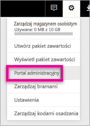
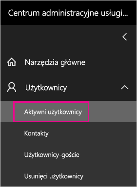
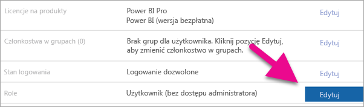
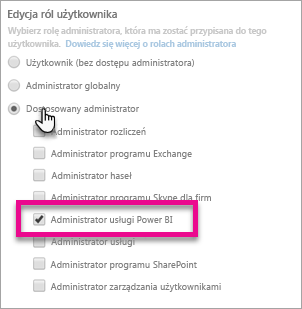
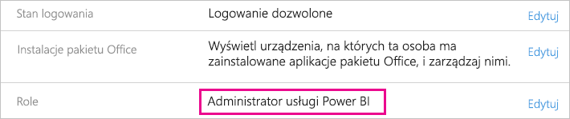

# <a name="understanding-the-power-bi-admin-role"></a>Opis roli administratora usługi Power BI
Dowiedz się, jak możesz używać roli administratora usługi Power BI w organizacji.

<iframe width="640" height="360" src="https://www.youtube.com/embed/PQRbdJgEm3k?showinfo=0" frameborder="0" allowfullscreen></iframe>

Rolę administratora usługi Power BI można przypisać do użytkowników, którzy powinni mieć dostęp do portalu administracyjnego usługi Power BI, jednocześnie nie przypisując im innych funkcji administracyjnych usługi Office 365. Przykładowo rola administratora globalnego. Jest przeznaczona dla osób, których zadaniem jest administracja usługi Power BI w organizacji.

Administratorzy usługi Office 365 mogą przypisywać użytkowników jako administratorów usługi Power BI w centrum administracyjnym usługi Office 365 lub za pośrednictwem skryptu programu PowerShell. Po przypisaniu użytkownika uzyska on dostęp do [portalu administracyjnego usługi Power BI](service-admin-portal.md). W tym miejscu użytkownik ma dostęp do metryk użycia obejmujących dzierżawę i może kontrolować użycie funkcji usługi Power BI w całej dzierżawie.



## <a name="using-the-office-365-admin-center-to-assign-a-role"></a>Używanie centrum administracyjnego usługi Office 365 do przypisywania roli
Aby przypisać użytkowników do roli administratora usługi Power BI w centrum administracyjnym usługi Office 365, możesz wykonać następujące czynności.

1. Przejdź do centrum administracyjnego usługi Office 365 i wybierz opcję **Użytkownicy** > **Aktywni użytkownicy**.
   
    
2. Wybierz użytkownika, któremu chcesz przypisać rolę.
3. Wybierz opcję **Edytuj** dla ról.
   
    
4. Wybierz opcję **Administrator dostosowany** > **Administrator usługi Power BI**
   
    
5. Wybierz pozycję **Zapisz**.

Rola tego użytkownika powinna uzyskać opcję **Administrator usługi Power BI**. Użytkownik będzie mieć teraz dostęp do [portalu administracyjnego usługi Power BI](service-admin-portal.md).



## <a name="using-powershell-to-assign-a-role"></a>Używanie programu PowerShell do przypisywania roli
Aby uruchomić polecenie programu PowerShell, musisz mieć zainstalowany moduł Azure Active Directory PowerShell.

### <a name="download-azure-ad-powershell-module"></a>Pobieranie modułu Azure AD PowerShell
[Pobieranie programu PowerShell usługi Azure Active Directory w wersji 2](https://github.com/Azure/azure-docs-powershell-azuread/blob/master/Azure%20AD%20Cmdlets/AzureAD/index.md)

[Pobieranie programu PowerShell usługi Azure Active Directory w wersji 1.1.166.0 GA](http://connect.microsoft.com/site1164/Downloads/DownloadDetails.aspx?DownloadID=59185)

### <a name="command-to-add-role-to-member"></a>Polecenie umożliwiające dodanie roli do użytkownika
**Polecenia programu Azure AD PowerShell w wersji 2**

Musisz pobrać identyfikator **ObjectId** dla roli **Administrator usługi Power BI**. Możesz uruchomić polecenie [Get-AzureADDirectoryRole](https://docs.microsoft.com/powershell/azuread/v2/get-azureaddirectoryrole), aby pobrać identyfikator **ObjectId**

```
PS C:\Windows\system32> Get-AzureADDirectoryRole

ObjectId                             DisplayName                        Description
--------                             -----------                        -----------
00f79122-c45d-436d-8d4a-2c0c6ca246bf Power BI Service Administrator     Full access in the Power BI Service.
250d1222-4bc0-4b4b-8466-5d5765d14af9 Helpdesk Administrator             Helpdesk Administrator has access to perform..
3ddec257-efdc-423d-9d24-b7cf29e0c86b Directory Synchronization Accounts Directory Synchronization Accounts
50daa576-896c-4bf3-a84e-1d9d1875c7a7 Company Administrator              Company Administrator role has full access t..
6a452384-6eb9-4793-8782-f4e7313b4dfd Device Administrators              Device Administrators
9900b7db-35d9-4e56-a8e3-c5026cac3a11 AdHoc License Administrator        Allows access manage AdHoc license.
a3631cce-16ce-47a3-bbe1-79b9774a0570 Directory Readers                  Allows access to various read only tasks in ..
f727e2f3-0829-41a7-8c5c-5af83c37f57b Email Verified User Creator        Allows creation of new email verified users.
```

W tym przypadku identyfikator ObjectId roli to 00f79122-c45d-436d-8d4a-2c0c6ca246bf.

Ponadto musisz znać identyfikatory **ObjectID** użytkowników. Możesz je znaleźć przy użyciu polecenia [Get-AzureADUser](https://docs.microsoft.com/powershell/azuread/v2/get-azureaduser).

```
PS C:\Windows\system32> Get-AzureADUser -SearchString 'tim@contoso.com'

ObjectId                             DisplayName UserPrincipalName      UserType
--------                             ----------- -----------------      --------
6a2bfca2-98ba-413a-be61-6e4bbb8b8a4c Tim         tim@contoso.com        Member
```

Aby dodać członka do roli, uruchom polecenie [Add-AzureADDirectoryRoleMember](https://docs.microsoft.com/powershell/azuread/v2/add-azureaddirectoryrolemember).

| Parametr | Opis |
| --- | --- |
| ObjectId |Identyfikator ObjectId roli. |
| RefObjectId |Identyfikatory ObjectId członków. |

```
Add-AzureADDirectoryRoleMember -ObjectId 00f79122-c45d-436d-8d4a-2c0c6ca246bf -RefObjectId 6a2bfca2-98ba-413a-be61-6e4bbb8b8a4c
```

**Polecenia programu Azure AD PowerShell w wersji 1**

Aby dodać członka do roli przy użyciu poleceń cmdlet usługi Azure AD w wersji 1, musisz uruchomić polecenie [Add-MsolRoleMember](https://docs.microsoft.com/powershell/msonline/v1/add-msolrolemember).

```
Add-MsolRoleMember -RoleMemberEmailAddress "tim@contoso.com" -RoleName "Power BI Service Administrator"
```

## <a name="limitations-and-considerations"></a>Ograniczenia i istotne zagadnienia
Rola administratora usługi Power BI nie zapewnia dostępu do następujących elementów.

* Możliwość modyfikowania użytkowników i licencji w centrum administracyjnym usługi Office 365.
* Dostęp do dzienników inspekcji. Aby uzyskać więcej informacji, zobacz [Korzystanie z inspekcji w ramach organizacji](service-admin-auditing.md).

## <a name="next-steps"></a>Następne kroki
[Portal administracyjny usługi Power BI](service-admin-portal.md)  
[Add-AzureADDirectoryRoleMember](https://docs.microsoft.com/powershell/azuread/v2/add-azureaddirectoryrolemember)  
[Add-MsolRoleMember](https://docs.microsoft.com/powershell/msonline/v1/add-msolrolemember)  
[Inspekcja usługi Power BI w organizacji](service-admin-auditing.md)  
[Administrowanie usługą Power BI w organizacji](service-admin-administering-power-bi-in-your-organization.md)  

Masz więcej pytań? [Zadaj pytanie społeczności usługi Power BI](http://community.powerbi.com/)

