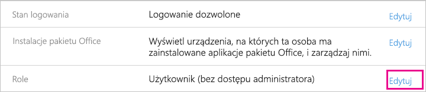

# <a name="understanding-the-power-bi-service-administrator-role"></a>Opis roli administratora usługi Power BI

Dowiedz się, jak możesz używać roli administratora usługi Power BI w organizacji. Użytkownicy pełniący tę rolę mają pełną kontrolę nad dzierżawą usługi Power BI i jej funkcjami administracyjnymi, z wyjątkiem licencjonowania.

<iframe width="640" height="360" src="https://www.youtube.com/embed/PQRbdJgEm3k?showinfo=0" frameborder="0" allowfullscreen></iframe>

Rolę administratora usługi Power BI można przypisać do użytkowników, którzy potrzebują dostępu do portalu administracyjnego usługi Power BI, jednocześnie nie przypisując im pełnych praw dostępu administratora usługi Office 365.

Administratorzy zarządzający użytkownikami usługi Office 365 przypisują użytkowników do roli administratora usługi Power BI w centrum administracyjnym usługi Office 365 lub za pomocą skryptu programu PowerShell. Po przypisaniu użytkownika może on uzyskiwać dostęp do [portalu administracyjnego usługi Power BI](service-admin-portal.md). W tym miejscu użytkownik ma dostęp do metryk użycia obejmujących dzierżawę i może kontrolować użycie funkcji usługi Power BI w całej dzierżawie.

## <a name="limitations-and-considerations"></a>Ograniczenia i istotne zagadnienia

Rola administratora usługi Power BI nie zapewnia dostępu do następujących funkcji:

* Możliwość modyfikowania użytkowników i licencji w centrum administracyjnym usługi Office 365.

* Dostęp do dzienników inspekcji. Aby uzyskać więcej informacji, zobacz [Korzystanie z inspekcji w ramach organizacji](service-admin-auditing.md).

## <a name="assign-users-to-the-admin-role-in-office-365"></a>Przypisywanie użytkowników do roli administratora w usłudze Office 365

Aby przypisać użytkowników do roli administratora usługi Power BI w centrum administracyjnym usługi Office 365, wykonaj poniższe kroki.

1. W centrum administracyjnym usługi Office 365 wybierz kolejno pozycje **Użytkownicy** > **Aktywni użytkownicy**.

    

1. Wybierz użytkownika, któremu chcesz przypisać rolę.

1. W obszarze **Role** wybierz pozycję **Edytuj**.

    

1. Wybierz kolejno pozycje **Administrator dostosowany** > **Administrator usługi Power BI**.

    

1. Wybierz kolejno pozycje **Zapisz** i **Zamknij**.

Rola tego użytkownika powinna uzyskać opcję **Administrator usługi Power BI**.


## <a name="assign-users-to-the-admin-role-with-powershell"></a>Przypisywanie użytkowników do roli administratora przy użyciu programu PowerShell

Do przypisywania użytkowników do ról służy również program PowerShell. Zarządzanie użytkownikami odbywa się w usłudze Azure Active Directory (Azure AD). Jeśli nie masz jeszcze modułu Azure AD PowerShell, [pobierz i zainstaluj najnowszą wersję](https://www.powershellgallery.com/packages/AzureAD/).

1. Najpierw pobierz identyfikator **ObjectId** roli **Administrator usługi Power BI**. Możesz uruchomić polecenie [Get-AzureADDirectoryRole](/powershell/module/azuread/get-azureaddirectoryrole), aby pobrać identyfikator **ObjectId**

    ```
    PS C:\Windows\system32> Get-AzureADDirectoryRole

    ObjectId                             DisplayName                        Description
    --------                             -----------                        -----------
    00f79122-c45d-436d-8d4a-2c0c6ca246bf Power BI Service Administrator     Full access in the Power BI Service.
    250d1222-4bc0-4b4b-8466-5d5765d14af9 Helpdesk Administrator             Helpdesk Administrator has access to perform..
    3ddec257-efdc-423d-9d24-b7cf29e0c86b Directory Synchronization Accounts Directory Synchronization Accounts
    50daa576-896c-4bf3-a84e-1d9d1875c7a7 Company Administrator              Company Administrator role has full access t..
    6a452384-6eb9-4793-8782-f4e7313b4dfd Device Administrators              Device Administrators
    9900b7db-35d9-4e56-a8e3-c5026cac3a11 AdHoc License Administrator        Allows access manage AdHoc license.
    a3631cce-16ce-47a3-bbe1-79b9774a0570 Directory Readers                  Allows access to various read only tasks in ..
    f727e2f3-0829-41a7-8c5c-5af83c37f57b Email Verified User Creator        Allows creation of new email verified users.
    ```

    W tym przypadku identyfikator **ObjectId** roli to 00f79122-c45d-436d-8d4a-2c0c6ca246bf.

1. Następnie pobierz identyfikator **ObjectId** użytkownika. Możesz je znaleźć przy użyciu polecenia [Get-AzureADUser](/powershell/module/azuread/get-azureaduser).

    ```
    PS C:\Windows\system32> Get-AzureADUser -SearchString 'tim@contoso.com'

    ObjectId                             DisplayName UserPrincipalName      UserType
    --------                             ----------- -----------------      --------
    6a2bfca2-98ba-413a-be61-6e4bbb8b8a4c Tim         tim@contoso.com        Member
    ```

1. Aby dodać członka do roli, uruchom polecenie [Add-AzureADDirectoryRoleMember](/powershell/module/azuread/add-azureaddirectoryrolemember).

    | Parametr | Opis |
    | --- | --- |
    | ObjectId |Identyfikator ObjectId roli. |
    | RefObjectId |Identyfikatory ObjectId członków. |

    ```powershell
    Add-AzureADDirectoryRoleMember -ObjectId 00f79122-c45d-436d-8d4a-2c0c6ca246bf -RefObjectId 6a2bfca2-98ba-413a-be61-6e4bbb8b8a4c
    ```

## <a name="next-steps"></a>Następne kroki

[Administrowanie usługą Power BI w organizacji](service-admin-administering-power-bi-in-your-organization.md)  
[Portal administracyjny usługi Power BI](service-admin-portal.md)  

Masz więcej pytań? [Zadaj pytanie społeczności usługi Power BI](http://community.powerbi.com/)