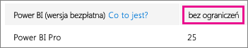
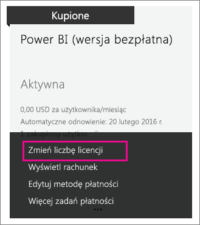

# Usługa Power BI (wersja bezpłatna) w organizacji
Zostanie przedstawiony sposób użycia oferty usługi Power BI (wersja bezpłatna) w organizacji. Organizacja oznacza dzierżawę oraz możliwość zarządzania użytkownikami i usługami w tej dzierżawie. Jako administrator możesz kontrolować przypisania licencji i umożliwić użytkownikom indywidualne rejestrowanie się. Omówimy licencję usługi Power BI (wersja bezpłatna) oraz możliwość kontrolowania indywidualnego rejestrowania się.

## Porównanie indywidualnego rejestrowania się i przypisywania licencji
Użytkownicy w organizacji mogą uzyskać dostęp do usługi Power BI na dwa różne sposoby. Mogą indywidualnie rejestrować się w usłudze Power BI lub można im przypisać licencję usługi Power BI w portalu administracyjnym usługi Office 365.

Umożliwienie indywidualnego rejestrowania się zmniejsza obciążenie administratorów organizacji, zapewniając możliwość bezpłatnej rejestracji użytkownikom zainteresowanym usługą Power BI.

Aby uzyskać większą kontrolę, można zablokować możliwość indywidualnego rejestrowania i samodzielnie przydzielać licencje usługi Power BI w centrum administracyjnym usługi Office 365. Dzięki temu można określić, kto może uzyskiwać dostęp do jakich usług w organizacji. Jest to również doskonałe rozwiązanie w przypadku konieczności przeprowadzenia inspekcji, gdy niezbędna jest wiedza na temat dostępu użytkowników do poszczególnych usług.

## Jak uzyskać blok licencji bez ograniczeń
W centrum administracyjnym usługi Office 365 w obszarze **Rozliczenia** > **Licencje** może być widoczna usługa Power BI (wersja bezpłatna) z licencjami bez ograniczeń.

Ten blok licencji będzie wyświetlany od momentu indywidualnego zarejestrowania się użytkownika w usłudze Power BI po raz pierwszy. Podczas tego procesu blok licencji jest dołączany do organizacji, a licencja zostaje przypisana do rejestrującego się użytkownika.

Jeśli blokujesz możliwość indywidualnego rejestrowania się i nikt się nie zarejestrował, ten blok licencji nie będzie wyświetlany. Można umożliwić indywidualne rejestrowanie się użytkowników i poprosić użytkownika o zarejestrowanie się lub uzyskać bezpłatne licencje za pomocą przepływu dodawania subskrypcji usługi Office 365, który omówiono w dalszej części tego artykułu.

Gdy blok licencji usługi Power BI (wersja bezpłatna) jest dostępny, można przydzielać te licencje użytkownikom. Aby uzyskać więcej informacji na temat przydzielania licencji, zobacz [Przydzielanie licencji użytkownikom w usłudze Office 365](https://support.office.com/article/Assign-or-unassign-licenses-for-Office-365-for-business-997596b5-4173-4627-b915-36abac6786dc).

## Uzyskiwanie bezpłatnych licencji za pomocą opcji Dodaj subskrypcję w usłudze Office 365
1. Przejdź do [centrum administracyjnego usługi Office 365](https://portal.office.com/admin/default.aspx).
2. W okienku nawigacji po lewej stronie wybierz pozycję **Rozliczenia** > **Subskrypcje**.
3. Wybierz pozycję **Dodaj subskrypcje +** znajdującą się po prawej stronie.
4. W obszarze Inne plany najedź kursorem na **wielokropek (…)** przy usłudze Power BI (wersja bezpłatna) i wybierz pozycję **Kup teraz**.
   
    
5. Wprowadź liczbę licencji, które chcesz dodać, i wybierz pozycję **Sfinalizuj zakup** lub **Dodaj do koszyka**.
   
   > [!NOTE]
   > Później, w razie potrzeby, możesz dodać więcej licencji.
   > 
   > 
6. Wprowadź informacje wymagane w procesie finalizacji zakupu.

To podejście nie powoduje zakupu, ale konieczne jest wprowadzenie informacji o karcie kredytowej do rozliczeń lub wybranie opcji fakturowania.

Jeśli zechcesz później dodać więcej licencji, wróć do obszaru **Dodawanie subskrypcji**, a następnie wybierz pozycję **Zmień liczbę licencji** dla usługi Power BI (wersja bezpłatna).

Teraz możesz przydzielić te licencje użytkownikom. Aby uzyskać więcej informacji na temat przydzielania licencji, zobacz [Przydzielanie licencji użytkownikom w usłudze Office 365](https://support.office.com/article/Assign-or-unassign-licenses-for-Office-365-for-business-997596b5-4173-4627-b915-36abac6786dc).

## Włączanie lub wyłączanie indywidualnego rejestrowania się użytkowników w usłudze Azure Active Directory
Jako administrator możesz wybrać, czy chcesz włączyć, czy wyłączyć indywidualne rejestrowanie się użytkowników w ramach usługi Azure Active Directory (AAD). Jeśli wiesz, jak korzystać z poleceń programu PowerShell usługi AAD, możesz samodzielnie włączać lub wyłączać subskrypcje ad hoc. [Dowiedz się więcej](https://technet.microsoft.com/library/jj151815.aspx)

Ustawienie usługi AAD, które kontroluje tę opcję, to **AllowAdHocSubscriptions**. W przypadku większości dzierżaw dla tego ustawienia określona jest wartość true, co oznacza, że jest ono włączone. Jeśli klient nabył usługę Power BI za pośrednictwem partnera, domyślnie dla tego ustawienia może być ustawiona wartość false, co oznacza, że jest ono wyłączone.

1. Najpierw musisz zalogować się do usługi Azure Active Directory przy użyciu poświadczeń usługi Office 365. Pierwszy wiersz spowoduje wyświetlenie monitu o podanie poświadczeń. Drugi wiersz spowoduje nawiązanie połączenia z usługą Azure Active Directory.
   
     $msolcred = get-credential   connect-msolservice -credential $msolcred
   
   
2. Po zalogowaniu się można wydać następujące polecenie, aby wyświetlić bieżącą konfigurację dzierżawy.
   
     Get-MsolCompanyInformation | fl AllowAdHocSubscriptions
3. Przy użyciu tego polecenia można włączyć ($true) lub wyłączyć ($false) opcję AllowAdHocSubscriptions.
   
     Set-MsolCompanySettings -AllowAdHocSubscriptions $true

> [!NOTE]
> Blokada uniemożliwia rejestrowanie się w usłudze Power BI nowym użytkownikom w organizacji. Użytkownicy, którzy zarejestrują się w usłudze Power BI przed wyłączeniem nowych rejestracji dla organizacji, zachowają swoje licencje.
> 
> 

## Następne kroki
[Rejestracja samoobsługowa w usłudze Power BI](service-self-service-signup-for-power-bi.md)  
[Zakup usługi Power BI Pro](service-admin-purchasing-power-bi-pro.md)  
[Rejestrowanie się w usłudze Power BI (wersja bezpłatna) przy użyciu niestandardowej dzierżawy usługi Azure Active Directory](developer/create-an-azure-active-directory-tenant.md)  
[Power BI Premium — co to jest?](service-premium.md)  
[Oficjalny dokument firmy Microsoft na temat usługi Power BI Premium](https://aka.ms/pbipremiumwhitepaper)  

Masz więcej pytań? [Zadaj pytanie społeczności usługi Power BI](http://community.powerbi.com/)

