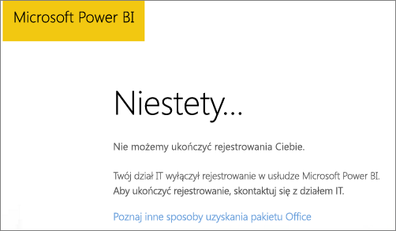
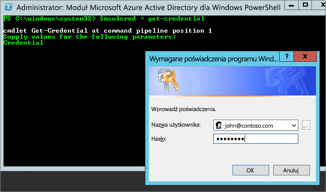

# Nie można dodać usługi Power BI do subskrypcji partnera usługi Office 365
Firmy mogą sprzedawać usługę Office 365 w postaci powiązanej i zintegrowanej z ich własnymi rozwiązaniami, co zapewnia klientom końcowym jeden punkt kontaktu w zakresie zakupów, rozliczeń i pomocy technicznej.

Jeśli interesuje Cię uzyskanie usługi Power BI (oprócz Twojej subskrypcji usługi Office 365), zalecamy skontaktowanie się z odpowiednim partnerem. Jeśli partner nie oferuje usługi Power BI, istnieje szereg innych możliwości.

1. Możesz kupić usługę innym kanałem, bezpośrednio od firmy Microsoft lub od innego partnera. Ta opcja nie jest dostępna dla niektórych klientów — zależnie od ich relacji z partnerem. Można to sprawdzić, przechodząc do **portalu administracyjnego usługi Office 365** > **Rozliczenia** > **Subskrypcje**. Jeśli widzisz pozycję **Subskrypcje**, możesz kupić usługę bezpośrednio od firmy Microsoft lub możesz się skontaktować z partnerem oferującym usługę Power BI.
   
    
2. Jeśli nie widzisz pozycji **Subskrypcje** w obszarze **Rozliczenia**, nie możesz dokonać zakupu bezpośrednio od firmy Microsoft ani od innego partnera. 
   
   

Jeśli nie możesz kupić usługi Power BI w sposób bezpośredni, nadal masz kilka opcji zakupu, w zależności od rodzaju subskrypcji usługi Power BI, która Cię interesuje.

[Usługa Power BI (wersja bezpłatna)](#power-bi-free)

[Usługi Power BI Pro i Premium](#power-bi-pro)

## Usługa Power BI (wersja bezpłatna)
Jeśli bezpłatna wersja usługi Power BI jest dla Ciebie wystarczająca, możesz utworzyć konto w celu korzystania z usługi bezpłatnej. Domyślnie opcja tworzenia konta przez użytkowników indywidualnych (znana także jako subskrypcja ad hoc) jest wyłączona. Podczas próby utworzenia konta w usłudze Power BI zostanie wyświetlony komunikat informujący, że dział informatyczny wyłączył możliwość tworzenia kont w usłudze Microsoft Power BI.

    Your IT department has turned off signup for Microsoft Power BI.

Aby włączyć subskrypcje ad-hoc, możesz skontaktować się ze swoim partnerem i poprosić o ich włączenie. Jeśli jesteś administratorem dzierżawy i wiesz, jak korzystać z poleceń programu PowerShell usługi Azure Active Directory, możesz samodzielnie włączyć subskrypcje ad hoc. [Dowiedz się więcej](https://technet.microsoft.com/library/jj151815.aspx)

1. Najpierw musisz zalogować się do usługi Azure Active Directory przy użyciu poświadczeń usługi Office 365. Pierwszy wiersz spowoduje wyświetlenie monitu o podanie poświadczeń. Drugi wiersz spowoduje nawiązanie połączenia z usługą Azure Active Directory.
   
        $msolcred = get-credential
        connect-msolservice -credential $msolcred
   
    
2. Po zalogowaniu się możesz wpisać poniższe polecenie, aby włączyć możliwość tworzenia kont w bezpłatnej wersji usługi.
   
        Set-MsolCompanySettings -AllowAdHocSubscriptions $true

## Usługi Power BI Pro i Premium
Jeśli chcesz kupić subskrypcję usługi Power BI Pro lub Power BI Premium, razem ze swoim partnerem rozważ dostępne opcje.

* Partner zgadza się dodać usługę Power BI do swojej oferty, aby umożliwić Ci jej zakup u siebie.
* Partner może zaproponować Ci model pozwalający na zakup usługi Power BI bezpośrednio w firmie Microsoft lub od innego partnera, który ma w swojej ofercie usługę Power BI.

W tym klipie wideo przedstawiono zagadnienia związane z syndykacją usługi Office 365 i zakupem usługi Power BI:

<iframe width="560" height="315" src="https://www.youtube.com/embed/C357phT94A8" frameborder="0" allowfullscreen></iframe>

## Następne kroki
[Zarządzanie usługą Azure AD przy użyciu programu Windows PowerShell](https://technet.microsoft.com/library/jj151815.aspx)  
[Power BI Premium — co to jest?](service-premium.md)

Masz więcej pytań? [Zadaj pytanie społeczności usługi Power BI](http://community.powerbi.com/)

