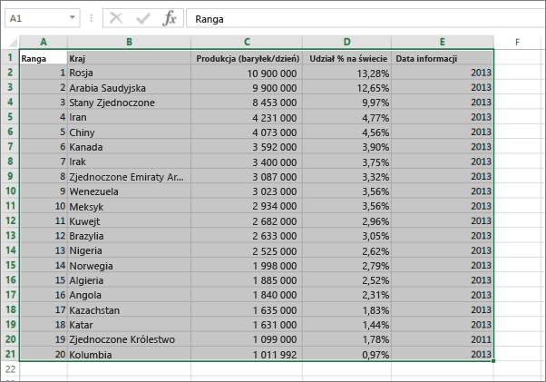

# Błąd: nie można odnaleźć żadnych danych w skoroszycie programu Excel

>[!NOTE]
>Ten artykuł dotyczy programu Excel 2007 lub nowszego.

Podczas importowania skoroszytu programu Excel do usługi Power BI może zostać wyświetlony następujący błąd:

*Błąd: nie można odnaleźć żadnych danych w skoroszycie programu Excel. Dane mogą być niepoprawnie sformatowane. Edytuj skoroszyt w programie Excel i zaimportuj go ponownie.*

## Szybkie rozwiązanie
1. Edytuj skoroszyt w programie Excel.
2. Zaznacz zakres komórek zawierających dane. Pierwszy wiersz powinien zawierać nagłówki kolumn (nazwy kolumn).
3. Naciśnij klawisze **Ctrl+T**, aby utworzyć tabelę.
4. Zapisz skoroszyt.
5. Wróć do usługi Power BI i zaimportuj skoroszyt ponownie lub jeśli pracujesz w programie Excel 2016, a skoroszyt został wcześniej zapisany w usłudze OneDrive dla Firm, w programie Excel kliknij pozycję Plik > Publikuj.

## Szczegóły
### Przyczyna
W programie Excel można utworzyć **tabelę** obejmującą zakres komórek, co pozwala łatwiej sortować, filtrować i formatować dane.

Podczas importowania skoroszytu programu Excel usługa Power BI wyszukuje te tabele i importuje je do zestawu danych; jeśli nie znajdzie żadnej tabeli, zostanie wyświetlony ten komunikat o błędzie.

### Rozwiązanie
1. Otwórz skoroszyt w programie Excel. 
    >[!NOTE]
    >Ilustracje w tym temacie pochodzą z programu Excel 2013. Jeśli używasz innej wersji, elementy mogą wyglądać inaczej, jednak kroki są takie same.
    
    
2. Zaznacz zakres komórek zawierających dane. Pierwszy wiersz powinien zawierać nagłówki kolumn (nazwy kolumn):
   
    
3. Na wstążce na karcie **WSTAW** kliknij pozycję **Tabela** (lub naciśnij skrót **Ctrl+T**).
   
    
4. Zostanie wyświetlone następujące okno dialogowe. Upewnij się, że pole **Moja tabela ma nagłówki** zostało zaznaczone i wybierz przycisk **OK**:
   
    
5. Dane zostaną sformatowane jako tabela:
   
    
6. Zapisz skoroszyt.
7. Wróć do usługi Power BI. Wybierz pozycję Pobierz dane w dolnej części okienka nawigacji po lewej stronie.
   
    
8. W polu **Pliki** wybierz opcję **Pobierz**.
   
    
9. Zaimportuj ponownie skoroszyt programu Excel. Tym razem proces importu powinien znaleźć tabelę i zakończyć się powodzeniem.
   
    W przypadku dalszych problemów z importem skontaktuj się z nami, klikając pozycję **Społeczność ** w menu pomocy:
   
    
