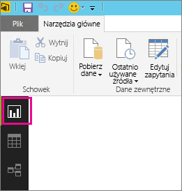
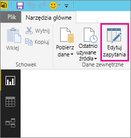
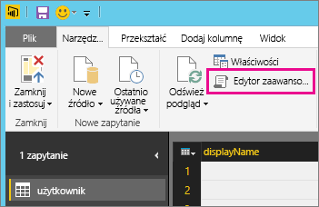
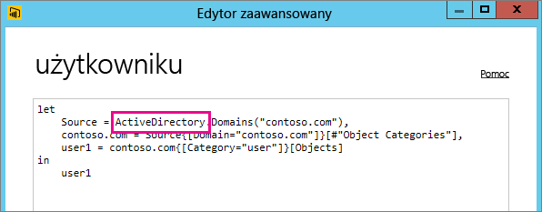

# Rozwiązywanie problemów ze źródłem danych, którego odświeżanie nie jest obsługiwane
Podczas próby konfigurowania zaplanowanego odświeżania zestawu danych może zostać wyświetlony błąd.

        You cannot schedule refresh for this dataset because it gets data from sources that currently don’t support refresh.

Dzieje się tak, jeśli odświeżanie źródła danych używanego w programie Power BI Desktop nie jest obsługiwane. Musisz ustalić, czy używane źródło danych znajduje się na liście obsługiwanych źródeł danych zawartej w artykule [Odświeżanie danych w usłudze Power BI](refresh-data.md). 

## Znajdowanie źródła danych
Jeśli nie masz pewności, jakie źródło danych jest używane, możesz to sprawdzić za pomocą poniższych kroków w programie Power BI Desktop.  

1. W programie Power BI Desktop przejdź do okienka **Raport**.  
   
2. Wybierz pozycję **Edytuj zapytania** na wstążce.  
   
3. Wybierz pozycję **Edytor zaawansowany**.  
   
4. Zanotuj nazwę dostawcy źródła.  W tym przykładzie dostawca to ActiveDirectory.  
   
5. Sprawdź, czy dostawca znajduje się na liście obsługiwanych źródeł danych w artykule [Odświeżanie danych w usłudze Power BI](refresh-data.md).  Zobaczysz, że odświeżanie źródła danych Active Directory nie jest obsługiwane.  

## Następne kroki
[Odświeżanie danych](refresh-data.md)  
[Power BI Gateway — Personal](personal-gateway.md)  
[Lokalna brama danych](service-gateway-onprem.md)  
[Rozwiązywanie problemów z lokalną bramą danych](service-gateway-onprem-tshoot.md)  
[Rozwiązywanie problemów z bramą Power BI Gateway — Personal](service-admin-troubleshooting-power-bi-personal-gateway.md)  

Masz więcej pytań? [Zadaj pytanie społeczności usługi Power BI](http://community.powerbi.com/)

