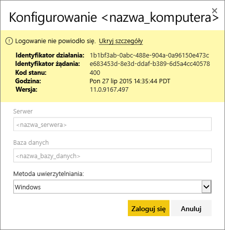

# Rozwiązywanie problemów z bramą Power BI Gateway – Personal
W tym temacie przedstawiono niektóre typowe problemy, które mogą wystąpić w przypadku korzystania z bramy Power BI Gateway — Personal.

> [!NOTE]
> Bieżąca wersja bramy do użytku osobistego to **Lokalna brama danych (osobista)**. Zaktualizuj swoją instalację, aby korzystać z tej wersji.
> 
> 

## Aktualizowanie do najnowszej wersji
Gdy wersja bramy jest nieaktualna, może pojawiać się wiele problemów.  Warto dbać o to, aby mieć zawsze najnowszą wersję.  Jeśli brama nie była aktualizowana przez miesiąc lub dłużej, warto rozważyć zainstalowanie najnowszej wersji bramy i sprawdzić, czy możliwe będzie odtworzenie problemu.

## Instalacja
**Brama osobista jest w wersji 64-bitowej** — jeśli maszyna jest w wersji 32-bitowej, nie będzie można zainstalować bramy osobistej. System operacyjny musi być w wersji 64-bitowej. Musisz zainstalować 64-bitową wersję systemu Windows lub zainstalować bramę osobistą na maszynie w wersji 64-bitowej.

**Nie można zainstalować bramy osobistej jako usługi, nawet jeśli jesteś administratorem lokalnym na komputerze** — instalacja może zakończyć się niepowodzeniem, jeśli użytkownik znajduje się w lokalnej grupie administratorów na komputerze, ale zasady grupy nie zezwalają na logowanie się przy użyciu danej nazwy użytkownika jako usługa.  W tej chwili upewnij się, że zasady grupy umożliwiają użytkownikowi logowanie jako usługa. Pracujemy nad rozwiązaniem tego problemu. [Dowiedz się więcej](https://technet.microsoft.com/library/cc739424.aspx)

**Upłynął limit czasu operacji** — ta sytuacja występuje często, gdy komputer (maszyna fizyczna lub wirtualna), na którym instalujesz bramę osobistą, ma procesor z pojedynczym rdzeniem. Zamknij wszystkie aplikacje, wyłącz wszystkie procesy inne niż niezbędne i spróbuj zainstalować ponownie.

**Nie można zainstalować bramy zarządzania danymi lub łącznika Analysis Services Connector na tym samym komputerze, co brama osobista** — jeśli już zainstalowano łącznik Analysis Services Connector lub bramę zarządzania danymi, należy najpierw odinstalować łącznik lub bramę, a następnie ponownie spróbować zainstalować bramę osobistą.

> [!NOTE]
> Jeśli podczas instalacji wystąpi problem, informacje ułatwiające rozwiązanie problemu mogą znajdować się w dziennikach instalacji. Zobacz sekcję [Dzienniki instalacji](#SetupLogs), aby uzyskać więcej informacji.
> 
> 

 **Konfiguracja serwera proxy** — mogą wystąpić problemy z konfigurowaniem bramy osobistej, jeśli środowisko wymaga użycia serwera proxy. Aby dowiedzieć się więcej na temat sposobu konfigurowania informacje o serwerze proxy, zobacz [Konfigurowanie ustawień serwera proxy dla bram Power BI Gateway](service-gateway-proxy.md)

## Planowanie odświeżania
**Błąd: brak poświadczeń przechowywanych w chmurze.**

Ten błąd może wystąpić w obszarze ustawień dla \<zestawu danych\>, jeśli zaplanowano odświeżanie, a następnie odinstalowano i ponownie zainstalowano bramę osobistą. Po odinstalowaniu bramy osobistej poświadczenia źródła danych dla zestawu danych, który został skonfigurowany do odświeżenia, są usuwane z usługi Power BI.

**Rozwiązanie:** w usłudze Power BI przejdź do ustawień odświeżania dla zestawu danych. W obszarze Zarządzanie źródłami danych dla dowolnego źródła danych z błędem kliknij link Edytuj poświadczenia, a następnie ponownie zaloguj się do źródła danych.

**Błąd: poświadczenia podane dla zestawu danych są nieprawidłowe. Zaktualizuj poświadczenia w ramach operacji odświeżania lub w oknie dialogowym Ustawienia źródła danych, aby kontynuować.**

**Rozwiązanie**: wyświetlenie komunikatu dotyczącego poświadczeń może oznaczać, że:

* Należy upewnić się, że nazwy użytkowników i hasła używane do logowania do źródeł danych są aktualne. W usłudze Power BI przejdź do ustawień odświeżania dla zestawu danych. W oknie Zarządzanie źródłami danych kliknij pozycję Edytuj poświadczenia, aby zaktualizować poświadczenia dla źródła danych.
* Nie będzie można odświeżyć zestawów połączonych danych między źródłem chmury i źródłem lokalnym w ramach pojedynczego zapytania, jeśli jedno ze źródeł używa funkcji OAuth do uwierzytelniania. Przykładem takiej sytuacji jest zestaw połączonych danych między usługą CRM Online i lokalnym programem SQL Server. Ta operacja zakończy się niepowodzeniem, ponieważ usługa CRM Online wymaga uwierzytelniania OAuth.
  
  Jest to znany problem, który obecnie analizujemy. Aby obejść ten problem, używaj oddzielnego zapytania dla źródła chmury i źródła lokalnego, a do ich łączenia używaj zapytania scalającego lub dołączającego.

**Błąd: nieobsługiwane źródło danych.**

**Rozwiązanie:** wyświetlenie komunikatu o nieobsługiwanym źródle danych w ustawieniach planowania odświeżania może oznaczać, że: 

* Źródło danych nie jest obecnie obsługiwane na potrzeby odświeżania w usłudze Power BI. 
* Skoroszyt programu Excel nie zawiera modelu danych, tylko dane arkusza kalkulacyjnego. Usługa Power BI aktualnie obsługuje odświeżanie, tylko jeśli przekazany skoroszyt programu Excel zawiera model danych. Podczas importowania danych za pomocą dodatku Power Query w programie Excel pamiętaj, aby wybrać opcję ładowania danych do modelu danych. Dzięki temu dane na pewno zostaną zaimportowane do modelu danych. 

**Błąd: [nie można połączyć danych] &lt;część_zapytania&gt;/&lt;...&gt;/&lt;...&gt; uzyskuje dostęp do źródeł danych z poziomami prywatności, które nie mogą być używane razem. Skompiluj ponownie tę kombinację danych.**

**Rozwiązanie**: ten błąd występuje z powodu ograniczeń dotyczących poziomów prywatności i używanych typów źródeł danych. [Dowiedz się więcej](refresh-enable-fast-combine.md)

**Błąd: błąd źródła danych: nie można przekonwertować wartości „\[Tabela\]” na typ Tabela.**

**Rozwiązanie**: ten błąd występuje z powodu ograniczeń dotyczących poziomów prywatności i używanych typów źródeł danych. [Dowiedz się więcej](refresh-enable-fast-combine.md)

**Błąd: za mało miejsca dla tego wiersza.**

Ta sytuacja wystąpi, jeśli rozmiar pojedynczego wiersza będzie większy niż 4 MB. Należy określić, który wiersz pochodzi ze źródła danych i spróbować go odfiltrować w celu zmniejszenia jego rozmiaru.

## Źródła danych
**Brak dostawcy danych** — brama osobista jest tylko w wersji 64-bitowej. Wymaga ona zainstalowania 64-bitowej wersji dostawców danych na tym samym komputerze, na którym zainstalowano tę bramę osobistą. Jeśli na przykład źródło danych w zestawie danych to program Microsoft Access, należy zainstalować 64-bitowego dostawcę ACE na tym samym komputerze, na którym zainstalowano bramę osobistą.  

>[!NOTE]
>Jeśli korzystasz z 32-bitowej wersji programu Excel, nie możesz zainstalować 64-bitowej wersji dostawcy ACE na tym samym komputerze.

**Uwierzytelnianie systemu Windows nie jest obsługiwane w przypadku bazy danych programu Access** — usługa Power BI aktualnie obsługuje tylko anonimowy dostęp do bazy danych programu Access. Pracujemy nad włączaniem uwierzytelniania systemu Windows na potrzeby bazy danych programu Access.

**Błąd logowania podczas wprowadzania poświadczeń dla źródła danych** — jeśli wystąpi błąd podobny do poniższego podczas wprowadzania poświadczeń systemu Windows dla źródła danych, być może nadal używasz starszej wersji bramy osobistej. [Zainstaluj najnowszą wersję bramy Power BI Gateway — Personal](https://powerbi.microsoft.com/gateway/).

  

**Błąd: błąd logowania w przypadku wybrania uwierzytelniania systemu Windows dla źródła danych przy użyciu dostawcy ACE OLEDB** — jeśli podczas wprowadzania poświadczeń źródła danych dla źródła danych przy użyciu dostawcy ACE OLEDB zostanie wyświetlony następujący błąd:

Usługa Power BI aktualnie nie obsługuje uwierzytelniania systemu Windows dla źródła danych przy użyciu dostawcy ACE OLEDB.

**Rozwiązanie:** aby obejść ten błąd, można wybrać opcję Uwierzytelnianie anonimowe. W przypadku starszej wersji dostawcy ACE OLEDB poświadczenia anonimowe są odpowiednikiem poświadczeń systemu Windows.

## Odświeżanie kafelka
Jeśli wystąpi błąd związany z odświeżaniem kafelka pulpitu nawigacyjnego, zapoznaj się z poniższym artykułem.

[Rozwiązywanie problemów z błędami kafelków](refresh-troubleshooting-tile-errors.md)

## Narzędzia do rozwiązywania problemów
### Historia odświeżania
**Historia odświeżania** może pomóc w zidentyfikowaniu błędów, które wystąpiły, a także w uzyskaniu przydatnych danych, jeśli musisz utworzyć żądanie obsługi. Można przeglądać operacje zaplanowane oraz przeprowadzane na żądanie. Oto sposób uzyskiwania dostępu do **historii odświeżania**.

1. W okienku nawigacji usługi Power BI w obszarze **Zestawy danych** wybierz zestaw danych &gt; otwórz menu &gt; **Zaplanuj odświeżanie**.
   
2. W obszarze **Ustawienia dla...** &gt; **Planowanie odświeżania** wybierz pozycję **Historia odświeżania**.  
   
   
   

### Dzienniki zdarzeń
Istnieje kilka dzienników zdarzeń, które zawierają potrzebne informacje. Dwa pierwsze — **Brama zarządzania danymi** i **PowerBIGateway** — są dostępne, jeśli jesteś administratorem danej maszyny.  Jeśli nie jesteś administratorem i korzystasz z bramy osobistej, wpisy dziennika będą widoczne w dzienniku **aplikacji**.

Dzienniki **Brama zarządzania danymi** i **PowerBIGateway** są dostępne w obszarze **Dzienniki aplikacji i usług**.

### Śledzenie za pomocą narzędzia Fiddler
[Fiddler](http://www.telerik.com/fiddler) to bezpłatne narzędzie firmy Telerik, które monitoruje ruch HTTP.  Dzięki niemu można sprawdzić ruch przychodzący i wychodzący w ramach usługi Power BI z maszyny klienckiej. W ten sposób można ujawnić błędy i inne istotne informacje.

### Dzienniki instalacji
Jeśli nie można zainstalować **bramy osobistej**, zobaczysz link umożliwiający wyświetlenie dziennika instalacji. Może on zawierać szczegółowe informacje o błędzie. Są to dzienniki instalacji systemu Windows, znane również jako dzienniki MSI. Mogą być one stosunkowo skomplikowane i trudne do odczytania. Przeważnie błąd wynikowy będzie znajdować się w dolnej części. Ustalenie jego przyczyny nie będzie łatwe. Może on wystąpić w konsekwencji błędów w innym dzienniku lub wynikać z błędu znajdującego się na wyższym poziomie w dzienniku.

Możesz również przejść do **folderu Temp** (%temp%) i poszukać plików, których nazwy zaczynają się od **Power\_BI\_**.

> [!NOTE]
> Przejście do folderu %temp% może spowodować przeniesienie do podfolderu folderu temp.  Pliki **Power\_BI\_** będą znajdować się w folderze głównym katalogu temp.  Być może trzeba będzie przejść w górę o jeden lub dwa poziomy.
> 
> 

## Następne kroki
[Konfigurowanie ustawień serwera proxy dla bram Power BI Gateway](service-gateway-proxy.md)  
[Odświeżanie danych](refresh-data.md)  
[Power BI Gateway — Personal](personal-gateway.md)  
[Rozwiązywanie problemów z błędami kafelków](refresh-troubleshooting-tile-errors.md)  
[Rozwiązywanie problemów z lokalną bramą danych](service-gateway-onprem-tshoot.md)  
Masz więcej pytań? [Odwiedź społeczność usługi Power BI](http://community.powerbi.com/)

