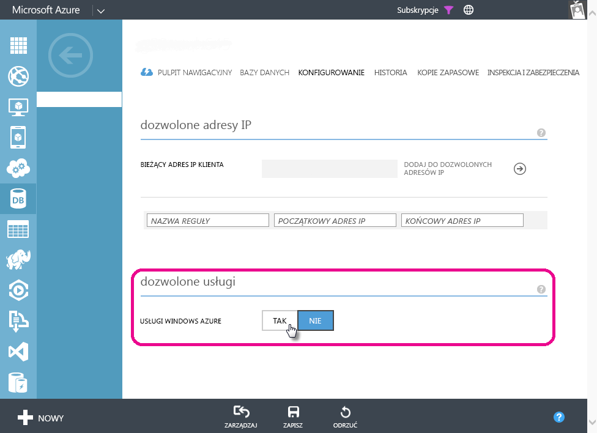

# Rozwiązywanie problemów z zaplanowanym odświeżaniem baz danych Azure SQL Database w usłudze Power BI
Aby uzyskać szczegółowe instrukcje dotyczące konfigurowania zaplanowanego odświeżania, zobacz [Odświeżanie danych w usłudze Power BI](refresh-data.md).

Jeśli konfigurujesz zaplanowane odświeżanie bazy danych Azure SQL Database i w trakcie tego procesu wystąpi błąd z kodem 400 podczas edytowania poświadczeń, spróbuj wykonać następujące czynności, aby skonfigurować odpowiednią regułę zapory:

1. Zaloguj się do portalu zarządzania platformy Azure
2. Przejdź do serwera Azure SQL, dla którego konfigurujesz odświeżanie
3. W sekcji usług dozwolonych włącz opcję „Usługi platformy Microsoft Azure”

  

Masz więcej pytań? [Odwiedź społeczność usługi Power BI](http://community.powerbi.com/)

