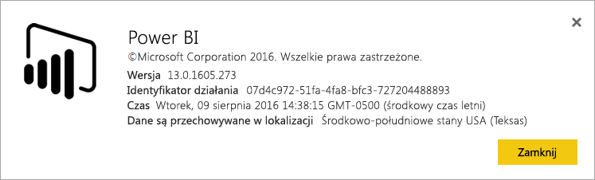
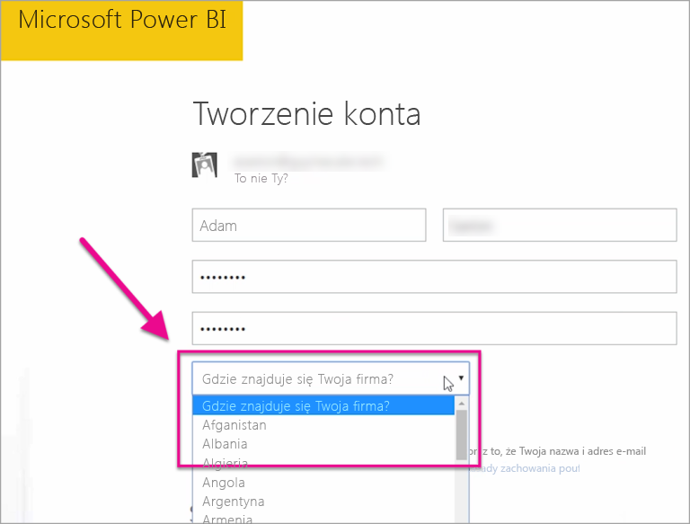

# Gdzie znajduje się moja dzierżawa usługi Power BI?
<iframe width="560" height="315" src="https://www.youtube.com/embed/0fOxaHJPvdM?showinfo=0" frameborder="0" allowfullscreen></iframe>

Dowiedz się, gdzie znajduje się Twoja dzierżawa usługi Power BI i jak jest wybierana ta lokalizacja. Ważne jest, aby to zrozumieć, ponieważ może to wpływać na interakcje z usługą.

## Jak ustalić, gdzie znajduje się Twoja dzierżawa usługi Power BI
Aby znaleźć region, gdzie znajduje się Twoja dzierżawa, możesz wykonać następujące czynności.

1. Wybierz znak **?** w usłudze Power BI.
2. Wybierz pozycję **Informacje o usłudze Power BI**.
3. Wyszukaj wartość obok pozycji **Twoje dane są przechowywane w**. Jest to region, w którym się znajdujesz.

## Jak jest wybierany region danych
Region danych zależy od kraju, który został wybrany podczas pierwszego tworzenia dzierżawy. Dotyczy to logowania się do usługi Office 365, oprócz usługi Power BI, ponieważ te informacje są udostępnione. Jeśli jest to nowa dzierżawa, podczas tworzenia konta zostanie wyświetlona lista rozwijana krajów.

Ten wybór jest podstawą ustalenia lokalizacji przechowywania danych. Usługa Power BI wybierze region danych najbliższy do tego wyboru.

> [!WARNING]
> Nie można zmienić tego wyboru!
> 
> 

Masz więcej pytań? [Odwiedź społeczność usługi Power BI](http://community.powerbi.com/)

