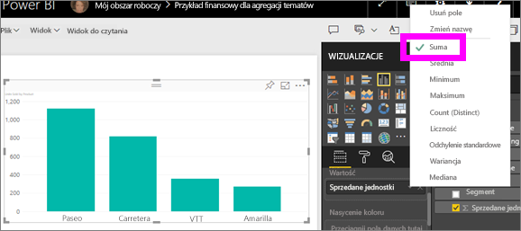

# Praca z agregacjami (suma, średnia itp.) w usłudze Power BI
## Co to jest agregacja?
Czasami trzeba za pomocą operacji matematycznych połączyć ze sobą wartości w danych. Operacja matematyczna może dotyczyć sumy, średniej, wartości maksymalnej, liczby elementów itp. Łączenie wartości w danych jest nazywane *agregowaniem*. Wynikiem tej operacji matematycznej jest *agregacja*. 

Podczas tworzenia wizualizacji w usłudze Power BI lub w programie Power BI Desktop dane mogą zostać zagregowane. Często agregacja to dokładnie to, czego potrzebujesz, ale czasami możesz chcieć zagregować wartości w inny sposób.  Na przykład suma w porównaniu ze średnią. Istnieją różne sposoby zmieniania agregacji używanej w wizualizacji i zarządzania nią.

Najpierw przyjrzyjmy się *typom* danych, ponieważ typ danych określa jak, i czy, dane mogą być agregowane.

## Typy danych
Większość zestawów danych zawiera więcej niż jeden typ danych. Na najbardziej podstawowym poziomie dane są liczbowe albo nie. Dane liczbowe można agregować przy użyciu sumy, średniej, wartości minimalnej, wariancji i nie tylko. Nawet dane tekstowe, często nazywane danymi *kategorii*, można agregować. W przypadku próby agregowania pola kategorii (przez umieszczenie go w zasobniku „tylko liczbowe”, takim jak **Wartości** lub **Etykietki**) usługa Power BI będzie zliczać wystąpienia każdej kategorii lub unikatowe wystąpienia każdej kategorii. Natomiast specjalne typy danych, takie jak daty, mają kilka własnych opcji agregacji: najwcześniejsze, najpóźniejsze, pierwsze i ostatnie. 

W poniższym przykładzie:
- Kolumny **Sprzedane jednostki** (Units Sold) i **Cena produkcji** (Manufacturing Price) zawierają dane liczbowe
-  Kolumny **Segment**, **Kraj** (Country), **Produkt** (Product), **Miesiąc** (Month) i **Nazwa miesiąca** (Month Name) zawierają dane kategorii

   

Podczas tworzenia wizualizacji w usłudze Power BI pola liczbowe zostaną zagregowane (wartość domyślna to *suma*) względem niektórych pól kategorii.  Na przykład „Sprzedane jednostki ***wg. Produktu***”, „Sprzedane jednostki ***wg. Miesiąca***” i „Cena produkcji ***wg. Segmentu***”. Niektóre pola numeryczne są nazywane **miarami**. Identyfikacja miar w edytorze raportów usługi Power BI jest łatwa — miary są wyświetlane z symbolem ∑ na liście pól. Aby uzyskać więcej informacji, zobacz [The report editor... take a tour](service-the-report-editor-take-a-tour.md) (Edytor raportów — przewodnik).

## Dlaczego agregowanie nie działa odpowiednio?
Praca z agregacjami w usłudze Power BI może sprawiać kłopot, kiedy na przykład usługa Power BI nie pozwala Ci zmienić agregacji w przypadku pola numerycznego lub kiedy nie chcesz agregować pola (np. Rok), ale chcesz jedynie zliczyć jego wystąpienia.

Najczęstszym źródłem problemu jest sposób zdefiniowania pola w zestawie danych. Jeśli pole zostało zdefiniowane jako tekst, nie będzie możliwe obliczenie sumy ani średniej. Niestety [tylko właściciel zestawu danych może zmienić sposób klasyfikacji pola](desktop-measures.md). Jeśli zatem masz uprawnienia właściciela do zestawu danych, albo w programie Desktop, albo w innym, w którym ten zestaw danych został utworzony (na przykład Excel), możesz rozwiązać ten problem. W przeciwnym razie musisz skontaktować się z właścicielem zestawu danych, aby uzyskać pomoc.  

W razie jakichkolwiek problemów zapoznaj się z sekcją **Istotne zagadnienia i rozwiązywanie problemów** w tym artykule.  Jeśli nie znajdziesz tam odpowiedzi, opublikuj swoje pytanie na [forum społeczności usługi Power BI](http://community.powerbi.com), aby uzyskać szybką odpowiedź bezpośrednio od zespołu usługi Power BI.

## Zmienianie sposobu agregacji pola numerycznego
Załóżmy, że istnieje wykres sumujący sprzedane jednostki dla różnych produktów, ale wolisz wyświetlić dane uśrednione. 

1. Utwórz wykres używający kategorii i miary. W tym przykładzie używamy sprzedanych jednostek według produktu.  Domyślnie usługa Power BI tworzy wykres sumujący sprzedane jednostki (miara w źródle Wartość) dla każdego produktu (kategoria w źródle Oś).

   

2. W okienku wizualizacji kliknij prawym przyciskiem myszy miarę i wybierz odpowiedni typ agregacji. W tym przypadku wybieramy średnią. Jeśli nie widzisz odpowiedniej agregacji, zobacz temat „Istotne zagadnienia i rozwiązywanie problemów” poniżej.  
   
   
   
   > [!NOTE]
   > Opcje dostępne na liście rozwijanej będą się różnić w zależności od 1) wybranego pola oraz 2) sposobu sklasyfikowania pola przez właściciela zestawu danych.
   > 
3. Twoja wizualizacja używa teraz agregacji według średniej.

   

##    Sposoby agregowania danych

Niektóre opcje dostępne w ramach agregowania pola:

* **Nie sumuj.** Po wybraniu tej opcji wszystkie wartości w danym polu są traktowane odrębnie i nie są sumowane. Ta opcja jest przydatna w przypadku kolumny identyfikatorów liczbowych, których nie należy sumować.
* **Suma.** Dodaje do siebie wszystkie wartości w danym polu.
* **Średnia.** Przyjmuje średnią arytmetyczną wartości.
* **Minimum.** Wyświetla najmniejszą wartość.
* **Maksimum.** Wyświetla największą wartość.
* **Liczność (niepuste).** Zlicza wartości w danym polu, które nie są puste.
* **Liczność (unikatowe).** Zlicza różne wartości w danym polu.
* **Odchylenie standardowe.**
* **Wariancja.**
* **Mediana.**  Wyświetla wartość mediany (środkowa). Ta wartość ma taką samą liczbę elementów powyżej, jak i poniżej.  W przypadku dwóch wartości mediany usługa Power BI uśredni je.

Jako przykładu użyjemy następujących danych:

| Kraj | Kwota |
|:--- |:--- |
| Stany Zjednoczone |100 |
| Zjednoczone Królestwo |150 |
| Kanada |100 |
| Niemcy |125 |
| Francja | |
| Japonia |125 |
| Australia |150 |

Otrzymane wyniki będą wyglądać następująco:

* **Nie sumuj**: każda wartość jest wyświetlana osobno
* **Suma**: 750
* **Średnia**: 125
* **Maksimum**:  150
* **Minimum**: 100
* **Liczność (niepuste)**: 6
* **Liczność (unikatowe)**: 4
* **Odchylenie standardowe:** 20,4124145...
* **Wariancja:** 416,666...
* **Mediana:** 125

## Tworzenie agregacji za pomocą pola kategorii (tekstowego)
Możesz także agregować pola nieliczbowe. Na przykład jeśli masz pole nazwy produktu, możesz dodać je jako wartość, a następnie ustawić dla niego opcję **Liczność**, **Liczność unikatowych wartości**, **Pierwsza** lub **Ostatnia**. 

1. W tym przykładzie przeciągnęliśmy pole **Produkt** do źródła Wartości. Źródło Wartości jest zazwyczaj używane w przypadku pól liczbowych. Usługa Power BI rozpoznaje, że jest to pole tekstowe, ustawia dla agregacji opcję **Nie sumuj** i wyświetla tabelę z jedną kolumną.
   
   
2. Jeśli zmienimy domyślną opcję agregacji **Nie sumuj** na **Liczność (unikatowe)**, usługa Power BI zliczy liczbę różnych produktów. W tym przypadku jest ich 4.
   
   
3. Zmiana opcji agregacji na **Liczność** spowoduje, że usługa Power BI zliczy wszystkie elementy. W tym przypadku pole **Produkt** ma 7 wpisów. 
   
   

4. Przeciągając to samo pole (w tym przypadku pole **Produkt**) do źródła Wartości i pozostawiając domyślną opcję agregacji **Nie sumuj**, spowodujemy, że usługa Power BI podzieli liczbę według produktu.

   

## Istotne zagadnienia i rozwiązywanie problemów
Pytanie:  Dlaczego nie mam dostępu do opcji **Nie sumuj**?

Odpowiedź:  Wybrane pole to prawdopodobnie miara obliczana lub miara zaawansowana utworzona w programie Excel lub [Power BI Desktop](desktop-measures.md). Każda miara obliczana ma własną ustaloną formułę. Nie możesz zmienić używanej agregacji.  Jeśli na przykład jest to suma, może to być tylko suma. Na liście pól *miary obliczane* są wyświetlane z symbolem kalkulatora.

Pytanie:  Skoro wybrane przeze mnie pole **jest** numeryczne, dlaczego jedynymi dostępnymi opcjami są **Liczność** i **Liczność unikatowych wartości**?

Odpowiedź 1:  Prawdopodobnie właściciel zestawu danych przypadkowo lub celowo *nie* sklasyfikował pola jako liczby. Załóżmy, że zestaw danych zawiera pole **Rok**. Właściciel zestawu danych może sklasyfikować go jako tekst, ponieważ bardziej prawdopodobne jest, że pole **Rok** będzie zliczane (na przykład liczba osób urodzonych w 1974 r.), a nie sumowane lub uśredniane. Jeśli jesteś właścicielem, możesz otworzyć zestaw danych w programie Power BI Desktop i użyć karty **Modelowanie**, aby zmienić typ danych.  

Odpowiedź 2: Jeśli pole zawiera ikonę kalkulatora, oznacza to, że jest *miarą obliczaną*, a każda miara obliczana ma własną ustaloną formułę, którą może zmienić tylko właściciel zestawu danych. Przeprowadzane obliczenia mogą dotyczyć prostej agregacji, takiej jak średnia lub suma, ale równie dobrze mogłyby obejmować bardziej skomplikowane operacje, takie jak „procent łącznego wkładu względem kategorii nadrzędnej” lub „suma bieżąca obliczana od początku roku”. Usługa Power BI nie będzie obliczać sumy ani średniej dla otrzymanych wyników, zamiast tego ponownie zliczy wartości (przy użyciu ustalonej formuły) dla każdego punktu danych.

Odpowiedź 3:  Inna możliwość może dotyczyć upuszczenia pola do *zasobnika*, który dopuszcza tylko wartości kategorii.  W takim przypadku jedynymi dostępnymi opcjami będą Liczność i Liczność unikatowych wartości.

Odpowiedź 4:  Trzecia możliwość polega na tym, że używasz pola dla osi. Posłużmy się przykładem. Na osi wykresu słupkowego usługa Power BI wyświetla po jednym pasku dla każdej unikatowej wartości — wartości pola nie są przez nią w ogóle agregowane. 

>[!NOTE]
>Wyjątkiem od tej reguły są wykresy punktowe, które *wymagają* wartości zagregowanych dla osi X i Y.

Pytanie:  Dlaczego nie można agregować pól tekstowych w przypadku źródeł danych SSAS (SQL Server Analysis Services)?

Odpowiedź:  Połączenia na żywo z modelami wielowymiarowymi SSAS nie zezwalają na żadne agregacje po stronie klienta, w tym określanie wartości pierwszej, ostatniej, średniej, minimalnej i maksymalnej ani sumy.

Pytanie:  Mam wykres punktowy i *nie* chcę, aby moje pole było agregowane.  Jak to zrobić?

Odpowiedź:  Dodaj pole do zasobnika **Szczegóły**, a nie do zasobników osi X i Y.

Pytanie:  Podczas dodawania pól numerycznych do wizualizacji większość z nich przyjmuje wartość domyślną sumowania, ale dla niektórych wartość domyślna to średnia lub liczność albo jeszcze inne opcje agregacji.  Dlaczego domyślna opcja agregacji nie jest zawsze taka sama?

Odpowiedź:  Właściciele zestawów danych mają możliwość ustawienia wartości domyślnej sumowania dla każdego pola. Jeśli jesteś właścicielem zestawu danych, zmień domyślną wartość sumowania na karcie **Modelowanie** programu Power BI Desktop.

Pytanie:  Jestem właścicielem zestawu danych i chcę mieć pewność, że pole nigdy nie będzie agregowane.

Odpowiedź:  W programie Power BI Desktop na karcie **Modelowanie** ustaw kolumnę **Typ danych** na wartość **Tekst**.

Pytanie:  Na liście rozwijanej nie pojawia się opcja **Nie sumuj**.

Odpowiedź:  Spróbuj usunąć pole i dodać je ponownie.

Masz więcej pytań? [Odwiedź społeczność usługi Power BI](http://community.powerbi.com/)

