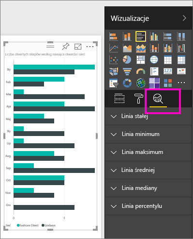
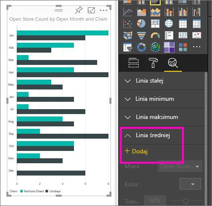
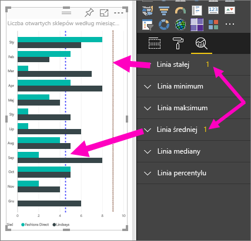
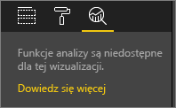

# Okienko Analiza w usłudze Power BI
Za pomocą okienka **Analiza** w **usłudze Power BI** możesz dodać do wizualizacji dynamiczne *linie odwołania* i skoncentrować się na ważnych trendach lub szczegółowych informacjach.

> [!NOTE]
> Okienko **Analiza** jest wyświetlane tylko po wybraniu wizualizacji na kanwie raportów.
> 
> 

## Używanie okienka Analiza
Za pomocą okienka **Analiza** można utworzyć następujące typy dynamicznych linii odwołania (w przypadku poszczególnych typów wizualizacji są dostępne określone linie):

* Linia stałej (oś X)
* Linia stałej (oś Y)
* Linia minimum
* Linia maksimum
* Linia średniej
* Linia mediany
* Linia percentylu

W poniższych sekcjach przedstawiono, jak można wykorzystać okienko **Analiza** i dynamiczne linie odwołania w swoich wizualizacjach.

Aby wyświetlić dynamiczne linie odwołania dostępne dla danej wizualizacji, wykonaj następujące kroki:

1. Wybierz lub utwórz wizualizację, a następnie wybierz ikonę **Analiza**  znajdującą się w okienku **Wizualizacje**.
2. Wybierz strzałkę w dół dla tworzonego typu linii, aby rozwinąć dostępne opcje. W tym przypadku wybierzemy pozycję **Linia średniej**.
   
   
3. Aby utworzyć nową linię, wybierz pozycję **+ Dodaj**. Następnie można określić nazwę linii, dwukrotnie klikając pole tekstowe, a następnie wpisując nazwę.
   
   Masz do wyboru wiele różnych opcji dotyczących linii, takich jak *kolor*, *przezroczystość*, *styl* i *pozycja* (względem wizualizacji danych). Możesz też zdecydować, czy linia ma mieć etykietę. Możesz też wybrać opcję **Miara** dla wizualizacji, na której ma bazować linia. W tym celu skorzystaj z listy rozwijanej **Miara**, która jest automatycznie wypełniona przy użyciu elementów danych wizualizacji. W tym przypadku miarą będzie pozycja *Open store count*, którą oznaczymy etykietą *Avg # Open Stores*. Dostosujemy także kilka innych opcji, co przedstawiono poniżej.
   
   
4. Jeśli chcesz, aby etykieta danych była wyświetlana, przesuń suwak **Etykieta danych**, aby ta opcja była włączona. Jeśli tak zrobisz, uzyskasz dostęp do wielu dodatkowych opcji dotyczących etykiety danych.
5. Zwróć uwagę na liczbę obok elementu **Linia średniej** w okienku **Analiza**. Informuje on, ile dynamicznych linii poszczególnych typów znajduje się obecnie w wizualizacji. Jeśli dodamy element **Linia stałej** w celu wyznaczenia docelowej liczby sklepów równiej 9, w okienku **Analiza** pojawi się informacja, że wizualizacja została wzbogacona o linię odwołania **Linia stałej**.
   
   
   
   Jeśli do wybranej wizualizacji nie można zastosować dynamicznych linii odwołania (w tym przypadku wizualizacji **Mapa**), po wybraniu okienka **Analiza** zobaczysz poniższy komunikat.
   
   

Istnieją różne rodzaje interesujących danych szczegółowych, które można wyróżnić, tworząc dynamiczne linie odwołania w okienku **Analiza**.

Planujemy wprowadzenie kolejnych funkcji i możliwości. Mamy między innymi zamiar poszerzyć liczbę wizualizacji obsługujących dynamiczne linie odwołania. Warto zatem często sprawdzać, co mamy nowego.

## Ograniczenia
Możliwość używania dynamicznych linii odwołania zależy od typu wizualizacji. Poniższej przedstawiono listę linii dynamicznych dostępnych obecnie dla poszczególnych wizualizacji:

Pełne wykorzystanie linii dynamicznych jest możliwe w przypadku następujących wizualizacji:

* Wykres warstwowy
* Wykres liniowy
* Wykres punktowy
* Wykres kolumnowy grupowany
* Wykres słupkowy grupowany

Poniższe wizualizacje mogą używać jedynie *linii stałej* z okienka **Analiza**:

* Skumulowany warstwowy
* Skumulowany słupkowy
* Skumulowany kolumnowy
* 100% skumulowany słupkowy
* 100% skumulowany kolumnowy

W przypadku poniższych wizualizacji obecnie jest dostępna jedynie opcja *linia trendu*:

* Nieskumulowany liniowy
* Wykres kolumnowy grupowany

Wizualizacje niekartezjańskie nie obsługują obecnie linii dynamicznych z okienka **Analiza**. Są to elementy, takie jak:

* Macierz
* Wykres kołowy
* Pierścień
* Tabela

## Następne kroki
[Okienko analizy w programie Power BI Desktop](desktop-analytics-pane.md)

Masz więcej pytań? [Odwiedź społeczność usługi Power BI](http://community.powerbi.com/)

