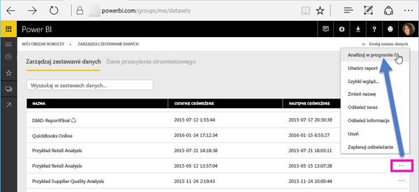
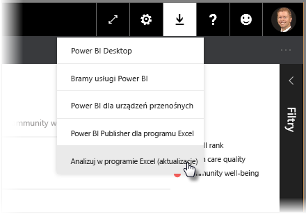
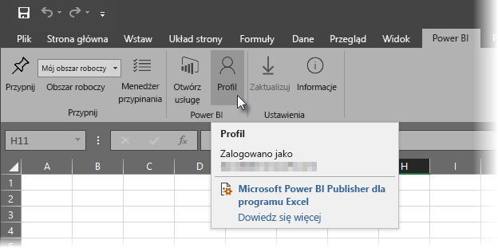
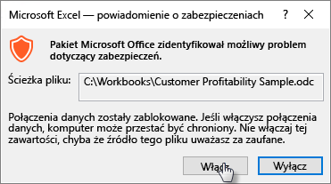
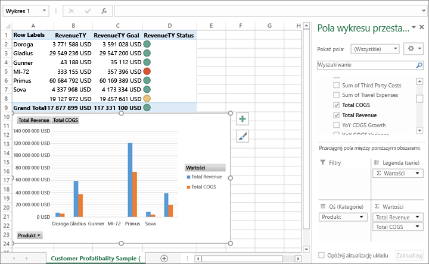

# Analizowanie w programie Excel
Czasami może zaistnieć potrzeba wyświetlenia i obsługi zestawu danych z usługi Power BI w programie Excel. Jest to możliwe dzięki funkcji **Analizuj w programie Excel**. Funkcja ta pozwala także korzystać z opcji tabeli przestawnej, wykresu i fragmentatora w programie Excel (w zależności od zestawu danych istniejącego w usłudze Power BI).

## Wymagania
Aby można było korzystać z funkcji **Analizuj w programie Excel**, trzeba spełnić kilka wymagań:

* Funkcja **Analizuj w programie Excel** jest obsługiwana w programie Microsoft Excel 2010 z dodatkiem SP1 i jego nowszych wersjach.
* Tabele przestawne programu Excel nie obsługują agregacji metodą przeciągania i upuszczania pól liczbowych. Zestaw danych w usłudze Power BI *musi mieć wstępnie zdefiniowane miary*.
* W niektórych organizacjach mogą istnieć reguły zasad grupy uniemożliwiające zainstalowanie w programie Excel wymaganych aktualizacji funkcji **Analizuj w programie Excel**. Jeśli nie możesz zainstalować aktualizacji, skontaktuj się z administratorem.
* **Analizowanie w programie Excel** wymaga licencji na wersję Pro. Aby dowiedzieć się więcej o różnicach w działaniu wersji bezpłatnej i wersji Pro, zobacz temat [Usługa Power BI — wersja bezpłatna a wersja Pro](service-free-vs-pro.md). 

## Jak to działa?
Wybranie pozycji **Analizuj w programie Excel** z menu z wielokropkiem (...) skojarzonego z odpowiednim zestawem danych lub raportem w usłudze **Power BI** powoduje utworzenie w usłudze Power BI pliku ODC i pobranie go z przeglądarki na komputer.

Po otwarciu pliku w programie Excel zostaje wyświetlony pusty element **Tabela przestawna** i lista **Pola** z tabelami, polami i miarami z zestawu danych usługi Power BI. Tabele przestawne i wykresy można tworzyć podobnie jak w przypadku lokalnego zestawu danych w programie Excel. Analizowanie tego zestawu danych również przebiega podobnie.

Plik ODC ma ciąg połączenia MSOLAP, który łączy się z zestawem danych w usłudze Power BI. Podczas analizowania danych lub pracy z nimi program Excel wysyła zapytanie do tego zestawu danych w usłudze Power BI i zwraca wyniki do programu Excel. Jeśli ten zestaw danych łączy się ze źródłem danych na żywo za pomocą zapytania bezpośredniego, usługa Power BI wysyła zapytanie do źródła danych i zwraca wynik do programu Excel.

Funkcja **Analizuj w programie Excel** przydaje się w przypadku zestawów danych i raportów łączących się z *tabelarycznymi usługami Analysis Services* lub *wielowymiarowymi* bazami danych, a także w przypadku plików programu Power BI Desktop lub skoroszytów programu Excel z modelami danych, dla których miary modeli utworzono w języku Data Analysis Expressions (DAX).

## Rozpoczynanie pracy z funkcją Analizuj w programie Excel
W usłudze Power BI wybierz menu z wielokropkiem obok raportu lub zestawu danych (czyli symbol ... obok nazwy raportu lub zestawu danych) i z wyświetlonego menu wybierz pozycję **Analizuj w programie Excel**.

### Instalowanie aktualizacji programu Excel
Po pierwszym uruchomieniu funkcji **Analizuj w programie Excel** trzeba zainstalować aktualizacje bibliotek programu Excel. Zostanie wyświetlony monit o pobranie i uruchomienie aktualizacji programu Excel (co spowoduje zainicjowanie instalacji pakietu instalatora systemu Windows *SQL_AS_OLEDDB.msi*). Ten pakiet powoduje zainstalowanie programu **Microsoft AS OLE DB Provider for SQL Server 2016 RC0 (wersja zapoznawcza)**.

> [!NOTE]
> W oknie dialogowym **Instalowanie aktualizacji programu Excel** zaznacz pole wyboru **Nie pokazuj ponownie tego komunikatu**. Aktualizację wystarczy zainstalować raz.
> 
> 

Jeśli zajdzie konieczność ponownego zainstalowania aktualizacji programu Excel dla funkcji **Analizuj w programie Excel**, można pobrać aktualizację, korzystając z ikony **Pobierz** w usłudze Power BI, jak pokazano na poniższym obrazie.

### Logowanie do usługi Power BI
Nawet jeśli nastąpiło już zalogowanie do usługi Power BI w przeglądarce, po pierwszym otwarciu nowego pliku ODC w programie Excel może zostać wyświetlony monit o zalogowanie się do usługi Power BI przy użyciu konta usługi Power BI. W ten sposób jest wykonywane uwierzytelnianie połączenia programu Excel z usługą Power BI.

### Użytkownicy z wieloma kontami usługi Power BI
Niektórzy użytkownicy mają wiele kont usługi Power BI. W przypadku takich użytkowników może wystąpić sytuacja, że są oni zalogowani w usłudze Power BI przy użyciu jednego konta, ale to inne konto zapewnia dostęp do zestawu danych używanego przez funkcję Analizuj w programie Excel. W takich sytuacjach może wystąpić błąd **Zabronione** lub niepowodzenie logowania podczas próby uzyskania dostępu do zestawu danych używanego przez skoroszyt w ramach funkcji Analizuj w programie Excel.

Użytkownik będzie miał kolejną możliwość zalogowania się. Będzie mógł wówczas zalogować się za pomocą konta usługi Power BI zapewniającego dostęp do zestawu danych, z którego korzysta funkcja Analizuj w programie Excel. Można także wybrać pozycję **Profil** na karcie **Power BI** na wstążce programu Excel. Opcja ta pozwala sprawdzić bieżące konto i udostępnia link umożliwiający wylogowanie się (a następnie zalogowanie się za pomocą innego konta).

### Włączanie połączeń danych
Aby umożliwić analizowanie danych usługi Power BI w programie Excel, trzeba wybrać pozycję **Włącz**, kiedy zostanie wyświetlony monit o sprawdzenie nazwy pliku odc i ścieżki do tego pliku.

> [!NOTE]
> Administratorzy dzierżaw usługi Power BI mogą za pomocą *portalu administracyjnego usługi Power BI* uniemożliwić korzystanie z funkcji **Analizuj w programie Excel** w połączeniu z lokalnymi zestawami danych przechowywanymi w bazach danych usług Analysis Services (AS). Jeśli ta opcja jest wyłączona, funkcja **Analizuj w programie Excel** jest wyłączona w przypadku baz danych usługi AS, ale nadal jest dostępna do obsługi innych zestawów danych.
> 
> 

## Swobodne analizowanie
Kiedy już program Excel został otwarty i masz do dyspozycji pustą tabelę przestawną, możesz zacząć analizować zestaw danych usługi Power BI na wiele różnych sposobów. Tak jak w przypadku innych skoroszytów lokalnych, funkcja Analizuj w programie Excel umożliwia tworzenie tabel przestawnych i wykresów, dodawanie danych z innych źródeł i wykonywanie różnych innych zadań. Oczywiście można także tworzyć arkusze zapewniające prezentowanie danych na różne sposoby.

> [!NOTE]
> Należy pamiętać, że funkcja **Analizuj w programie Excel** prezentuje wszystkie dane na każdym poziomie szczegółowości dowolnemu użytkownikowi, który ma uprawnienia do określonego zestawu danych.
> 
> 

## Zapisywanie
Połączony skoroszyt zestawu danych usługi Power BI można zapisać podobnie jak każdy inny skoroszyt. Nie można jednak opublikować ani zaimportować skoroszytu z powrotem w usłudze Power BI, ponieważ publikować lub importować w usłudze Power BI można tylko te skoroszyty, które mają dane w tabelach lub model danych. Ponieważ nowy skoroszyt ma połączenie z zestawem danych w usłudze Power BI, opublikowanie lub zaimportowanie go w usłudze Power BI nie miałoby sensu.

## Udostępnianie
Po zapisaniu skoroszytu możesz udostępnić go innym użytkownikom usługi Power BI w organizacji.

Kiedy użytkownik, któremu został udostępniony skoroszyt, otworzy go, zobaczy tabele przestawne i dane w postaci aktualnej podczas ostatniego zapisania skoroszytu. Może nie być to najnowsza wersja danych. Aby uzyskać najnowsze dane, użytkownicy muszą użyć przycisku **Odśwież** znajdującego się na wstążce **Dane**. Skoroszyt jest połączony z zestawem danych w usłudze Power BI, w związku z czym użytkownicy próbujący odświeżyć skoroszyt muszą zalogować się do usługi Power BI i zainstalować aktualizacje programu Excel przed pierwszą próbą zaktualizowania danych za pomocą tej metody.

Ponieważ użytkownicy muszą odświeżyć zestaw danych, a odświeżanie w przypadku połączeń zewnętrznych nie jest obsługiwane w usłudze Excel Online, zaleca się użytkownikom otwarcie skoroszytu w klasycznej wersji programu Excel na komputerze.

## Rozwiązywanie problemów
Mogą zaistnieć sytuacje, w których użycie analizy w programie Excel zwróci nieoczekiwane wyniki lub ta funkcja nie będzie działać zgodnie z oczekiwaniami. [Ta strona oferuje rozwiązania typowych problemów związanych z użyciem funkcji analizy w programie Excel](desktop-troubleshooting-analyze-in-excel.md)